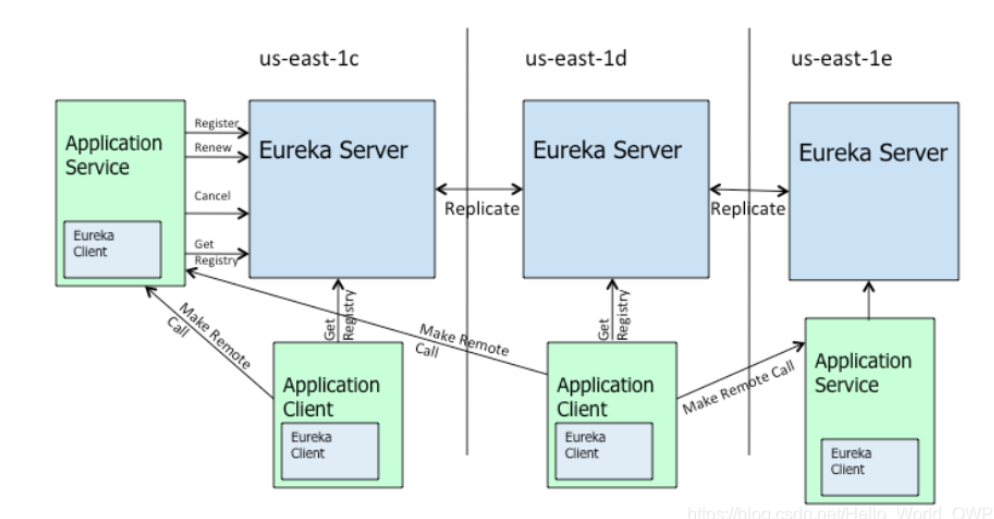
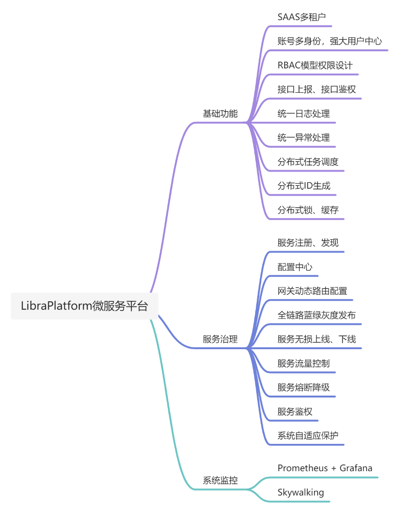
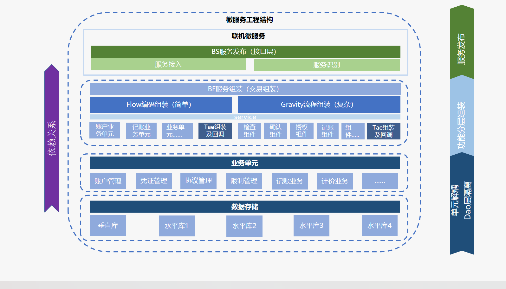
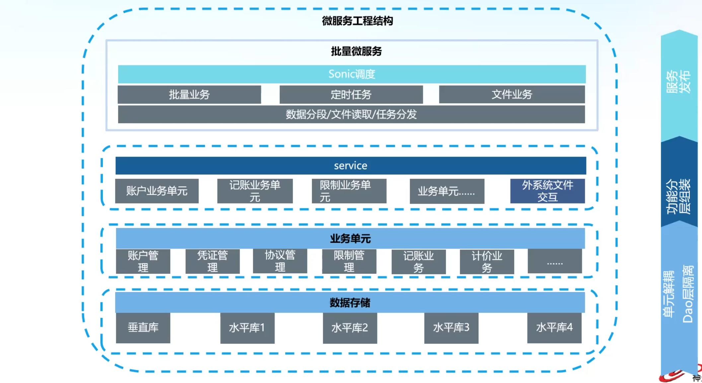
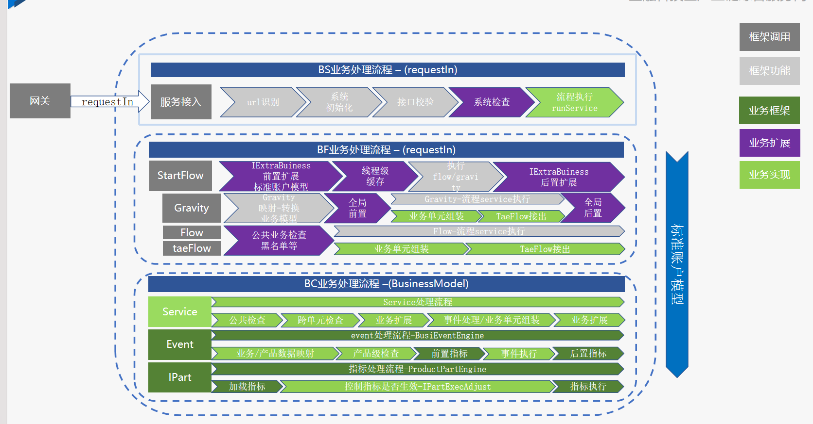
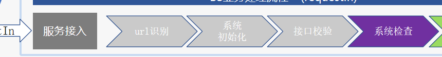
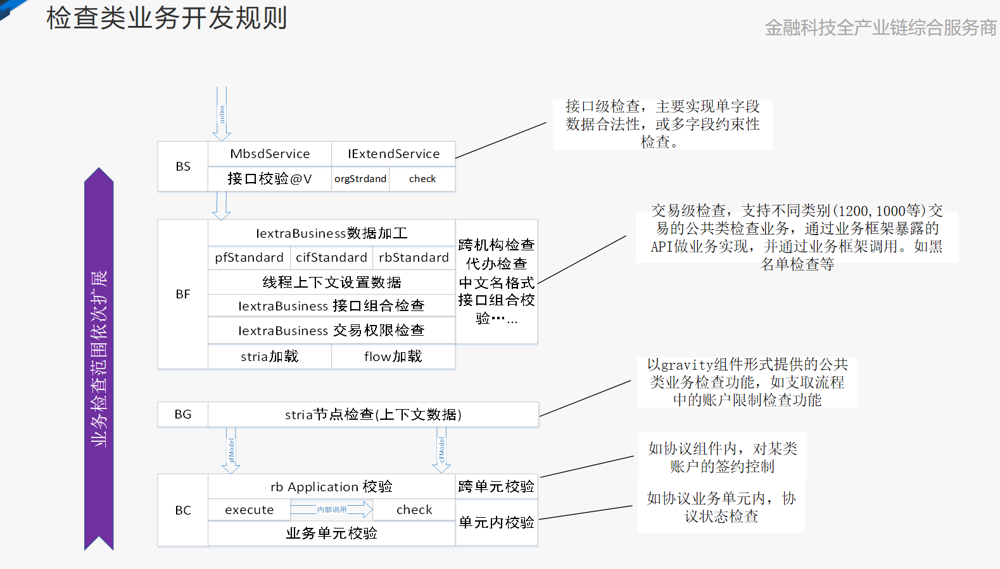

# 联机（Online）

> 指的是计算机或其他设备通过网络或其他通信方式实现**互相连接**，以便进行数据交换、资源共享和协同工作的过程。联机可以分为同步联机和异步联机两种形式。同步联机是指在同一时刻多个计算机或设备同时访问和操作同一个系统或应用程序。异步联机是指不同时间、不同地点的计算机或设备通过网络或其他通信方式进行数据交换和资源共享。

# eurka

> Eureka 是 Netflix 的一个子模块，也是核心模块之一。

- Eureka 是一个基于 REST（REpresentational State Transfer） 的服务，用于**定位服务**，以实现云端中间层服务器的**负载均衡和故障转移**。Eureka还附带了一个基于java的客户端组件——Eureka Client，它使得与服务的**交互**更加容易。Eureka Client 还有一个内置的**负载均衡**器，可以进行基本的循环负载均衡，在 Netflix，一个更加复杂的负载均衡器封装了 Eureka，可以根据流量、资源的使用情况、错误条件等因素根据自定义的权重来实现负载均衡，从而提供更好的弹性服务。
- 对于**服务注册与发现**对于微服务架构来说是非常重要的，有了服务发现与注册，只需要使用服务的标识符，就可以访问到服务，而不需要修改服务调用的配置文件了。

  

## Eureka 基本架构原理

- Eureka 采用了 C-S 的设计架构。Eureka Server 作为服务注册功能的服务器，它是服务注册中心。
- 系统中的其他微服务，则使用 Eureka Client 连接到 Eureka Server 并维持心跳连接。这样系统的维护人员就可以通过 Eureka Server 来监控系统中各个微服务是否正常运行。
- Spring Cloud 的一些其他子模块（例如 Gateway）就可以通过 Eureka Server 来发现系统中的其他微服务，并执行相关的业务逻辑。一个 Eureka 的高可用架构图如下：

## CAP 原则的三个指标

1. 一致性（Consistency，C）：在分布式系统中的所有数据备份，在同一时刻是否同样的值。（等同于所有节点访问同一份最新的数据副本）。
2. 可用性（Availability，A）：在一个分布式系统的集群中一部分节点故障后，该集群是否还能够正常响应客户端的读写请求。（对数据更新具备高可用性）。
3. 分区容错性（Partition tolerance，P）：大多数的分布式系统都分布在多个子网络中，而每个子网络就叫做一个区（partition）。分区容错的意思是，区间通信可能失败。比如阿里巴巴的服务器（不知道各位有没有发现，不管你到那个城市去，你访问的服务器总是该城市的，其中使用 了算法，由于篇幅有限就不再这儿一一讲解了），一台服务器放在上海，另一台服务器放在北京，这就是两个区，它们之间可能存在无法通信的情况。在一个分布式系统中一般分区容错是无法避免的，因此可以认为 CAP 中的 P 总是成立的。CAP 理论告诉我们，在 C 和 A 之间是无法同时做到。

### Spring Cloud Eureka -> AP

### Apache Zookeeper -> CP

#  Libra-Platform 微服务平台

> Libra-Platform微服务平台基于SpringCloud(2020.0.x) + SpringCloudAlibaba(2021.x) + SpringBoot(2.4.x) + Vue3开发，基于多租户SaaS模式的设计，拥有强大的用户中心（一个账号对应多业务身份），权限基于RBAC设计，支持蓝绿灰度发布、网关动态路由、服务治理（流量控制、熔断降级、系统自适应保护、服务鉴权）等功能。Libra-Platform平台架构清晰、代码简介、注解齐全，很适合作为基础框架使用。

# 微服务中使用MQ——RabbitMQ 

> 简单的理解就是：在消息的传输过程中使用队列作为保存消息的容器。
> 队列是在消息的传输过程中的通道，是保存消息的容器，
> 根据不同的情形，可以有先进先出，优先级队列等区别 。

### 解耦

消息队列能够将业务逻辑解耦，调用方只需要下达命令而不用等待整个逻辑执行完毕！

### 同步转异步

可以把同步的处理变成异步进行处理

### 削峰

在高并发场景下【平滑短时间内大量的服务请求】
分流：将突发大量请求转换为后端能承受的队列请求。

### mq关心的是“通知”，而非“处理“

# 联机工程结构

> taeFlow（分布式记账引擎）控制事务的一致性

- 垂直库：公共信息，参数之类的，不带客户号的。

- 水平库：分片，比如客户号，截取前几位。

- lunar web上定义的:

## 检查类业务开发规则

