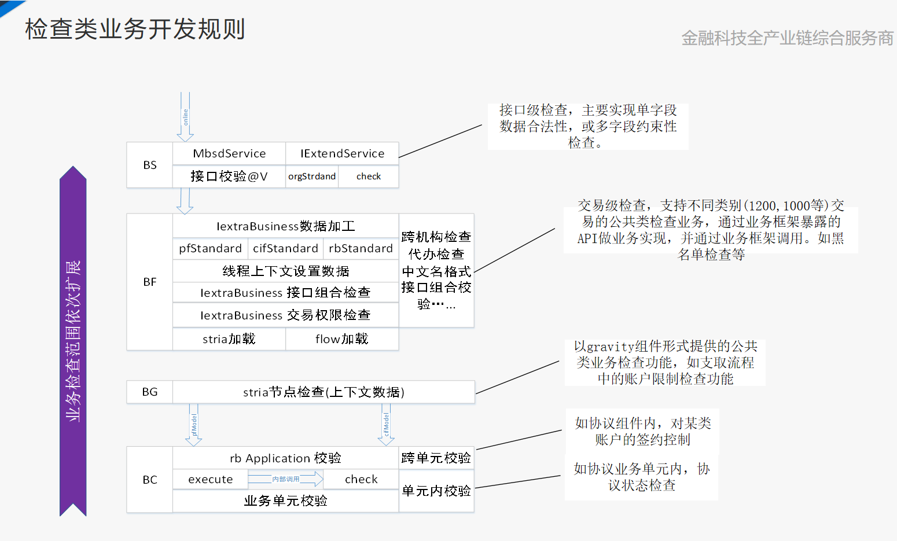
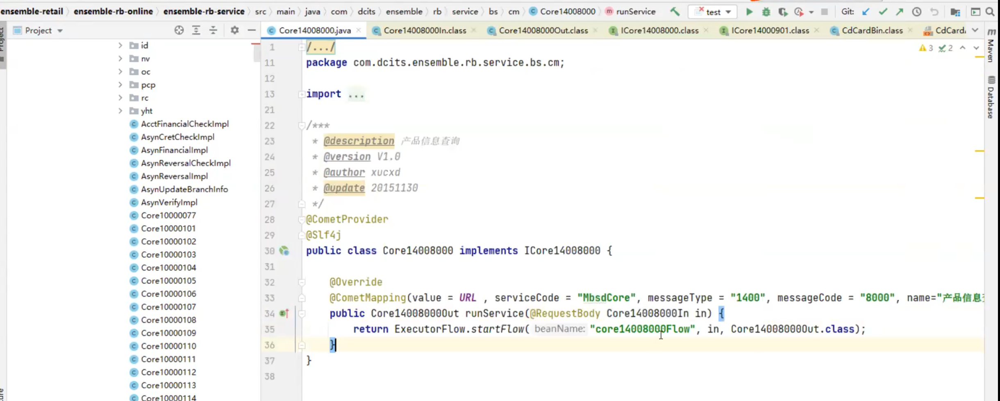
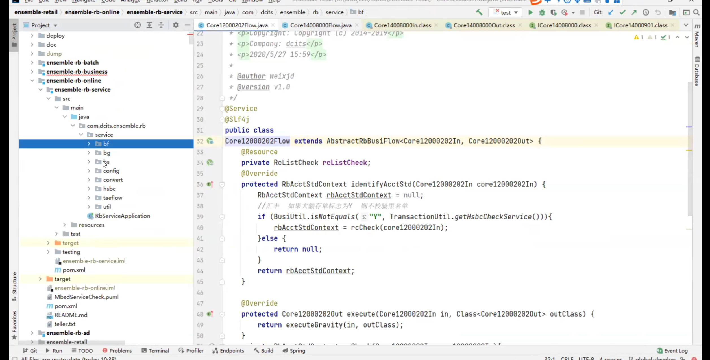
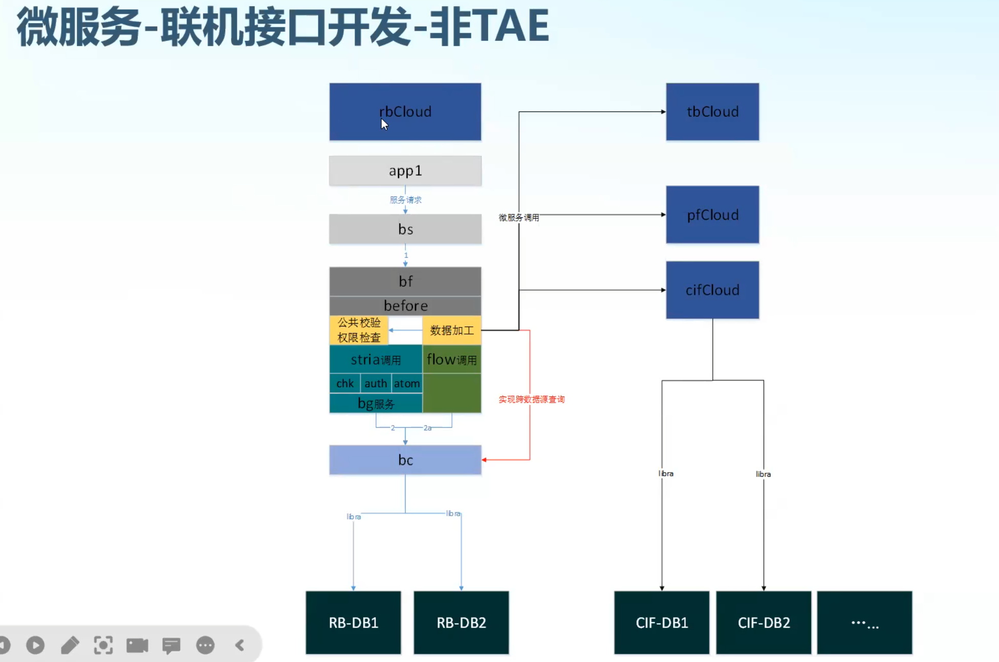
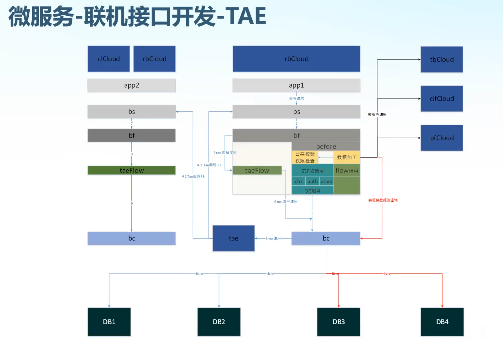
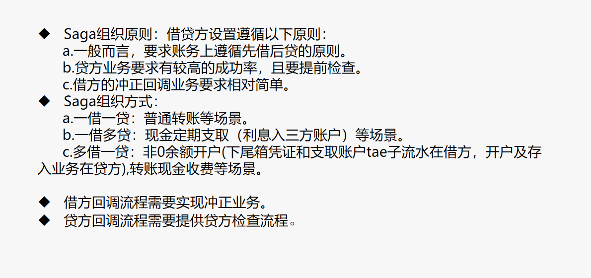
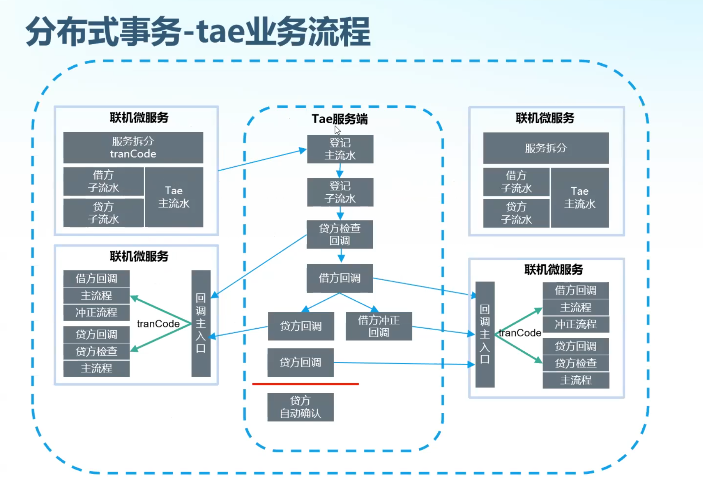

# 开发

## BS

## BF

## TAE

> taeFlow（分布式记账引擎）控制**事务**的一致性

- 垂直库：公共信息，参数之类的，不带客户号的。

- 水平库：分片，比如客户号，截取前几位。

- lunar web上定义的:

  把一个交易拆成很多步，微服务之间跨微服务，跨库交易等等，很多时候强制性走TAE.

  

### tae拆分组织原则

- 当一个服务中出现一个以上的客户参与或一个客户有跨数据库业务操作时，需要对每个客户或一个客户的跨数据库业务进行拆分，各自提供独立的处理流程(tae回调流程)。

- 拆分后由服务组织tae主子流水并调用tae服务端，由tae服务端转发每个回调流程到微服务集群并确保各回调流程的**事务一致性** 。

- 组织方式分为saga和order方式。

  saga方式：按借贷方式组织tae子流水。
           Tae服务端遵从先借方后贷方的原则进行tae子流程调用。贷方失败时会自动调用借方子流程的冲正接口，特殊的一借多贷场景下，超过红线时会自动进行贷方确认。
        order方式：按业务执行顺序进行组织tae子流水。
           Tae服务端按序号从小到大进行tae子流程调用，当有tae子流水执行失败时，会倒序调用tae子流程的冲正接口。应用于多账户账务联动类场景，如资金池等。

  

​	

