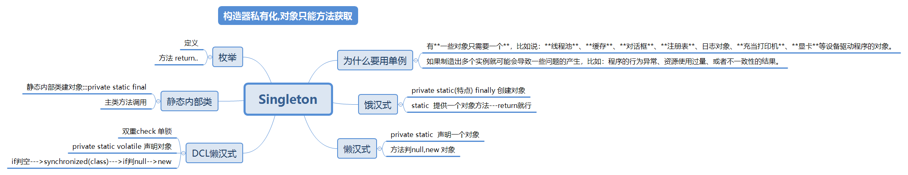

# Singleton

- 单例模式: 
  - 第一步，不让外部调用创建对象，所以把构造器私有化，用private修饰。
  - 第二步，怎么让外部获取本类的实例对象？通过本类提供一个方法，供外部调用获取实例。
    由于没有对象调用，所以此方法为类方法，用static修饰。
  - 第三步，通过方法返回实例对象，由于类方法(静态方法)只能调用静态方法，所以存放该实例的变量改为类变量，用static修饰。
    最后，类变量，类方法是在类加载时初始化的，只加载一次。所以由于外部不能创建对象，而且本来实例只在类加载时创建一次.

### 为什么要用单例
- 有**一些对象只需要一个**，比如说：**线程池**、**缓存**、**对话框**、**注册表**、日志对象、**充当打印机**、**显卡**等设备驱动程序的对象。
- 如果制造出多个实例就可能会导致一些问题的产生，比如：程序的行为异常、资源使用过量、或者不一致性的结果。

> zjz说单例
- 单例主要是饿汉式!懒汉式!DCL懒汉式!静态内部类!枚举!
- 他们的共同点:构造器必须私有---别人无法new一个对象了.只能调用方法来获取-----对于除枚举,都可反射破解private
> 饿汉的特性就是static所以就是耗费内存,所以饿.
> 
> 懒汉是提前**声明**一个私有静态对象,判断了一下是否为空,空就建立一个,所以就叫懒.
> 
> DCL懒汉--双重锁懒汉,再加一个防止指令重排(volatile)的声明
  - DCL---Double Check + Lock
  - 声明对象多一个volatile
  - 在获取实例时:先判断null,同步class,再判断空,再实例化(new)对象

- 变量上加Volatile
  - Volatile 是java提高的**轻量级**的**同步机制**

> 静态内部类单例
- 内部类建单例对象private static final InnerSingleton innerSingleton = new InnerSingleton();
- 外边获取实例方法调用内部类获取对象

> 枚举类
- 定义一个枚举,提供一个获取枚举的方法.

## 单例模式,枚举
- 枚举--本身是一个class类

