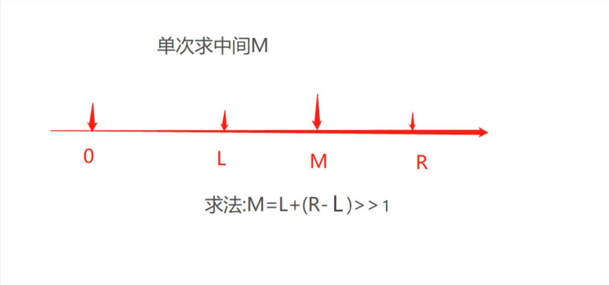
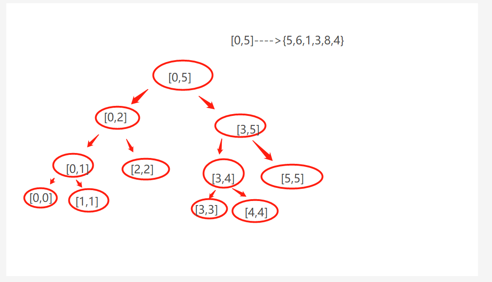

# 前言
- 收获:二分思想,舍弃思想,递归树思想,
- 重点:数轴,树思想,栈思想,二分,多分思想,master公式
- 一遇递归,直接造树!!
- 递归,永远不要把它当作一个方法,你可以把它当作一个过程树
## 题:
- 1.[L,R]上求最大
    - 定:最大,数轴,拆分为树
    - 解:
        - 1.**二分思想**,两个跑肯定比单个跑快--那么就涉及到中间,中间数的求法最好就是**舍弃法**
        - 2.中间为分界,左边跑,右边跑
        - 3.调用Math函数进行比较
      - 思维解:
        - 1.多叉树,2.利用栈后继遍历.3.悬而未决压入栈 4.清晰的就出去 5.高度上压栈
            - 悬而未决(有的孩子(子节点)不知道是多少)
            - 栈弹出,遇到我们的判断出递归条件
    - 规范:只有一个数?直接处理
    - 注:Math虽然好用,但只能用于判断回值.数据的交换,还是需交换方式,
    
- 舍弃法(关于舍弃,很大的优势就是有效增益--可看利扣53.最大子序和)



- 求最大的树图

  
- 使用树的方式,将我们要求的因子找出来,减少普通排序的一次次比较

- 2.递归的master公式---(重点)
    - 定:递归的复杂度,递归的执行流程
    - 解:
        - 1.先树,栈的形式解析整个递归 ---发现树的高度就是递归的次数
        - 2.master公式的学习
            - T(N)=a*(N/b)+O(N^d)
            - 主方法 = 次数*子方法+其它   --- 递归的主方法和子方法也就参数不一样
            - a指的是调用方法次数,b指的是切割问题几段,,N指的是复杂度
        - 3.时间复杂度的计算
            - 1.log(b,a)>d--->复杂度O(N^log(b,a))
            - 2.log(b,a)<d--->复杂度O(N^d)
            - 3.log(b,a)==d--->复杂度O(O^d * logN)    

- 一般使用递归是为了职责分明,**递归就进栈,弹栈**就好了,弹栈是由自己写的条件控制.遇到多子递归时,那就树来走

## 归并
> 本质:二分排序,再合并
- 归并的做法是:左侧比较完,右侧比较完,再最后左右比较
- 还是两两交换,,不管是for循环,还是递归---两者都是使用二分思想来变成O(logN),本质是让两个数两两交互排序


### 归并递归法
- 我测试了它的递归走向
    - 发现它的走向是按照(终止条件,方法体控制的),递归的本质是都走
    - 怎么走,就是如果里面是双子递归,那么它会按树走,走的时候,是先左大节点,再左大节点的左子节点,再左大节点的右子节点.(往复进行),中途走到终止条件跳出,
    其它继续执行,,遇到很小的满足要求方法体的也会去执行.
- 它的目的就是,整个流程我都整出来并且压入栈,执行完的或者遇到条件的就出去,按照你的控制停止,你有条件,满足就执行.    
### 必须明白的递归弹栈 
- 数组为{11,8,9,4,12,3,7,6}--[0,7]
- 开始,进栈[0,7],遇到子,再进栈[0,3],遇到子,再进栈[0,1],再遇到再进,直到遇到该停止的,再不断的弹,弹出这一步,走下一步,下一步再弹,再...

- 简单没有弹,只是顺序执行的流程
    ```
       这是一个,没有终止弹的流程
        原数据:11,8,9,4,12,3,7,6
        递归流程:0--1
        方法执行:8 11 
        递归流程:2--3
        方法执行:4 9 
        递归流程:0--3
        方法执行:4 8 9 11 
        递归流程:4--5
        方法执行:3 12 
        递归流程:6--7
        方法执行:6 7 
        递归流程:4--7
        方法执行:3 6 7 12 
        递归流程:0--7
        方法执行:3 4 6 7 8 9 11 12 
        输出结果:3 4 6 7 8 9 11 12 
    
    ```
    


