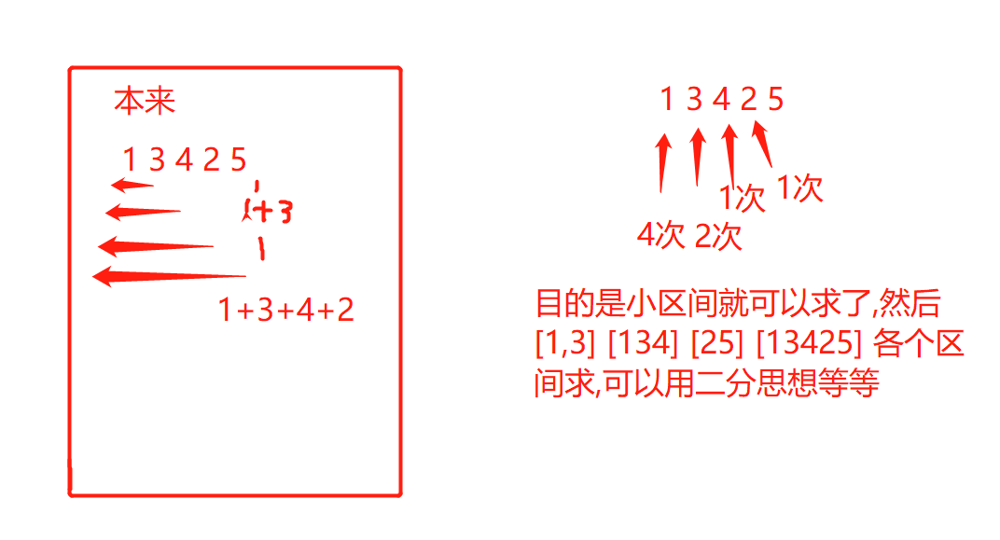
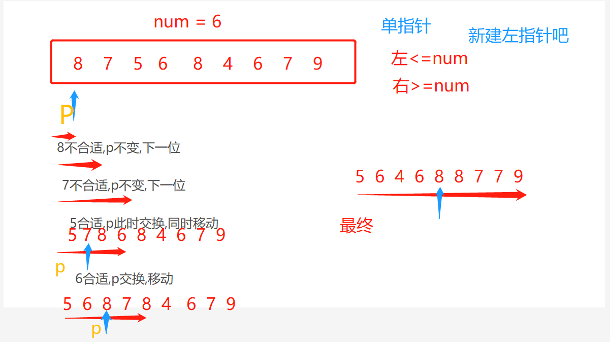
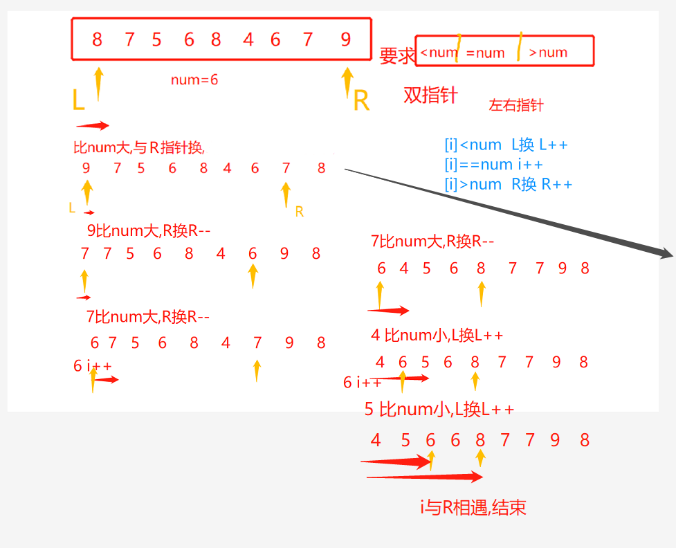

# 前言
- 想法:树思想,整合思维转变思想.指针思想

- 收获:真正的递归,考虑的功能,以及一些要达成的目的,都是在叶子节点之上进行的
- 小和,逆序对,本质就是递归完,然后目的是求非叶子节点时,左边或者右边的总数,即能得到我们想要得答案.
- res+=arr[p1]<arr[p2]?(R-p2+1)*arr[p1]:0;   // (R-L+1)记的次数,arr[p1]要记的数

- 整合思维:就是本来是一遍一遍的刷整个列,我们将它变为小区间统计当前数的次数

  
- 正规刷完肯定二次方,而能形成小区间求,那么肯定能降低复杂度.

## 指针
- 遇到一些问题,特别是大小问题,应该想思考指针!!**双指针**!!!多指针
    - 只有指针才能将问题转换为O(N),,,将复杂度达到最低
    
- 而想指针,应该首要想到边界值,指针停哪里,怎么才走!
- 还有就是,不要把思想,图想和代码混为一体,首先按照思想和绘图来思考
- 指针又不是非得前进,有可能在执行后还是原地不动的

- 荷兰国旗的左右双指针玩法
  - 定:左右指针,关键:条件,什么时候L,R,i动
  - 解: ([i]<Num L++,[i]==num i++  [i]>Num R--)
    - 终止条件:i==R
  
- 单个分类的单指针玩法(左边比目标小,右边比目标大)

### 单指针,左右指针
- 单指针的移动就是碰到了合适的进行交换指针位,否则等待
- 左右指针的移动就是 条件满足   左指针变,或者右指针变,或者移动   
  - ([i]<Num 左指针变,[i]==num i变  [i]>Num 右指针变)

  

