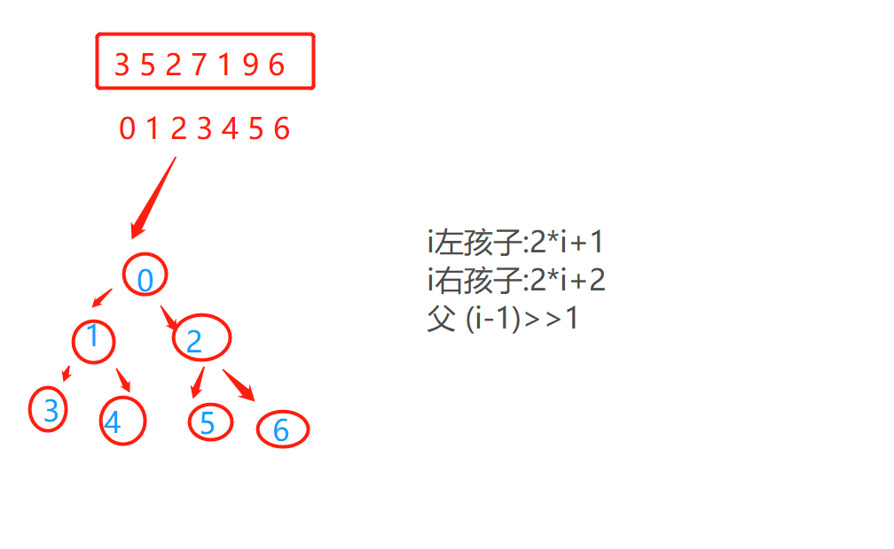

# 前言
> 练算法在我看来就是对思想,对思维,对代码的亲和力的提升
- 思想:指针思想,条件优先思想,二叉树思想,组件化思想
- 条件优先,防止理解混乱,防止走无用功

> 组件化思想
- 将每一个小功能都作为一个方法,这样求最终时就会好求


## 数组???二叉树??
- 一个下标**从0开始的数组**可以转换为一颗**二叉树**
- i位置左孩子 2*i+1
- 右孩子 2*i+2
- 父 (i-1)/2 直接截断取整5/2取2  如果-1/2=0

  
## 堆
- 优先级队列就是堆
- 堆结构就是用数组实现的完全二叉树结构
  

- 大根堆
    - 每一个子树,头节点最大
    - 求法,父节点比较---
  
- 小根堆
  - 也就是经常见到的优先级队列
  - PriorityQueue<Integer> --java.util.PriorityQueue下的  而阻塞队列时java.util.concurrent.BlockingQueue下的且允许过程不同的..
  
  

  

## 堆排序
- 初始化堆
  - heapInsert - 利用(i-1)/2

- 堆最大值出去
  - heapify -- 利用2*i+1
  
- 排序,
  - 利用最后位置于首位交换

## 比较器要好好懂(Compare)
> Comparator接口(推荐)
- 1.代码1,仅仅返回比较的值
- ```
       public static class MyCompare implements Comparator<ComPPP> {
  
          @Override
          public int compare(ComPPP o1, ComPPP o2) {
              return o1.getAge()- o2.getAge();
          }
  
      }
    
  ```

- 2.使用时:Arrays.sort(对象数组,MyCompare);

> Comparable
- 1.需要这个对象类implements Comparable
- 2.代码中编写
- ```
     @Override
	  public int compareTo(对象 newTemp) {
		  return 属性类型.compare(this.属性,newTemp.属性);
	  }
  
  ```

- 3.Arrays.sort(对象数组);


