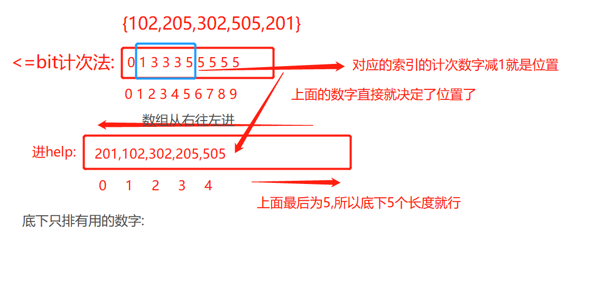
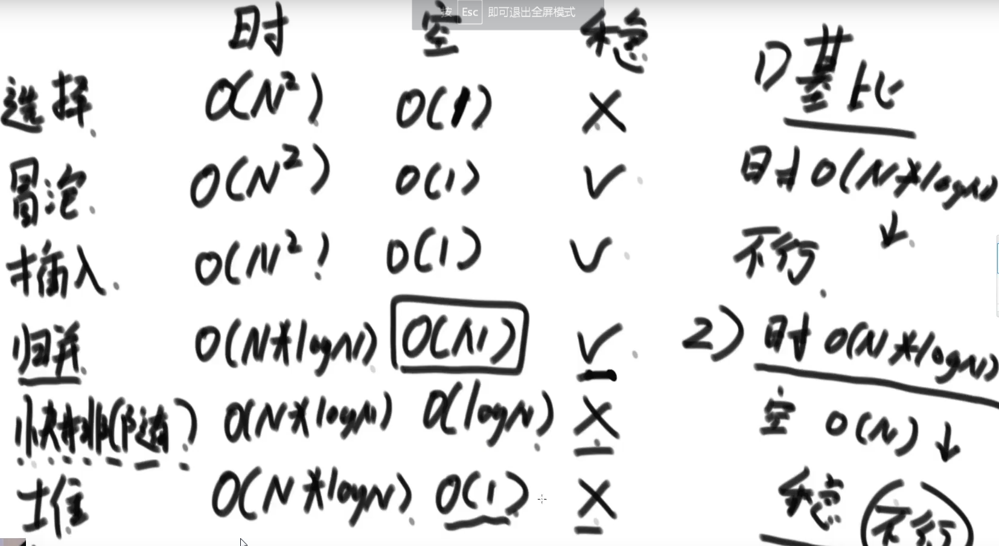

# 桶+链表+哈希表

- 思想:舍弃法,计次万能法(前缀计次),
- 综合排序的方式,如:插入+快排
  - Arrays.sort---如果是基础类型,快排,非基础类型,归并..----稳定性

- 桶的计次法--->目的:获取到该到的位置



## 一些排序算法
> 非基础类重要的稳定性
- 排序算法的稳定性及其汇总 
  - 同样值的个体之间，如果不因为排序而改变相对次序，就是这个排序是有稳定性的；否则就没有。 (比如1,2,3,1) 两个1的相对顺序没变
    - 1.不具备稳定性的排序： 
      - 选择排序(选取第一个比)、快速排序(随机多分)、堆排序 (树,但是取末位)
    - 2.具备稳定性的排序：
      - (两两交换--)冒泡排序、插入排序、(二分思想下的树--)归并排序、一切桶(前缀计次)排序思想下的排序 
        
    - 目前没有找到时间复杂度O(N*logN)，额外空间复杂度O(1)，又稳定的排序。
  



## 链表
- 单链表的节点结构
  ```
    Class Node<V>{
      V value;
      Node next;  
      }
  ```
  
- 双链表的节点结构
  ```
  Class Node<V>{
   V value;
   Node next;
   Node last;
   }
  
  ```

## 解链表的技巧
- 1）额外数据结构记录（哈希表等）
- 2）快慢指针
  - (1)目标:判断是否是回文串
  - (2)快指针一次走两步:.next.next
  - (3)慢指针一次走一步:.next


## 哈希表
- 在C++中叫做:UnOrderedMap  UnSortedMap
- 哈希表的增删改查---复杂度都是常数级别

- 哈希表的简单介绍
  - 1）哈希表在使用层面上可以理解为一种集合结构
  - 2）如果只有key，没有伴随数据value，可以使用HashSet结构(C++中叫UnOrderedSet)
  - 3）如果既有key，又有伴随数据value，可以使用HashMap结构(C++中叫UnOrderedMap)
  - 4）有无伴随数据，是HashMap和HashSet唯一的区别，底层的实际结构是一回事
  - 5）使用哈希表增(put)、删(remove)、改(put)和查(get)的操作，可以认为时间复杂度为 O(1)，但是常数时间比较大
  - 6）放入哈希表的东西，如果是基础类型，内部按值传递，内存占用就是这个东西的大小
  - 7）放入哈希表的东西，如果不是基础类型，内部按引用传递，内存占用是这个东西内存地址的大小


## 有序表的简单介绍
- 1）有序表在使用层面上可以理解为一种集合结构
- 2）如果只有key，没有伴随数据value，可以使用TreeSet结构(C++中叫OrderedSet)
- 3）如果既有key，又有伴随数据value，可以使用TreeMap结构(C++中叫OrderedMap) 
- 4）有无伴随数据，是TreeSet和TreeMap唯一的区别，底层的实际结构是一回事 
- 5）有序表和哈希表的区别是，有序表把key按照顺序组织起来，而哈希表完全不组织
- 5）红黑树、AVL树、size-balance-tree和跳表等都属于有序表结构，只是底层具体实现不同
- 6）放入哈希表的东西，如果是基础类型，内部按值传递，内存占用就是这个东西的大小
- 7）放入有序表的东西，如果不是基础类型，必须提供比较器，内部按引用传递，内存占 用是这个东西内存地址的大小
- 8）不管是什么底层具体实现，只要是有序表，都有以下固定的基本功能和固定的时间复 杂度

## 有序表的固定操作
- 1）void put(K key, V value)：将一个（key，value）记录加入到表中，或者将key的记录 更新成value。
- 2）V get(K key)：根据给定的key，查询value并返回
- 3）void remove(K key)：移除key的记录。
- 4）boolean containsKey(K key)：询问是否有关于key的记录
- 5）K firstKey()：返回所有键值的排序结果中，最左（最小）的那个
- 6）K lastKey()：返回所有键值的排序结果中，最右（最大）的那个。
- 7）K floorKey(K key)：如果表中存入过key，返回key；否则返回所有键值的排序结果中， key的前一个。
- 8）K ceilingKey(K key)：如果表中存入过key，返回key；否则返回所有键值的排序结果中， key的后一个。
- 以上所有操作时间复杂度都是O(logN)，N为有序表含有的记录数


