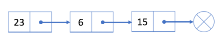
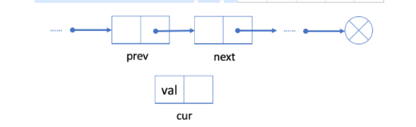
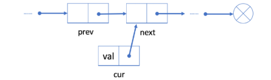
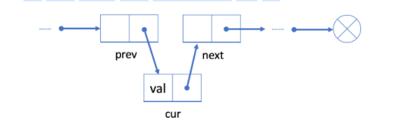
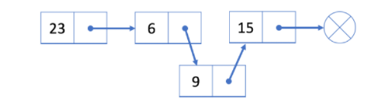
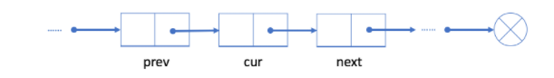
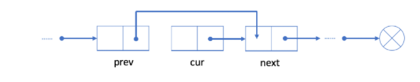
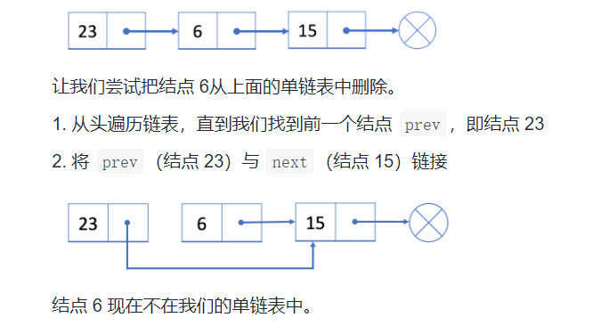

# 前言
- 对于算法或者其它事情,如果这个事让你去动脑了,那么就做完后需要看它的**功能**,以及**健壮性**!!!
- 本文重点是灵活使用链表的增,删!!!(重点)--第三节
> 思想:正反(顺逆)思想,


## 一.链表
- 基本操作::: [ListNode](zh-cn/数据结构与算法/NOTES/ListNode.md)
> 与数组相似，链表也是一种线性数据结构
- 链表中的每个元素实际上是一个单独的对象，而所有对象都通过每个元素中的引用字段链接在一起。

- 链表有两种类型：单链表和双链表。
  

### 二.单链表
> 1.单链表中的每个结点不仅包含值，还包含链接到下一个结点的引用字段。通过这种方式，单链表将所有结点按顺序组织起来。
> 
> 2.使用头结点(第一个结点)来表示整个列表。


> 3.单链表的节点结构
- 正常结构
  ```
    Class Node<V>{
      V value;
      Node next;  
      }
  ```

- java中的结构
    ```
     // 链表要素:本节点,以及Next
     // java要素,,面向对象-->java类-->构造器  
      public class SinglyListNode {
        int val;   // 当前节点
        SinglyListNode next;  // 节点Next指针,注意它是类名定义的,属于SinglyListNode对象
        SinglyListNode(int x) { val = x; }
      }
    ```


> 4.操作
- 与数组不同，我们**无法在常量时间内**访问单链表中的**随机元素**。
  - 如果我们想要获得第 i 个元素，我们必须从头结点逐个遍历。
  - 我们按索引来访问元素平均要花费O(N)时间，其中 N 是链表的长度。
    
- zjz说:链表的每一个节点都得O(N)才能访问到

- (23,Next)--->(6,Next)--->(15,Next)--->end
- 例如，在上面的示例中，头结点是 23。
  访问第 3 个结点的唯一方法是使用头结点中的“next”字段到达第 2 个结点（结点 6）; 然后使用结点 6 的“next”字段，我们能够访问第 3 个结点。

- 为什么链表很有用，尽管它在通过索引访问数据时（与数组相比）具有如此糟糕的性能。
  - 插入和删除操作，你将了解到链表的好处。


## 三.链表的增,删!!!(重点)
> 定义
- ```
     public class SinglyListNode {
        int val;   // 当前节点
        SinglyListNode next;  // 节点Next指针,注意它是类名定义的,属于SinglyListNode对象
        SinglyListNode(int x) { val = x; }
      }
  
  ```
  
> 添加操作 - 单链表---注意看图
- 1.如果我们想在给定的结点 prev 之后添加新值
    - 1.使用给定值初始化新结点 cur；
    - 
    - 2.将 cur 的 next 字段链接到 prev 的下一个结点 next ；
    - 
    - 3.将 prev 中的 next 字段链接到 cur 。
    - 
- 2.与数组不同，我们不需要将所有元素移动到插入元素之后。因此，您可以在 O(1) 时间复杂度中将新结点插入到链表中，这非常高效。

- 3.举例
  - (23,Next)-->(6,Next)-->(15,Next)-->end
  - 第二个节点6后面插入9  ----操作:首先**初始化**一个值为9的新结点。然后**将结点9Next链接到结点15** 。最后，将**结点 6 链接到结点 9** 。
  - 
- zjz说:
    - 将一个节点插入进去,需要**涉及到两个节点的改变**,,前节点的next,插入节点的新建以及next的链接
    - 而数组涉及到后面的所有元素变动,而且数组还得扩容,,,

- 4.在开头添加结点
- 我们使用头结点来代表整个列表
- 因此，在列表开头添加新节点时更新头结点 head 至关重要
    - 1.初始化一个新结点 cur ；
    - 2.将新结点链接到我们的原始头结点 head。
    - 3.将 cur 指定为 head 。
    
- 在列表的开头添加一个新结点 9 。
    - 1.我们初始化一个新结点 9 并将其链接到当前头结点 23 。
      - (9,next)--->(当前头head)(23,next)--->(6,next)--->(15,next)--->end
    - 2.指定结点 9 为新的头结点。
      - (当前头head)(9,next)--->(23,next)--->(6,next)--->(15,next)--->end  
    
- 5.在链表末尾添加节点，需要从 head 遍历，直到找到最后一个节点，将该节点的next设置为目标节点。

> 删除操作 - 单链表
- 我们想从单链表中删除现有结点 cur，可以分两步完成：
  - 1.找到 cur 的上一个结点 prev 及其下一个结点 next ；
    - ...()
  - 2.接下来链接 prev 到 cur 的下一个节点 next 。  
    - 
  - 在我们的第一步中，我们需要找出 prev 和next。
  - 使用 cur 的参考字段很容易找出 next，但是，我们必须从头结点遍历链表，以找出prev，它的平均时间是O(N)，其中 N 是链表的长度。
  - 因此，删除结点的时间复杂度将是O(N)。
    
- 举例

  
- 删除第一个结点
 - 如果想要删除第一个结点，我们可以简单地将下一个结点分配给 head。也就是说，删除之后我们的头将会是结点 6。


### .
- 双链表的节点结构
  ```
  Class Node<V>{
   V value;
   Node next;
   Node last;
   }
  
  ```

## 解链表的技巧
- 1）额外数据结构记录（哈希表等）
- 2）快慢指针
    - (1)目标:判断是否是回文串
    - (2)快指针一次走两步:.next.next
    - (3)慢指针一次走一步:.next


