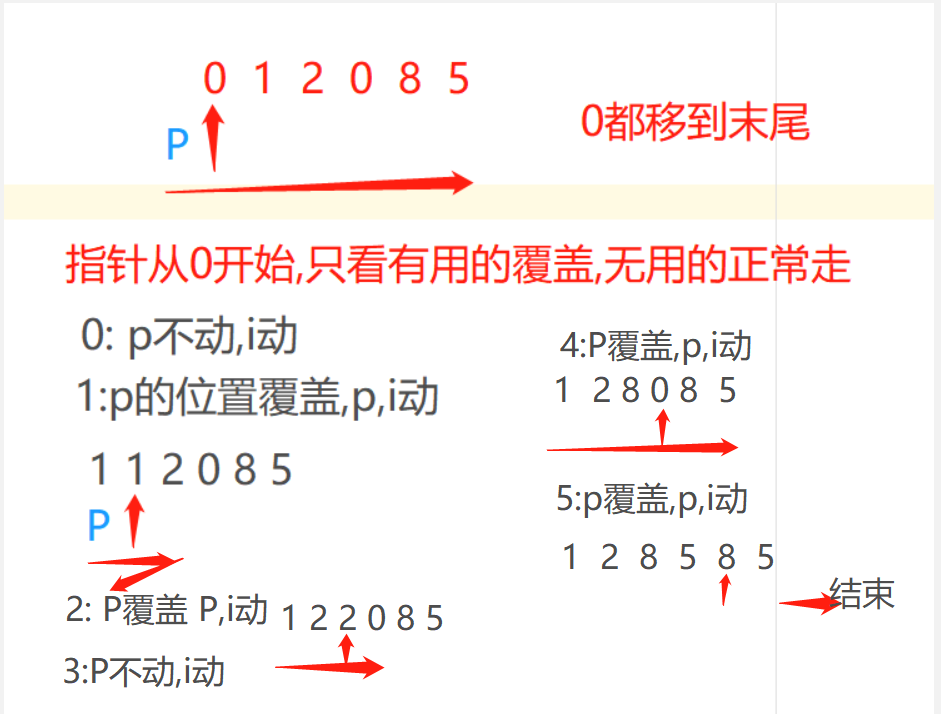

# 链表
> 思想:有效思想，指针思想，额外数据结构记录（哈希表等），快慢指针思想

> 单双链表，对于笔试，不要纠结空间，一切时间复杂度，，，面试时间第一，但是也要思考空间复杂度

## 指针思想
- 如有指针，必定用while，因为while方便`控制指针的移动不移动`！！！
- 很多时候，指针有可能不动的，for虽然好，但是很多情况容易思路不清晰！

## 有效思想
- 在指针中实在太常见了,有效的时候指针移动,无效时指针不动
- 先让自己`眼中只有有效`的元素
- 方法1：移动0，有用则覆盖p，无用则跑 --- 方法2，p，i走，有用则交换pi跑，无用i继续跑



> 于14号将链表手写完成
-  [ListNode](zh-cn/数据结构与算法/NOTES/ListNode.md)

## 双指针操作
- 在有序的链表找共同
- 谁小谁移动的思想，相同返回同时再移动。。。

## 快慢指针
- 本质上是为了让链表也能成为二分的链表
- 快指针一次走两步，慢指针走一步，如果快指针走完了，那么慢指针应该在中间
- 注意它们是从头指针开始走的
- ```
    Node n1 = head;   Node n2 = head;
    while(n2.next != null && n2.next.next!=null){  // 都是n2.。。背会就好
        n1 = n1.next;
        n2 = n2.next.next;
    }

  ```

## 逆序链表
- 确定next为null。。依据--》   1.`找到下一个 `  2.`逆转next` 3.阵容需要三个Node
```
  n2 = n1.next;   // 找到null的下一个
  n1.next = null; // 放心的next为null
  Node n3 = null;  // 利用n3，n1,n2来进行组成一个小逆序阵
  
  while(n2!=null){
    n3 = n2.next;  // 找到下一个
    n2.next = n1;  // 安心指到之前的
    n1 = n2;  // 阵容移动。。
    n2 = n3;  
  }


```

## 栈
- Stack<E> stack = new Stack<>();
- stack.push(1);
- stack.pop();
