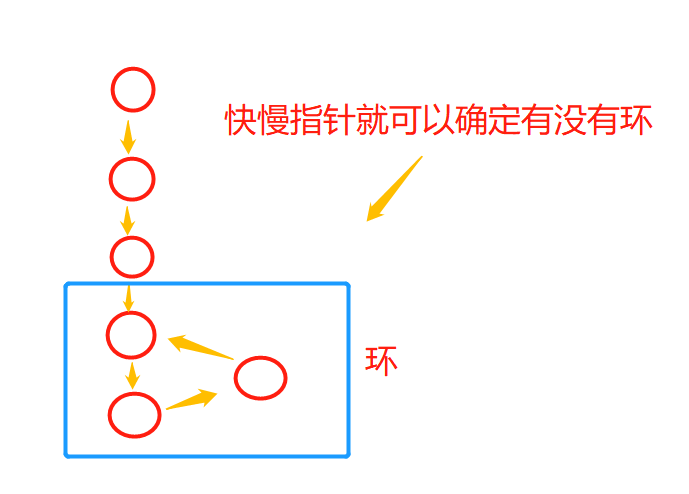
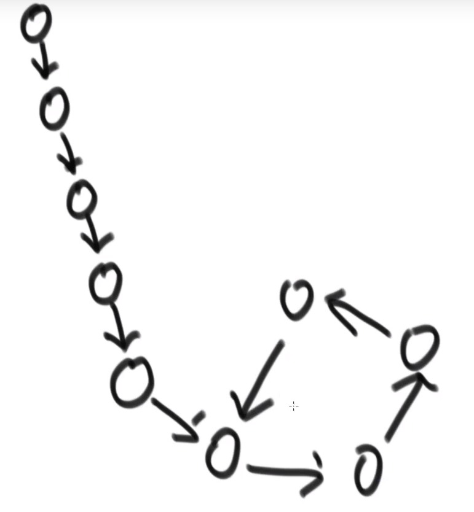

# 链表
> 思想：链表拆解法，跟屁虫思想
- 如果要找重复，**不能使用哈希**时，排序时候的遍历确实是个好方法，思考有没有指针能解决不断遍历
- 链表题必备的**指针** ListNode cur = head; 执行体内要做next或者其它操作..

## 链表-
- 值得注意的是链表每个节点都有一个next指针（结构就注定了，，）想想之前的定义的结构
> 拆解法

- 之前我们数组的荷兰国旗问题（`<target` ,`=target`,`>target`)
    - 使用数组的双指针解决，指针控制头，末尾，数组也控制。最后达成效果。
    - 而链表只需要6个节点，三个头。三个尾，分别存放，最后连接，（注意：：最后边界问题，有可能小于，大于，等于有空的情况）
    - **链表的运行，每次都得判断两种情况：空-新建，非空-运算**
    
> 借助map
- 结构中有一个随机节点（Rand）的Node链表，可以想象成它每次都有两条next的路
- 那么如何复制呢？
- 采用哈希表（hashMap）的方式，1.复制节点的值，2.复制节点的next 3.复制节点的Rand
 - 注：为啥不直接复制节点，因为一个节点的构成是由它的结构决定的，而不是直接复制节点
 - 如果`直接复制节点`，`只能复制它当前地址的引用`，，**没有值**，**没有next**。。

> 复制节点
- 1.借助hashmap
    - 我们有的也就是Hash<Node,Node>,先把里面放上新的节点，然后再将next以及其它属性整进去
    - 1.复制值 map.put(cur,new Node(cur.value))
    - 2.复制next：注意得对应上直接复制的值：：： map.get(cur).next = map.get(cur.next);

- 2.只借助链表本身。。---跟屁虫
    - 1.链表明确；Node（值，next） 定义只能定Node（值） 
    - 2.只能从next出发，于是可以--n1-n11-n2-n22--n3-n33--null--------
    - 思考上面的方式，这样实际上1.如何操作，只要遍历时add一个，更改两个next就好了
    - 拆的时候，只需要1.返回Node.next.next，2.组装，于是就能拆开两个链表
    

### 有环
 
> 方法1：利用哈希表，找到重复的点，返回index，然后跑一遍抓到了。
- 要注意规范，，没头，尾巴。。。
  
> 外环，内环
- 环外5个，环内四个，，，循环点之前的都环外的，循环点开始的就环内的

    

> 方法2：快慢指针，快指针判null，
- 快指针就是隔一个走一下
- 最好初始就先让快慢走一波，`快在head.next.next---慢在head.next`---**判断**也是判断next，next.next不为null在走！！
- 于是这样到时**只要判断相等**就好了,由**快**的`next，next.next判断null`，，直接**抓到无环**

> 快慢指针找到第一个环节点
- **关键**：：魔性的结论，相遇后。快指针回到head---然后快慢一起`一步步走`，最后相遇的地方就是第一个环
 - Q指针---》head  S指针---》相遇的地方 再同时走（**都是走1步**）！！----》相遇的就是开始环的节点

## 两个链表相交--找到相交点
- 如果无环的，那么它们必然是两个头，一个尾，中间有个交点，，直接**判断尾巴就**知道相交不。 --判断内存地址==
  - 既然尾巴相同，那么前边部分，长的要截掉一部分（长-短），然后一起走碰到内存地址一样的就是相交的开始。--内存地址==
    
- 一个有环，一个无环，不可能相交，有环中怎么出来的尾巴？

  
- 如果有环的，分三种情况：
 - 1.没有交集。。----
 - 2.交点在各种环点前-
 - 3.交点在内环里----
- 第二种好判断`直接比下环节点`，**内存相同**就证明属于第二种，-->然后再依据长的减短的，`一起走`就找到了交点
- 第一，第三，直接在内环中找，比如直接**找A链表的内环有没有B的环节点**就行了，，，

## 如何找到第一个重复的元素
- 想法：使用集合，这时时间为O(n)，但是空间O(n)
    - 当集合的size不再增加，就证明了有重复了
    - 怎么判断结合不再增加，多一个变量count，同size一起增，count!=size就证明该停了  

- 空间O(1)::想法：双指针，链表(快慢指针很快就重合)好找到，---但是数组咋搞？

