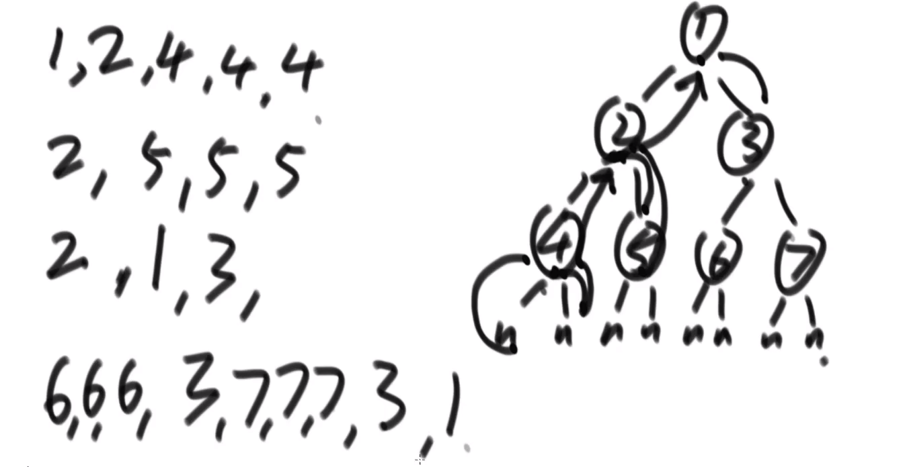
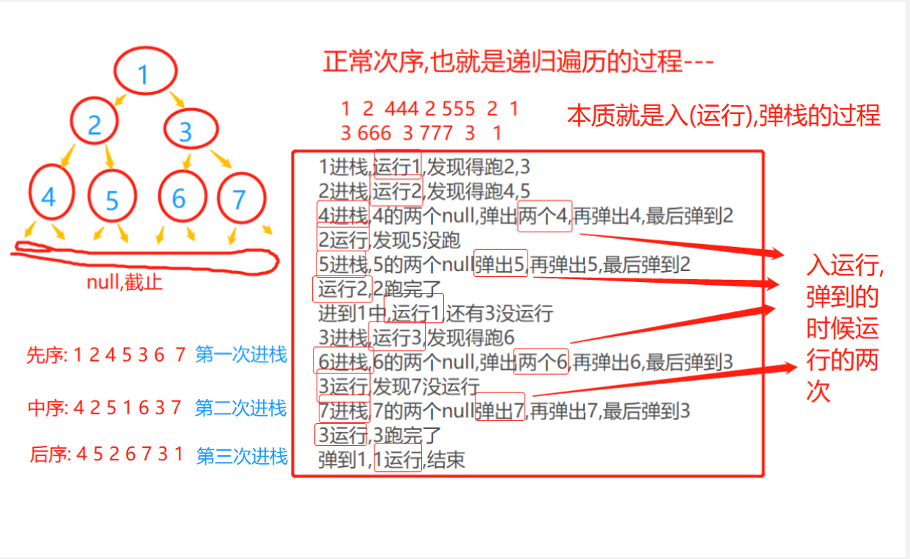
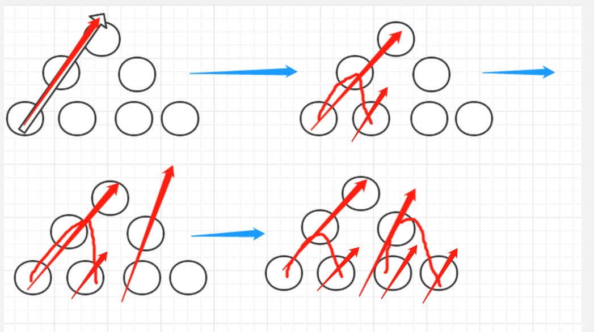
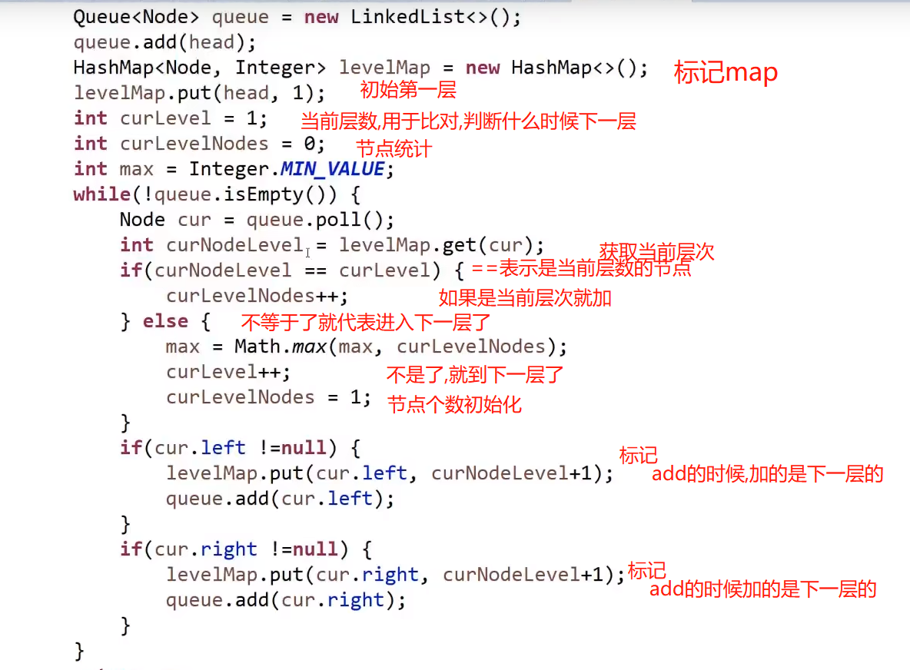

# 二叉树
> 遍历树，标记法，逆向思想


## 逆向思想
> 从结果的角度出发
- 1.首先思考:100个球,两个人抓球,A先出手,如何保证自己赢?
 - 思想:A拿完,剩6个A赢
 - A出手拿4个,此后保证A+B在5个内,5或10个内是按照BA的形式来进行的
 
- 2.根据最终显示进行思考,如树的先中后遍历
 - 都是按照最终的结果,进行逆向的推算.

## 树的遍历
> 树的广度优先遍历,深度优先遍历
- 广度优先遍历算法，又叫宽度优先遍历，或横向优先遍历，是从根节点开始，沿着树的宽度遍历树的节点。如果所有节点均被访问，则算法中止。
  - zjz说:就是横着来,,一波一波横着来
- 深度优先遍历算法是遍历算法的一种。是沿着树的深度遍历树的节点
  - 直接就想下先序遍历(头左右)--
> 元素的进出考虑队列和栈
- 看别人的代码，要把变量记上，然后一步一步的走逻辑，还原树。。画图
## 二叉树结构
- 结构：从每一个节点出发---值，左指针，右指针
- 和单链表有点像，不过它有两个指针，左右指针，没有环
- 左右为null的节点是叶子节点，最上面的节点是根节点  
- ```
    class Node<V>{
        V value;
        Node left;
        Node right;
    }
  
  ```
  
> 最容易的遍历方式
- 递归的写法
- 递归序
> 还是之前的思想，一遇递归就是树，有几个枝，看里面小递归几个



## 遍历
- 正常遍历代码
 - ```
    public void f(Node head){
       if(head==null){
            return;    // 叶子的终止
        }
    
    f(head.left); // 左
    f(head.right); // 右
    }
   ```

> 每一次的进入子递归,都相当于主节点,左节点,右节点
- 先中后，都是指的**头节点**的位置。。。
> 先序遍历（头左右）---第一次进栈值的顺序
- 先序代码，在运行左子遍历前打印就行 
  - **zjz说**:先序,也就是每次进入主节点先调用sout,然后再进左,
  - 注意的是,`每次进子,子的就是主了`
- ```
    public void f(Node head){
       if(head==null){
            return;    // 叶子的终止
        }
    System.out.print(head.value+" ");
    f(head.left); // 左
    f(head.right); // 右
    }
   ```
> 中序遍历（左头右）---第二次进栈值的顺序
- 中序代码，在左右子遍历中间打印就行
  - **zjz说**:也就是每次主节点的左节点的所有引用完了(底下的都是return状态)
  - ,**要进入右节点的时候**(能进右的时候(底层的null,return也就是完成了左右)!!),在这之前sout一波,调用一下打印本主节点
  - 注意的是,`每次进子,子的就是主了`
- ```
    public void f(Node head){
       if(head==null){
            return;    // 叶子的终止
        }
    
    f(head.left); // 左
    System.out.print(head.value+" ");
    f(head.right); // 右
    }
   ```
> 后序遍历（左右头）---第三次进栈值的顺序
- 后序代码，在运行右子遍历后打印就行
  - zjz说:后序也就是主节点的左右子节点的所有引用都完了,调用一下打印本主节点,再去下一个压栈的主节点.--记得注意底层的叶子返回.
  - 注意的是,`每次进子,子的就是主了`
- ```
    public void f(Node head){
       if(head==null){
            return;    // 叶子的终止
        }
    
    f(head.left); // 左
    f(head.right); // 右
   System.out.print(head.value+" ");
    }
   ```



## 模拟递归遍历打印流程
- 本质是：模仿递归的执行流程！
- 都需要逆向思考，分析。。。**要啥**，应该是**栈怎么运行**
- 注意的就是：：压左再压右就是，右出，左出-----压右再压左，就是左出，右出
> 先序遍历--一个栈--弹右左
- 一个栈，要的是头左右，那么应该是头出，左出，右出---`压右再压左，就是左出，右出`
 - 1.栈`弹出`一个元素，运行一波打印
 - 2.栈`弹出`一个元素时，先`压树的右边`，在`压树的左边`,**不为null**就压入
 - 3.**循环**，直到`栈null`
- zjz说：一个栈，逆向思维，先序要头左右，那么栈头进，头出，右进左进---》左出右出
  - 先放进去一个,然后弹的时候,判断有没有左右---只有左,压左,有左右,先压右再压左!
  - 它是弹一压一波的过程
  
  
> 后序遍历---两个栈--1号栈：弹左右--2号栈：存弹
- 两个栈，一个用于第一波，一个用于收集第一波
- 后序是：左右头，那么我们的`收集栈`--从**下到上**应该是头右左，那么第一波的栈，应该是头出，右出，左出--`压左再压右,再压头就是，头出,右出，左出`
- 于是；；；第一个栈：
 - 1.弹出一个，放入2号栈
 - 2.先进左，再进右，（不为null的时候）
- 第二个栈：打印就行
- zjz说：逆向思维，先判的二号需要从`上到下`，左出右出头出，那么一号需要给头出-》右出左出，所以一号头进，左进，右进

> 中序遍历---单个栈+判断
> 
- 栈：1.左边全进来，`叶子在最上面`，`根在最下面`.
    - 2.`每出去一个`，打印，**判断**一次有没有右树，如果有，**右树的左边全进来**。（null除外）
    - 3.弹出节点的右树重复 1 2
- zjz说：左边全进，出有右，右左全进。    

  
- 代码
 - ```
    public static void inOrderUnRecur(Node head){
      if(head != null){
        Stack<Node> stack = new Stack<Node>();
        // 左边全进,然后出,出的时候一个个出,右边有就左边进来!
        while(!stack.isEmpty() || head != null){  // 条件!!不为null才运行,先栈后节点判断
          // 不为null,先塞左值,也就是初始化!!然后run就行
          if(head != null){  // 初始化,以及当右边不为null时!左边进!
              stack.push(head);
              head = head.left;
            }else{   // run
              stack.pop();
              System.out.println();
              head = head.right;  // 右边进
            }
        }
      } 
      System.out.println();
    }
   
   ```


## 队列的使用
> Queue<Node> queue = new LinkedList<>();  // 先进先出的
- 每弹出一个数字，可以往队列里面塞值
- 如：二叉树的宽度优先遍历---先左后右--队列使用
 - 做法：一颗树，每次遍历它的每一层输出
 - 难点：如何确定下一层的数据，，使用队列，弹出时，判断有没有左右节点，加进去


## 标记法
> 什么时候用呢？怎么标记？
- 使用hashMap进行标记，利用多重判断来进行识别
  
## 宽度优先遍历
> 宽度也就是横着走----
### 宽度遍历
- 直接一个队列存,出一个,左右不为null就进,,----弹出时打印


### 求一颗二叉树的最大宽度
> 目标:知道第几层,这层有多少节点---
- 在二叉树宽度优先遍历的过程中，最大宽度为多少？
 - 1.求宽度---先得出每一层的宽度
 - 2.算法的过程是--二叉树的宽度优先遍历---先左后右--使用队列
  - 做法：一颗树，每次遍历它的每一层输出
  - 难点：如何确定下一层的数据，，使用队列，弹出时，判断有没有左右节点，加进去
 - 3.它是每一次弹出，然后将左右节点塞进去

> 最大宽度:   
- 我们需要一个`记录层次的`，一个`记录节点数`的标记，还有一个`判断是否进入下一层`。
- 主要采用的是**标记思想**，每次出来的点，进行标记，第一次弹的时候就应该有当前层数的计数。
  - 做法:加节点的时候,将节点的位置加上
  - 弹的时候判断是不是当前层的,是就计数器计数,不是就计数器置0,开始下一层.
  
- 弹完后加节点，都是下层的，关键问题：它弹的时候是弹一个，加的第一波可能是1或2个，后面可能是2的n次个，如何确保每一层？
- 在开始时确定好是哪一层的开始，在add的时候，使用hashmap将它们的层数记上



> 使用非hash表的方式
- 每层记最后一个
  - newTail，每次进一个更新标记newTail，上一层的末尾oldTail到了，就结束了，最后newTail换OldTail
  
- 代码
  - ```
      public void DeepTraverse(Node head){
        // 入参头节点,用队列,弹一个左右进
        Queue<Node> queue = new LinkedList<>();
        queue.add(head);
        HashMap<Node,Integer> levelMap = new HashMap<>(); // 用于标记当前节点的层数
        levelMap.put(head,1);
    
        int curLevel = 1;  // 判断节点是不是当前层的,能不能进入下一层
       
        int curCount  = 0; // 计数器
        
        int max  = Integer.MIN_VALUE;  // 找到最大
    
        while(!queue.isEmpty()){
          // 队列弹出的节点----依据他获取它的左右子节点
          Node cur = queue.poll();
    
          int curNodeLevel = levelMap.get(cur);  // 当前节点的层数--用于记录
          if(curNodeLevel==curLevel){
            curCount++;
          }else{
            max = Math.max(max,curCount); 
            curLevel++;  // 开始下一层,以及进行结算
            curCount = 0;
          }
                
    
          if(cur.left!=null){  // 左边不空,左边加
             levelMap.put(cur.left,curNodeLevel+1);
            queue.add(cur.left);
            
          }
          if(cur.right!=null){ // 右边不空,右边加
           levelMap.put(cur.right,curNodeLevel+1);
            queue.add(cur.right);
          }
      
        }
        
        
    
    
    }
    
    
    
    ```


