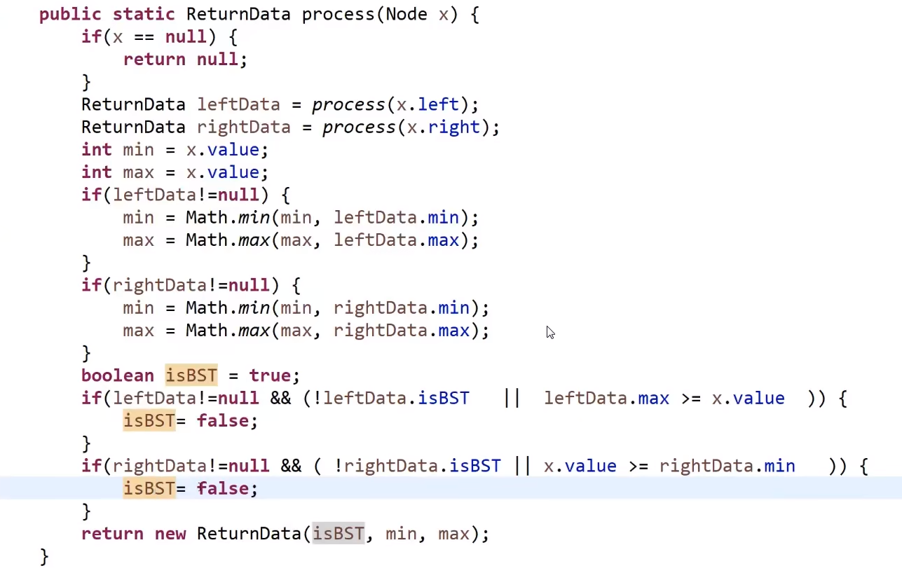
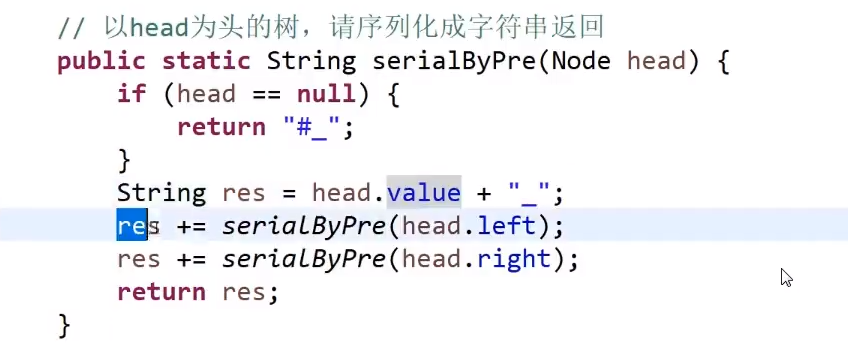
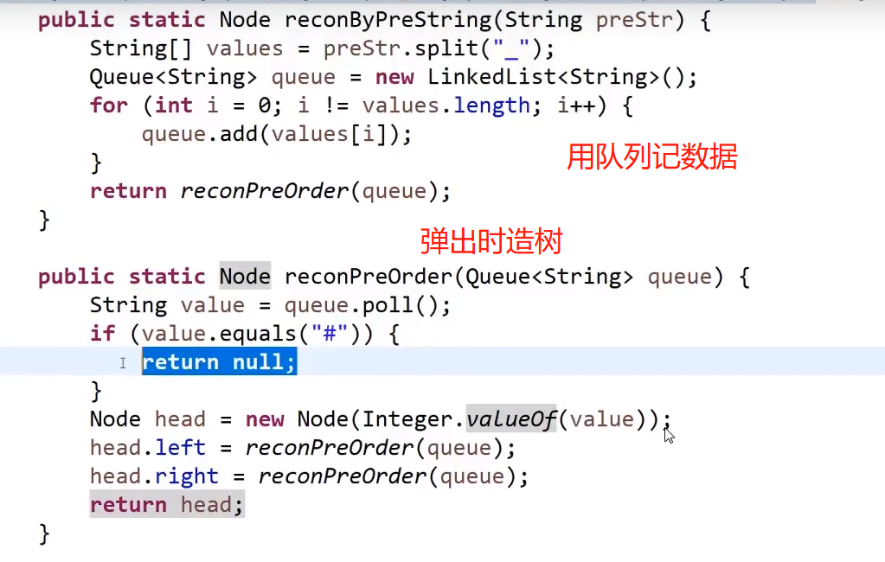

# 二叉树套路
> 思想:需要什么?提供什么?
- 需要一个静态类,**关键**:属性有哪些???

> 优势:明确的格式(一个静态类,返回值的处理,判定)


> 树型DP
- 树上做动态规划
- 要去练,百度去找!


> 套路编写
- 1.分析好需要返回的值,一个静态内部类
- 2.编写递归:
  - 1.终止判断
  - 2.递归开始--左右树递归
  - 3.先写返回值,然后返回值需要的先写上  
  - 4.处理返回值需要的值---


## 搜索二叉树
- 1.需要::左子树需要最大值,右子树需要最小值.是不是BST
- 2.提供::左子树的最大值,右子树的最小值,是不是BST
  - 共同的需要:最大值,最小值,是不是BST --- 因为根据递归,我们必须入参,出参是一样的!!所以最大,最小
    
- 3.递归体的编写:终止:如果null,就返回null
    - 递归体,左右子树
    - 需要的及提供的,最大,最小,由不为null的左右子树分别获取
    - 需要的及提供的,isBST ,需要进行判断,
      - 依据:左子树的最大值要小于等于主节点的value,右子树的最小值要大于等于主节点的value
    
- 我们需要的值有了,判断有了,,终止也有了
- 代码:



## 满二叉树
- 1.需要及提供:高度,个数
- 2.递归体按递归体套路写,四步,,终止,递归,返回值,返回值的属性的处理
- 3.最后在拿上统计好的值进行判断 N = 2^L-1;


## 平衡二叉树
- 1.需要:之前的高度,之前是不是平衡的
- 2.提供:高度,提供是不是平衡的
 - 共同的需要,提供,直接用静态内部类的一个对象操作
- 3.递归体的编写:终止,**需要的及提供的**,return结束.
- 关键是这个静态内部类的属性,,,依据需求进行编写!

- 代码
 - ```
      public static class Node {
            public int value;
            public Node left;
            public Node right;
    
            public Node(int data) {
                this.value = data;
            }
        }
    
       // 执行体
        public static boolean isBalanced(Node head) {
            return process(head).isBalanced;
        }
    
        // 因为要返回两个值,所以使用一个静态内部类来,属性也就是值
        public static class ReturnType {
            public boolean isBalanced;
            public int height;
    
            public ReturnType(boolean isB, int hei) {
                isBalanced = isB;
                height = hei;
            }
        }
    
    
       // 递归体,目标:要获取之前的树,要返回两个值(1.是不是平衡二叉树,2.高度)
        public static ReturnType process(Node x) {
           // 叶子节点的终止..
            if (x == null) {
                return new ReturnType(true, 0);
            }
            
            // 递归体,利用构造器,不断获取值
            ReturnType leftData = process(x.left);
            ReturnType rightData = process(x.right);
    
            // 要提供的以及需要的::高度和是不是平衡二叉树的获取
            int height = Math.max(leftData.height, rightData.height) + 1;  // 加1是为了获取我们的头,因为这个1,我们才得以计算高度
            boolean isBalanced = leftData.isBalanced && rightData.isBalanced
                    && Math.abs(leftData.height - rightData.height) < 2;
          
            // 要提供的以及需要的::这个return刷新很多次,直到停止
            return new ReturnType(isBalanced, height);
        }
   
   
   ```

## 求二叉树两节点的最小公共祖先
> N1,N2,一定属于同一个head的树

> 遍历时,使用hashMap将每个节点的father标记上.
- 递归体操作时,将其进行标记
- 从上到下的标记过程.

> 怎么让N1和N2向上找自己的父节点了?
> 依据:之前的标记,直接标记的时候,标记的自己的父亲,于是通过父亲找父亲!
- 1.判断如果不到head(cur != fatherMap.get(cur))
- 2.一直往set中加N1的father--set1.add(cur);----cur=fatherMap.get(cur);
- 1.再让N2,也往上走,与N1的set进行比较!


## 二叉树的后继节点
- 新的二叉树结构
  - ```
    public class Node{
      public int value;
      public Node left;
      public Node right;
      public Node parent;
      
      public Node(int val){
        value = val;
     }
      
      }
    
    ```
> 如果按照中序遍历ABCDEFG的树的话
- DBCAFCG---->后继节点就是 D后面是B,C后面是A
  - 前驱也是指的B的前面是D
> 方法1
- 直接中序遍历完

> 方法2
- 利用树的结构来进行
- 1.如果主节点有右子节点,那么下一个就是右子节点的左节点
- 2.如果主节点无右子节点,那么下一个节点就是不断向上抛---直到遇到它的父亲是别的节点的左节点
- 3.2的基础上,如果抛到了头节点之上的null,直接返回null(也就是当前的parent),主要判断里,防止一直null中的无限套娃


## 二叉树的序列化和反序列化

- 树的序列化:内存中的数据或者结构变成硬盘里的字符串的形式  --- 要求字符串对应出唯一的结构来
  

- 树的反序列化:依据字符串推出结构和数据 

  

## 折纸
- 1.折出一个凹 -- 1凹
- 2.折出凹凹凸 -- 2凹 1凹 2凸
- 3.折出凹凹凸凹凹凸凸 3凹 2凹 3凸 1凹 3凹 2凸 3凸

> head为凹,左子树头节点为凹,右子树头节点为凸
- i是节点的层数,N是一共的层数,down==true 凹 down==false 凸
- 递归体-->两个子递归递归,中间一输出
- 入参三个


