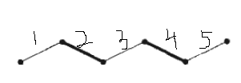

# 算法模板

## 匈牙利算法
### 介绍及使用
> 一个用于图论中`寻找最大匹配`的算法
>
> 用于匹配，是图论中的任务分配问题，通常是针对于二部图发起的，想想也是，匹配不就是`配对`么，自然是两两成对了。
>
> 二部图:就是分为两个集合进行x{}，y{} --- 可以多思考下奇数集合，偶数集合，
- 要求:
    - 1. 匹配是边的集合；
    - 2. 在该集合中，任意两条边不能有共同的顶点。

- 自然而然就会有一个想法，一个图会有多少匹配？有没有最大的匹配（即边最多的匹配呢）？
- 
- **交错路径**：给定图G的一个匹配M，如果一条路径的边交替出现在M中和不出现在M中，我们称之为一条M-交错路径。
    - 匹配M是2，4的话，那么图就是一个交错路径的图。。---边一直处于M与非M的交互之间
- **增广路径**:而如果一条M-交错路径，它的两个端点都不与M中的边关联，我们称这条路径叫做M-增广路径。

> 最大匹配的思想就是：在已有的基础上不断看两端是否`都`与M关联，以此来推算最大的匹配项
> 先来先得，能让就让
- 寻找增广路径这么个解决问题的想法。

- zjzSum:任务分配机制,最大匹配,最省成本的匹配
      -  // 匈牙利算法要素,1.进入的待匹配的数 2.匹配数集合 3.匹配对(对应匹配数,有就是匹配值,无就是0)集合 4.标记是否匹配过(只与匹配对以及匹配数产生关联).
      
- zjz思想：本质，它是将每个数分为两组，一组进入另一组寻找匹配项（定义两个数组），当找到时，先来先占（使用一个标记记录，是否用过它了），
  再进入二次判断，（第一确保这个数没被其他数占有--需要一个匹配组（记录匹配上的数），或者其他数再进入本递归能找到其他匹配项（由上而下的时候用过的已经标记）），
  赋值，结束。
  
  
### 代码:
- ```java
    public class Main{
    
        static int max=0;
        public static void main(String[] args){
            //标准输入
            Scanner sc=new Scanner(System.in);
            while(sc.hasNext()){
                //输入正偶数
                int n=sc.nextInt();
                //用于记录输入的n个整数
                int[] arr=new int[n];
    
    
                //用于存储所有的奇数
                ArrayList<Integer> odds=new ArrayList<>();
                //用于存储所有的偶数
                ArrayList<Integer> evens=new ArrayList<>();
    
            
            
            for(int i=0;i<n;i++){
                    arr[i]=sc.nextInt();
                    //将奇数添加到odds
                    if(arr[i]%2==1){
                        odds.add(arr[i]);
                    }
                    //将偶数添加到evens
                    if(arr[i]%2==0){
                        evens.add(arr[i]);
                    }
                }
                
            
            
            
            //下标对应已经匹配的偶数的下标，值对应这个偶数的伴侣
                int[] matcheven=new int[evens.size()];
                
            
            //记录伴侣的对数
                int count=0;
                
            
            for(int j=0;j<odds.size();j++){
                    //用于标记对应的偶数是否查找过
  // 单独写进循环,清除之前的缓存是因为,我这个数,只与匹配对以及匹配数产生关联
                    boolean[] v=new boolean[evens.size()];
                    //如果匹配上，则计数加1
                    if(find(odds.get(j),matcheven,evens,v)){  
            // 输入的-- 奇数（for塞入），匹配数组（下标为偶数下标，值为奇数）偶数集合，偶数是否匹配过（每一个奇数进入时都是一个新的数组）。
                        count++;
                    }
                }
                System.out.println(count);
            }   
        }
        
        //判断奇数x能否找到伴侣
        // 让奇数尽最大的可能进行匹配，先来先得，后来居上。----关键精髓就是让。怎么让？
     // 匈牙利算法要素,1.进入的待匹配的数 2.匹配数集合 3.匹配对集合 4.标记是否匹配过.
  
  
    // 匈牙利的目标就是将两组数,先变成一组只与本数有关的过程!
   // 匈牙利算法要素,1.进入的待匹配的数 2.匹配数集合 3.匹配对(对应匹配数,有就是匹配值,无就是0)集合 4.标记是否匹配过.
    // 作为过程处理器,目标:只将经过记录.

    // 我一个数,进来的时候,第一先看偶数遍历标记,如果有之前经过的,那么就下一个.  第二看能不能进入匹配对,---先来占坑,后来让路(不能就不让)//标记的核心..
        private static boolean find(int x,int[] matcheven,ArrayList<Integer> evens,boolean[] v){  
        // 奇数进入偶数数组进行遍历
            for(int i=0;i<evens.size();i++){   // 偶数下标开始遍历！  目的1：就是让匹配过的数进行标记(Boolean数组标记) 目的2:将匹配对记录在匹配对数组中
    
                if(isPrime(x+evens.get(i))&&v[i]==false){   // isPrime---条件
                    v[i]=true;
                  
                    if(matcheven[i]==0||find(matcheven[i],matcheven,evens,v)){ // 两种情况,一种是匹配对数组值0(未记录过),一种是递归后可以让.
                        matcheven[i]=x;
                        return true;
                    }
                }
            }
            return false;
        }
    
    
    
    
    
        //判断x是否是素数
        private static boolean isPrime(int x){
            if(x==1) return false;
            //如果能被2到根号x整除，则一定不是素数
            for(int i=2;i<=(int)Math.sqrt(x);i++){
                if(x%i==0){
                    return false;
                }
            }
            return true;
        }
    }

```
