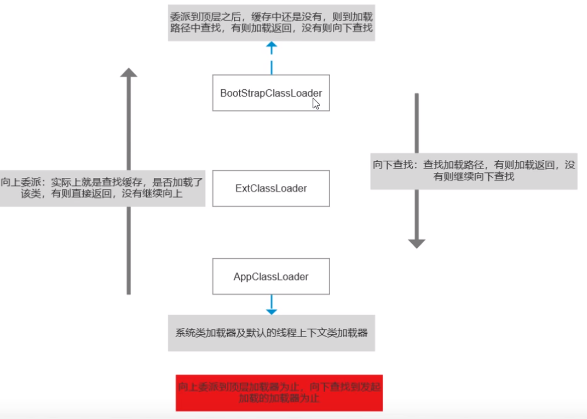
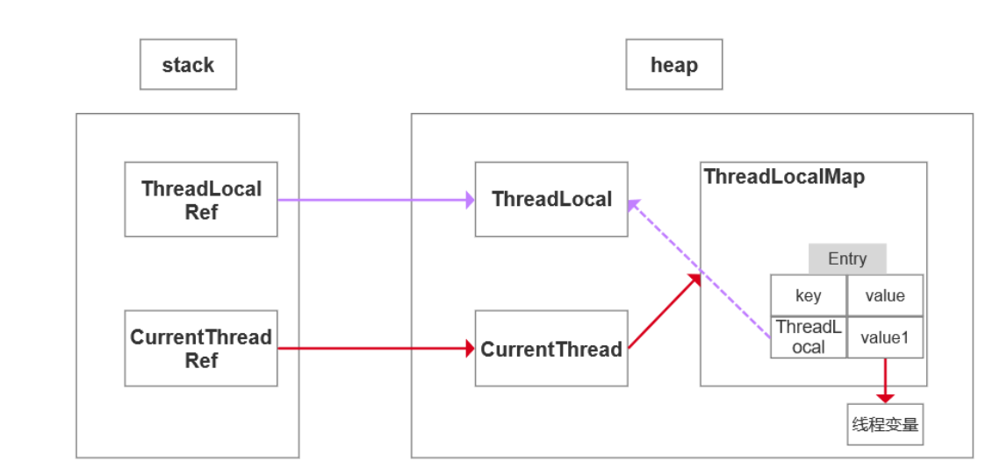
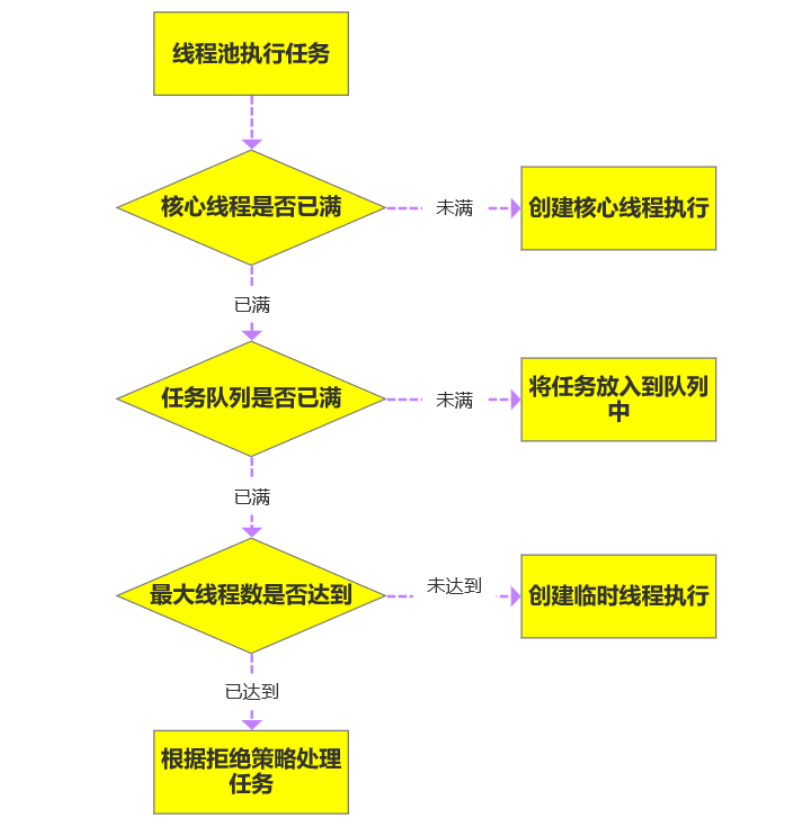

# 前言:
- zjz说:
 - java本质结构:数组+指针
 - JVM,内存分配,回收,,,  
 - 内存泄露:不再会被使用的对象或者变量占用的内存不能被回收  
   - OOM 内存不够了
 - 事务和线程绑定在一起的  
 - hashMap:要明白什么时候存到数组中的`同一个链表`中,怎么找数组的下标,以及数组扩容机制(基本16,0.75,12就扩容2倍,以及为啥2^n)
 - Fail-Fast机制：---迭代器
 - hash表--函数映射
 - concurrentHashMap中的volatile
 - IOC容器
 - 类加载器,双亲委派机制
 - GC怎么判断什么是垃圾?
 - 线程的生命周期?线程有哪几种状态?
 - sleep()、wait()、join()、yield()的区别
 - sleep,wait的区别
 - 线程安全,堆,栈,线程,进程
 - 守护线程
 - 并发、并行、串行的区别
 - 并发三大特性
 - 线程池的七大参数,执行流程
 - 线程池中阻塞队列的作用?为什么是先添加队列而不是先创建最大线程?
 - 线程池的线程怎么跑.(线程复用)---循环任务,不停检查,执行run方法

# java最基本的结构
> 数组 + 指针
- 在java编程语言中，最基本的结构就是两种，一个是数组，另外一个是模拟指针（引用），所有的数据结构都可以用这两个基本结构来构造的，HashMap也不例外。
- 数组就不多说了,指针-->Node(链表,二叉树),


# 引用,JVM
> Java中JVM负责内存的分配和回收，
- 这是它的优点（使用方便，程序不用再像使用c那样操心内存），但同时也是它的缺点（不够灵活）。
- 为了解决内存操作不灵活这个问题，可以采用软引用等方法。
- 这四种级别由高到低依次为：强引用、软引用、弱引用和虚引用。
- 强引用是最常用的，软引用应用的情况比较多，弱引用用的比较少，虚引用基本不用。
## 引用--->GC直接关系.
> 强引用
- 常用的引用都是强引用，如果一个对象具有强引用，`GC绝不会回收它`，当内存空间不足，Java虚拟机宁愿抛出OutOfMemoryError错误，使程序异常终止，
  也不会靠随意回收具有强引用的对象来解决内存不足问题。
- 如:new的对象, 反射
- 如果想取消强引用与对象之间的关联,可以显示的将引用赋值为null,这样JVM在合适的时间就会回收该对象

> 软引用（SoftReference）
- 如果内存空间足够，垃圾回收器就不会回收它，如果`内存空间不足`了，就会`回收这些对象的内存`。
  只要垃圾回收器没有回收它，该对象就可以被程序使用。软引用可用来实现`内存敏感的高速缓存`。

> 弱引用（WeakReference）
> 特点:WeakReference包裹
- 弱引用与软引用的区别在于：只具有弱引用的对象拥有`更短暂的生命周期`。
  在垃圾回收器线程扫描它 所管辖的内存区域的过程中，一旦发现了只具有弱引用的对象，`不管当前内存空间足够与否，都会回收它的内存`。
  不过，由于垃圾回收器是一个优先级很低的线程， 因此不一定会很快发现那些只具有弱引用的对象。
  
> 虚引用（PhantomReference）
- 如果一个对象仅持有虚引用，那么它就`和没有任何引用一样`，在任何时候都可能被垃圾回收。


- zjz说:强(new的对象,反射),GC永不回收.软,没内存回收.弱,发现就回收.虚,,GC随便收.

## hashMap

> hashMap
- 底层数组+链表实现，，1.8以后数组+链表+红黑树
  - 数组中存的是Node（链表）
- jdk1.8以后 链表高度到达8，数组超64，链表转换为红黑树，元素以Node节点（链表）存在
> 存放过程，依据key存value  
- 1.计算**key的hash值**，二次hash(两次h的运算),然后`hashCode(key)&数组长度-1`，搜索指定hash值在对应table中的索引,找到对应数组下标
  - 通过h & (length-1); 来得到该对象的保存位，而HashMap底层数组的长度总是 `2 的 n 次方`，这是HashMap在速度上的优化。
  - 而当数组长度为16时，即为2的n次方时，2n-1得到的二进制数的每个位上的值都为1，这使得在低位上&时，得到的和原hash的低位相同，
    加之hash(int h)方法对key的hashCode的进一步优化，加入了高位计算，就使得只有相同的hash值的两个值才会被放到数组中的同一个位置上形成链表。   
  - 为啥要做hash值,因为里面存的是对象,,不通过hashCode怎么找..
- 2.没有hash冲突，(数组下标位置没有值)，`直接创建Node`存入数组
- 3.如果有hash冲突（数组下标位置有值），先进行`equals比较`，`key相同则取代`，
  - `key不同`，判断链表的高度，插入链表后的高度达到8，并且数组的长度达到64则转变为红黑树，`长度低于6则将红黑树转回链表`  
- 4.key为null，存放到下标为0的位置    

- 会涉及到数组扩容---arrayList
  - 扩容机制：`容量默认16`，`加载因子默认0.75`，
    - 超过阈值：负载因子*数组长度-（16*0.75=**12**）-》启动扩容
    - **扩容为原来的两倍**
    
> ArrayList数组扩容(非HashMap的)
- 默认10,负载因子0.5,就会扩容2倍----
 
- zjz说:HashMap 在底层将 key-value 当成一个整体进行处理，这个整体就是一个 `Entry 对象`。
  - HashMap 底层采用一个 Entry[] 数组来保存所有的 key-value 对，
  - 当需要存储一个 Entry 对象时，会根据hash算法来决定其在数组中的存储位置，在根据equals方法决定其在该数组位置上的链表中的存储位置；
  - 当需要取出一个Entry时，也会根据hash算法找到其在数组中的存储位置，再根据equals方法从该位置上的链表中取出该Entry。


> hashMap的key-value
- HashMap在底层将key-value当成一个**整体**进行处理，这个整体就是一个`Node对象`。
- HashMap底层采用一个`Node[]数组`来保存所有的`key-value对`，
- 当需要存储一个Node对象时，会根据**key的hash算法**来**决定**其在数组中的**存储位置**，在根据**equals方法**决定其在该数组位置上的链表中的**存储位置**；
- 当需要取出一个Node时，也会根据key的hash算法找到其在数组中的存储位置，再根据equals方法从该位置上的链表中取出该Node。

- zjz说:put一个Node的时候,通过key的hash算法来决定**数组的**存储的位置,equals决定**链表的**存储位置
  - getNode时,也是key的hash算法算出数组的位置,equals取链表上的值


-  HashMap的key重复,那么value会被覆盖吗？
  - 明确:hashCode相同了才会有哈希冲突,才会触发equals比较key值
  - `同hashCode`-->不同key---value不会覆盖,增加链表,出现两个值


> Fail-Fast机制：---迭代器
> 
> 如果在使用迭代器的过程中有其他线程修改了map，那么将抛出ConcurrentModification`Exception`，这就是所谓fail-fast策略。
- java.util.HashMap不是线程安全的
- 源码中的实现是通过modCount域，modCount顾名思义就是**修改次数**，
  - 对HashMap内容的`修改都将增加这个值`，那么在迭代器初始化过程中会将这个值赋给迭代器的expectedModCount。
- 在迭代过程中，判断modCount跟expectedModCount是否相等，如果不相等就表示已经有其他线程修改了Map：
 - 注意到modCount声明为`volatile`，保证线程之间修改的可见性

- 变量上加Volatile
  - Volatile 是java提高的**轻量级**的**同步机制**
  
- 迭代器的快速失败行为不能得到保证

## hash表

> Hash表
- 1.Hash表也称散列表，也有直接译作哈希表，Hash表是一种特殊的数据结构，
  它同数组、链表以及二叉排序树等相比较有很明显的区别，
  它能够**快速定位到想要查找的记录**，而不是与表中存在的记录的关键字进行比较来进行查找。
- 2.使用**函数映射的思想**将记录的存储位置与记录的关键字关联起来，从而能够很快速地进行查找。


> 冲突的解决
- 通常情况下有2种解决办法：
 - 1)开放定址法
   - 即当一个关键字和另一个关键字发生冲突时，使用某种探测技术在Hash表中形成一个探测序列，然后沿着这个探测序列依次查找下去，当碰到一个空的单元时，则插入其中.
 - 2)链地址法
   - 采用数组和链表相结合的办法，将`Hash地址相同的记录存储在一张线性表`中，而每张表的`表头的序号`即为计算得到的Hash地址。


## JUC下的concurrentHashMap
> jdk7 
- 1.数据结构:ReentrantLock+Segment+HashEntry,一个Segment中包含一个HashEntry数组,每个HashEntry又是一个链表结构
 - 那么,zjz现在不知道哪个?可重复锁+Segment(HashEntry数组)+HashEntry链表
 - 查询时,第一次hash定位到Segment,第二次Hash定位到元素所在的链表头部
- 2.锁:Segment**分段锁**,Segment继承ReentrantLock,锁定操作的Segment,其它Segment不受影响,并发度为Segment个数,可以通过构造函数指定,数组扩容不会影响它
- 3.get,无需加锁,volatile保证可见性

> jdk8
- 数据结构:synchronized+CAS+Node+红黑树,Node的val和next都用`volatile`修饰,保证可见性
- 查找,替换,赋值操作都使用CAS -------CAS乐观锁
- 锁:`锁链表的head节点`,不影响其它元素的读写,`锁粒度更细`,`效率更高`,**扩容时**,`阻塞所有的读写操作,并发扩容`

- 读操作无锁
 - Node的val和next使用volatile修饰,读写线程对该变量互相可见
 - 数组用volatile修饰,保证扩容时被读线程感知  


## 实现IOC容器
> 简单描述
- 配置文件:配置包扫描路径
- 递归包,扫描获取.class文件
- 反射,确定要交给IOC管理的类
- 对需要注入的类进行依赖注入

> 详细设计
- 配置文件中指定需要扫描包的路径
- 定义一些注解，分别表示访问控制层、业务服务层、数据持久层、依赖注入注解、获取配置文件注解
- 从配置文件中获取需要扫描的包路径，获取到当前路径下的文件信息及文件夹信息，我们将当前路径下所有以.class结尾的文件添加到一个`Set集合中进行存储`
- `遍历这个set集合`，获取在类上有指定注解的类，并将其交给IOC容器，定义一个**安全的Map用来存储这些对象**
- 遍历这个IOC容器，获取到每一个类的实例，判断里面是有有依赖其他的类的实例，然后进行递归注入

## java加载器
> bootstrap ClassLoader --rt.jar
- 加载%JAVAHOME%/jre/lib 下的jar包和class文件
> ExtClassLoader
- 加载%JAVAHOME%//lib/ext 下的jar包和class文件
> AppClassLoader
- 加载classpath下的类文件.系统加载器,**线程上下文加载器**---三个类加载器都可以访问线程上下文加载器


> 双亲委派机制---注意它是针对类,,每个对象都有类

  
- 向上查找就是查找缓存,向下查找就是加载类路径
- 向下后AppClassLoader 没找到类,就报找不到了
- 双亲委派模型的好处:
 - 主要为了安全性,避免了用户自己编写的类动态替换java的一些核心类,比如:String
 - 同时避免了`类的重复加载`,因为JVM中区分不同类,不仅仅是根据类名,相同的class文件被不同的ClassLoader加载就是不同的两个类.


## java中异常体系
- java中所有异常都来自顶级父类Throwable
- Throwable下有两个子类,Exception和Error
- Error,程序无法处理的错误,一旦出现这个错误,则程序被迫停止运行
- Exception不会导致程序停止,分为两个部分
  - `RunTimeException运行时异常`(就很常见的异常,如:null指针)和
  - CheckedException检查异常(比如:编写时语法有问题,出来红色下划线..).
- RuntimeException就程序运行异常,也可以手动抛出,,- throw new RuntimeException("..."); 一般自己手动抛异常用这个


## GC如何判断对象可以被回收
- **引用计数法**:每个对象都有一个引用计数属性,新增一个引用时计数加1,引用释放时计数减1,计数为0被回收.(java不采用!!)
  - 缺陷:循环引用,A引用B,B引用A,,,,
- **可达性分析法**:从GC Roots开始向下搜索,搜索走过的路径叫做引用链.
  当一个对象到GC Roots没有任何引用链相连时,则证明此对象不可用,那么虚拟机就判断是可回收对象.
  - GC Roots对象有哪些?
    - 虚拟机栈(栈帧中的`局部变量表`)中引用的对象--- 判断是否还要在栈中运行,弹出去的就要被回收--之前我想的那个{}
    - 方法区中**类**静态属性引用的对象--
    - 方法区中常量引用的对象---
    - 本地方法栈JNI(一般说的Native方法)引用的对象
  
- 可达性算法中的不可达对象并不是立即死亡的，对象拥有一次自我拯救的机会。
  - 对象被系统宣告死亡至少要经历**两次标记**过程:
    - 第一次是经过可达性分析发现没有与GC Roots相连接的引用链
    - 第二次是在由虚拟机自动建立的 Finalizer队列中判断是否需要执行finalize()方法。
    
- 当对象变成(GC Roots)不可达时，GC会判断该对象是否覆盖了finalize方法，若未着盖，则直接将其回收。否则
  若对象未执行过finalize方法，将其放入F-Queue队列，由一低优先级线程执行该队列中对象的finalize方法。
  执行 finalize方法完毕后，GC会再次判断该对象是否可达，若不可达，则进行回收，否则，对象“复活” 
  
- 每个对象**只能触发一次**finalize()方法
- 由于finalize()方法运行代价高昂，不确定性大，无法保证各个对象的调用顺序，不推荐大家使用，建议遗忘它。

  

## 线程的生命周期.线程的状态
- NEW RUNNABLE  BLOCKED WAITING TIMED_WAITING  TERMINATED
- 新生 运行      阻塞     等待(死等)  超时等待      终止

- 阻塞状态分为:
  - (1)、等待阻塞:运行的线程执行wait方法(Object)，该线程会释放占用的所有资源，JVM会把该线程放入“`等待池`”中。
    进入这个状态后，是不能自动唤醒的，必须依靠其他线程调用notify或notifyAll方法才能被唤醒，wait是object类的方法
  - (2)、同步阻塞:运行的线程在获取对象的`同步锁`时，若该同步锁被别的线程占用，则JVM会把该线程放入“`锁池`”中。
  - (3)、其他阻塞:运行的线程执行sleep或join方法，或者发出了I/O请求时，VM会把该线程置为阻塞状态。当
    sleep状态超时、join等待线程终止或者超时、或者I/O处理完毕时，线程重新转入就绪状态。sleep是Thread类的方法

- 1.新建状态(New):新创建了一个线程对象。
- 2.就绪状态(Runnable):线程对象创建后，其他线程调用了该对象的`start方法`。该状态的线程位于可运行线程池中，变得可运行，`等待获取CPU`的使用权。
- 3.运行状态(Running):就绪状态的线程`获取了CPU，执行程序代码`。
- 4.阻塞状态(Blocked):阻塞状态是线程因为某种原因`放弃CPU使用权`，暂时停止运行。`直到线程进入就绪状态`，才有机会转到运行状态
- 5.死亡状态(Dead):线程执行完了或者因异退出了run方法,该线程结束生命周期

## sleep()、wait()、join()、yield()的区别
> 1.锁池
- 所有需要`竞争同步锁的线程`都会放在`锁池`当中，比如当前对象的锁已经被其中一个线程得到，
  则其他线程需要在这个锁池进行等待，当前面的线程`释放同步锁后`锁池中的线程去`竞争同步锁`，当某个线程得到后`会进入就绪队列`进行**等待cpu资源分配**。
> 2.等待池
- 当我们调**用wait()方法**后，线程会放到等待池当中，`等待池的线程是不会去竞争同步锁`。
 - 只有调用了notify()或notifyAll()后等待池的线程`才会开始去竞争锁`，
 -  notify()是`随机`从等待池选出一个线程放到锁池，而notifyAll()是将等待池的`所有`线程放到锁池当中

> sleep与wait的区别
- 1、sleep 是`**Thread** 类的静态本地方法`，wait 则是 `**Object** 类的本地方法`。
- 2、sleep方法`不会释放lock`，但是wait`会释放`，而且会加入到等待队列中。
  - sleep抱着锁睡觉
  - ```
    sleep就是把cpu的执行资格和执行权释放出去，不再运行此线程，
    当定时时间结束再取回cpu资源，参与cpu的调度，获取到cpu资源后就可以继续运行了。
    而如果sleep时该线程有锁，那么sleep不会释放这个锁，而是把锁带着进入了冻结状态，也就是说其他需要这个锁的线程根本不可能获取到这个锁。
    也就是说无法执行程序。
    如果在睡眠期间其他线程调用了这个线程的interrupt方法，那么这个线程也会抛出interruptexception异常返回，这点和wait是一样的。
   ```
  
- 3、sleep方法`不依赖于同步器synchronized`，但是`wait需要依赖synchronized关键字`。
- 4、sleep不需要被唤醒(休眠之后推出阻塞)，但是wait需要(不指定时间需要被别人中断)。
- 5、sleep一般用于`当前线程休眠`，或者`轮循暂停操作`，wait 则多用于`多线程之间的通信`。
- 6、sleep 会让出 CPU 执行时间`且强制上下文切换`，而 wait 则不一定，wait 后可能还是`有机会重新竞争`到锁继续执行的。


- zjz说: 
  - sleep 一般用于当前线程休眠,wait用于多线程之间的通信. sleep是Thread类下,wait是Objects下的,sleep抱着锁睡觉..wait释放.
  - sleep 不依赖synchronized,wait依赖..

- yield()执行后线程直接进入就绪状态，马上释放了cpu的执行权，但是依然`保留了cpu的执行资格`，
  所以有可能CPU下次线程调度还会让这个线程获取到执行权继续执行
 - 短暂让出CPU
- join() 插队  A调用B的join,B完了A才能继续---


## 线程安全
> 线程安全的定义:
- 不是线程安全、应该是`内存安全`，堆是共享内存，可以被所有线程访问
  - 当多个线程访问一个对象时，如果不用进行额外的同步控制或其他的协调操作，调用这个对象的行为都可以获 得正确的结果，我们就说这个对象是线程安全的
- zjz说:多个线程操作,符合预期的结果,预期的流程,就是线程安全的
  
> 堆与线程
- 堆是进程和线程共有的空间，分**全局堆**和**局部堆**。
  全局堆就是所有`没有分配的空间`，局部堆就是`用户分配的空间`。
  堆在操作系统对`进程初始化`的时候分配，运行过程中也可以向系统`要额外的堆`，
  但是用完了要`还给`操作系统，要不然就是`内存泄漏`。
  
- 在Java中，堆是Java虚拟机所管理的内存中最大的一块，是所有线程共享的一块内存区域，在虚
  拟机启动时创建。
  堆所存在的内存区域的`唯一目的就是存放对象实例`，几乎所有的`对象实例以及数组`都在这里分配内存。


> 栈与线程
- 栈是每个线程**独有的**，保存其运行状态和局部自动变量的。
  栈在线程开始的时候初始化，`每个线程的栈互相独立`，因此，栈是`线程安全`的。
- **操作系统在切换线程的时候会自动切换栈**。`栈空间不需要在高级语言里面显式的分配和释放`。

> 进程与线程的堆
- 目前主流操作系统都是`多任务的`，即`多个进程同时运行`。为了保证安全，每个**进程**只能访问分配给`自己
  的内存空间`，而不能访问别的进程的，这是由`操作系统保障的`。
- 在每个进程的内存空间中都会有一块特殊的公共区域，通常称为`堆（内存）`。进程内的**所有线程都可以
  访问到该区域**，这就是`造成问题的潜在原因`。
  
- zjz说,进程由多个线程组成,每个进程都有自己的内存(堆),而它们中的线程共享本进程的堆,这就是安全问题所在


## 守护线程
- 守护线程：为所有非守护线程提供服务的线程；`任何一个守护线程`都是整个JVM中`所有非守护线程`的**保姆**；
  - 它依赖整个进程运行,其它线程结束了,没有要执行的了,程序就结束了,直接中断守护线程
- 注意:由于守护线程的终止是无法控制的,不要把IO,File等重要的操作逻辑分给它,不靠谱.

> 守护线程的作用:
- GC垃圾回收线程:就是一个经典的守护线程.当我们的程序不再有任何运行的Thread,程序就不会产生垃圾了,垃圾回收线程是JVM上仅剩的线程,它自动离开.
- 应用场景:(1)为其它线程提供服务支持的情况.(2)在任何情况,线程结束时,这个线程必须正常且立即关闭.
- thread.setDaemon(true)必须在thread.start()之前设置，否则会抛出一个IllegalThreadStateException异常。
  你`不能把正在运行的常规线程设置为守护线程`。
  
- 在Daemon线程中产生的`新线程也是Daemon`的
- Java自带的多线程框架，比如ExecutorService，会将守护线程转换为用户线程，所以如果要使用后台线
  程就不能用Java的线程池。
  
## ThreadLocal
- 每一个Thread对象都含有一个ThreadLocalMap类型的成员变量threadLocals ,它存储本线程中所
  有ThreadLocal对象及其对应的值
  - Entry--key->threadLocal---- value->值
  - ThreadLocalMap 由一个个 Entry 对象构成  ---容器

    
- Entry 继承自 WeakReference<ThreadLocal<?>> ，一个 Entry 由 ThreadLocal 对象和 Object 构
  成。由此可见， 
  Entry 的key是ThreadLocal对象，并且是一个弱引用。
  当没指向key的强引用后，该key就会被垃圾收集器回收.
  
- 当执行set方法时，ThreadLocal`首先会获取当前线程对象`，然后获取当前线程的`ThreadLocalMap对象`。
  再以当前ThreadLocal对象为`key`，将`值存储`进ThreadLocalMap对象中。
  
- get方法执行过程类似。ThreadLocal`首先会获取当前线程对象`，然后获取当前线程的`ThreadLocalMap对象`。
  再以当前ThreadLocal对象为`key`，`获取对应的value`。

- 由于每一条线程均含有各自**私有**的ThreadLocalMap容器，这些容器相互独立互不影响，因此不会存在
  线程安全性问题，从而也无需使用同步机制来保证多条线程访问容器的互斥性。

- zjz说:ThreadLocal为解决多线程程序的并发问题提供了一种新的思路。
  - 使用这个工具类可以很简洁地编写出`优美的多线程程序`，ThreadLocal并不是一个Thread，而是Thread的**局部变量**。
  - ThreadLocalMap(ThreadLocal对象,value)(类型)  threadLocals(变量) --->一个个Entry对象构成
  
- 使用场景：
 - 1、在进行对象跨层传递的时候，使用ThreadLocal可以避免多次传递，打破层次间的约束。
 - 2、线程间数据隔离
 - 3、进行事务操作，用于存储线程事务信息。
 - 4、数据库连接，Session会话管理。

## ThreadLocal内存泄露原因，如何避免
- 内存泄露为程序在申请内存后，`无法释放已申请的内存空间`，一次内存泄露危害可以忽略，但内存泄露
  堆积后果很严重，无论多少内存,迟早会被占光，
  `不再会被使用的对象或者变量占用的内存不能被回收`，就是**内存泄露**。
- ThreadLocal的实现原理，每一个Thread维护一个ThreadLocalMap，key为使用`弱引用`的ThreadLocal
  实例，value为线程变量的副本
  

- hreadLocalMap使用ThreadLocal的弱引用作为key，如果一个ThreadLocal不存在外部强引用时，
  `Key(ThreadLocal)势必会被GC回收`，这样就会导致ThreadLocalMap中key为null，
  `而value还存在着强引用`，只有thead线程退出以后,value的强引用链条才会断掉，但如果`当前线程再迟迟不结束`的话，这
  些key为null的Entry的value就`会一直存在一条强引用链`（红色链条）
  
- ThreadLocal内存泄漏的根源是：由于ThreadLocalMap的生命周期跟Thread一样长，如果没有
  手动删除对应key就会导致内存泄漏，而不是因为弱引用。
- ThreadLocal正确的使用方法
  - 每次使用完ThreadLocal都调用它的remove()方法清除数据
  - 将ThreadLocal变量定义成private static，这样就一直存在ThreadLocal的强引用，也就能保证任
    何时候都能通过ThreadLocal的弱引用访问到Entry的value值，进而清除掉 。


## 并发、并行、串行的区别
- 串行在时间上不可能发生重叠，前一个任务没搞定，下一个任务就只能等着   --- 链表
- 并行在时间上是重叠的，两个任务在`同一时刻互不干扰`的同时执行。
- 并发允许两个任务`彼此干扰`。统一时间点、只有一个任务运行，`交替执行` 

## 并发三大特性:
> 原子性
- 原子性是指在一个操作中cpu不可以在中途暂停然后再调度，即不被中断操作，要不`全部执行完成`，要不`都不执行`。
  - 如i++的不原子性,
    - 1：将 count 从主存读到工作内存中的副本中
    - 2：+1的运算
    - 3：将结果写入工作内存
    - 4：将工作内存的值刷回主存(什么时候刷入由操作系统决定，不确定的)
- zjz说:原子性==>交易,同时完成,他不知道什么时候刷回主存,
> 可见性--也就是使用两个协议.
- 两个协议:总线锁定,MESI(缓存一致性协议)  
  - 协议保证: 在工作内存中:T1做了操作,T2中的变量暂时处于失效状态
  - 在值写到缓存时,也会同时写入主存,(原子操作,不可中断)
- 当多个线程访问同一个变量时，一个线程修改了这个变量的值，其他线程能够立即看得到修改的值

> 有序性
- 虚拟机在进行代码编译时，对于那些改变顺序之后不会对最终结果造成影响的代码.
  - 虚拟机`不一定会按照我们写的代码的顺序来执行`，有可能将他们重排序。(指令重排)
  - 实际上，对于有些代码进行重排序之后，虽然对变量的值没有造成影响，但有可能会出现线程安全问题。
- volatile(只能修饰一个变量),synchronized
- new User() 的三个步骤---->1.申请一个内存,2.给内存中的属性赋值.3.栈中对象的引用


## 线程池
> 为什么用线程池？解释下线程池参数？
- 1、降低`资源消耗`；提高线程利用率，降低创建和销毁线程的消耗。
- 2、提高`响应速度`；任务来了，直接有线程可用可执行，而不是先创建线程，再执行。
- 3、提高线程的可`管理性`；线程是稀缺资源，使用线程池可以统一分配调优监控。
  
- zjz说:资源消耗,响应速度,管理.

> 七大参数
- 1.corePoolSize 代表核心线程数，也就是正常情况下创建工作的线程数，这些线程创建后并不会
  消除，而是一种**常驻线程**
- 2.maxinumPoolSize 代表的是**最大线程数**，它**与核心线程数相对应**，表示`最大允许被创建`的线程
  数，比如当前任务较多，将核心线程数都用完了，还无法满足需求时，此时就会创建新的线程，但
  是线程池内线程总数不会超过最大线程数
- 3.keepAliveTime 、 unit 表示超出核心线程数之外的线程的`空闲存活时间`，也就是核心线程不会
  消除，但是超出核心线程数的部分线程如果空闲一定的时间则会被消除,我们可以通过setKeepAliveTime 来设置空闲时间
- 4.unit 超时单位
- 5.workQueue 用来存放待执行的任务，假设我们现在`核心线程都已被使用，还有任务进来则全部放
  入队列`，直到整个队列被`放满`但任务还`再持续进入则会开始创建新的线程`.
- 6.ThreadFactory 实际上是一个线程工厂，用来生产线程执行任务。我们可以选择使用默认的创建
  工厂，产生的线程都在同一个组内，拥有相同的优先级，且都不是守护线程。当然我们也可以选择
  自定义线程工厂，一般我们会根据业务来制定不同的线程工厂
- 7.Handler `任务拒绝策略`，有两种情况，
  第一种是当我们调用 shutdown 等方法关闭线程池后，这时候即使线程池内部还有没执行完的任务正在执行，
  但是由于`线程池已经关闭`，我们再继续想线程池提交任务就会遭到拒绝。
  另一种情况就是当`达到最大线程数`，线程池已经`没有能力继续处理`新提交的任务时，这时也就拒绝.


## 线程池执行流程

- zjz说:核心线程启动完-->队列满没满-->最大线程数-->拒绝

### 线程池中阻塞队列的作用?为什么是先添加队列而不是先创建最大线程?
> 阻塞---阻塞队列---普通队列?
- 1、一般的队列只能保证作为一个有限长度的缓冲区，如果超出了缓冲长度，就无法保留当前的任务
  了，阻塞队列通过阻塞可以**保留住**当前想要继续入队的任务。
- 阻塞队列可以`保证任务队列中没有任务时阻塞获取任务的线程`，使得线程进入wait状态，释放cpu资源。
- 阻塞队列自带**阻塞**和**唤醒**的功能，不需要额外处理，无任务执行时,线程池利用阻塞队列的take方法挂
  起，从而维持核心线程的存活、不至于一直占用cpu资源
  
- zjz说:一般的队列也就是一个简单的容器.如果超出限度就不管了.阻塞队列会卡住这个想要入队的任务.
  - 两个阻塞,唤醒,线程都在使用阻塞任务,保证任务队列中没有任务时**阻塞获取任务的线程**,线程变成wait状态,

> 为什么是先添加队列而不是先创建最大线程?
- 线程池在`创建新线程的时候`，是要获取**全局锁**的，这个时候其它的就得阻塞，影响了`整体效率`
  - 就好比一个企业里面有10个（core）正式工的名额，最多招10个正式工，要是任务超过正式工人数
    （task > core）的情况下，工厂领导（线程池）不是首先扩招工人，还是这10人，但是任务可以稍微积
    压一下，即先放到队列去（代价低）。10个正式工慢慢干，迟早会干完的，要是任务还在继续增加，超
    过正式工的加班忍耐极限了（队列满了），就的招外包帮忙了（注意是临时工）,外包进来就重新分配一下任务(全局锁),
    要是正式工加上外包还是不能完成任务，那新来的任务就会被领导拒绝了（线程池的拒绝策略）。


## 线程池线程复用原理
- 线程池将`线程和任务进行解耦`，**线程是线程**，**任务是任务**，摆脱了之前通过 Thread 创建线程时的
  一个线程必须对应一个任务的限制。
- 在线程池中，同一个线程可以从阻塞队列中不断获取新任务来执行，其核心原理在于线程池对
  Thread 进行了封装，并不是每次执行任务都会调用 Thread.start() 来创建新线程，而是
- 让每个线程去执行一个“**循环任务**”，在这个“循环任务”中`不停检查是否有任务需要被执行`，如果有则直接执行，也就
  是`调用任务中的 run 方法`，将 run 方法当成一个普通的方法执行，通过这种方式只使用固定的线程就
  将所有任务的 run 方法**串联**起来。

- zjz说:线程池,直接调run方法,为了同步执行.
