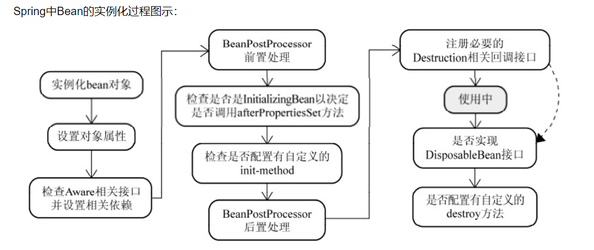
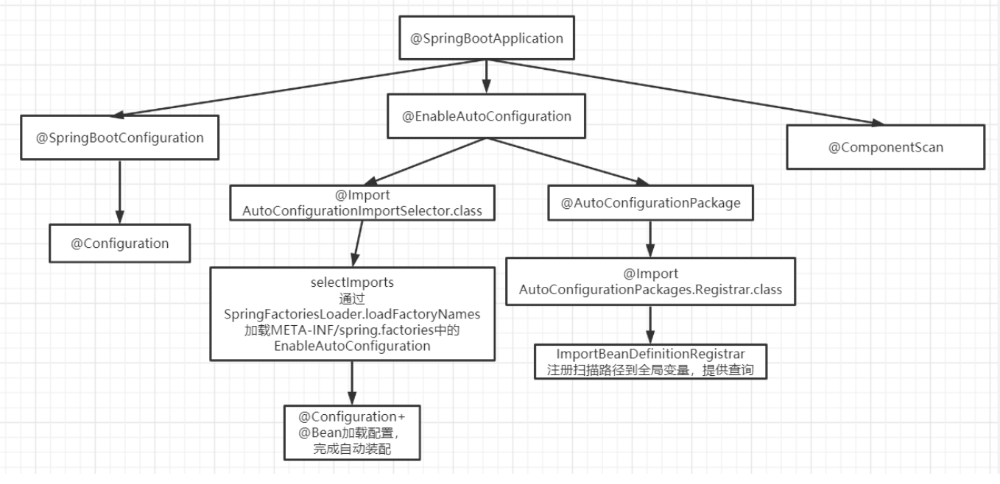

# 前言
- spring 容器,中间层(连接)
- AOP 因为OOP能定义由上到下,但是不适合定义从左到右的关系.AOP可以对某个对象或某些对象的功能进行增强,在某个方法之前之后都可以额外的做一些事情
- IOC控制反转的思想,就类似于多了一个遥控器..@Autowired 先byType @Resource 先byName
- ApplicationContext:提供`统一的资源文件访问方式`。 --- 可以访问resource最终通过ResourceLoader---所以可以使用`context调用bean`  
  - 一般都是直接用ApplicationContext来操作bean对象
- 古老的BeanFactory和ApplicationContext有什么区别?---- ApplicationContext`启动后预载入所有的单实例Bean`,`有利于检查所依赖属性是否注入`。
- BeanPostProcessor`bean实例化、配置以及其他初始化方法前后要添加一些自己逻辑处理`。
- 描述一下Spring Bean的生命周期？
- 解释下Spring支持的几种bean的作用域?  默认单例 
- Spring中的单例Bean是线程安全的吗?
- Spring框架用了哪些设计模式? 
- BeanFactory是个容器,工厂,,FactoryBean是个bean,但它能产生一些bean
- Spring事务的实现方式和原理以及隔离级别？
  - spring事务隔离级别就是数据库的隔离级别：外加一个默认级别
  - read uncommitted（未提交读）
  - read committed（提交读、不可重复读） --- oracle
  - repeatable read（可重复读）----mysql
  - serializable（可串行化）
- 事务中经常会产生以下问题：
  - 1. 脏读
  - 2. 不可重复读
  - 3. 幻读
  - 更新丢失（Lost Update）
- springboot,springMVC,spring的区别 --容器,web交互,快速开发工具包
- Spring Boot 自动配置原理？--`不去自动配置的功能`,以及有一个`自动配置仓库`
- SpringBoot中的Starter
- 嵌入式服务器?
- Mybatis
- #{}和${}的区别
- 简述Mybatis的插件运行原理,如何编写一个插件? ---分页插件要晓得


## spring
- 轻量级的开源的J2EE框架。它是一个**容器框架**，用来装javabean（`java对象`）
  - **中间层框架**（万能胶）可以起一个连接作用，`比如说把Struts和hibernate粘合在一起运用`，可以让我们的企业开发更快、更简洁
- Spring是一个轻量级的控制反转（IoC)和面向切面（AOP）的容器框架
  - -从大小与开销两方面而言Spring都是轻量级的。
  - -通过控制反转(IoC)的技术达到松耦合的目的
  - -提供了`面向切面编程`的丰富支持，允许通过分离应用的业务逻辑与系统级服务进行内聚性的开发
  - -`包含并管理应用对象`(Bean)的配置和生命周期，这个意义上是一个容器。
  - -将`简单的组件配置、组合成为复杂的应用`，这个意义上是一个框架。


## 谈谈你对AOP的理解
- 系统是由许多不同的组件所组成的，每一个组件各负责一块特定功能。除了实现自身核心功能之外，这
  些组件还经常承担着额外的职责。
 - 例如日志、事务管理和安全这样的核心服务经常融入到自身具有核心业务逻辑的组件中去。
   这些系统服务经常被称为横切关注点，因为它们会跨越系统的多个组件。
  
- 当我们需要为分散的对象引入公共行为的时候，OOP则显得无能为力。也就是说，
  OOP允许你定义从上到下的关系，但并`不适合定义从左到右的关系`。例如日志功能。
  
- 日志代码往往水平地散布在所有对象层次中，而与它所散布到的对象的核心功能毫无关系。
  
- 在OOP设计中，它导致了大量代码的重复，而不利于各个模块的重用。
  
- AOP：将程序中的交叉业务逻辑（比如安全，日志，事务等），封装成一个切面，然后注入到目标对象
  （具体业务逻辑）中去。`AOP可以对某个对象或某些对象的功能进行增强`，
  比如对象中的方法进行增强，可以在执行某个方法**之前**额外的做一些事情，在某个方法执行**之后**额外的做一些事情

## IOC的理解
> 容器概念、控制反转、依赖注入
- ioc容器：实际上就是个**map（key，value）**，里面存的是`各种对象`
  （在xml里配置的bean节点、@repository、@service、@controller、@component），
  在项目启动的时候会读取配置文件里面的bean节点，根据全限定类名使用反射创建对象放到map里、
  扫描到打上上述注解的类还是通过**反射**创建对象放到map里。
- 这个时候map里就有各种对象了，接下来我们在代码里需要用到里面的对象时，再通过**DI注入**
  （`autowired、resource等注解`，`xml里bean节点内的ref属性`，项目启动的时候会读取xml节点ref属性
  根据`id注入`，也会扫描这些注解，根据类型或id注入；id就是对象名）。
- 控制反转：
  - 没有引入IOC容器之前，对象A依赖于对象B，那么对象A在初始化或者运行到某一点的时候，自己必须
  主动去创建对象B或者使用已经创建的对象B。无论是创建还是使用对象B，控制权都在自己手上。
    
  - 引入IOC容器之后，对象A与对象B之间失去了直接联系，当`对象A运行到需要对象B的时候`，`IOC容器会
  主动创建一个对象B注入到对象A需要的地方`。
    
  - 通过前后的对比，不难看出来：对象A获得依赖对象B的过程,由主动行为变为了被动行为，控制权颠倒
  过来了，这就是“控制反转”这个名称的由来。
    
  - 全部对象的控制权全部上缴给“第三方”IOC容器，所以，IOC容器成了整个系统的关键核心，它起到了一
  种类似“粘合剂”的作用，把系统中的所有对象粘合在一起发挥作用，如果没有这个“粘合剂”，对象与对
  象之间会彼此失去联系，这就是有人把IOC容器比喻成“粘合剂”的由来。 
  
- 依赖注入：
  - “获得依赖对象的过程被反转了”。控制被反转之后，获得依赖对象的过程由自身管理变为了由IOC容器
  主动注入。`依赖注入是实现IOC的方法`，就是由IOC容器在运行期间，动态地将某种依赖关系注入到对
  象之中。


## BeanFactory和ApplicationContext有什么区别？
- ApplicationContext是BeanFactory的子接口
- ApplicationContext提供了更完整的功能：
  - ①继承MessageSource，因此支持国际化。
  - ②`统一的资源文件访问方式`。 --- 可以访问resource最终通过ResourceLoader---所以可以使用context调用bean
  - ③提供在监听器中注册bean的事件。
  - ④同时`加载多个配置文件`。
  - ⑤`载入多个（有继承关系）上下文` ，使得每一个上下文都专注于一个特定的层次，比如应用的web层。
  
- BeanFactroy采用的是延迟加载形式来注入Bean的，即只有在使用到某个Bean时(调用 getBean())，
  才对该Bean进行加载实例化。这样，我们就不能发现一些存在的Spring的配置问
  题。如果Bean的某一个属性没有注入，BeanFacotry加载后，直至第一次使用调用getBean方法
  才会抛出异常。 
  
  
- ApplicationContext，它是在`容器启动时，一次性创建了所有的Bean`。这样，在容器启动时，我
  们就可以发现Spring中存在的配置错误，这样`有利于检查所依赖属性是否注入`。
  ApplicationContext`启动后预载入所有的单实例Bean`，通过预载入单实例bean ,确保当你需要的
  时候，你就不用等待，因为它们已经创建好了。

- 相对于基本的BeanFactory，ApplicationContext 唯一的不足是占用内存空间。当应用程序配置
  Bean较多时，程序启动较慢。
  
- BeanFactory通常以`编程的方式`被创建，ApplicationContext还能以`声明的方式`创建，如使用
  `ContextLoader`。
  
- BeanFactory和ApplicationContext都支持`BeanPostProcessor`、BeanFactoryPostProcessor的
  使用，但两者之间的区别是：BeanFactory需要`手动注册`，而ApplicationContext则是`自动注册`。
 - BeanPostProcessor接口作用：
  -  如果我们想在Spring容器中完成`bean实例化、配置以及其他初始化方法前后要添加一些自己逻辑处理`。
     我们需要定义一个或多个BeanPostProcessor接口实现类，然后注册到Spring IOC容器中。

- zjz说:
  BeanFactory(古老原始)只有`使用bean时才加载`,所以不能提前知道bean的错误--无法支持spring插件，例如：AOP、Web应用等功能。
  ApplicationContext是容器一`启动就创建`所有bean,`有利于检查异常`,`预加载`,使用的时候不需要等待
  BeanFactory是以`编程的形式`创建,ApplicationContext是以`声明的方式`创建,如使用ContextLoader
- ApplicationContext其实是BeanFactory的实现，`一般都是直接用ApplicationContext来操作bean对象`，也就是我们常说的上下文容器


## 描述一下Spring Bean的生命周期？
- 1、解析类得到BeanDefinition---扫描路径
- 2、如果有多个构造方法，则要`推断构造方法`
- 3、确定好构造方法后，进行`实例化得到一个对象`
- 4、对对象中的加了`@Autowired注解`的属性进行属性填充
- 5、回调Aware方法，比如BeanNameAware，BeanFactoryAware --- 感知到自身的一些属性
- 6、调用BeanPostProcessor的初始化前的方法
- 7、调用初始化方法
- 8、调用BeanPostProcessor的`初始化后`的方法，`在这里会进行AOP`
- 9、如果当前创建的bean是单例的则会把bean放入`单例池`
- 10、使用bean --- 运行
- 11、Spring容器关闭时调用DisposableBean中destory()方法




## 解释下Spring支持的几种bean的作用域
- singleton：默认，`每个容器中只有一个bean的实例(单个容器单个实例)`，单例的模式由BeanFactory自身来维护。
  该对象的生命周期是与Spring IOC容器一致的（但在第一次被注入时才会创建）。
- prototype(原型模式)：为每一个bean请求提供一个实例。在`每次注入时都会创建一个新的对象`
- request：bean被定义为在`每个HTTP请求中创建一个单例对象`，也就是说在单个请求中都会复用
  这一个单例对象。(单例的)
- session：与request范围类似，`确保每个session中有一个bean的实例`，在session过期后，bean
  会随之失效。(单例的)
- application：bean被定义为在`ServletContext的生命周期`中复用一个单例对象。
- websocket：bean被定义为在`websocket的生命周期`中复用一个单例对象。
  - global-session：全局作用域，global-session和Portlet应用相关。当你的应用部署在Portlet容器
    中工作时，它包含很多portlet。如果你想要声明让所有的portlet共用全局的存储变量的话，那么
    这全局变量需要存储在global-session中。全局作用域与Servlet中的session作用域效果相同。


## Spring中的单例Bean是线程安全的吗?
> 框架没有进行多线程处理
- 如果Bean是有状态的 那就需要开发人员自己来进行线程安全的保证，最简单的办法就是改变bean的作
  用域 把 "singleton"改为’‘protopyte’ 这样每次请求Bean就相当于是 new Bean() 这样就可以保证线程的安全了。
   - 有状态就是有数据存储功能
   - 无状态就是不会保存数据 `controller、service和dao层本身并不是线程安全的`，只是如果只
      是调用里面的方法，而且多线程调用一个实例的方法，会在内存中复制变量，这是`自己的线程的工
      作内存，是安全的`。
  - Dao会`操作数据库Connection`，Connection是带有状态的，比如说数据库事务，Spring的事务管理器
    使用`Threadlocal`为不同线程维护了一套独立的connection副本，保证线程之间不会互相影响（Spring
    是如何保证事务获取同一个Connection的）
  - 不要在bean中声明任何有状态的实例变量或类变量，如果必须如此，那么就使用ThreadLocal把变量变
    为线程私有的，如果bean的实例变量或类变量需要在多个线程之间共享，那么就只能使用
   ` synchronized、lock、CAS等这些实现线程同步的方法`了。

## Spring框架用了哪些设计模式?
> 简单工厂：由一个工厂类根据传入的参数，动态决定应该创建哪一个产品类
- Spring中的`BeanFactory`就是简单工厂模式的体现，根据传入一个唯一的标识来`获得Bean对象`，但是否是在传入参数后创建还是传入参数前创建这个要根据具体情况来定。
  - BeanFactory和ApplicationContext是个**容器**,主要是用来创建bean
> 工厂方法：
- 实现了FactoryBean接口的bean是一类叫做factory的**bean**。  --- 是一个Java Bean
  其特点是，`spring会在使用getBean()调用获得该bean时`，会自动调用该bean的getObject()方法，
  所以返回的不是factory这个bean，而是这个bean.getOjbect()方法的返回值。
  
> 单例模式：保证一个类仅有一个实例，并提供一个访问它的全局访问点
- spring对单例的实现： spring中的单例模式完成了后半句话，即提供了全局的访问点BeanFactory。但没 有从构造器级别去控制单例，这是因为spring管理的是任意的java对象。

> 适配器模式：
- Spring定义了一个适配接口，使得每一种`Controller`有一种对应的适配器实现类，让适配器代替 controller执行相应的方法。
  这样在扩展Controller时，只需要增加一个适配器类就完成了SpringMVC 的扩展了。
  - 主要就controller,想想MVC的适配器
  
> 装饰器模式：动态地给一个对象添加一些额外的职责。就增加功能来说，Decorator模式相比生成子类更为灵活。
- Spring中用到的包装器模式在类名上有两种表现：一种是类名中含有Wrapper，另一种是类名中含有 Decorator。

> 动态代理：
- 切面在应用运行的时刻被织入。一般情况下，在织入切面时，AOP容器会为目标对象创建动态的创建一个代理对象。
  SpringAOP就是以这种方式织入切面的。 织入：把切面应用到目标对象并创建新的代理对象的过程。
  
> 观察者模式：
- spring的事件驱动模型使用的是观察者模式 ，Spring中Observer模式常用的地方是`listener的实现`。

> 策略模式：
- Spring框架的资源访问`Resource接口`。该接口提供了更强的资源访问能力，Spring 框架本身大量使用了 Resource 接口来访问底层资源。
  
> 模板方法：父类定义了骨架（调用哪些方法及顺序），某些特定方法由子类实现。
最大的好处：代码复用，减少重复代码。除了子类要实现的特定方法，其他方法及方法调用顺序都在父
类中预先写好了。
refresh方法


## Spring事务的实现方式和原理以及隔离级别？
- 在使用Spring框架时，可以有两种使用事务的方式，一种是编程式的，一种是申明式的，
  @Transactional注解就是申明式的。
- 首先，事务这个概念是**数据库层面**的，Spring只是基于数据库中的事务进行了扩展，以及提供了一些能
  让程序员更加方便操作事务的方式。
- 比如我们可以通过在某个方法上增加@Transactional注解，就可以开启事务，这个方法中所有的sql都
  会在一个事务中执行，统一成功或失败。
- 在一个方法上加了@Transactional注解后，Spring会基于这个类生成一个代理对象，会将这个代理对象
  作为bean，当在使用这个代理对象的方法时，如果这个方法上存在@Transactional注解，那么代理逻
  辑会先把事务的自动提交设置为false，然后再去执行原本的业务逻辑方法，如果执行业务逻辑方法没有
  出现异常，那么代理逻辑中就会将事务进行提交，如果执行业务逻辑方法出现了异常，那么则会将事务
  进行回滚。
- 当然，针对哪些异常回滚事务是可以配置的，可以利用@Transactional注解中的rollbackFor属性进行
  配置，默认情况下会对RuntimeException和Error进行回滚。
  
- spring事务隔离级别就是数据库的隔离级别：外加一个默认级别
  - read uncommitted（未提交读）
  - read committed（提交读、不可重复读） --- oracle
    - 提交读+一些乐观锁,悲观锁处理
  - repeatable read（可重复读）----mysql
  - serializable（可串行化）
    - 事务序列化执行，事务只能一个接着一个地执行，不能并发执行,,,类似于队列...
- spring配置为准,


## spring事务传播机制
> 方法A是一个事务的方法，方法A执行过程中调用了方法B，那么方法B有无事务以及方法B对事务的要求不同都会对方法A的事务具体执行造成影响，同时方法A的事务对方法B的事务执行也有影响
> 

- REQUIRED(Spring默认的事务传播类型)：如果A当前没有事务，则B自己新建一个事务，如果A当前存在事
  务，则B将它的给A加入这个事务
- SUPPORTS：当前存在事务，则加入当前事务，如果当前没有事务，就以非事务方法执行
- MANDATORY：当前存在事务，则加入当前事务，如果当前事务不存在，则抛出异常。
- REQUIRES_NEW：创建一个新事务，如果存在当前事务，则挂起该事务。
- NOT_SUPPORTED：以非事务方式执行,如果当前存在事务，则挂起当前事务
- NEVER：不使用事务，如果当前事务存在，则抛出异常
- NESTED：如果当前事务存在，则在嵌套事务中执行，否则REQUIRED的操作一样（开启一个事务）


## Spring事务什么时候会失效?
> spring事务的原理是AOP，进行了切面增强，那么失效的根本原因是这个AOP不起作用了！
- 自调用
- 方法不是public的
- 数据库不支持事务
- 没有被spring管理
- 异常被吃掉,事务不会回滚,


## bean的自动装配
- 手动装配:ref
- byName,byType,---


## springboot,springMVC,spring的区别
- spring是一个IOC容器，用来管理Bean，使用依赖注入实现控制反转，可以很方便的整合各种框架，提
  供AOP机制弥补OOP的代码重复问题、更方便将不同类不同方法中的共同处理抽取成切面、自动注入给
  方法执行，比如日志、异常等
  
- springmvc是spring对web框架的一个解决方案，提供了一个总的前端控制器Servlet，用来接收请求，
  然后定义了一套`路由策略`（`url到handle的映射`）及适配执行handle，将handle结果使用视图解析技术
  生成视图展现给前端
  
- springboot是spring提供的一个快速开发工具包，让程序员能更方便、更快速的开发spring+springmvc
  应用，简化了配置（约定了默认配置），整合了一系列的`解决方案`（starter机制）、redis、
  mongodb、es，可以`开箱即用`

- 容器,web交互,快速开发工具包


## Spring MVC的主要组件？
- Handler：也就是`处理器`。它直接应对着MVC中的C也就是Controller层，它的具体表现形式有很多，可
  以是类，也可以是方法。在Controller层中@RequestMapping标注的所有方法都可以看成是一个
  Handler，只要可以实际处理请求就可以是Handler
- 1、HandlerMapping
  initHandlerMappings(context)，处理器映射器，根据用户请求的资源uri来查找Handler的。在
  SpringMVC中会有很多请求，每个请求都需要一个Handler处理，具体接收到一个请求之后使用哪个
  Handler进行，这就是HandlerMapping需要做的事。
- 2、HandlerAdapter
  initHandlerAdapters(context)，适配器。因为SpringMVC中的Handler可以是任意的形式，只要能处
  理请求就ok，但是Servlet需要的处理方法的结构却是固定的，都是以request和response为参数的方
  法。如何让固定的Servlet处理方法调用灵活的Handler来进行处理呢？这就是HandlerAdapter要做的
  事情。


## Spring Boot 自动配置原理？
> 自动,无非就是启动时就加载完配置..
> 先明白一点,我们要配置一个东西,自动配置就会失效.所以它必然有`不去自动配置的功能`,以及有一个`自动配置仓库`
> 先了解自动配置仓库----以及谁扫描它,加载它到bean---selector调用(spring的)SpringFactoriesLoader
- @Import + @Configuration + Spring spi(spring加载)
 - `自动配置类`由各个`starter提供`，使用**@Configuration + @Bean定义配置类**，放到META-INF/spring.factories下
 - 使用Spring spi扫描META-INF/spring.factories下的配置类
 - 使用@Import导入自动配置类



- @springBootApplication--->@SpringbootConfiguration --@EnableAutoConfiguration-- @ComponentScan
  - @EnableAutoConfiguration--@AutoConfigurationPackage -- `@Import(AutoConfigurationImportSelector.class)`
  

- @Import(AutoConfigurationImportSelector.class),selector 返回一个字符串数组,里面有着类的权重.
  - 字符串从META-INF/spring.factories(key-value中的key值)中来
  - 然后Selector调用(spring的)SpringFactoriesLoader去加载这些字符串(有EnableAutoConfiguration的),然后反射加载到IOC容器中.
  
- @Configuration+@Bean加载配置,完成自动装配.


> 不去自动配置的功能由XXXAutoConfigurartion 自动配置类控制
- @ConditionalOnXXX派生注解+@ConfigurationProperties(prefix = "XXX")属性

## SpringBoot中的Starter
- 使用spring + springmvc使用，如果需要引入mybatis等框架，需要到xml中定义mybatis需要的bean
  
> 怎么扫描到Configuration配置类,在`starter`中META-INF/spring.factories中写入该配置,springboot按照约定加载
- starter就是定义一个starter的**jar包**，写一个@Configuration配置类、将这些bean定义在里面，然后在
  starter包的META-INF/spring.factories中写入该配置类，springboot会按照约定来加载该配置类
- 开发人员只需要`将相应的starter包依赖进应用`，进行`相应的属性配置`（使用默认配置时，不需要配
  置），就可以直接进行代码开发，使用对应的功能了，比如mybatis-spring-boot--starter，spring-boot-starter-redis


## 嵌入式服务器?
- tomcat.jar在springboot上直接.jar弄进去


## Mybatis
> mybatis的优缺点
- 优点：
  - 1、基于 SQL 语句编程，相当灵活，不会对应用程序或者数据库的现有设计造成任何影响，SQL 写在
    XML 里，解除 sql 与程序代码的耦合，便于统一管理；提供XML标签,支持编写动态 SQL 语句,并可重用。
  - 2、与 JDBC 相比，减少了50%以上的代码量，消除了JDBC大量冗余的代码，不需要手动开关连接；
  - 3、很好的与各种数据库兼容（ 因为 MyBatis 使用 JDBC 来连接数据库，所以只要JDBC 支持的数据库
    MyBatis 都支持）。
  - 4、能够与 Spring 很好的集成；
  - 5、提供映射标签， 支持对象与数据库的ORM字段关系映射； 提供对象关系映射标签， 支持对象关系组件维护。
- 缺点：
  - 1、SQL 语句的编写工作量较大,尤其当字段多、关联表多时,对开发人员编写SQL语句的功底有一定要求。
  - 2、SQL 语句依赖于数据库,导致数据库移植性差,不能随意更换数据库。
  
## MyBatis 与Hibernate 有哪些不同？
> SQL 和 ORM 的争论，永远都不会终止
- 开发速度的对比：
- `Hibernate的真正掌握要比Mybatis难些`。Mybatis框架相对简单很容易上手，但也相对简陋些。
  比起两者的开发速度，不仅仅要考虑到两者的特性及性能，更要根据项目需求去考虑究竟哪一个更适合
  项目开发，比如：一个项目中用到的复杂查询基本没有，就是简单的增删改查，这样选择hibernate效
  率就很快了，`因为基本的sql语句已经被封装好了`，根本不需要你去写sql语句，这就节省了大量的时
  间，但是对于一个大型项目，复杂语句较多，这样再去选择hibernate就不是一个太好的选择，选择
  mybatis就会加快许多，而且语句的管理也比较方便。

- 开发工作量的对比：
  - Hibernate和MyBatis都有相应的代码生成工具。可以生成简单基本的DAO层方法。针对高级查询，
  - Mybatis需要手动编写SQL语句，以及ResultMap。而Hibernate有良好的映射机制，开发者无需关心
  - SQL的生成与结果映射，可以更专注于业务流程

- sql优化方面：
  - Hibernate的查询会将表中的所有字段查询出来，这一点会有性能消耗。Hibernate也可以自己写SQL来
    指定需要查询的字段，但这样就破坏了Hibernate开发的简洁性。而Mybatis的SQL是手动编写的，所以
    可以按需求指定查询的字段。
  - Hibernate HQL语句的调优需要将SQL打印出来，而Hibernate的SQL被很多人嫌弃因为太丑了。
  - MyBatis的SQL是自己手动写的所以调整方便。但Hibernate具有自己的日志统计。Mybatis本身不带日
    志统计，使用Log4j进行日志记录。
  
- 对象管理的对比：
  - Hibernate 是完整的对象/关系映射解决方案，它提供了对象状态管理（state management）的功能，
  使开发者不再需要理会底层数据库系统的细节。也就是说，相对于常见的 JDBC/SQL 持久层方案中需要
  管理 SQL 语句，Hibernate采用了更自然的面向对象的视角来持久化 Java 应用中的数据。
  换句话说，使用 Hibernate 的开发者应该总是关注对象的状态（state），不必考虑 SQL 语句的执行。
  这部分细节已经由 Hibernate 掌管妥当，只有开发者在进行系统性能调优的时候才需要进行了解。而
  MyBatis在这一块没有文档说明，用户需要对对象自己进行详细的管理。
    
> 缓存机制对比：
- 相同点：都可以实现自己的缓存或使用其他第三方缓存方案，创建适配器来完全覆盖缓存行为。
- 不同点：Hibernate的二级缓存配置在SessionFactory生成的配置文件中进行详细配置，然后再在具体的表-对象映射中配置是哪种缓存。
- MyBatis的二级缓存配置都是在每个具体的表-对象映射中进行详细配置，这样针对不同的表可以自定义
  不同的缓存机制。并且Mybatis可以在命名空间中共享相同的缓存配置和实例，通过Cache-ref来实现。 
  
- 两者比较：因为Hibernate对查询对象有着良好的管理机制，用户无需关心SQL。所以在使用二级缓存时如果出现脏数据，系统会报出错误并提示。
- 而MyBatis在这一方面，使用二级缓存时需要特别小心。如果不能完全确定数据更新操作的波及范围，
 避免Cache的盲目使用。否则，脏数据的出现会给系统的正常运行带来很大的隐患。

- Hibernate功能强大，数据库无关性好，O/R映射能力强，如果你对Hibernate相当精通，而且对
  Hibernate进行了适当的封装，那么你的项目整个持久层代码会相当简单，需要写的代码很少，开发速
  度很快，非常爽。
  
- Hibernate的缺点就是学习门槛不低，要精通门槛更高，而且怎么设计O/R映射，在性能和对象模型之
  间如何权衡取得平衡，以及怎样用好Hibernate方面需要你的经验和能力都很强才行。
  
- iBATIS入门简单，即学即用，提供了数据库查询的自动对象绑定功能，而且延续了很好的SQL使用经
  验，对于没有那么高的对象模型要求的项目来说，相当完美。
  
- iBATIS的缺点就是框架还是比较简陋，功能尚有缺失，虽然简化了数据绑定代码，但是整个底层数据库
  查询实际还是要自己写的，工作量也比较大，而且不太容易适应快速数据库修改。


## `#{}和${}的区别`
- `#{}是预编译处理、是占位符， ${}是字符串替换、是拼接符。`
- Mybatis 在处理#{}时，会将 sql 中的#{}替换为?号，调用 PreparedStatement 来赋值；
- Mybatis 在处理${}时， 就是把${}替换成变量的值，调用 Statement 来赋值；
- `#{} 的变量替换是在DBMS 中、变量替换后，#{} 对应的变量自动加上单引号`
- ${} 的变量替换是在 DBMS 外、变量替换后，${} 对应的变量不会加上单引号

- 总之:使用#{}可以有效的防止SQL注入,提高系统安全性。


## 简述Mybatis的插件运行原理,如何编写一个插件?
> 分页插件要晓得
> 
> 插件指的就是拦截器
- Mybatis 只支持针对 `ParameterHandler`、`ResultSetHandler`、`StatementHandler`、`Executor` 
  这4种接口的插件,Mybatis 使用 JDK 的动态代理,为需要拦截的接口生成代理对象以实现接口方法拦截功能， 
  每当执行这 4 种接口对象的方法时，就会进入拦截方法，具体就是 InvocationHandler 的
  invoke() 方法， 拦截那些你指定需要拦截的方法。

- ParameterHandler --- 参数转换
- ResultSetHandler  --- 结果集
- StatementHandler --- 针对Statement,设置参数,结果集转换
- Executor --- Mybatis调度器

- 编写插件： 实现 Mybatis 的 Interceptor 接口并复写 intercept()方法， 然后在给插件编写注解， 指定
  要拦截哪一个接口的哪些方法即可， 在配置文件中配置编写的插件。
  
- ```
      @Intercepts({
      @Signature(type = StatementHandler.class,method = "query",args = {Statement.class, ResultHandler.class}), 
      @Signature(type = StatementHandler.class,method = "update", args = {Statement.class}),
      @Signature(type = StatementHandler.class, method = "batch", args = { Statement.class })})
  
  
    @Component invocation.proceed()执行具体的业务逻辑
  
  ```


