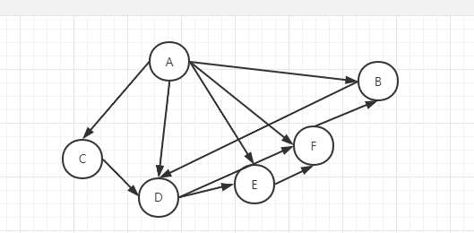
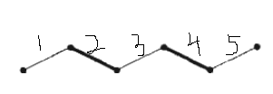

# 总结

## 华为题库
### 20220227
> 今天做质数因子判断，主要是针对质数的判断
- 在质数中使用Math.sqrt(n)，它如果执行到i==Math.sqrt(n)的时候，就可以证明它本身已经是质数了

> 位图(BitSet)
- 凡是涉及到去重统计都可以用位图实现。因为每一个不同的数据只需要用二进制的一位存储即可，大大减小了统计所使用的存储空间
- bitSet.set() -加数 -- bitSet.get(n) --是否存在数n  --- bitSet.cardinality() --里面有多少数

### 20220309
> 做的错误统计，要求输出最后8个且进入的顺序不变
- 问题：怎么统计？怎么保证顺序？
- 统计：
  - 一种HashMap-但是没法保证顺序
    - 我做的就是HashMap，但是没法计次，所以又加入了ArrayList来进行记录顺序，。。。内存消耗很大
  - 一种ArrayList-但是不好计次
    - 辅助的东西计次（一个数组，对应它的下标进行计次）。


### 30220316
> Huawei的素数伴侣
- 目前没解出来
- 问题,我依据最少的次数和零次进行了先筛选,然后剩下的元素分别是2-N个不同级别的相互依赖
- 此时问题可以想象成一个图,分别有着不同的枝干连接各个元素,没有一个元素是只联系一个的
- 求**解最佳的两两交互**的小区域---就是两个两个联系,最多的方案.元素只可用一次.

- 

- zjz：因为之前没有很多经验，没能更好的处理出这个问题。导致最后的思路成为了一个图。
  而这个图也没抽象对，因为奇数+奇数==偶数，偶数+偶数=偶数，必然不会是一个这样的图
 - 后来看了下匈牙利算法，发现确实按照奇数偶数进行分类，组成二部图，然后再直接使用算法即可解出最大配对。


### 匈牙利算法
> 一个用于图论中`寻找最大匹配`的算法
> 
> 用于匹配，是图论中的任务分配问题，通常是针对于二部图发起的，想想也是，匹配不就是`配对`么，自然是两两成对了。
> 
> 二部图:就是分为两个集合进行x{}，y{} --- 可以多思考下奇数集合，偶数集合，
- 要求:
  - 1. 匹配是边的集合；
  - 2. 在该集合中，任意两条边不能有共同的顶点。
  
- 自然而然就会有一个想法，一个图会有多少匹配？有没有最大的匹配（即边最多的匹配呢）？
- 
- **交错路径**：给定图G的一个匹配M，如果一条路径的边交替出现在M中和不出现在M中，我们称之为一条M-交错路径。
  - 匹配M是2，4的话，那么图就是一个交错路径的图。。---边一直处于M与非M的交互之间
- **增广路径**:而如果一条M-交错路径，它的两个端点都不与M中的边关联，我们称这条路径叫做M-增广路径。

> 最大匹配的思想就是：在已有的基础上不断看两端是否`都`与M关联，以此来推算最大的匹配项
> 先来先得，能让就让
- 寻找增广路径这么个解决问题的想法。


## 暴力枚举
> 顾名思义-就是以每个元素为出发点点进行不断的寻找
- 通常是配合递归的，递归可以跑到每个元素，在每个元素跑完返回值，然后加就行，注意好结束就行。
- 举例：最长递增序列
- ```
     // 依据数组，数组下标，一个个跑当前元素的递增。
     static int  GetAddLen(int[] ints,int index){
     // 加个存储，判断是否有存储
        if (memory[index]!=0){
            return memory[index];
        }
        // 最后一个如果是就是1，不是就不会进来的。
        if (index == ints.length-1){
            return 1;
        }
        // 当前元素就属于序列的一个
        int maxLen = 1;
        for (int i = index+1; i < ints.length; i++) {
            if (ints[i]>ints[index]){
        // 如果后一个大于当前的话，就找这个大于的元素的递增。    
                maxLen = Math.max(maxLen,GetAddLen(ints,i)+1);
            }
        }
        memory[index] = maxLen;
        return maxLen;
    }
  ```
  
- 后来发现太慢。可以加一个参数，专用于统计元素存储，有就直接返回就好。


## 链表
> 创建
- 1.值，下一个节点
- 2.两个构造器


### 输入
> 两种，一种是倒着加进来，就是头插入法。一种是顺序插入
> 
> 头插法，先插入头，其次依次在头后面插入
- ```
   headerNode.m_nKey = Integer.valueOf(s[s.length-1]);
        for (int i = 0; i < integer-1; i++) {
  // 赛值，最后一个的next是null，不需要定义，下次进来的next就是现在这个节点了
            ListNode listNode = new ListNode(Integer.valueOf(s[i]),headerNode.m_pNext);  
  // 不断让头结点的next指向新增节点
            headerNode.m_pNext = listNode;
        }
  
  ```
  
- 一般用于倒着找元素，快。

> 顺序插入
- ```
      // 需要一个临时Node作为中介
        ListNode tempListNode = new ListNode();
        tempListNode = headNode;
        headNode.value = 0;
        for (int i = 1; i < 5; i++) {
  // 新建的Node
            ListNode newListNode = new ListNode();
  // 赋值
            newListNode.value = i;
  // 临时Node的下一个为newListNode，，，前一个节点（如head）的next为newListNode
            tempListNode.next = newListNode;
  // 临时Node为newListNode,临时的变为new节点
            tempListNode = newListNode;
        }
  
  ```
### 输出
- 正常输出就是判断不为null，然后不断迭代一个输出
- ```
        while (headerNode!=null){
            System.out.print(headerNode.m_nKey+" ");
            headerNode = headerNode.m_pNext;
        }
  ```


## 关于递归的一些操作
> 全局变量的使用
-  需要一个index,跑字符串的下标,考虑整个程序我只会跑一次,遇到括号就正常跑,并不会跑完再重复跑,所以定一个类变量
- 整个程序只会跑一次的.


