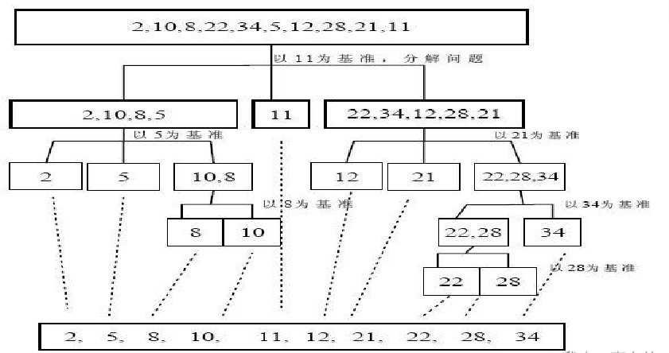

# 总结

## DP算法
> 关键算法，跳跳计算流---
### LCS-最长公共序列
- 给定两个序列 如：A{a,v,c,e,q,a,f,g,h,j,l}，B{f,g,a,g,b,c,z,e,t,h,d,s}
  - 最长应该是 a,c,e,h
- 这时候，**指针**是达不到我想要的。 如果要指针，需要无限指针。
- 考虑**二维表**，横竖各一，作为上面，左边。。然后进行排序。
> 问题
- 1.考虑怎么**计数**。 `加和继承`。
  - 主要是考虑怎么计数，，，加和继承问题
  - **加**，是因为当遇到相同的时候我们应该+1
  - **继承**是因为，我们前面遇到了，那后面就应该全部都有这个记录，所以需要数字来源于前面或者上面。
- 2.考虑怎么识别哪一条，或者说哪个数才是最长公共序列的那个。
  - 不需要考虑，只要合适就记录，因为找到的就属于最长的。

- 可以肯定的是有相同的就+1，那么怎么加。  
### LIS-最长递增子序列
- 给定某一序列，需要间接查找。如 7 96 1 6 8 3 4 79 5 ，这个我要找**最长递增子序列**，那应该就是 1 3 4 5
- 首先，**指针**是达不到跳的找东西的。
- 很多时候，遇到跳，我毫无头绪，总是想要用指针解决，这个显然不可取。

> 方法：二维表

## PAT
### 来自我要通过！
> 增什么，怎么增
- 介绍
 - 字符串中必须仅有 P、 A、 T这三种字符，不可以包含其它字符；
 - 任意形如 xPATx 的字符串都可以获得“答案正确”，其中 x 或者是空字符串，或者是仅由字母 A 组成的字符串；
 - 如果 aPbTc 是正确的，那么 aPbATca 也是正确的，其中 a、 b、 c 均或者是空字符串，或者是仅由字母 A 组成的字符串。
- 本题主要是第三个条件得判定，从aPbTc-->aPbATca ，那么它的变化是多了一个大A，然后多一个小a，那么下一次应该继续，aPbAATcaa,aPbAAATcaaa.
- 于是就好处理了。
- 本体逻辑主要是增--增什么，怎么增。

> 条件是一层层的
- 一般先满足1，然后满足2,3是基于2的基础上进行的

### 之前的快排算法
> 凡是区间定为L,R,不在从0计算
- 第一是为了迭代使用方法，第二是为了更好的可控。第三是要记住数组是从0开始，然后到 数组长度-1 的位置

### 很常见的数组分类法
> 基于一个基点，基点的左边是比他小的，右边是比它大的，
- 本质就是为了每次递归锁定一个数的位置，而这个数就是基点，不断拆分不断锁定基点 
  小区间基准左边比基准小，基准右边比基准大。但是开始的时候基准不变，最后才换到它应该在的地方。
- 优先把此基点放在首或尾，然后开始分，最后换到L和R相见的位置就行了。
- 从左往右跑，小的继续，大的和右边的指针换，换完后右边的指针往前一下（此时左指针不动，可能还得换）

## 牛客
### 层层递进
> 来自称砝码
- 问题是比如给我一串数字（1 2 2 3 4 4 5 6 78 54...）,然后计算它的组合的和有多少中
- 比如1 2 3 1+2+2+3 。。 1+4+78.。。等等。可以跳着加的。
- 那我应该怎么计算，首先指针肯定不行，这个会有无限指针。比如1 4 78 54的计算。
> 层层递进  
- 我可以用一种边存边计算来进行，比如 0存进来，那到1就是存0 1，再到2 就是存 0 1 2 3，再到2存 0 1 2 3 4 5（直接先拉过来。然后加2）
- 我需要两个集合，一个存上一次，一个存计算的，最后整合在一起。
