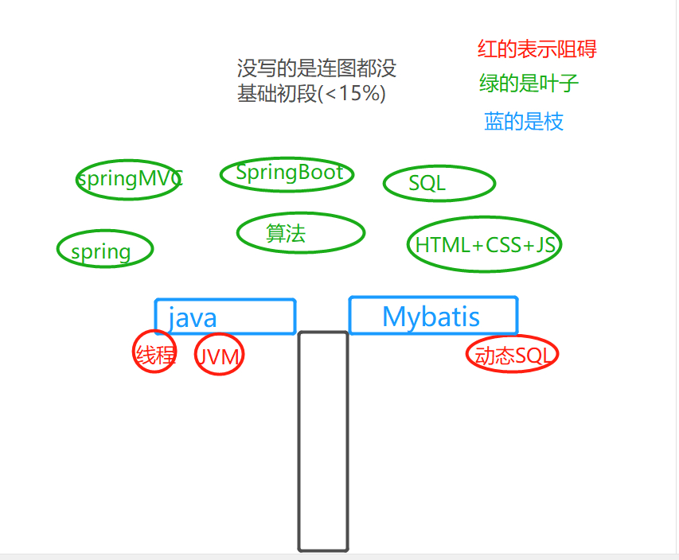

## Level-Start
> 等级开启
> 

# IT
## 枝
- Java-枝 - 战争初段(初) -基础中段(初)
- Mybatis-枝  -基础中段(初)  

## 图  
- Spring-图 - 基础初段(高)
- SpringMVC-图 -基础初段(中)  
- SpringBoot-图 - 基础初段(初)-->基础初段(中)20211003
- 算法-图 -基础初段(初)
- SQL-图 -基础初段(中)
- HTML-图 -基础初段(高)  
- CSS-图 -基础初段(初)
- JS-图 -基础初段(初)

## 希望赶紧开启的图
- 数据结构
- 计算机网络

### 20211003的幼苗

# 其它
- 英语四级-枝 -基础中段(初)

## 传统行业如何进入互联网行业
- 这个问题说起来没那么难，只要做好以下4件事：

- 1、好好复习准备面试，主要有几块内容：
  - 1）Java 常见的核心技术知识，这块是大头，需要花较长的时间准备；
  - 2）准备一个牛逼的项目，要有自己的亮点。一个复杂的需求设计、一个巧妙的设计、一次性能优化、一次线上问题解决，都可能是亮点，多思考自己做过的事；
  - 3）算法笔试题，主要是：《LeetCode 热题 HOT 100》和《剑指 Offer》系列，如果是面普通的互联网小公司，这块可以相对准备的少一点。
- 2、写一份干净简洁的简历，不要超过2页，突出自己的亮点：看过源码、掌握框架的核心原理、解决过复杂的问题、优化过系统性能、做过系统稳定性保障等等。
- 3、疯狂投简历，在BOSS和拉勾上投，所有符合自己要求的岗位都投，增加面试机会。
- 4、平静的面对每一次面试，遇到自己深入研究过的内容，抓住机会表现。
- 当然说起来容易，做起来还是挺难的，但是只要肯花时间，我相信问题真的不大。

- 拉勾网、BOSS直聘、猎聘网,智联和无忧。
- 没有社招面试经验：建议采取海投的方式，只要职位要求跟自己比较匹配都可以投，累计面试经验。

- 写SQL很常考察group by、内连接和外连接。
  - 手写代码：手写代码一般考单例、排序、线程、消费者生产者。我建议排序算法除了冒泡排序，最好还能手写一种其他的排序代码。
  - 试想：如果一般面试者都写的冒泡排序，而你写的是快速排序/堆排序，肯定能给面试官留下不错的印象。

