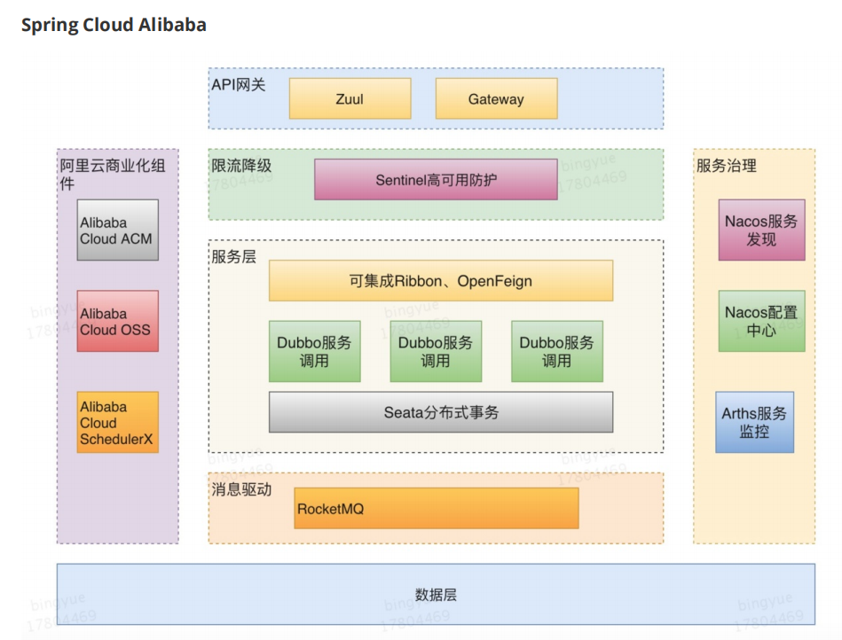
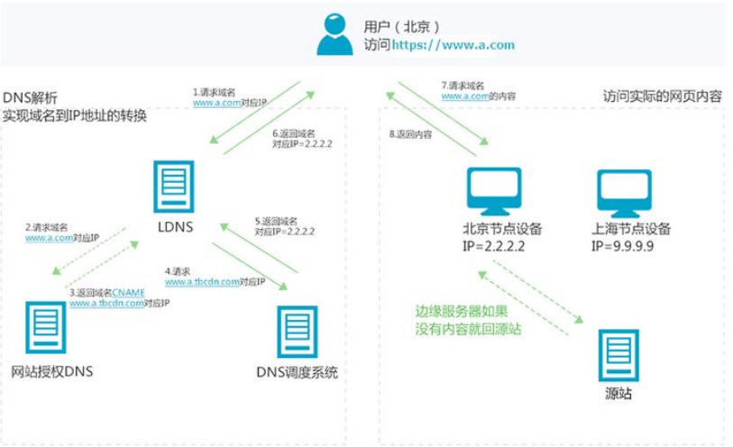

# 记事本01

# 前言
- 1.前端的东西
- 2.微服务的技术栈
- 3.常量,静态导入包
- 4.表的数据是一个二维表的形式,怎么存,Mybatis怎么存
- 5.List,Set
- 6.Controller操作,RequestMapping操作数组
- 7.Mybatis操作
  - 1).自增,日期等怎么弄
  - 2).联表查询..collection association
- 8.SDK,API
- 9.SOA
- 10.CDN
- 11.Jetty
- 12.ACID,CAP
- 13.数组工具Arrays
- 14.手动抛异常
- 15.优先级队列,阻塞队列,不同包下的
- 16.乐观锁&悲观锁

## 目前保证
- 前端方面
- 1.有一套自己熟悉的后台模板：工作必要！x-admin
- 2.前端界面：至少自己能够通过前端框架组合出一个网站页面  
- 3.让网站能跑起来，能独立运行

- Gradle和Maven很像

- 使用东西一般用GA

## 微服务技术栈有哪些？

| 微服务条目                               | 落地技术                                                     |
| ---------------------------------------- | ------------------------------------------------------------ |
| 服务开发                                 | SpringBoot,Spring,SpringMVC                                  |
| 服务配置与管理                           | Netflix公司的Archaius、阿里的Diamond等                       |
| 服务注册与发现                           | Eureka、Consul、Zookeeper等                                  |
| 服务调用                                 | Rest、RPC、gRPC                                              |
| 服务熔断器                               | Hystrix、Envoy等                                             |
| 负载均衡                                 | Ribbon、Nginx等                                              |
| 服务接口调用（客户端调用服务的简化工具）        | Feign等                                                      |
| 消息队列                                 | Kafka、RabbitMQ、ActiveMQ等                                  |
| 服务配置中心管理                         | SpringCloudConfig、Chef等                                    |
| 服务路由（API网关）                      | Zuul等                                                       |
| 服务监控                                 | Zabbix、Nagios、Metrics、Specatator等                        |
| 全链路追踪                               | Zipkin、Brave、Dapper等                                      |
| 服务部署                                 | Docker、OpenStack、Kubernetes等                              |
| 数据流操作开发包                         | SpringCloud Stream(封装与Redis，Rabbit，Kafka等发送接收消息) |
| 事件消息总线                             | SpringCloud Bus                                              |

## 一些没注意到的点
- import static XXX
  - 静态导入包,直接用里面的方法
  
- 关于常量-->static + final
- public static final int age = 18; // 常量
- 或者接口直接int age;

- JDBC 写sql的时候
- 如果外面是双引号,里面就单引号,否则报错

- 整个表的数据是一个二维表的形式,我们不能只取一列
  - 于是我们采用List<Map<String,Object>>的形式取
  - Map负责取一列,List存取每列
- 而Mybatis中,List存对象,对象存一列

- SpringBoot中Servlet和web.xml没消失,可以通过配置Configuration的方式配个Bean使用

- String的课外补充：写个例子：Stirng a = “123” 再将a = a + “45” 这时打印出a = “12345”
  这个例子看似这个a被更改了。其实不是，这只是一个假象而已。
  JVM对于这几行代码是这样处理的，首先创建一个String对象a。
  并把123赋值给a其实在a = a + “45”的时候，JVM又创建了一个新的对象也名为a。
  然后再把原来的a的值和”45”加起来再赋值给新的a。而原来的a就会被回收机制给回收掉。
  所以，a实际上并没有被更改，也就是前面说的String对象一旦创建之后不可更改了

- List,Set 
    - 1.list集合有序可重复，set无序不可重复，PS:Map以键值对的形式对元素进行存储
    - 2.List允许任意数量的空值，Set最多允许一个空值的出现，PS:Map只允许出现一个空键，但允许出现任意数量的空值
    - 3.List 支持for循环，也就是通过下标来遍历，也可以用迭代器，但是set只能用迭代，因为他无序，无法用下标来取得想要的值。
    - 4.Set：检索元素效率低下，删除和插入效率高，插入和删除不会引起元素位置改变。
    - 5.List：和数组类似，List可以动态增长，查找元素效率高，插入删除元素效率低，因为会引起其他元素位置改变

- i18n 
  - 国际化
  
- SSM的时候，jsp的取数据是$ ,而action和href的跳转是${pageContext.request.contextPath}/方法名
- XML中写#是为了预编译。。。

- th:action后是@{/方法}  th:href后也是@{/方法}

- Controller 是spring的
- RestController 是spring-web下的

- @RequestMapping({"/","/index"}) 点进去可以看下,它可以是一个数组

### 关于配置文件
- 之前SSM中写的配置文件XML,最终import整合到applicationContext.xml
- 然后由web.xml中的servlet初始化调用它
- 值得注意的是:一个servlet要对应一个servlet-mapping

## 对于Mybatis操作
> 我们依据是否有集合来**区分**一对多,多对一,注意是集合,不是对象
> 
> 我们依据有几个sql语句区分嵌套和子查询
> 
> 如果有自增,以及引入别的类,以及日期
- pojo类,如果自增,日期,二者出其一,我们就得重写编写构造器,如果有其它类的引入,只定义属性写上就行了
  - 如果自增,构造器中除了自增,剩下都得有
  - 如果日期,构造器在this.日期时进行处理,年龄也类似(进行下计算,当前-出生)

- mapper接口无变动
- mapper.xml
  - 按照构造器写就行,自增的不用写,如果是计算的年龄也不用写,日期正常写

- zjz说:如果是联表查询
  - 关于查询,别名,连接
  - 关于结果集,前面的property对应好主pojo的属性,后面的column就是上面写的别名
  - 遇到association或者 collection中,里面对应好子查询的pojo属性(property)和别名
  - 前端的时间处理`${#dates.format(emp.getBirth(),'yyyy-MM-dd HH:mm:ss')}`

- 如果是两个表或者多个表都有增删查改,那么推荐使用子查询,,
  - 别的表的语句,复制过来,,然后resultMap中的association或者 collection中select导入就好了

## @EnableXXX开启某个功能
  - @EnableXXX放在主run上

## 链式编程
- 正常lomback,加个@Accessors(chain = true)

## SDK,API
- 
- 你可以把SDK想象成一个虚拟的程序包，在这个程序包中有一份做好的软件功能，这份程序包几乎是全封闭的，只有一个小小接口可以联通外界，这个接口就是API。
  - 有一杯密封饮料，它的名字叫做“SDK”。
  - 饮料上插着吸管，吸管的名字叫“API”
  
- SDK＝放着你想要的软件功能的软件包
- API＝SDK上唯一的接口

### SOA
- **面向服务的架构**(SOA)是一个**组件模型**，
- 它将应用程序的**不同功能单元**(称为服务)进行拆分，
- 并通过这些服务之间定义良好的接口和协议联系起来。
接口是采用中立的方式进行定义的， 它应该独立于实现服务的硬件平台、操作系统和编程语言。
这使得构建在各种各样的系统中的服务可以以一种统一和通用的方式进行交互。

- zjz思考
  - 面向服务的架构,,服务也就是我们的一个个**功能模块**
  

### CDN
- 介绍:  
    - 淘宝的图片访问，有98%的流量都走了CDN缓存。只有2%会回源到源站，节省了大量的服务器资源。
    - 但是，如果在用户访问高峰期，图片内容大批量发生变化，大量用户的访问就会穿透cdn，对源站造成巨大的压力。
- CDN工作原理
    - 内容分发网络（Content Delivery Network，简称CDN）是**建立并覆盖在承载网**之上，由分布在**不同区域的边缘节点服务器群**组成的**分布式网络**。

- 承载网:是位于接入网和交换机之间的，用于传送各种语音和数据业务的网络，通常以光纤作为传输媒介。

- 假设通过CDN加速的域名为www.a.com，接入CDN网络，开始使用加速服务后，当终端用户（北京）发起HTTP请求时，处理流程如下：
  - 1.当终端用户（北京）向www.a.com下的指定资源发起请求时，首先向LDNS（本地DNS）发起域名解析请求。
  - 2.LDNS检查缓存中是否有www.a.com的IP地址记录。如果有，则直接返回给终端用户；如果没有，则向授权DNS查询。
  - 3.当授权DNS解析www.a.com时，返回域名CNAME www.a.tbcdn.com对应IP地址。
  - 4.域名解析请求发送至阿里云**DNS调度系统**，并为请求**分配最佳节点IP地址**。
  - 5.LDNS获取DNS返回的解析IP地址。用户获取解析IP地址。
  - 6.用户向获取的IP地址发起对该资源的访问请求。
    
    - 如果该IP地址对应的节点已缓存该资源，则会将数据直接返回给用户，例如，图中步骤7和8，请求结束。
    - 如果该IP地址对应的节点未缓存该资源，则节点向源站发起对该资源的请求。
      - 获取资源后，结合用户自定义配置的缓存策略，将资源缓存至节点，例如，图中的北京节点，并返回给用户，请求结束。
  
- 从这个例子可以了解到：
  - （1）CDN的加速资源是跟域名绑定的。
  - （2）通过域名访问资源，首先是通过DNS分查找离用户最近的CDN节点（边缘服务器）的IP
  - （3）通过IP访问实际资源时，如果CDN上并没有缓存资源，则会到源站请求资源，并缓存到CDN节点上，
      这样，用户下一次访问时，该CDN节点就会有对应资源的缓存了。

- zjz说:
  - 1.正常一个网址是检查本地有没有DNS,再去授权DNS去找
    - 比如我们的8080就直接本地了..
  - 2.CDN是什么，我会说“我把坚果从一个距离他们很远的筐里盛出来，放在距离他们很近的眼前，让他们不用一次次起身费劲的去抓，而是坐在那儿就能够到”
  - 3.“如果我们把某种网络资源，看成是某种路途遥远又曲折的，很多人都喜欢吃的美食，
    CDN就是把他们一次性的空降到我们面前（并且假设可以共享且取之不尽），让我们轻而易举的大快朵颐”。
  - 4.在我看来，CDN的本质是缓存，而内核中支撑它的互联网精神则是共享。  
  

## Jetty
- Jetty 是一个开源的servlet容器，它为基于Java的web容器，轻量级,灵活
  - Jetty更满足公有云的分布式环境的需求，而Tomcat更符合企业级环境
  

- 一些出错:
 - 记住：接口名与Mybatis的映射文件名一定要一模一样
 - xml用的是classpath

## ACID,CAP
- ACID是什么？
  - A（Atomicity）原子性
  - C（Consistency） 一致性
  - I （Isolation）隔离性
  - D（Durability）持久性
- CAP是什么？
  - C（Consistency）强一致性
  - A（Availability）可用性
  - P（Partition tolerance）分区容错性
  
- 著名的CAP理论指出，一个分布式系统不可能同时满足C（一致性）、A（可用性）、P（容错性）。
- 由于**分区容错性P**在分布式系统中是必须要保证的，因此我们只能在A和C之间进行权衡。
  - Zookeeper保证的是CP；
  - Eureka保证的是AP；
  
- `因此，Eureka(AP)可以很好的应对因网络故障导致部分节点失去联系的情况，而不会像zookeeper(CP)那样使整个注册服务瘫痪`

- 自己写组件,要放在主run的上一层,不能被扫描到

## 抛异常
- throw new RuntimeException("..."); 一般自己手动抛异常用这个
  - 用Exception得用try catch
  
## Arrays
- 数组工具类:Arrays.asList(1L, 2L, 3L);----似乎被我忘了...
 - Arrays.asList("1", "2", "3"); 它的对象只能读,不能写

## 一些讲究
- 父类型引用指向子类型对象，**无法调用只在子类型里定义的方法**
- default 权限限于同一个包中，即包权限＝default权限
- 考察点1：重载静态多分派——根据传入重载方法的参数类型，**选择更加合适的一个重载方法**
- 考察点2：static方法不能被子类覆写，在子类中定义了和父类完全相同的static方法，则父类的static方法被隐藏，
  Son.staticmethod()或new Son().staticmethod()都是调用的子类的static方法，
  如果是Father.staticmethod()或者Father f = new Son(); f.staticmethod()调用的都是父类的static方法。
- 考察点3：此题如果都不是static方法，则最终的结果是A. 调用子类的getType，输出collection
- 前端的时间处理`${#dates.format(emp.getBirth(),'yyyy-MM-dd HH:mm:ss')}`
- Netty ~30天---关于网络的,有空可以看
- Availability 可用的,CAP-idea都见

- 一个类读取到另一个类的变量...加final，变量会存在堆中的方法区里，子线程共享进程的堆，所以能读到。否则是存在另一个线程的栈中，不同线程读不到

- PriorityQueue<Integer> --java.util.PriorityQueue下的  而阻塞队列时java.util.concurrent.BlockingQueue下的且允许过程不同的..

- 先要打印就看一下有没有返回值,有没有输出

- 获取反射对象:记得要加前面的路径:::Class.forName("com.DesignMode.Singleton.LazySingleton");

### 乐观锁&悲观锁
- 在面试过程中经常被问到乐观锁/悲观锁，这个其实很简单
> 乐观锁：顾名思义十分乐观,他总是认为不会出现问题,无论干什么都不上锁!如果出现了问题,再次更新值测试 version-new version
>
> 悲观锁：顾名思义十分悲观,他总是认为出现问题,无论干什么都会上锁!再去操作!这样别人想拿到这个数据就会block直到它拿到锁。传统的关系型数据库里面就
  用到了很多这种锁机制，比如行锁，表锁等，读锁，写锁等，都是在操作之前先上锁。
- 乐观锁机制!
- 乐观锁实现方式:
  - 取出记录时,获取当前version
  - 更新时,带上这个version
  - 执行更新时,set version = newVersion where version = oldVersion
  - 如果version不对,就更新失败

- linkedMap在于存储数据你想保持进入的顺序与被取出的顺序一致的话，优先考虑LinkedMap
- linkedMap键和值都不可以为空

### 对于if
- if() 里要求必须得是,Boolean  while也是  
- 虽然他们中的数据会正常运行一下,但是最终还是要走boolean的

- 端口：80
  - 服务：HTTP
  - 说明：用于网页浏览。木马Executor开放此端口

- 端口：443
  - 服务：Https
  - 说明：网页浏览端口，能提供加密和通过安全端口传输的另一种HTTP。
