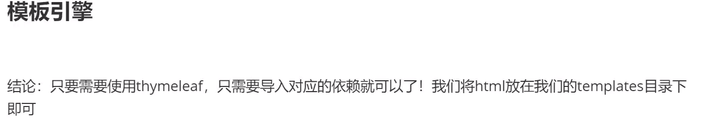
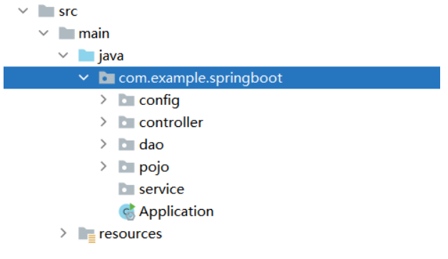

- 本阶段代码可直接从gitee上拉取https://gitee.com/zhangjzm/spring-boot1.git
# SpringBoot 开始搭建

## 目前是无数据库搭建：
 - 思考：不用数据库用什么存放信息呢？---数组？LIST？SET？MAP？还是什么
 - 方法：采用静态static块的方法 将信息存放于MAP容器中，以id作为key来进行操作，这样对于数据的操作
      - 依赖于Map的方法-------如put新增  .values获取所有数据 get查询  remove删除

## 核心介绍 
- 视图


    ```
    //模拟数据库中的数据  声明employees作为一个《int，对象》的容器
        private static Map<Integer, Employee> employees = null;
         //静态块提前加载，所以很多方法会失效   
         static {
         //实例化，---标准java思想操作----成功创建出employess对象的容器
            employees= new HashMap<Integer,Employee>();
    
            employees.put(1001,new Employee(1001,"AA","1846846@qq.com",0,new Department(101,"教学部")));
            employees.put(1002,new Employee(1002,"BB","2846846@qq.com",1,new Department(101,"市场部")));
            employees.put(1003,new Employee(1003,"CC","3846846@qq.com",0,new Department(101,"教研部")));
            employees.put(1004,new Employee(1004,"DD","4846846@qq.com",1,new Department(101,"运营部")));
            employees.put(1005,new Employee(1005,"EE","5846846@qq.com",0,new Department(101,"后勤部")));
        }
    ```
- 注意：静态块提前加载，所以很多方法会失效

    - 1.首先导入了初始的依赖 springboot自带的依赖 及 spring-boot-starter-web依赖

        - 建立文件夹的路径

        

    - 2.导入lombak  目的：为了构造器，getset

        ```
        <!-- lombok -->
        <dependency>
            <groupId>org.projectlombok</groupId>
            <artifactId>lombok</artifactId>
        </dependency>
        ```

    - 3.建立pojo文件夹，建立类

    ```java
    //员工表
    @Data
    @AllArgsConstructor
    @NoArgsConstructor
    public class Employee {
        private Integer id;
        private String lastname;
        private String  email;
        private Integer gender;// 0 women 1 men
        private Department department;
        private Date birth; //需要util下的，不要SQL下的
    }
    ```

- 4.建立dao文件夹

    - 加入spring托管

    ```java
    //部门dao
    @Repository
    ```

    ```java
    //部门dao
    @Repository
    public class DepartmentDao {
    
        //模拟数据库中的数据
        private static Map<Integer, Department> departments = null;
    
        static {
            departments = new HashMap<Integer,Department>();    //创建一个部门表
            departments.put(101,new Department(101,"教学部"));
            departments.put(102,new Department(101,"市场部"));
            departments.put(103,new Department(101,"教研部"));
            departments.put(104,new Department(101,"运营部"));
            departments.put(105,new Department(101,"后勤部"));
        }
        
        //获取所有部门信息
        public Collection<Department> getDepartments(){
            return departments.values();
        }
    
        //通过id得到部门
        public Department getDepartmentById(Integer id){
            return departments.get(id);
        }
        
    }
    ```

### 因为想默认日期实现，防止一次次输入
    ```
    方法：
    声明日期  Date date；
    private Date birth;
    实例化（创建日期对象） 
    this.birth = new Date();
    ```

    ```java
    @Data
    @NoArgsConstructor
    public class Employee {
        private Integer id;
        private String lastname;
        private String  email;
        private Integer gender;// 0 women 1 men
        private Department department;
        private Date birth;
    
    
        public Employee(Integer id, String lastname, String email, Integer gender, Department department) {
            this.id = id;
            this.lastname = lastname;
            this.email = email;
            this.gender = gender;
            this.department = department;
            //默认日期实现
            this.birth = new Date();
        }
    }
    ```

- 员工dao

    ```java
    package com.example.springboot.dao;
    
    
    import com.example.springboot.pojo.Department;
    import com.example.springboot.pojo.Employee;
    import org.springframework.beans.factory.annotation.Autowired;
    import org.springframework.stereotype.Repository;
    
    import java.util.Collection;
    import java.util.HashMap;
    import java.util.Map;
    
    //员工Dao
    @Repository
    public class EmployeeDao {
        //模拟数据库中的数据
        private static Map<Integer, Employee> employees = null;
    
        @Autowired
        private DepartmentDao departmentDao;
        //想使用departmentDao.getXXXById  但是因为表在static中，优先加载，所以导致不可用
        static {
            employees= new HashMap<Integer,Employee>();
    
            employees.put(1001,new Employee(1001,"AA","1846846@qq.com",0,new Department(101,"教学部")));
            employees.put(1002,new Employee(1002,"BB","2846846@qq.com",1,new Department(101,"市场部")));
            employees.put(1003,new Employee(1003,"CC","3846846@qq.com",0,new Department(101,"教研部")));
            employees.put(1004,new Employee(1004,"DD","4846846@qq.com",1,new Department(101,"运营部")));
            employees.put(1005,new Employee(1005,"EE","5846846@qq.com",0,new Department(101,"后勤部")));
        }
    
    
        //主键自增
        private static Integer initId = 1006;
    
        //增加一个员工
        public void save(Employee employee){
            if(employee.getId() == null){
                employee.setId(initId++);
            }
            employee.setDepartment(departmentDao.getDepartmentById(employee.getDepartment().getId()));
    
            employees.put(employee.getId(),employee);
    
        }
        //查询全部员工信息
        public Collection<Employee> getAll(){
            return employees.values();
        }
    
        //通过ID查询员工
        public Employee getEmployeeById(Integer id){
            return employees.get(id);
        }
    
        //删除员工通过ID
        public void delete(Integer id){
            //调用MAP的remove方法，因为本来就是使用MAP的键值对进行存放，所以增加，删除修改，都直接使用map的方法
            employees.remove(id);
        }
    
    }
    
    ```
