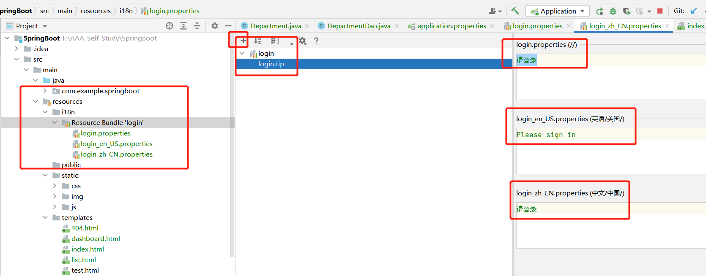

- 本阶段代码可直接从gitee上拉取https://gitee.com/zhangjzm/spring-boot1.git
## 1.首页配置：
- 注意点，所有页面的静态资源都需要使用thymeleaf接管;url:@{} ---th:href="@{}"
- 首页配置实质就是配置spring容器-----webmvc
- src/main/java/com/example/springboot/config/MyMvcConfig.java
    ```
    @Configuration
    public class MyMvcConfig implements WebMvcConfigurer {
    
        @Override
        public void addViewControllers(ViewControllerRegistry registry) {
            registry.addViewController("/").setViewName("index");
            registry.addViewController("/index.html").setViewName("index");
    
        }
    }
    
    ```
## 2.页面国际化

- 然后配置src/main/resources/application.properties
    ```
    #我们配置文件放在的真实位置
    spring.messages.basename=i18n.login
    
    ```
- 然后index.html
    ```
    <body class="text-center">
            <form class="form-signin" action="dashboard.html">
                
                <h1 class="h3 mb-3 font-weight-normal" th:text="#{login.tip}">Please sign in</h1>
                <input type="text" class="form-control" th:placeholder="#{login.username}" required="" autofocus="">
                <input type="password" class="form-control" th:placeholder="#{login.password}" required="">
                <div class="checkbox mb-3">
                    <label>
              <input type="checkbox" value="remember-me"> [[#{login.remember}]] 
              //设置切换显示 th:placeholder="#{login.password}"  [[#{login.remember}]] 
            </label>
                </div>
                <button class="btn btn-lg btn-primary btn-block" type="submit">[[#{login.btn}]]</button>
                <p class="mt-5 mb-3 text-muted">© 2017-2018</p>
                //选择语言
                <a class="btn btn-sm" th:href="@{/index.html(1='zh_CN')}">中文</a>
                <a class="btn btn-sm" th:href="@{/index.html(1='en_US')}">English</a>
            </form>
    
        </body>
    ```

- 然后src/main/java/com/example/springboot/config/MyLocaleResolver.java
    ```
    //这是一个language字符串，所以直接使用字符串数组来获取它分割的，达到取对应东西的目的
    因为Locale要求获取语言，国家两个参数
         public Locale(String language, String country) {
            this(language, country, "");
        }
    
    
    String language = httpServletRequest.getParameter("1");
    String[] split = language.split("_");
    locale =  new Locale(split[0],split[1]);
    ```

    ```
    package com.example.springboot.config;
    
    import org.springframework.web.servlet.LocaleResolver;
    import org.thymeleaf.util.StringUtils;
    
    import javax.servlet.http.HttpServletRequest;
    import javax.servlet.http.HttpServletResponse;
    import java.util.Locale;
    
    public class MyLocaleResolver implements LocaleResolver {
    
    //解析请求
        @Override
        public Locale resolveLocale(HttpServletRequest httpServletRequest) {
            //获取请求中的语言参数
            String language = httpServletRequest.getParameter("1");
            Locale locale = Locale.getDefault();//如果没有就使用默认的
    
            //如果请求的链接携带了国际化参数
            if(!StringUtils.isEmpty(language)){
                //zh_CN
                String[] split = language.split("_");
                locale =  new Locale(split[0],split[1]);
            }
            return locale;
        }
    
        @Override
        public void setLocale(HttpServletRequest httpServletRequest, HttpServletResponse httpServletResponse, Locale locale) {
    
        }
    }
    
    ```

- 然后配置src/main/java/com/example/springboot/config/MyMvcConfig.java
- 在容器里配置Bean
    ```
    @Configuration
    public class MyMvcConfig implements WebMvcConfigurer {
    
        @Override
        public void addViewControllers(ViewControllerRegistry registry) {
            registry.addViewController("/").setViewName("index");
            registry.addViewController("/index.html").setViewName("index");
    
        }
    
        //自定义的组件就生效了
        @Bean
        public LocaleResolver localeResolver(){
            return new MyLocaleResolver();
        }
    }
    
    ```


## 3.登录功能

- 首先index配置，1.action 2.用户，密码 的name值（controller 要获取到，进行处理）
    ```
    <body class="text-center">
            <form class="form-signin" th:action="@{/user/login}">
                
                <h1 class="h3 mb-3 font-weight-normal" th:text="#{login.tip}">Please sign in</h1>
                <input type="text" name = "username" class="form-control" th:placeholder="#{login.username}" required="" autofocus="">
                <input type="password" name = "password" class="form-control" th:placeholder="#{login.password}" required="">
    ```


- 配置controller的src/main/java/com/example/springboot/controller/LoginController.java
    ```
    @Controller
    public class LoginController {
    
        @RequestMapping("/user/login")
    //    @ResponseBody  有这个是跳转到文字，没得话就是跳转到视图
        //Model 回显数据
        public String login(
                @RequestParam("username") String username,
                @RequestParam("password") String password,
                Model model){
    
            //具体业务
            if(!StringUtils.isEmpty(username) && "123456".equals(password)){
                return "dashboard";
                 //防止地址栏出现密码    return "redirect:/main.html";
               
            }else {
                //告诉用户，你登录失败了
                model.addAttribute("msg","用户名或密码错误!");
                return "index";
            }
    
        }
    
    }
    
    ```


- 配置下index 映射失败时候的提示
    ```
    
                <h1 class="h3 mb-3 font-weight-normal" th:text="#{login.tip}">Please sign in</h1>
    
                <!-- 如果msg消息为空，则不显示消息-->
                <p style="color: red" th:text="${msg}" th:if="${not #strings.isEmpty(msg)}"></p>
                <input type="text" name = "username" class="form-control" th:placeholder="#{login.username}" required="" autofocus="">
    ```

## 4.地址栏出现密码：

- 配置MyMvcConfig
- registry.addViewController("/main.html").setViewName("dashboard");

- 配置controller LoginController
    ```
       //具体业务
            if(!StringUtils.isEmpty(username) && "123456".equals(password)){
                return "redirect:/main.html";
                //防止地址栏出现密码
            }else {
                //告诉用户，你登录失败了
                model.addAttribute("msg","用户名或密码错误!");
                return "index";
            }
    ```