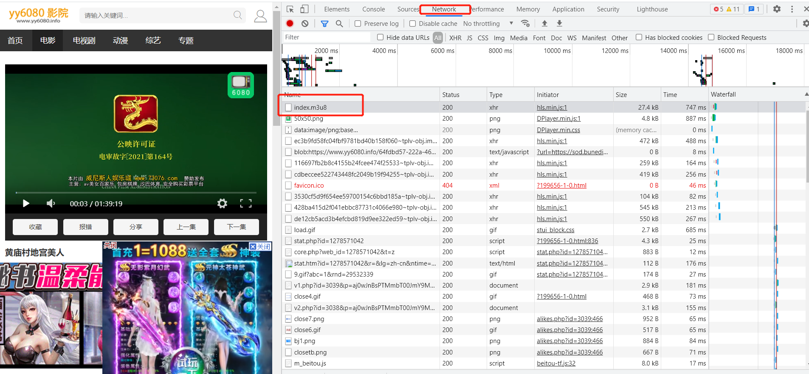
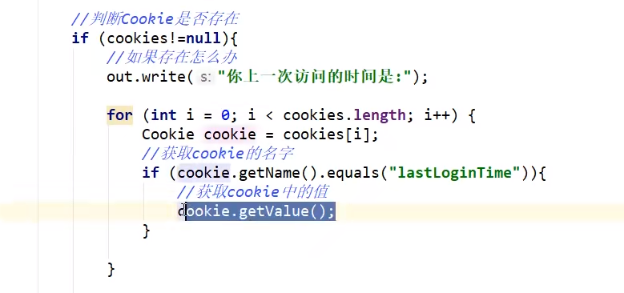
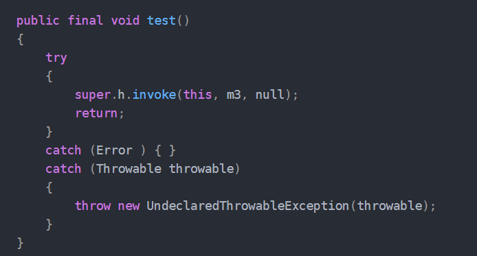

# ？？？解决掉呀！

## 前言（对zjz说，同样阅读此文档的人说）
- Thinking is more important than learning
> 动脑动脑，不要废了它！！！---所说的能力，无非是想让你的大脑run起来！！！
>
> 现在最为关键的**不是扣字眼**，而是通过**生活中的例子**，**推出此结论**，再进一步分析--万物源于生活
>
> 一个失败的人不会永永远远的彻底的失败
>


### 一些听到的词_但是不懂 ---积累是无限的，这个md可能会有好几个，目前先一个

## m3u8
- m3u8 想要爬取视频,结果发现没有视频格式的文件，甚至没有音频文件，只发现这个
- 百度后发现index.m3u8是保存音频、视频分块的列表文件，通常一个大文件会被分割成若干小文件，然后通过m3u8记录每个文件的地址。
- M3U8还有一个同胞叫HLS
    - HLS(HTTP Live Streaming)是苹果公司针对iPhone、iPod、iTouch和iPad等移动设备而开发的基于HTTP协议的流媒体解决方案
    - HLS 技术中 Web 服务器向客户端提供接近实时的音视频流。但在使用的过程中是使用的标准的 HTTP 协议，所以这时，只要使用 HLS 的技术，就能在普通的 HTTP 的应用上直接提供点播和直播
- M3U8文件是指UTF-8编码格式的M3U文件。M3U文件是记录了一个索引纯文本文件，打开它时播放软件并不是播放它，而是根据它的索引找到对应的音视频文件的网络地址进行在线播放

  

-BigDecimal
  - 


- 数组中查找



- META-INF文件夹是干啥的
  - 将Jar中的META-INF文件夹删除，那么jar文件里边就没有MANIFEST.MF文件。
  - 那么，java -jar就找不到main class.
  - 没有META-INF你仍然可以创建一个Jar文件。
  - 当你想要执行jar文件的时候，这个jar是需要具备 META-INF/MANIFEST.MF的
  
## 容器中存对象，怎么返回对象的属性
- 普通容器，List  Set Map   之间返回对象，对象返回方法


- spring容器
- 


## 两种输入方法
- InputStreamReader isr = new InputStreamReader(System.in);
- Scanner sc = new Scanner(System.in);
- InputStreamReader比Scanner快，其中的BufferedReader类中对象只生成一次，以后可以重复使用，这就是效率高的原因。

## IO流
- 对于IO流 记得抛异常
  - 1.我们首要建立一个流的通道
  - 2.
  
- 为啥buffer中最后会有数据？
  - read(byte[] b) :  从输入流中读取一定数量的字节，并将其存储在缓冲区数组 b 中。
  - 在计算机中，所有的文件都是以二进制的形式存储的，换句话说，每个文件不管是什么类型，在计算机中的形式都是一串0和1。
    而read()方法在读的时候是每次读取8个二进制位，这8个0或1就是我们所谓的一个byte（字节）。
    在这里通常容易产生的疑问就是将字节和字符混为一谈。无论在什么语言什么系统中，
    只要它符合当今世界对于计算机技术的主流定义，那么一个byte就是8个二进制位
    。而字符则不同，字符是与人为定义的编码规则相关的，一个字符的大小（也就是其所占的二进制位）是由编码规则决定的，
    比如在GBK编码中一个汉字用两个字节表示，而在utf-8中，一个汉字由3到4个字节表示。
    言归正传，既然一个byte表示8个二进制位，那么这8个二进制位就是一个0-255之间的十进制数字，
    实际上在Java中，byte就是一个0-255之间的整数，而将从文件中读取的二进制转化成十进制这一过程是由read()方法完成的


## Is-a Has-a like-a
- Is-a(继承关系)
  - 比如 苹果，橘子，梨都是水果，那么就应该使用继承
- Has-a(从属关系)--聚合
  - 比如 电脑是由 显示器，CPU，硬盘等组成的  -- 那么应该把这些类聚合成电脑类
- like-a(组合关系) 
  - 比如空调继承于制冷机，但它同时有加热功能，除湿功能 ---那么它应该继承制冷机，并且实现加热接口


## SQL优化，引擎，InnoDB底层原理，索引，索引优化


## 很多时候定义对象
- 为啥要`Father FSon = new Son();` 的形式了
- 因为子类只能使用子类的，而要使用一些父类的本身的方法就得去多态

## 关于代理中为啥自动运行invoke，而且不可缺少
- //  Proxy.newProxyInstance 执行时会生成一个创建出一个类$Proxy0，此类中调用invoke
- 如果少了还会执行，但是咱们的代理对象没有方法了。。
`        Object result = method.invoke(被代理对象的接口, args);  // 执行 被代理对象的接口方法，，invoke`




# Java体系结构包括四个独立但相关的技术：
- Java程序设计语言
- Java.class文件格式
- Java应用编程接口（API）
- Java虚拟机(JVM)
- 我们再在看一下它们四者的关系：
- 当我们编写并运行一个Java程序时，就同时运用了这四种技术，用Java程序设计语言编写源代码，
  把它编译成Java.class文件格式，
  然后再在Java虚拟机中运行class文件。
  当程序运行的时候，它通过调用class文件实现了Java API的方法来满足程序的Java API调用
  


- java虚拟机栈：线程私有，生命周期和线程一致。
  - 描述的是 **Java 方法执行的内存模型**：每个方法在执行时都会床创建一个栈帧(Stack Frame)用于存储局部变量表、操作数栈、动态链接、方法出口等信息。
    **每一个方法从调用直至执行结束**，就**对应着一个栈帧**从虚拟机栈中入栈到出栈的过程。(主函数先入栈,最后在弹出)  **没有类信息，类信息是在方法区中**
- java堆：对于绝大多数应用来说，这块区域是 JVM 所管理的内存中最大的一块。**线程共享**，主要是存放**对象实例和数组**  
- 方法区：属于共享内存区域，存储已被虚拟机**加载的类信息**、**常量、静态变量、即时编译器编译后**的代码等数据。

  
# 正则表达式的规则
- 1. 任意一个字符表示匹配任意对应的字符，如a匹配a，7匹配7，-匹配-。
- 2. []代表匹配中括号中其中任一个字符，如[abc]匹配a或b或c。
- 3. -在中括号里面和外面代表含义不同，如在外时，就匹配-，
     如果在中括号内[a-b]表示匹配26个小写字母中的任一个；[a-zA-Z]匹配大小写共52个字母中任一个；[0-9]匹配十个数字中任一个。
- 4. ^在中括号里面和外面含义不同，如在外时，就表示开头，如^7[0-9]表示匹配开头是7的，且第二位是任一数字的字符串；
     如果在中括号里面，表示除了这个字符之外的任意字符(包括数字，特殊字符)，如[^abc]表示匹配出去abc之外的其他任一字符。
- 5. .表示匹配任意的字符。
- 6. \d表示数字。
- 7. \D表示非数字。
- 8. \s表示由空字符组成，[ \t\n\r\x\f]。
- 9. \S表示由非空字符组成，[^\s]。
- 10. \w表示字母、数字、下划线，[a-zA-Z0-9_]。
- 11. \W表示不是由字母、数字、下划线组成。
- 12. ?: 表示出现0次或1次。
- 13. +表示出现1次或多次。
- 14. *表示出现0次、1次或多次。
- 15. {n}表示出现n次。
- 16. {n,m}表示出现n~m次。
- 17. {n,}表示出现n次或n次以上。
- 18. XY表示X后面跟着Y，这里X和Y分别是正则表达式的一部分。
- 19. X|Y表示X或Y，比如"food|f"匹配的是foo（d或f），而"(food)|f"匹配的是food或f。
- 20. (X)子表达式，将X看做是一个整体


## java8的新特性吗，请简单介绍一下
- Lambda 表达式 − Lambda允许把函数作为一个方法的参数（函数作为参数传递进方法中。---要求是函数式接口
- 方法引用− 方法引用提供了非常有用的语法，可以直接引用已有Java类或对象（实例）的方法或构造器。与lambda联合使用，方法引用可以使语言的构造更紧凑简洁，减少冗余代码。
- 默认方法− 默认方法就是一个在接口里面有了一个实现的方法。
- 新工具− 新的编译工具，如：Nashorn引擎 jjs、 类依赖分析器jdeps。
- Stream API −新添加的Stream API（java.util.stream） 把真正的函数式编程风格引入到Java中。
- Date Time API − 加强对日期与时间的处理。
- Optional 类 − Optional 类已经成为 Java 8 类库的一部分，用来解决空指针异常。
- Nashorn, JavaScript 引擎 − Java 8提供了一个新的Nashorn javascript引擎，它允许我们在JVM上运行特定的javascript应用。


### SOA
- 代表了面向服务的架构。SOA是一种使用松耦合的黑盒子服务构建业务应用的体系架构，这些服务可以通过编排连接在一起以实现特定的功能。

### SOC
- 关注点分离原则


### 链式编程
> 链式编程的原理就是返回一个this对象，就是返回本身，达到链式效果。
> 
> 经常用的 StringBuffer 就是 实现了链式的写法
```
  StringBuffer builder = new StringBuffer();
  builder.append("blake").append("bob").append("alice").append("linese").append("eve");
```
- 实现原理
  - 其实就是在设置的 返回当前的对象 。
  
- 2、jdk中 StringBuffer 源码：
  ```
      @Override
      public StringBuilder append(String str) {
        super.append(str);
        return this;
      }
    
  ```

- 3.自己pojo实现
  - 注意return的对象
  
  ```
    public class StudentBean {
        private String name;
        private int age;
      public StudentBean setName(String name) {
            this.name = name;
            return this;
        }
    
        public StudentBean setAge(int age) {
            this.age = age;
            return this;
        }
    }
  
  
  test
    -  StudentBean studentBean = new StudentBean().setAge(22).setName("ly");
    一波全整完
  
  ```
  
- lombok 链式编程
  - 注解加个@Accessors(chain = true) 
  


- lombok 实现静态的链式编程
  - @RequiredArgsConstructor 和 @NonNull
  ```
  
    @Accessors(chain = true)
    @Getter
    @Setter
    @RequiredArgsConstructor(staticName = "of")
    public class StudentBean {
    
        @NonNull
        private String name;
    
        private int age;
    }
  
  
  测试
  
      public class Main { 
        public static void main(String[] args) {        
            StudentBean studentBean = StudentBean.of("zhangsan").setAge(22);
            System.out.println(studentBean.getAge());
            System.out.println(studentBean.getName());
        }
    }


  ```


### builder模式
> 提供一个bean
> 

- 使用场景:
 - 多个部件或者零件，都可以装配到一个对象中，但是产生的运行结果又相同。
 - 产品类非常复杂，或者产品类中调用顺序不同产生了不同的作用。
 - 初始化一个对象特别复杂，如使用多个构造方法，或者说有很多参数，并且都有默认值时
   
- build模式实现原理为在bean里面创建一个 静态builder方法 和一个 静态内部Builder类 ，
  通过调用静态builder方法来创建 Builder类，然后通过 builder类 中的 build方法直接创建一个Bean

  ```
  
    public class StudentBean {
        private String name;
    
        private int age;
    
        public String getName() {
            return name;
        } 
        public void setName(String name) {
            this.name = name;
        } 
        public int getAge() {
            return age;
        } 
        public void setAge(int age) {
            this.age = age;
        }
    
        public static Builder builder() {
            return new Builder();
        }
    
        public static class Builder{
            private String name;
    
            private int age;
    
            public Builder name(String name) {
                this.name = name;
                return this;
            }
    
            public Builder age(int age) {
                this.age = age;
                return this;
            }
    
            public StudentBean build() {
                StudentBean studentBean = new StudentBean();
                studentBean.setName(name);
                studentBean.setAge(age);
                return studentBean;
            }
        }
    }
  

  
  测试:
    StudentBean studentBean = StudentBean.builder().name("zhangsan").age(11).build();

  ``` 

- lombok 实现 builder模式的链式bean
  -  @Builder
  
  ```
    @Builder
    public class StudentBean {
        private String name;
    
        private int age;
    }
  
  ```


- zookeeper 启动失败
  - 将 conf 文件夹下的 zoo.cfg 文件中的 dataDir 地址修改一下即可。


- CAP原则又称CAP定理，指的是在一个分布式系统中
  - 一致性（Consistency）
  - 可用性（Availability）
  - 分区容错性（Partition tolerance）
- CAP 原则指的是，这三个要素最多只能同时实现两点，不可能三者兼顾。


- 声明的变量的语法形式
  - (public)修饰符 (Customer)变量类型 (customer)变量名;
  - 平时用的那是JAVA自带的一些类型、类型你也可以自定义的、
  - 这个Customer就是自定义的一个类型或者说一个类，而customer就相当于该类型的一个变量或对象。

- XMPP是一种基于标准通用标记语言的子集XML的协议，它继承了在XML环境中灵活的发展性。因此，基于XMPP的应用具有超强的可扩展性。
  - 可扩展通讯和表示协议 (XMPP) 可用于服务类实时通讯、表示和需求响应服务中的XML数据元流式传输。
  - XMPP中定义了三个角色，客户端，服务器，网关。


- 乐观锁用到的机制就是CAS，Compare and Swap。
  - CAS 的指令允许算法执行读-修改-写操作，而无需害怕其他线程同时修改变量，因为如果其他线程修改变量，那么CAS会检测它（并失败），算法可以对该操作重新计算。
- volatile变量的读/写和CAS可以实现线程之间的通信。把这些特性整合在一起，就形成了整个concurrent包得以实现的基石。
  如果我们仔细分析`concurrent包的源代码实现`，会发现一个`通用化的实现模式`:
  - 1.首先，声明共享变量为volatile；
  - 2.然后，使用CAS的原子条件更新来实现线程之间的同步；
  - 3.同时，配合以volatile的读/写和CAS所具有的volatile读和写的内存语义来实现线程之间的通信。
- CAS的缺点：
  - CAS虽然很高效的解决了原子操作问题，但是CAS仍然存在三大问题。
    - 1.循环时间长开销很大。
    - 2.只能保证一个变量的原子操作。
    - 3.ABA问题。
     - CAS 的使用流程通常如下：1）首先从地址V读取值A；2）根据A计算目标值B；3）通过 CAS 以原子的方式将地址V中的值从A修改为B。
      - 它的值在第1步和第3步之间被其他线程改变过了？


## 什么是包装流呢？
> 　根据功能分为节点流和包装流（处理流）
- 节点流：可以从或向一个特定的地方(节点)读写数据。如FileReader.
- 处理流(包装流)：是对一个`已存在的流的连接和封装`，`通过所封装的流的功能调用实现数据读写`。
  如BufferedReader.处理流的构造方法总是要带一个其他的`流对象做参数`。
  一个流对象经过其他流的多次包装，称为`流的链接`。
  - ①、包装流`隐藏了底层节点流的差异`，并对外提供了`更方便的输入\输出功能`，让我们只关心这个高级流的操作
  - ②、使用包装流包装了节点流，程序直接操作包装流，而底层还是节点流和IO设备操作
  - ③、关闭包装流的时候，只需要关闭包装流即可

- 缓冲流：是一个包装流，目的是缓存作用，加快读取和写入数据的速度。
  - 字节缓冲流：BufferedInputStream、BufferedOutputStream
  - 字符缓冲流：BufferedReader、BufferedWriter

  
- ERP --管理系统

## 枚举
- 枚举类`有多少实例`,就会`调用多少次构造方法`
- 枚举类构造方法只能加private修饰符(或不加),因为枚举类本身已经构造好了,不允许再被外部构造.
- 枚举量:常量,符合标识符号书写 --- 必须是**第一条语句**
- 构造方法,只能是private,不允许public
> 怎么获取枚举中的常量?
- 枚举名.常量
- 枚举类型的每一个值都是一个对象


## 配置镜像加速!
- maven,主要就是管理依赖的,它本质是一个仓库,下东西进仓库需要配置镜像加速(aliyun)要不下载太慢.
- Docker:一个容器,下东西,也最好配置镜像加速

- peek 不改变栈的值(不删除栈顶的值)，pop会把栈顶的值删除。


## idea的git报错
- 看下idea的git是不是设置的自动找路径，改一下
- Event Log标黄，一般需要abort一下
- git merge --abort命令回到解决冲突之前的状态(先使用git-stash命令将这些未commit文件暂存起来)


## 接口
> java中的接口
- 类：模板 对象：具体的实例 抽象：抽象是对类的抽象，是一种**模板**设计(为了同类去做) 
- 接口：行为的抽象，行为规范（如增刪查改的方法，作為作为辅助系列的扩充）


## 子网掩码与IP
- 子网掩码不能单独存在，它必须结合IP地址一起使用。子网掩码只有一个作用，就是将某个IP地址划分成网络地址和主机地址两部分。
> 如何根据掩码来确定ip地址网段
- 转换为二进制--将两者相“与（and）"运算
- 这种192.168.1.x/22形式的ip地址相信大家平时都见过，就是已经告诉了子网掩码了。也就是说他们共同的子网掩码二进制前面22个都是1。


