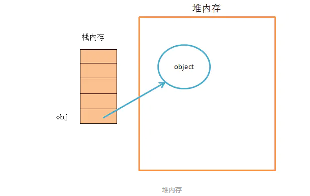
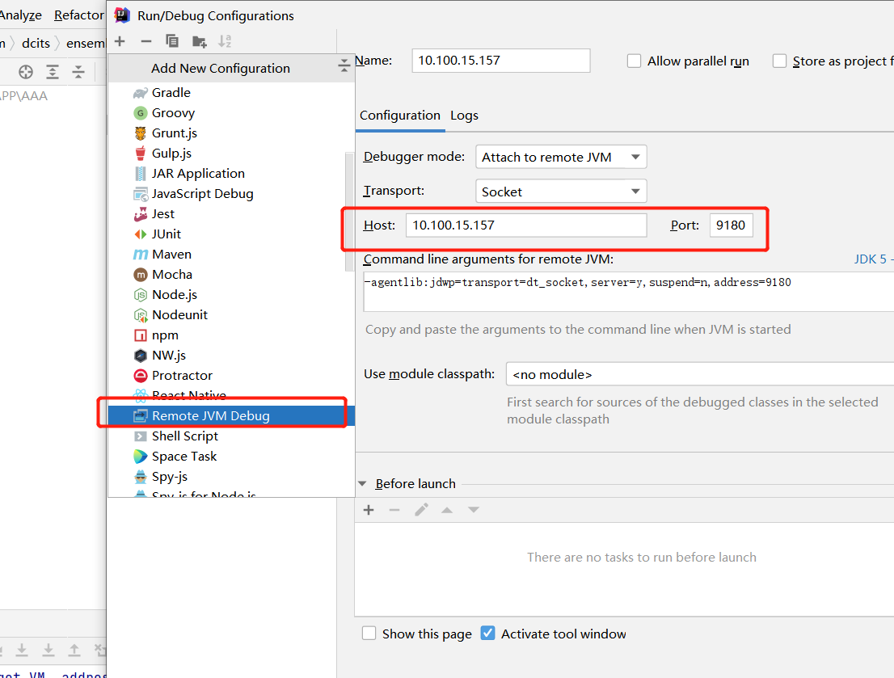

# 积累

## 前言（对zjz说，同样阅读此文档的人说）
- Thinking is more important than learning
> 动脑动脑，不要废了它！！！---所说的能力，无非是想让你的大脑run起来！！！
> 
> 现在最为关键的**不是扣字眼**，而是通过**生活中的例子**，**推出此结论**，再进一步分析--万物源于生活
> 
> 一个失败的人不会永永远远的彻底的失败
>
> 在我看来，我该总结的1.基础！ 2.交互 3.整合
- 交互才是王道，不知怎么交互，下次出来还是不会！！！！！---更无法整合，，，平常人做的是总结而不是整合！！！
## 所有事情都是先会看，再去做---
- 比如，学习一些属性方法，最好就是将它们的东西直接输出，然后再去学怎么做到的
- 看东西，第一眼看[] 是不是数组
- 学习，不要只看目前的，你得知道目前用到的从哪里来的，，由上到下---去悟


## 别人的学习方法
- 狂神:1.网上的视频,2.网上的文档----说的简单,实际他通过大量的观看,积累


## 类：模板 对象：具体的实例 抽象：抽象是对类的抽象，是一种模板设计 接口：行为的抽象，行为规范
 
## 关于for
- 你的目标是多少,你就<=target 
- userList.forEach(System.out::println); list的遍历
## 方法
- 常见的方法().方法().方法().方法().方法().方法()的形式，无非是之前的方法返回一个对象。。所以才连环调用

## 一些东西的复制
- System.arraycopy(arr,0,arr1,0,x);

## 1. idea 多行一起处理：
   - 使用Ait 点住左键 往下拖
## 2. static 
   - 优先加载，所以其他非静态方法就不要在里面调用了 
## 3. @enablewebmvc
   - 它会让你的静态资源链接无法加载，是引入webmvcconfigurationsupport的，
   - 也就是spring会跳过springboot的自动装配（也就是webmvautoconfiguration），
   - 会扫描不到src/main/resource/static下的静态资源，
   - 但如果使用@enableautoconfiguration注解会读取（yaml）和properties的配置
## 4.深拷贝和浅拷贝的区别
- 浅拷贝：
   - 被复制对象的所有变量都含有与原来的对象相同的值，而所有的对其他对象的引用仍然指向原来的对象。
   - 总：浅拷贝仅仅复制所考虑的对象，而不复制它所引用的对象。 
- 深拷贝：
   - 被复制对象的所有变量都含有与原来的对象相同的值，除去那些引用其他对象的变量。
   - 那些引用其他对象的变量将指向被复制过的新对象，而不再是原有的那些被引用的对象。
   - 总：深拷贝把要复制的对象所引用的对象都要复制一遍。
   
## 5.数据类型
- 数据分为基本数据类型(String, Number, Boolean, Null, Undefined，Symbol)和对象数据类型。
   - 1、基本数据类型的特点：直接存储在栈(stack)中的数据
   - 2、引用数据类型的特点：该对象的引用存储在栈中，真实的数据存放在堆内存里


- 赋值：
   - 当我们把一个对象赋值给一个新的变量时，赋的其实是该对象的在栈中的地址，而不是堆中的数据。
   - 也就是两个对象指向的是同一个存储空间，无论哪个对象发生改变，其实都是改变的存储空间的内容，因此，两个对象是联动的。
-  好多时候将protected类型的，重写它并修改为public类型


-  可以使用 desc t_user 来查看表结构、表中列的声明顺序(只能命令行模式)


-  ^在中文的情况下打出……
-  换行"\n"


## widows下的操作
- win+E 打开我的电脑后
- f4 打开地址栏
- f6 在地址栏，左栏，中间进行切换
- 最快的方法---打开，f4-黏贴

- B站  F全屏

## 6.cmd 超好用的技巧，很不错的打开方式
- 超快速打开管理cmd   widows + x 按a
- 直接打开文件位置，在地址栏输入cmd 地址----直接cmd打开到所在文件位置
  - ex:cmd D:\work
  - cd ../../../  返回上几层的方式
- 当然，也可以直接gitbash-----
- cmd打开有包的class 
  - java 包名.class名  --- 前提在包的位置，非class位置


## 7.IDEA常用快捷方式
- Ait + Insert   ==对空白==
    - getset，construct equals，hashCode toString 
    - 第二种用法，对包---新建一个东西
- Ait + Enter  ==对代码==  快速自配，类似于eclipse的Ait+/ 
    - 比如new
- ctrl + Ait + t  ==对代码==
    - 条件，条件。。。。包括synchronized，runnable
- Ctrl + O  --Override
- Ctrl + Shift + C 复制绝对路径（磁盘位置）
- Ctrl + / 注释 -————-Ctrl + Shift + / 多行注释  （重要） ---适用于java，html，xml，jsp等等
- Ctrl + D 复制当前行
- Ctrl + X 删除当前行  
- Ctrl + Enter 换行，指针不动
- tab, shift+tab 集体缩进 
- Ctrl + R：替换字符串
- ctrl + y：删除当前行
- Ctrl + i 快速重新必须实现的方法
- 对于HTML的标签 写一个P，H1，然后按住tab，自动生成
- shift + f6 重命名
- shift + enter 快速到下一行
- shift + Ait + / 直接获取下面语句
- Ctrl + Alt + L 整理代码
- Alt+1 快速打开或隐藏工程面板
- F2 或Shift+F2 高亮错误或警告快速定位
- Ctrl+E 最近更改的代码
- Ctrl＋`[`或`]`可以跳到大括号的开头结尾
- Ctrl＋F12，可以显示当前文件的结构
- AIT + <- 或 ->  快速换上面的视图
- Ait + ~ 关于git系列---提交，回滚，查看历史
- 打开(Ait+Insert)get，set那些之后，使用shift进行多选 
- ctrl+shift+O maven编译（常用）
- Ait+/ 自动补全,类似于Linux的tab
- File--->Settings---->Editor---->File and Code Templates --->Includes--->File Header:加作者信息
- 写一个-,然后ctrl+Ait+t 快速建一些判断


## 网页操作
- Ait+F 意想不到的开启
- ctrl+tab 切换网页     ctrl+tab+shift
- F 视频全屏
- ctrl+n 新打开网页
- ctrl+t 新建标签
- ctrl+h 历史记录


- 桌面的 --- ctrl+shift+o 打开网易邮箱


## 键盘输入时不在有中午符号..
- 设置里的常规,中文使用英文符号---这样做会导致打不出中文符号


## linux
- sz 文件名 ---下载文件
- rz 上传文件
- grep mysql /root/install.log   查找 /root/install.log 文件中包含 mysql 字符串的行，并输出
- grep -iv "#" redis.conf   不要#的查询


## 8.很多时候插件都是在执行引擎上动手脚

## native
- native是一个计算机函数，一个Native Method就是一个Java调用非Java代码的接口。方法的实现由非Java语言实现，比如C或C++。

## 9.三个重要的寄存器
- EIP（指令寄存器）：用来存储即将执行的程序指令的地址。cpu 依照 eip 的存储内容读取指令并执行，eip 随之指向相邻的下一条指令
    - 堆栈指针寄存器（EBP、ESP）
- EBP（栈基）: 即MIPS中的fp，用来存储当前函数状态的基地址   MIPS--单字长定点指令平均执行速度，衡量CPU速度的一个指标
- ESP（栈顶）: 即MIPS中的sp， 用来存储函数调用栈的栈顶地址,在压栈和出栈时发生变化
- BP为基指针（Base Pointer）寄存器，用它可直接存取堆栈中的数据；
- SP为堆栈指针（Stack Pointer）寄存器，用它只可访问栈顶。
- 寄存器 ： 
    - 寄存器是中央处理器内的组成部分。寄存器是有限存贮容量的高速存贮部件，
    - 它们可用来暂存指令、数据和地址。
    - 在中央处理器的控制部件中，包含的寄存器有指令寄存器(IR)和程序计数器(PC)。
        - 指令寄存器IR ，是临时放置从内存里面取得的代码数据（也就是指令），然后等待译码器来译码。
        - 指令指针寄存器ip，里面放置的是不是指令，而是一个指向下一个将要去获取的指令的内存地址（所以它是一个指针）。
    - 在中央处理器的算术及逻辑部件中，寄存器有累加器(ACC)
## 10.栈的定义
- 1.它是一种运算受限的线性表。
- 2.其限制是仅允许在表的一端进行插入和删除运算。这一端被称为栈顶。
- 相对地，把另一端称为栈底。
- 3.向一个栈插入新元素又称作进栈、入栈或压栈，从一个栈删除元素又称作出栈或退栈
## 11.程序中的栈–函数调用栈
- 函数调用栈是指程序运行时内存一段连续的区域，用来保存函数运行时的状态信息，包括函数参数与局部变量等
- 函数调用栈在内存中从高地址向低地址生长，所以栈顶对应的内存地址在压栈时变小，退栈时变大。

## 12.调用其它接口
- Socket Webservice http

## 13.java的本质时值传递

## 14.栈溢出，堆溢出
- 栈的机制，里面是走方法的，所以方法的不断调用会导致栈溢出
- 堆的机制，里面存数据的，所以数据的不断增长，导致堆溢出

## 15.新手村--魔鬼训练（分析原理，看源码）-->PK场

## 16.数组类型转字符串，**快速输出**的一种方式
  - 经Test，发现已有**对象**都可以用toString来进行返回一个String类型
  - Arrays.toString(strings)   -- 本质上借用StringBuilder的append

## `17.>>>` `>>` `<<`


| 符号 | 例子              | 理解                                                         |
| ---- | ----------------- | ------------------------------------------------------------ |
| <<   | num<<n,   32<<3   | 等价于 num×2^n，算数左移（逻辑左移）  32<<3为32*8,<br />口令：小鱼小鱼要变大 |
| >>   | num>>n,   32>>3   | 等价于 num/(2^n)   算数右移（逻辑右移）  32>>3为32/8<br />口令：大鱼大鱼要变小 |
| >>>  | num>>>n,   32>>>3 | 逻辑右移，当num为正数和算术右移一个效果                      |

```
32<<3:   256      从 10 0000  -->   1 0000 0000
32*8:    256
-----------------------
32>>3:   4        从 10 0000 -->   00 0100
32/8:    4
-----------------------
32>>>3:   4       从 10 0000 --> 00 0100
32/8:    4


5的二进制是0101。
x=5>>2 （>>带符号右移）

将0101右移2位，为：0001。
y=x>>>2 （>>>无符号右移，左边空缺补充为0）

再将0001右移2位，补0。结果为：0000。

所以得出答案0

```

## 18.System.exit();
- System.exit(0);  //正常终止,程序正常执行结束退出
- System.exit(1);  //非正常终止,就是说无论程序正在执行与否，都退出，
- System.exit(status)不管status为何值都会退出程序。
  - 和return 相比有以下不同点：return是回到上一层，而System.exit(status)是回到最上层


### JSP，Servlet的路径，详细见[WebBaseServlet](zh-cn/web/WebBaseServlet.md)
- 注意jsp中form的method要和servlet的doGet，doPost对应


### for
- 对于for循环 
  - 1.要大的在里面，小的在外面
  - 2.里面最好不要有运算（除非是必须的）
  - XXX.size() .length 最好在外卖就算了，要不每次都得执行一次
  


### 用户ID哪里来
- 从Session里面拿

### StringUtils
- 常用来判断是否为null

### ../ 上级目录

### - 界面去哪里找？？？不要自己每次都新加一个吧？？
- 去模板之家下一个！http://www.cssmoban.com/
- https://element.faas.ele.me/#/zh-CN
- 百度---门户网站模板

### 打开线程，内存，jvm的运行的监控- jconsole（cmd）
- JDK自带的jconsole工具，可以检测到当前运行Hello这个类的时候，JVM的运行情况，包含内存的使用、线程的运行状态、类的加载等信息

### 设置图片大小，直接右键编辑

### 关于字符串 它使用indexOf返回的下标（0开始）  length 返回的整体长度（1开始）
- .
```
    //获得上传的文件名，例如/img/girl/XXX.jpg,只需要XXX，其前面的后面的都不需要
    
    String fileName = uploadFileName.substring(uploadFileName.lastIndexOf("/") + 1);
    
    //获得文件的后缀名
    
    String fileExtName = uploadFileName.substring(uploadFileName.lastIndexOf(".") + 1);

```

### zjz的面向对象的思想：
- 1).是不是每一个java类都可以看成拥有一套对象？--  是！
    - 对象：对象是类的一个实例，有状态和行为。例如，一条狗是一个对象，它的状态有：颜色、名字、品种；行为有：摇尾巴、叫、吃等。
    - 类：类是一个模板，它描述一类对象的行为和状态
- 2). 往后见到**类**就可以明白**有一类型对象可以诞生**！！
- 3). 即便空类，它也有着自己的对象（默认构造器），有着虚拟机中的位置class


### 对于数组，我们定义使用[]  它的几乎所有的操作都是用它的工具Arrays来进行的
- 最根本的就是对象数组了，里面存放对象 对象名[] xxx = new 对象名[n];
- test05[] tarr = new test05[hashMap1.size()];

- ex： 排序sort 变list(之后不可用add,可以get)，变字符串
- 要想起二维数组的应用-----

## 目前遇到的截取，似乎好像都是[) 鸡头没鸡尾


## 前端小技巧
- 1.如何巩固js (看jQuery源码，看游戏源码)---`https://www.mycodes.net/1/`
- 2.巩固html，CSS(扒网站，全部down下来，然后对应修改看效果（审查元素-Delete其中--看效果--）)

## md使用
`&nbsp; 表示半角空格（英文）
&emsp; 表示全角空格（中文）`


##  return; --- 直接中断方法,用于中断一些东西


## String.class.newInstance();


## 接口
- 接口中只能预定义方法，定义变量都是常量(只能读不能改)。。。而且实现类必须实现方法。
- 获取常量---接口名.常量名
- 在接口中的所有方法都是抽象的，没有实现，没有办法去修改这个变量值的方法。

- JNI java Native Interface java本地化接口

- 接口分类
  - implements Serializable 标记接口  jvm---》本地方法栈 native ---》C++
  - 函数接口


## java栈
- 本地方法栈  交给C++做的
  - 比如有线程的start0，Sting 的intern---A.intern();常量池（SCP）如果有与A一样的内容B，就返回B，没有就将A加到SCP，返回A
- java栈 ---我们平时写的


## throw new RuntimeException(">>>"); 手动造一个异常---这个会将异常后面不会运行的语句编译报错
- 对于try…catch…finally 的理解
- 对于try中，若无异常，正常流程，遇到异常中断之后的输出,,,如果手动造异常，那么下面无法书写（编译报错）
- 对于catch，如果try中有异常，那么它就会执行
- finally 正常都会执行的
- 简单记忆，try直接走，异常catch走，最后finally走。 finally抛异常就跳过

- 注:catch中的异常不会被捕获(只会在控制台打印异常且中止交易，但会打印finally),
  同时若 e.printStackTrace();这句话在catch异常后面不会打印`try异常`信息,遇到直接跳finally
- 如果不使用 e.printStackTrace();  是不会打印异常的,直接运行结果

## try-with-resources
- try-with-resources(try(执行体){逻辑代码})
-  注意：使用被坑--- 它会自动使用一下，然后关闭。。。所以逻辑得写在{} 里面，，，，
   对于分开使用执行体(比如只是为了获取对象，方便后面的调用)的，不要用。。。


## int的取值范围--2147483647(2^31-1) 若加1 ---(-2147483648)
- 正常println 不加L,就是输出int型 --- 加L 就是long型


## javaFX
- javaFX是一个强大的图形和多媒体处理工具包集合。

## Map         
- // 万能的Map，一切东西都可以存到map中 --- 结果集
- `HashMap<String, String> resultMap = new HashMap<String, String>();`

## 迭代(Iterator)的使用
  ```
      // 迭代器打印，1.先获取迭代器对象，2.调用迭代器对象的方法
          Iterator<String> iterator = stringArrayList.iterator();
          while (iterator.hasNext()){
              System.out.print(iterator.next());
          }
  ```


## 对象.方法（XX），参数获取对象值
- 要一个空的容器或者数组去获取值，直接把它们当作参数去获取值。
> 本质上也就是returnXX（参数），而不是执行一些东西或者返回其它的
> 万物皆可return
- 举例
  ```
      public <T> T[] toArray(T[] a) {
      if (a.length < size)
          // Make a new array of a's runtime type, but my contents:
           return (T[]) Arrays.copyOf(elementData, size, a.getClass());
          System.arraycopy(elementData, 0, a, 0, size);
      if (a.length > size)
         a[size] = null;
         return a;
      }
  ```
  
- 目前见到的有
  - read(XX)  
  - toArray(XX)
  


## JDBC下SQL语句的拼接
- 使用StringBuffer的append存放，最后拼接--
  
## WEB-INF
- 在WEN-INF路径下，安全，用户无法访问上面的文件


## UUID -- 唯一的随机码
- //可以使用UUID(唯一通用识别码)来保证文件名的统一
- `String uuidFileName = UUID.randomUUID().toString();`


## 序列化 Serializable
- // 网络传输中的东西都需要序列化
- serialVersionUID
- POJO 实体类，如果想要在多个电脑上运行，就需要传输---》把对象给序列化


## 脚手架
- 东西已经成形了，往里面添加东西就行

## 反射主要就是通过class来进行操作的


## 一个类在内存中只有一个class对象
- 一个类被加载后,类的整个结构都会被封装在class中
- // 只要元素类型与维度一样,就是同一个class


## Class.forName()方法
> forName这句话就是**装载类**用的(new是根据已加载到内存中的类--去创建一个实例，要分清楚)。
> 
> jvm在装载类时会执行类的静态代码段，要记住**静态代码是和class绑定的**，class装载成功就表示执行了你的静态代码了，而且以后不会再执行这段静态代码了。
- 1.返回与给定的字符串名称相关联类或接口的Class对象。
- 2.是一个**静态方法**，可以用来加载类----要求JVM查找并加载指定的类，也就是说JVM会执行该类的静态代码段
  - 方法有两种形式：
  - Class.forName(String name, boolean initialize, ClassLoader loader) // name表示的是类的全名；initialize表示是否初始化类；loader表示加载时使用的类加载器
  - Class.forName(String className)。 // 默认设置参数 initialize的值为 true，loader的值为当前类的类加载器


## SQL反勾号或者叫飘号（``）
- 数据库、表、索引、列和别名用的是引用符是反勾号(‘`’)  注：Esc下面的键
- 自己能掌握在给相关数据取名的时候别和相关关键字冲突就行！！！！其实能取名和关键字有冲突的还是很小的几率。
- 在联表查询里，在拥有相同的字段时相同字段最好不要加反勾号,,当然，冲突的名称，你可以加上反勾号，其它加不加都行

## AND
- xml `&amp;`

## 空格
- md 中 `&emsp;&emsp;`


## 可以toString的遍历输出
- list.toString();


## ^ ：按位异或


## 普通小项目怎么变成moudle
- add pom.xml

## super
- 子类可以在自己的构造函数中使用super关键字来调用父类的含参数构造函数，但这个调用语句必须是子类构造函数的**第一个**可执行语句。
- 构造函数只能被调用，不能被继承。子类默认调用父类无参构造器，若父类**没有无参构造器**，
  子类需要用super()调用父类有参构造器，且super()位于子类构造器的第一行。
  
- 构造函数什么时候被调用？对象被创建时
  - 构造函数的作用就是初始化的时候调用


# 交互---
- 交互才是王道，不知怎么交互，下次出来还是不会！！！！！
## ResourceLoader 
- 资源加载 ，解析XML，properties等等


## xml配置文件
- 在大多数的时候充当一个服务者（提供全局的需求）
- 一个间接的管理者（配置进去了，才给真正的执行者）

- 比如一个bean配置进去，它会将其提供给bean的操作者--不止一个（解析的，赋值的，要获取的）
- 而取名，取别名啥的，它同样也算一个间接的管理者，开启事务，开启一些功能都在这配
- 所以才叫做配置中心！！--提供服务，间接管理

## Spring的解析XML
- 获取上下文，，new ClassPathXmlApplicationContext("beans.xml");


### idea
- idea直接改module的话，可能会爆红，将大小pom对应，同时编辑时要注意字符编码！！
- 删除target 重新编译下就行


### 思想，先判断少的再判断多的，提高速率  -- 两层for就是小外，大内

## 关于Mybatis和Spring
- 有相似的地方，如：依赖注入---（因为到时用的同一个pojo啊！！）
- 不同的地方，，，Spring对象，方法都放到容器了（IOC） 而Mybatis是间接的使用pojo的一些方法
- 测试时，即（送参，入参）执行者不同，，Mybatis是按钮接口的方法，，，而Spring是对象。。
- 所以Spring被说是Bean工厂---而mybatis只是数据的流通。


## Spring
- 在Spring中，我们会遇到很多的XXXTemplate：：redisTemplate模板

# 单if 在有return 中为啥不好使
- 因为你在你的if内写了判断,满足返回XXXX, 但是如果不在你的if中,你得返回一个东西吧...

- if 中如果不是双等于号,那么运行时,先if(x=a)中的赋值,再运行,,


## 变量 
- 类中声明的变量有默认初始值；方法中声明的变量没有默认初始值，必须在定义时初始化，否则在访问该变量时会出错。
boolean类型默认值是false
  

# 总：default拒绝一切包外访问；protected接受包外的子类访问


## SSM核心要点！！
- 不管什么bean，最终都是要进入ApplicationContext context
- 所以在源码中，我们可以读到非常多的多的-context.getBean(,XXX.class);来获取bean对象，进行操作！！
- 接口是不能有bean的


## BeanFactory和FactoryBean（解决实例化bean）
- 本质上！！！BeanFactory是个Factory，也就是IOC容器或对象工厂，FactoryBean是个Bean。
  - 在Spring中，所有的Bean都是由BeanFactory(也就是IOC容器)来进行管理的。
  - 但对FactoryBean而言，这个Bean不是简单的Bean，而是一个能生产或者修饰对象生成的工厂Bean,它的实现与设计模式中的工厂模式和修饰器模式类似 
- FactoryBean：：一般情况下，Spring通过反射机制利用<bean>的class属性指定实现类实例化Bean，
  在某些情况下，**实例化Bean过程**比较复杂，如果按照传统的方式，则需要在<bean>中提供大量的配置信息。
  配置方式的灵活性是受限的，这时采用编码的方式可能会得到一个简单的方案。
  Spring为此提供了一个org.springframework.bean.factory.FactoryBean的工厂类接口， 用户可以通过实现该接口定制实例化Bean的逻辑。
  FactoryBean接口对于Spring框架来说占用重要的地位，Spring自身就提供了70多个FactoryBean的实现。它们隐藏了实例化一些复杂Bean的细节，给上层应用带来了便利。


## 跳出双层for

  ```
    B:for(int i=0;i<10;i++){
              for (int j = 0; j < 20; j++) {
                  count++;
                  if(count==target){
                      break B;
                  }
              }
          }
  
  ```
  


# 前端
- `/** `包括这个请求下面的所有请求   一个`*`当前目录下的,`两个**`,代表所有

- 在web-inf下的所有页面或者资源,只能通过controller,或者servlet进行访问


# 前端的<>
- required 前端的校验必填
- value 默认值

- a href="/action"" 会直接走一个请求(如果是的话)


## 前端没有不会的..
- bootstrap可视化布局
  - `https://www.bootcss.com/p/layoutit/`
  


## 获取CPU
-   System.out.println(Runtime.getRuntime().availableProcessors());


- 看别人的代码，要把变量记上，然后一步一步的走逻辑，还原树。。画图


## 统计,总数
- 考虑是不是 1 1 3 5 8
- 这样判断是不是`斐波那契数列`


## 对于输入法的一个使用方法
- 输入v,然后进行时间的转换,计算,日期都好用!


## 服务器debug
- Remote JVM Debug--




