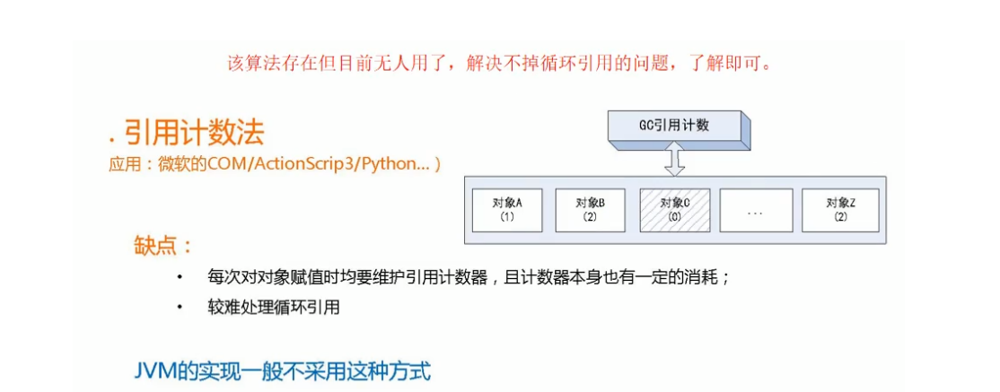
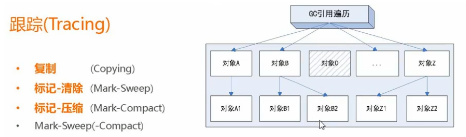

# GC回收
- -verbose:gc”,这个参数的作用就是打印 GC 信息。


## GC介绍
- 什么是GC？
 - 简单的说就是内存中已经不再被使用到的空间就是垃圾。
 - Person person = null;
- 要进行垃圾回收，如何判断一个对象是否可以被回收？

## 判断垃圾
> 方法一：引用计数法（了解即可）
- Java中，引用和对象是有关联的，如果要操作对象则必须用引用进行。
- 因此，很显然一个简单的办法是通过`引用计数`来判断一个对象`是否可以进行回收`。简单说，给对象中添
  加一个引用计数器，每当有一个地方引用它，计数器值加1，每当有一个`引用失效时，计数器减1`。
- 任何时刻计数器值为零的对象就是不可能再被使用的，那么这个对象就是可回收对象。


> 方法二：可达性分析算法
> 为了解决引用计数法的循环引用问题，Java 使用了可达性分析的方法。
- 
- 所谓 `GC roots` 或者说 `tracing GC` 的 “根集合" 就是一组`必须活跃的引用`。
- 基本思路就是通过一系列名为`GC Roots`的对象作为起始点，从这个被称为 GC Roots的对象开始向
  下搜索，如果`一个对象到 GC Roots 没有任何引用链相连`时，则说明**此对象不可用**。
- 给定一个集合的引用作为根出发，通过引用关系`遍历对象图`，能被遍历到的（可到达的）对象就被判定为存活，没有
  被遍历到的就自然被判定为死亡。

> Java中可以作为 GC Roots的对象：（共4种）
- 1、虚拟机栈（栈帧中的局部变量表）中引用的对象；
- 2、方法区中的类静态属性引用的对象。
- 3、方法区中常量引用的对象。
- 4、本地方法栈中 JNI （Native方法）引用的对象。


## 正常GC回收
> 作用域外的System.gc();
- 如果在同作用域之内的,虚拟机是不会回收的，它还是“有效”的,GC是不会回收的
- 作用域已经失效了。它已经“无用”了，虚拟机会回收它所占用的内存.


- slot复用
  - Slot 复用影响下的GC回收
  - 如果不在作用域外定义一个新的变量,那么作用域内的变量无法被垃圾回收 
  - placeholder变量能否被回收的关键就在于：局部变量表中的Slot是否还存有关于`placeholder`对象的引用。  
  - ```
        public class TestDemo {
     
        public static void main(String[] args){
            {
                byte[] placeholder = new byte[64 * 1024 * 1024];
                // 限定了 placeholder 的作用域，但之后并没有任何对局部变量表的读写操作，
                // placeholder 变量在局部变量表中占用的Slot没有被其它变量所复用， ---- 如果没有外部的a
                // 所以作为 GC Roots 一部分的局部变量表仍然保持着对它的关联。所以 placeholder 变量没有被回收。
            }
            int a = 0;   // 变量a正好复用了 placeholder 占用的 Slot
            System.gc();
        }
    }
    
    ```  
