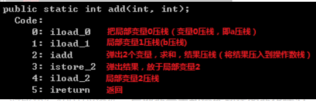
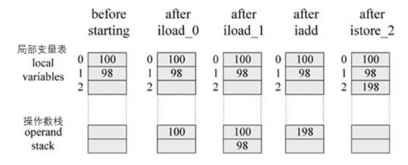

# java的操作流程


## 操作一个方法的过程
- 操作数栈

```
    public class OperandStack{
     
        public static int add(int a, int b){
            int c = a + b;
            return c;
        }
     
        public static void main(String[] args){
            add(100, 98);
        }
    }


```

- 使用 javap 反编译 OperandStack 后，根据虚拟机指令集，得出操作数栈的运行流程如下：

- add 方法刚开始执行时，操作数栈是空的。
  - 当执行 iload_0 时，把局部变量 0 压栈，即 100 入操作数栈。
  - 然后执行 iload_1，把局部变量1压栈，即 98 入操作数栈。
  - 接着执行 iadd，弹出两个变量（100 和 98 出 操作数栈），对 100 和 98 进行求和，
  - 然后将结果 198 压栈。
  - 然后执行 istore_2，弹出结果（出栈）。

- 对比执行100+98操作，局部变量表和操作数栈的变化情况。


