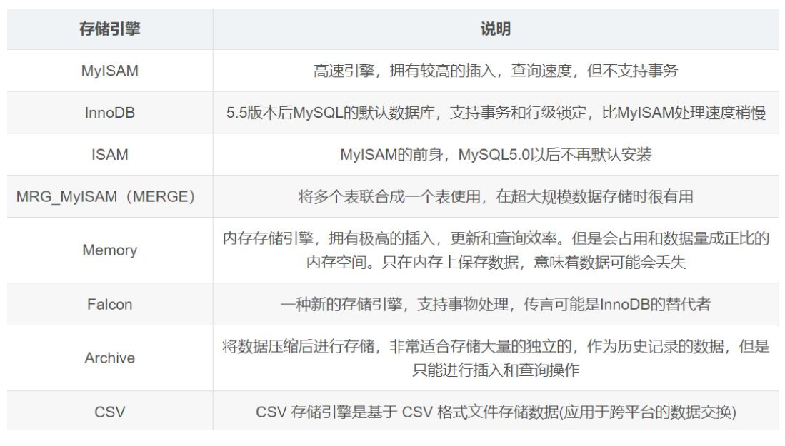
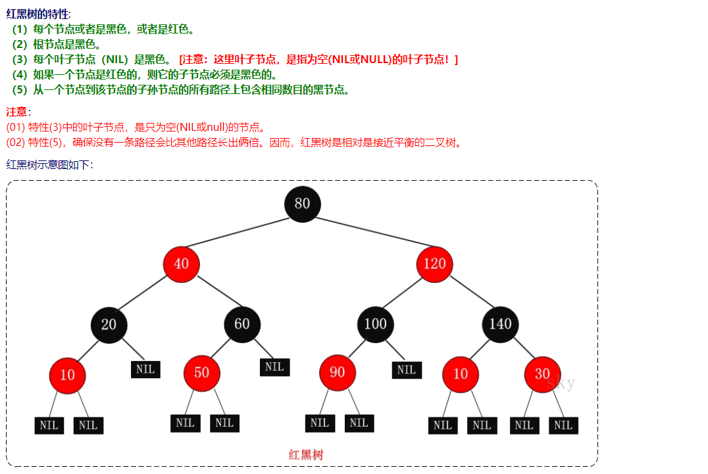
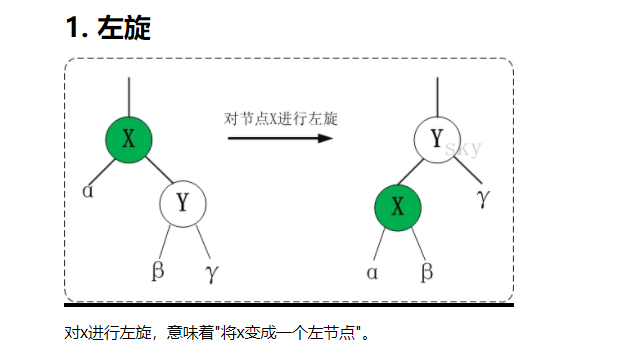
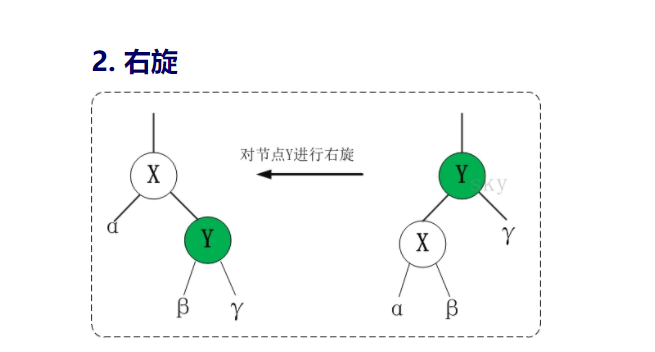

1：jdk1.7 到 jdk1.8 Map 发生了什么变化(底层)?

1.8 之后 hashMap 的数据结构发生了变化，从之前的单纯的数组+链表结构变成数组+链表+红黑树。也就是说在 JVM 存储 hashMap 的 K-V 时仅仅通过 key 来决定每一个 entry 的存储槽位（Node[]中的 index）。并且 Value 以链表的形式挂在到对应槽位上（1.8 以后如果 value长度大于 8 则转为红黑树）。

但是 hashmap1.7 跟 1.8 中都没有任何同步操作，容易出现并发问题，甚至出现死循环导致系统不可用。解决方案是 jdk 的 ConcurrentHashMap，位于 java.util.concurrent 下，专门解决并发问题。

2. ConcurrentHashMap

思路与 hashMap 差不多，但是支持并发操作，要复杂很多

3. 并行跟并发有什么区别？

并发：指应用交替执行不同的任务，多线程原理

并行：指应用同时执行不用的任务

区别：一个是交替执行，一个是同时执行。

4. jdk1.7 到 jdk1.8 java 虚拟机发生了什么变化?

JVM 中内存份为堆、栈内存，及方法区。

栈内存主要用途：执行线程方法，存放本地临时变量与线程方法执行是需要的引用对象的地址。

堆内存主要用途：JVM 中所有对象信息都存放在堆内存中，相比栈内存，堆内存大很多

所以 JVM 一直通过对堆内存划分不同功能区块实现对堆内存中对象管理。

堆内存不够常见错误：OutOfMemoryError

栈内存溢出常见错误：StackOverFlowError

在 JDK7 以及其前期的 JDK 版本中，堆内存通常被分为三块区域 Nursery 内存(younggeneration)、长时内存(old generation)、永久内存(Permanent Generation for VM Matedata)，

显示如下图：

在最上面一层是 Nursery 内存，一个对象被创建以后首先被房到 Nuersery 中的 Eden 内存中，如果存活周期超过两个 Survivor（生存周期）之后会被转移到 Old Generation 中。

永久内存中存放对象的方法、变量等元数据信息。永久内存不够就会出现 以下错误：java.lang.OutOfMemoryError:PermGen

但是在 JDK1.8 中一般都不会得到这个错误，原因在于：1.8 中把存放元数据的永久内存从堆内存中已到了本地内存（native Memory）中，1.8 中 JVM 内存结构变成了如下图：

这样永久内存就不占用堆内存，可以通过自增长来避免永久内存错误。

-XX:MaxMetaspaceSize=128m 这只最大的远内存空间 128 兆

JDK1.8 移除 PermGen，取而代之的是 MetaSpace 源空间

MetaSpace 垃圾回收：对僵死的类及类加载器的垃圾回收机制昂在元数据使用达到

“MaxMetaSpaceSize”参数的设定值时运行。

MetaSpace 监控：元空间的使用情况可以在 HotSpot1.8 的详细 GC 日志输出中得到。

更新 JDK1.8 的原因：

1.字符串存在永久代当中，容易出现性能问题和内存溢出

2.类及方法的信息比较难确定其大小，因此对永久代的大小制定比较困难，太小容易出

现永久代溢出，太大则容易导致老年代溢出。

3.永久代会为 GC 带来不必要的复杂度，并且回收效率偏低

4.Oracle 可能会想 HotSpot 与 JRockit 合并。

5. 如果叫你自己设计一个中间件,你会如何设计?

我会从以下几点方面考虑开发：

1) 远程过程调用

2) 面向消息：利用搞笑的消息传递机制进行平台无关的数据交流，并给予数据通信来进行分布式系统的集成，有一下三个特点：

i) 通讯程序可以在不同的时间运行

ii) 通讯晨旭之家可以一对一、一对多、多对一甚至是

上述多种方式的混合

iii) 程序将消息放入消息队列会从小吸毒列中取出消息来进行通讯

3) 对象请求代理：提供不同形式的通讯服务包括同步、排队、订阅发布、广播等。

可构筑各种框架如：事物处理监控器、分布数据访问、对象事务管理器 OTM 等。

4) 事物处理监控有一下功能：

a) 进程管理，包括启动 server 进程、分配任务、监控其执行并对负载进行平衡

b) 事务管理，保证在其监控下的事务处理的原子性、一致性、独立性和持久性

c) 通讯管理，为 client 和 server 之间提供多种通讯机制，包括请求响应、会话、

排队、订阅发布和广播等

6. 什么是中间件？

中间件是处于操作系统和应用程序之间软件，使用时旺旺是一组中间件集成在一起，构成一个平台（开发平台+运行平台），在这组中间件中必须要有一个通信中间件，即中间件= 平台+通信。该定义也限定了只有勇于分布式系统中才能称为中间件

主要分类：远程过程调用、面向消息的中间件、对象请求代理、事物处理监控。

7. ThreadLock 用过没有,说说它的作用?

ThreadLock 为本地线程，为每一个线程提供一个局部变量，也就是说只有当前线层可以访问，是线程安全的。原理：为每一个线程分配一个对象来工作，并不是由 ThreadLock 来完成的，而是需要在应用层面保证的，ThreadLock 只是起到了一个容器的作用。原理为ThreadLock 的 set()跟 get()方法。

实现原理：

public void set(T value) {
Thread t = Thread.currentThread();
ThreadLocalMap map = getMap(t);
if (map != null)
map.set(this, value);
else
createMap(t, value);
}
public T get() {
Thread t = Thread.currentThread();
ThreadLocalMap map = getMap(t);
if (map != null) {
ThreadLocalMap.Entry e = map.getEntry(this);
if (e != null)
return (T)e.value;
}
return setInitialValue();
}
8. Hashcode（）和 equals（）和==区别?

(1) hashcode()方法跟 equals()在 java 中都是判断两个对象是否相等

(2) 两个对象相同，则 hashcode 至一定要相同，即对象相同 ---->成员变量相同---->hashcode 值一定相同

(3) 两个对象的 hashcode 值相同，对象不一定相等。总结：equals 相等则 hashcode 一定相等，hashcode 相等，equals 不一定相等。

(4) ==比较的是两个引用在内存中指向的是不是同一对象（即同一内存空间）

9. mysql 数据库中,什么情况下设置了索引但无法使用?

(1) 索引的作用：在数据库表中对字段建立索引可以大大提高查询速度。

(2) Mysql 索引类型：

a) 普通索引

b) 唯一索引：唯一索引列的值必须唯一允许有空值，如果是组合索

引，则列值的组合必须唯一：

CREATE UNIQUE INDEX indexName ON mytable(username(length)) -- 修改表结构

ALTER mytable ADD UNIQUE [indexName] ON (username(length)) -- 创建表的时候直接指定

CREATE TABLE mytable( ID INT NOT NULL, username VARCHAR(16)NOT NULL, UNIQUE [indexName] (username(length)) );

c) 主键索引：一种特殊的唯一索引，不允许有空值，一般在创建表

的时候创建主键索引：

CREATE TABLE mytable( ID INT NOT NULL, usernameVARCHAR(16) NOT NULL, PRIMARY KEY(ID) );

d) 组合索引：CREATE TABLE mytable( ID INT NOT NULL, usernameVARCHAR(16) NOT NULL, city VARCHAR(50) NOT NULL, age INTNOT NULL );

为了进一步榨取 MySQL 的效率，就要考虑建立组合索引。就是将 name, city, age 建到一个索引里：代码如下:ALTER TABLE mytable ADD INDEX name_city_age

(name(10),city,age);

(3) 什么情况下有索引，但用不上？

a) 如果条件中有 OR，即使其中有部分条件带索引也不会使用。注

意：要想使用 or，又想让索引生效，只能将 or 条件中的每个列

都加上索引。

b) 对于多了索引，不是使用的第一部分，则不会使用索引。

c) Like 查询以%开头，不使用索引

d) 存在索引列的数据类型隐形转换，则用不上索引，比如列类型是字符串，那一定要在条件中将数据使用引号引用起来,否则不使用索引

e) Where 子句里对索引列上有数学运算，用不上索引

f) Where 子句中对索引列使用函数，用不上索引

g) Mysql 估计使用全表扫描要比用索引快，不使用索引

(4) 什么情况下不推荐使用索引？

a) 数据唯一性差的字段不要使用索引

b) 频繁更新的字段不要使用索引

c) 字段不在 where 语句中出现时不要添加索引，如果 where 后含

IS NULL/IS NOT NULL/LIKE ‘%输入符%’等条件，不要使用索引

d) Where 子句里对索引使用不等于（<>），不建议使用索引，效果一般

10. mysql 优化会不会,mycat 分库,垂直分库,水平分库?

(1) 为查询缓存优化你的查询

(2) EXPLAIN select 查询：explain 的查询结果会告诉你索引主键是如何被利用的

(3) 只需要一行数据时使用 limit1

(4) 为搜索字段添加索引

(5) 在关联表的时候使用相当类型的例，并将其索引

(6) 千万不要 ORDER BY RAND()

(7) 避免 select*

(8) 永远为每张表设置一个 ID

(9) 使用 ENUM 而不是 VARCHAR

(10) 从 PROCEDURE ANALYS()提取建议

(11) 尽可能的使用 NOT NULL

(12) Java 中使用 Prepared Statements

(13) 无缓冲的查询

(14) 把 IP 地址存成 UNSIGNED INT

(15) 固定表的长度

(16) 垂直分库：“垂直分割”是一种把数据库中的表按列变成几张表的方法，这样可以降低表的复杂度和字段的数目，从而达到优化的目的。

(17) 水平分库：“水平分割”是一种把数据库中的表按行变成几张表的方法，这样可以降低表的复杂度和字段的数目，从而达到优化的目的。

(18) 越小的列会越快

(19) 选择正确的存储引擎

(20) 使用一个对象关系映射器

(21) 小心永久链接

(22) 拆分大的 DELETE 活 INSERT 语句

11. 分布式事务解决方案?

(1) 什么是分布式事务？

a. 什么情况下需要用到分布式事务？

a) 当本地数据库断电、机器宕机、网络异常、消息丢失、消息乱序、数据错误、不可靠 TCP、存储数据丢失、其他异常等需要用到分布式事务。

b) 例如：当本地事务数据库断电的这种秦光，如何保证数据一致性？数据库由连个文件组成的，一个数据库文件和一个日志文件，数据库任何写入操作都要先写日志，在操作前会吧日志文件写入磁盘，那么断电的时候及时才做没有完成，在重启数据库的时候，数据库会根据当前数据情况进行 undo 回滚活 redo 前滚，保证了数据的强一致性。

c) 分布式理论：当单个数据库性能产生瓶颈的时候，可能会对数据库进行分区（物理分区），分区之后不同的数据库不同的服务器上 ，此时单个数据库的 ACID 不适应这种清苦啊，在此集群环境下很难达到集群的 ACID，甚至效率性能大幅度下降，重要的是再很难扩展新的分区了。此时就需要引用一个新的理论来使用这种集群情况：CAP 定理

d) CAP定理:由加州肚饿伯克利分销Eric Brewer教授提出，指出WEB服务无法同时满足 3 个属性：

a. 一致性：客户端知道一系列的操作都会同时发生

（生效）

b. 可用性：每个操作都必须以可预期的响应结束

c. 分区容错性：及时出现单组件无法可用，操作依然可以完成。具体的将在分布式系统中，在任何数据库设计中，一个 WEB 应至多只能同时支持上面两个属性。设计人员必须在一致性和可用性之间做出选择。

e) BASE 理论：分布式系统中追求的是可用性，比一致性更加重要，BASE 理论来实现高可用性。核心思想是：我们无法做到羟乙酯，单每个应用都可以根据自身的业务特点，采用适当的方式使系统达到最终一致性。

f) 数据库事务特性：ACID

i. 原子性

ii. 一致性

iii. 独立性或隔离性

iv. 持久性

(2) 分布式系统中，实现分布式事务的解决方案：

a. 两阶段提交 2PC

b. 补偿事务 TCC

c. 本地消息表（异步确保）

d. MQ 事务消息

e. Sagas 事务模型

12. sql 语句优化会不会,说出你知道的?

(1) 避免在列上做运算，可能会导致索引失败

(2) 使用 join 时应该小结果集驱动大结果集，同时把复杂的 join 查询拆分成多个 query，

不然 join 越多表，会导致越多的锁定和堵塞。

(3) 注意 like 模糊查询的使用，避免使用%%

(4) 不要使用 select * 节省内存

(5) 使用批量插入语句，节省交互

(6) Limit 基数比较大时，使用 between and

(7) 不要使用 rand 函数随机获取记录

(8) 避免使用 null，建表时，尽量设置 not nul，提高查询性能

(9) 不要使用 count（id），应该使用 count（*）

(10) 不要做无谓的排序，尽可能在索引中完成排序

(11) From 语句中一定不要使用子查询

(12) 使用更多的 where 加以限制，缩小查找范围

(13) 合理运用索引

(14) 使用 explain 查看 sql 性能

13. mysql 的存储引擎了解过没有?

(1) MySQL 存储引擎种类：

- 事务处理：在整个流程中出现任何问题，都能让数据回滚到最开始的状态，这种处理方式称之为事务处理。也就是说事务处理要么都成功，要么的失败。

14. 红黑树原理？
(1) 红黑树的性质：红黑树是一个二叉搜索树。在每个节点增加了一个存储位记录节点
的颜色，可以是 RED，也可以是 BLACK，通过任意一条从根到叶子简单路径上颜色
的约束，红黑树保证最长路径不超过最短路径的两倍，加以平衡。性质如下：

i. 每个节点颜色不是黑色就是红色
ii. 根节点的颜色是黑色的
iii. 如果一个节点是红色，那么他的两个子节点就是黑色的，
没有持续的红节点
iv. 对于每个节点，从该节点到其后代叶节点的简单路径上，
均包含相同数目的黑色节点。

- 红黑树的应用比较广泛，主要是用它来存储有序的数据，它的时间复杂度是O(lgn)，效率非常之高
   - Java集合中的TreeSet和TreeMap
- 红黑树的基本操作(一) 左旋和右旋
    - 红黑树的基本操作是添加、删除。在对红黑树进行添加或删除之后，都会用到旋转方法。
    - 为什么呢？道理很简单，添加或删除红黑树中的节点之后，红黑树就发生了变化，可能不满足红黑树的5条性质，也就不再是一颗红黑树了，而是一颗普通的树。而通过旋转，可以使这颗树重新成为红黑树。简单点说，旋转的目的是让树保持红黑树的特性。
    - 旋转包括两种：左旋 和 右旋。
    

      

