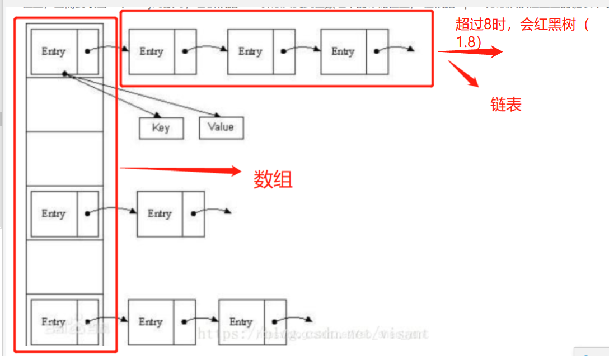

# 
## 逻辑
- 1.一堆人在玩游戏，每个人背上都有纸，有字和无字，关灯前看别人背上有字没，（关灯时有字的拍手）第一次关灯没人
  拍手，第二次关灯没有，第三次关灯有人拍手，问，有多少人背上有字。
  - 有几次灯，有几人背上有字
- 2.逻辑与或运算

## 数据库
- 1.迭代数据库？
## JDK1.8 新特性
- 1.Lambda表达式（本质上是一段匿名内部类）
- 2.函数式接口
  - 简单来说就是只定义了一个抽象方法的接口（Object类的public方法除外）
  - 并且还提供了注解：@FunctionalInterfac
  - 为了让我们更加方便的使用lambda表达式  
- 3.*方法引用和构造器调用
- 4.Stream API
- 5.接口中的默认方法和静态方法
- 6.新时间日期API
    - 表示日期的LocalDate
      表示时间的LocalTime
      表示日期时间的LocalDateTime

    - 在jdk1.8中对hashMap等map集合的数据结构优化。hashMap数据结构的优化
      原来的hashMap采用的数据结构是哈希表（数组+链表），hashMap默认大小是16，一个0-15索引的数组，如何往里面存储元素，首先调用元素的hashcode
      方法，计算出哈希码值，经过哈希算法算成数组的索引值，如果对应的索引处没有元素，直接存放，如果有对象在，那么比较它们的equals方法比较内容
      如果内容一样，后一个value会将前一个value的值覆盖，如果不一样，在1.7的时候，后加的放在前面，形成一个链表，形成了碰撞，在某些情况下如果链表
      无限下去，那么效率极低，碰撞是避免不了的
      加载因子：0.75，数组扩容，达到总容量的75%，就进行扩容，但是无法避免碰撞的情况发生
      在1.8之后，在数组+链表+红黑树来实现hashmap，当碰撞的元素个数大于8时 & 总容量大于64，会有红黑树的引入
      除了添加之后，效率都比链表高，1.8之后链表新进元素加到末尾
      ConcurrentHashMap (锁分段机制)，concurrentLevel,jdk1.8采用CAS算法(无锁算法，不再使用锁分段)，数组+链表中也引入了红黑树的使用

## 必知必会
### hashMap 
- jdk1.7 由数组+链表  jdk1.8 数组+链表+红黑树
-  Map<Integer, String> map = new HashMap();
     - 用不可变的类作为Key值，一般用String，字符串是不可变的，创建时hashcode就被缓存了
     - 获取对象时要用到equals()和hashcode()方法，键对象重写这两个方法是很重要的。
     - put的时候，如果相同（hashCode和equals）直接覆盖value
  - HashMap 是一个散列表，它存储的内容是键值对(key-value)映射。
  - HashMap 实现了 Map 接口，根据键的 HashCode 值存储数据，具有很快的访问速度，最多允许一条记录的键为 null，不支持线程同步。(但collection框架提供安全)
  - 底层使用数组实现，数组中每一项是个单向链表，即数组和链表的结合体；当链表长度大于一定阈值时，链表转换为红黑树，这样减少链表查询时间。  
  - HashMap 是无序的，即不会记录插入的顺序。
  - HashMap 继承于AbstractMap，实现了 Map、Cloneable、java.io.Serializable 接口。
- HashMap是基于哈希表的Map接口的非同步实现。实现HashMap对数据的操作，允许有**一个null键**，**多个null值**。
  -  HashMap基于hashing原理，我们通过put()和get()方法储存和获取对象。
     当我们将键值对传递给put()方法时，它调用**键对象的hashCode()方法**来计算hashcode，然后找到bucket位置来储存值对象。
     当获取对象时，通过键对象的equals()方法找到正确的键值对，然后返回值对象。
     HashMap使用链表来解决碰撞问题，当发生碰撞了，对象将会储存在链表的下一个节点中。 HashMap在每个链表节点中储存键值对对象。

### 数组：
  - 其实所谓的数组指的就是一组相关类型的变量集合，并且这些变量彼此之间没有任何的关联。
  - 存储区间连续，占用内存严重，数组有下标，查询数据快，但是增删比较慢；
### 链表：
  - 一种常见的基础数据结构，是一种线性表，但是不会按照线性的顺序存储数据，而是每一个节点里存到下一个节点的指针。
  - 存储区间离散，占用内存比较宽松，使用链表查询比较慢，但是增删比较快；
### 哈希表：
  - Hash table 既满足了数据的快速查询（根据关键码值key value 而直接进行访问的数据结构），也不会占用太多的内存空间，十分方便。
  - **哈希表是数组加链表组成**。哈希表 = 数组+链表
    
### 什么是HashSet 
    
- HashSet实现了Set接口，它不允许集合中有重复的值，当我们提到HashSet时，
- 第一件事情就是在将对象存储在HashSet之前，要先确保对象重写equals()和hashCode()方法，
- 这样才能比较对象的值是否相等，以确保set中没有储存相等的对象。(如果我们没有重写这两个方法，将会使用这个方法的默认实现)。
    - public boolean add(Object o)方法用来在Set中添加元素，当元素值重复时则会立即返回false，如果成功添加的话会返回true。

### 什么是HashMap
- HashMap实现了Map接口，Map接口对键值对进行映射。 
- Map中不允许重复的键。Map接口有两个基本的实现，HashMap和TreeMap。
- TreeMap保存了对象的排列次序，而HashMap则不能。
## HashMap允许键和值为null。HashMap是非synchronized的，但collection框架提供方法能保证HashMap synchronized，
- 这样多个线程同时访问HashMap时，能保证只有一个线程更改Map。
- Map m = Collections.synchronizeMap(hashMap);

### 数据库函数
- ROUND(X[,Y]) X在第Y位四舍五入 ROUND(3.456，2)=3.46 
- SQRT(X) X的平方根            SQRT(4)=2 
- TRUNC(X[,Y]) X在第Y位截断     TRUNC(3.456，2)=3.45

### hashcode
- 两个对象相同，则 hashcode 至一定要相同，即对象相同 ---->成员变量相同---->hashcode 值一定相同
- 两个对象的 hashcode 值相同，对象不一定相等。
- 总结：equals 相等则 hashcode 一定相等，hashcode 相等，equals 不一定相等。

### List
- ArrayList是List接口的**可变数组**非同步实现，并允许包括null在内的所有元素。
    - 底层使用数组实现
    - 该集合是可变长度数组，数组扩容时，会将老数组中的元素**重新拷贝**一份到新的数组中，每次数组容量增长大约是其容量的1.5倍，这种操作的代价很高。
    - 采用了Fail-Fast机制，**面对并发的修改时，迭代器很快就会完全失败**，而不是冒着在将来某个不确定时间发生任意不确定行为的风险
    - remove方法会让下标到数组末尾的元素向前移动一个单位，并把最后一位的值置空，方便GC

- LinkedList是List接口的双向链表非同步实现，并允许包括null在内的所有元素。
    - 底层的数据结构是基于双向链表的，该数据结构我们称为节点
    - 双向链表节点对应的类Node的实例，Node中包含成员变量：prev，next，item。其中，prev是该节点的上一个节点，next是该节点的下一个节点，item是该节点所包含的值。
    - 它的查找是分两半查找，先判断index是在链表的哪一半，然后再去对应区域查找，这样最多只要遍历链表的一半节点即可找到

## 静态导包
- 导入后可以直接用out.println,,MAX_VALUE,不用再System.和Integer.
