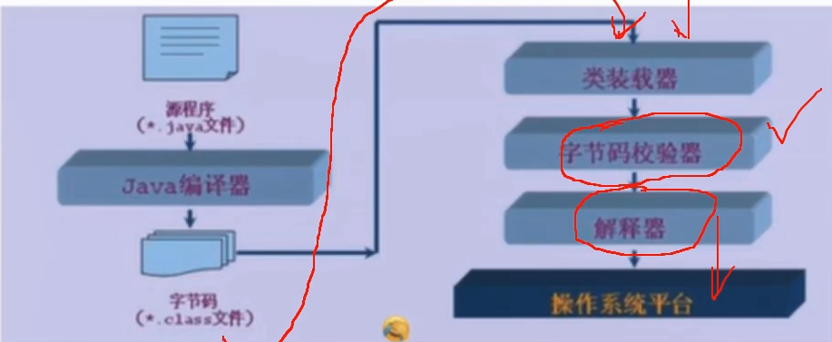
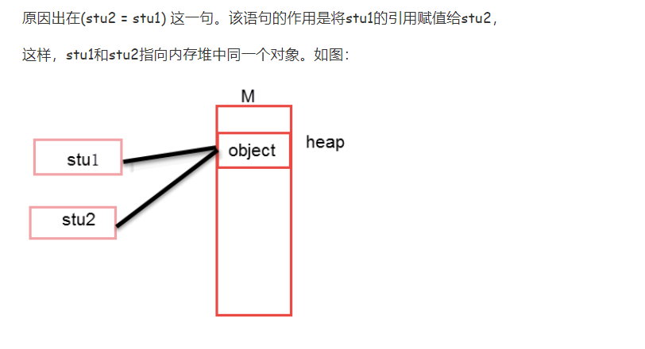
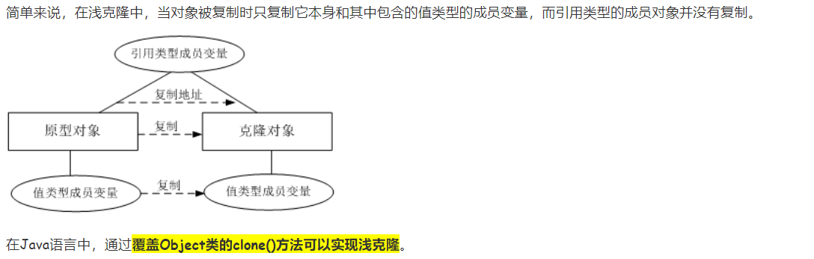
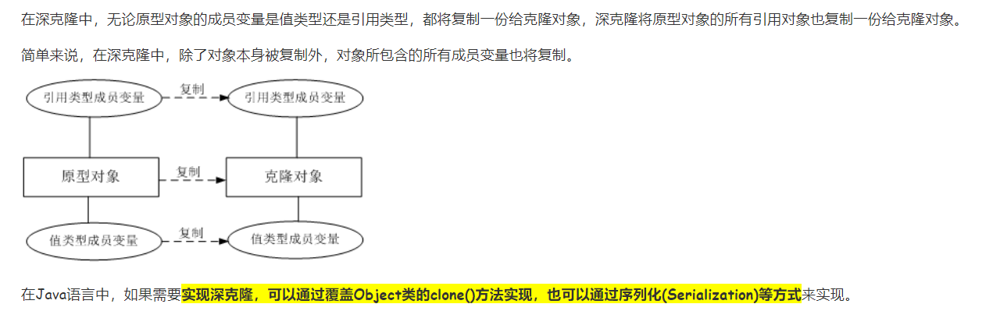

# java常用
## 注意：：：
- 1注意：
    - 1）.普通数据类型里，只有他们的包装类才会有着相应的方法，普通数据类型只是操作一下值
    - 2）.一个java类中，只能有一个public class ，其它的皆是class
- 2.zjz的面向对象的思想：
    - 1).是不是每一个java类都可以看成拥有一套对象？--  是！
        - 对象：对象是类的一个实例，有状态和行为。例如，一条狗是一个对象，它的状态有：颜色、名字、品种；行为有：摇尾巴、叫、吃等。
        - 类：类是一个模板，它描述一类对象的行为和状态
    - 2). 往后见到**类**就可以明白**有一类型对象可以诞生**！！
    - 3). 即便空类，它也有着自己的对象（默认构造器），有着虚拟机中的位置class

## 编译型，解释型
- 编译型：整本书都要再次重新翻译一下 ---操作系统，C语言，c++
- 解释型：走到哪里解释一下，边走边解释---网页，服务器，对于速度要求不高 ---javaScript，python
- java两种都有
    - java-->.class 编译的过程
    - 解释器-->操作系统 解释--
    



## 设计思想
### Is-a Has-a like-a
- Is-a(继承关系)
    - 比如 苹果，橘子，梨都是水果，那么就应该使用继承
- Has-a(从属关系)--聚合
    - 比如 电脑是由 显示器，CPU，硬盘等组成的  -- 那么应该把这些类聚合成电脑类
- like-a(组合关系)
    - 比如空调继承于制冷机，但它同时有加热功能，除湿功能 ---那么它应该继承制冷机，并且实现加热接口


## 修饰符号
- 类中属性、方法用 private 修饰，仅可于当前类访问。


## java输入
- BufferedReader类和InputStreamReader类(略微麻烦)---而且是字符串，需要手动改。。 
    - BufferedReader是javaIO流中的一个字符串、包装类，它必须建立在另一个字符流的基础之上，
    - 但system.in是字节流，需用InputStreamReader将其包装成字符流。
`BufferedReader input = new BufferedReader(new InputStreamReader(System.in));`
      
```

        BufferedReader input = new BufferedReader(new InputStreamReader(System.in));
        String s = null;
        System.out.println("please input:");
        try {
             s  = input.readLine();
        } catch (IOException e) {
            e.printStackTrace();
        }

        System.out.println(s);

```
  

## 怎么调用自己的属性
> 类中定义的
> 
> this代表的是调用这个函数的**对象的引用**,而静态方法是属于类的,不属于对象,静态方法成功加载后,对象还不一定存在(super同理)
> 
> 所以正常操作中区分一下是不是对象就可以知道this了。。
- 没static时调用，bean都是，它们属于对象的
    - 非静态方法 1.this.   --2.直接用 age = xx;3.对象. ---调用----调用
    - 在静态方法中只能 对象调用 1.对象. ---调用

- 有static的属性，此属性只属于本类，，
    - 在任何方法中可以直接1.name1。。。2.类对象. ---调用
    - static方法中不能使用this.name1。 非static中可以使用
- this指向的是当前的对象，调用的时候指向
- this是无法指向的，是默认指向调用它的那个对象

## 方法的调用
- 加static 能直接方法名() 直接使用
- 不加static 对象.调用


## 获取class
- 已知具体的类,通过类的class属性来获取
    - Class clazz = Person.class;
    
- 已知某个对象的实例,调用该实例的getClass()方法获取class对象
    - Class clazz = person.getClass();
    
- 已知道全类名,且该类在类的路径下,可通过Class类的静态方法forName()获取,可能抛出ClassNotFoundException
    - Class clazz = Class.forName("demo.Student");


## 创建对象
- new 一个
- clone 一个
- 反射机制 class创建----动态加载和创建Class 对象
-` A a = (A)Class.forName("pacage.A").newInstance();这和 A a =new A();是一样的效果。`


- 注:如果new了一个对象s1,然后让另一个对象s2直接等于这个s1,那么她两对应的对象为同一值
  - 我们常见的Object a=new Object();Object b;b=a;这种形式的代码复制的是引用，即对象在内存中的地址，a和b对象仍然指向了同一个对象。
    - System.out.println(stu1 == stu2); // true
- 


### 浅克隆(ShallowClone)和深克隆(DeepClone)
- 主要区别在于是否支持引用类型的成员变量的复制
 - 浅克隆
    - 1. 被复制的类需要实现Clonenable接口，该接口为标记接口(不含任何方法)
        - （不实现的话在调用clone方法会抛出CloneNotSupportedException异常)
    - 2. 覆盖clone()方法，访问修饰符设为public。方法中调用super.clone()方法得到需要的复制对象。（native为本地方法)

    


```
public class Student implements Cloneable{
    private String name;
    private int age;
    // 重写克隆方法
    @Override
    public Object clone(){
        Student student = null;
        try{
            student = (Student) super.clone();
        }catch (CloneNotSupportedException e){
            e.printStackTrace();
        }
        return student;
    }


    public String getName() {
        return name;
    }

    public void setName(String name) {
        this.name = name;
    }

    public int getAge() {
        return age;
    }

    public void setAge(int age) {
        this.age = age;
    }
}

public class TestClone {
    public static void main(String[] args) {
        Student st1 = new Student();
        st1.setAge(22);
        st1.setName("zjz");
        Student st2 = (Student)st1.clone();
        System.out.println("学生1:" + st1.getName()); // 学生1:zjz
        System.out.println("学生2:" + st2.getName()); // 学生2:zjz

        st2.setName("hh");
        System.out.println("学生2改:" + st2.getName()); // 学生2改:hh
        System.out.println("学生1:" + st1.getName()); // 学生1:zjz

        System.out.println("st1==st2:"+ (st1==st2)); // st1==st2:false

    }
}


```

- 深克隆


````

package com.TestDemo.cloneTest;

public class TestDeepClone {
    public static void main(String[] args) {
        StudentDeepClone st1 = new StudentDeepClone();
        Address address = new Address();
        address.setAddress("上海");

        st1.setAge(22);
        st1.setName("zjz");

        st1.setAddr(address);
        StudentDeepClone st2 = (StudentDeepClone)st1.clone();
        System.out.println("学生1:" + st1.getName() + st1.getAddr().getAddress()); // 学生1:zjz
        System.out.println("学生2:" + st2.getName() + st2.getAddr().getAddress()); // 学生2:zjz

        st2.setName("hh");
        address.setAddress("西安");
        System.out.println("学生2改:" + st2.getName() + st2.getAddr().getAddress()); // 学生2改:hh
        System.out.println("学生1:" + st1.getName() + st1.getAddr().getAddress()); // 学生1:zjz

        System.out.println("st1==st2:"+ (st1==st2)); // st1==st2:false

    }
}


package com.TestDemo.cloneTest;

public class StudentDeepClone implements Cloneable{
    private String name;
    private int age;
    private Address addr;
    // 重写克隆方法
    @Override
    public Object clone(){
        StudentDeepClone student = null;
        try{
            student = (StudentDeepClone) super.clone(); //浅复制
        }catch (CloneNotSupportedException e){
            e.printStackTrace();
        }
        student.addr = (Address) addr.clone(); // 深度复制
        return student;
    }


    public String getName() {
        return name;
    }

    public void setName(String name) {
        this.name = name;
    }

    public int getAge() {
        return age;
    }

    public void setAge(int age) {
        this.age = age;
    }

    public Address getAddr() {
        return addr;
    }

    public void setAddr(Address addr) {
        this.addr = addr;
    }

}

// 实现深拷贝
class Address implements Cloneable{
    private String address;

    public Object clone(){
        Address address = null;

        try{
            address = (Address) super.clone();
        }catch (CloneNotSupportedException e){
            e.printStackTrace();
        }

        return address;
    }


    public String getAddress() {
        return address;
    }

    public void setAddress(String address) {
        this.address = address;
    }
}


````


## javadoc
- 使用@Documented 表示我们的注解是否要生成在doc中
- Javadoc用于描述类或者方法的作用。Javadoc可以写在类上面和方法上面。
- 写在类上的文档标注一般分为三段：
    - 第一段：概要描述，通常用一句或者一段话简要描述该类的作用，以英文句号作为结束
    - 第二段：详细描述，通常用一段或者多段话来详细描述该类的作用，一般每段话都以英文句号作为结束
    - 第三段：文档标注，用于标注作者、创建时间、参阅类等信息
- @开头被称之为Javadoc文档标记，是JDK定义好的，如@author、@version、@since、@see、@link、@code、@param、@return、@exception、@throws等。
```
 /**
 * Doc comment here for <code>Class</code>
 * @param T type parameter
 * @see Math#sin(double)
 */
```

## 字符串
- 1.java获取字符串长度

`int len = 字符串名.length();`

- 2.产生随机字符：
    ```
    char ch = (char)('A'+Math.random()*('Z'-'A'+1));
    //Math.random()*('Z'-'A'+1)==>(26)产生[0,26)的随机数

    ```
    - Java中有两种方法可以产生随机数：
        - 1.Math.random(X)；//直接使用Math的方法，X指定到哪个数
        - 2.Random r = new Random();int ran1 = r.nextInt(20); //对象使用
    

- 3.字符串转换为其它类型
    - 转换：
        - 对象类的转换是转型成其父类或子类
        - 基础类型的转换是位数变宽或变窄的过程
    - 转换方式：1.直接new对象的方式，2.调用包装类的方法    
    - 换行"\n"
    
      ```
      两种转换结果都一样
      Integer integer = new Integer(str1);//new 对象的方式
      int i = Integer.valueOf(str1); //调用包装类的方法
      
      Double aDouble = new Double(ss);//new 对象的方式
      double value = Double.valueOf(ss.toString());//调用包装类的方法
      ```
- 4.java的parseInt和valueOf
  - 不确定类型就直接valueOf() 确定了为了速度快点parseInt()
     - Integer.parseInt(XXX) // 返回值是int,入参int
     - Integer.valueOf(XXX)返回值是Integer型的.入参int,String.把Integer赋值给int型的话,JRE会自己完成这些工作.
        - Integer是可以使用对象方法的  而int类型就不能和Object类型进行互相转换
     - String Int Double ----都有valueOf方法
        ```   
            String str = "123"; 
            try {
                int a = Integer.parseInt(str);
            } catch (NumberFormatException e) {
                e.printStackTrace();
            }        
          String str = "123";    
          try {          
              int b = Integer.valueOf(str).intValue()          
          } catch (NumberFormatException e) {          
              e.printStackTrace();          
          }
      
        ```
- 字符串反转
  ```
  //字符串转数组再反转---toCharArray
  String longString = "qwertrtytyuiuvdsd";
        char[] ch = longString.toCharArray();
        int chInt =    ch.length;
        System.out.println(longString + "   length: " + chInt);
        for(int i1 = 0;i1 < ch.length/2;i1++){
            char c1= ch[i1];
            ch[i1] = ch[ch.length-i1-1];
            ch[ch.length-i1-1] = c1;
  //字符串转为StringBuffer，然后直接调用方法
  StringBuffer stringBuffer = new StringBuffer(longString);
        StringBuffer rev = stringBuffer.reverse();
  ```


- int占用4字节，32比特，数据范围为-2147483648~2147483647[-2^31~2^31-1]
  - 中文占一个字符，也就是两个字节

  ```
  boolean 布尔型                 1/8 
  byte 字节类型                    1
  char 字符型                       2  一个字符能存储一个中文汉字
  short 短整型                     2
  int 整数类型                      4
  float 浮点类型（单精度）  4
  long 长整形                      8
  double 双精度类型（双精度）  8
  ```


- String
  - Java的String类型有特殊的处理：所有编译期认识的字符串，都会被放到常量池，于是下面的语句：
```
   String a = "s";
   String b = "s";
   a和b并不像其它对象一样有创建的动作，都是直接指向常量池中的"s"，所以你可以得到a==b。而下面的语句：
   String a = new String("s");
   String b = new String("s");
    是分别在Java堆中创建了2个对象，此时a!=b。
```

- 本质上说，对于基本数据类型（整数、字符等），Java的符号==，用于判断二者的值是否相等；
- 对于对象类型，Java的符号==，用于判断两个变量是否是“同一个对象”，equals()方法才是用于判断两个对象是否相等。

- this关键字的用法
    - 1、访问成员变量，区分成员变量和局部变量
    - 2、访问成员方法
    - 3、访问构造方法
    - 4、返回对当前对象的引用
    - 5、将对当前对象的引用作为参数传递给其他方法
    - "this();"访问构造方法必须放在构造方法的第一行
    - 注:this 不能出现在static中

-Lambda 表达式（先读再写）
  - 1).JDK8 的一个新特性，可以取代大部分的匿名内部类，写出更优雅的 Java 代码
      - a.尤其在集合的遍历和其他集合操作中，可以极大地优化代码结构。
      - b.jdk 8 中有另一个新特性：default， 被 default 修饰的方法会有默认实现，不是必须被实现的方法，所以不影响 Lambda 表达式的使用
      - c.@FunctionalInterface#
         - 修饰函数式接口的，要求接口中的抽象方法只有一个。 这个注解往往会和 lambda 表达式一起出现。
  - 2).（怎么读？）语法形式为 () -> {}，其中 () 用来描述参数列表，{} 用来描述方法体，-> 为 lambda运算符 ，读作(goes to)
      - 简化参数类型
        - 简化参数类型，可以不写参数类型，但是**必须所有参数**都不写
      - 简化参数小括号()  
         - 如果只有一个参数则可以省略参数小括号 
      - 简化方法体大括号{}
        - 简化方法体大括号，如果方法条只有一条语句，则可以省略方法体大括号
        - 如果方法体只有一条语句，并且是 return 语句，则可以省略方法体大括号
  - 3).应用
      - 一提到匿名内部类我们就应该想到可以使用 lambda 表达式来简化创建过程
        - a.线程创建：以往都是通过创建 Thread 对象，然后通过匿名内部类重写 run() 方法
        - b.遍历集合,集合操作


> 长度
    - 1.java 中的length 属性是针对数组说的,比如说你声明了一个数组,想知道这个数组的长度则用到了length 这个属性.
    - 2.java 中的length()方法是针对字 符串String说的,如果想看这个字符串的长度则用到 length()这个方法. 
    - 3.java 中的size()方法是针对泛型集合说的,如果想看这个泛型有多少个元素,就调用此方法来查看!


## 关于IS-a（继承）
- 总：
  - 子类自己new的对象可以用父类的东西，自己的东西
  - **父类的引用指向子类**，，，只能用父类的--不能用子类的
  
    ```
            
            public class TestAbstract {
            
                public static void main(String[] args) {
                    Son son = new Son();
            
                    // son可使用的方法及变量
                    son.f();
                    son.g();
                    System.out.println(son.j);
                    System.out.println(son.i);
            
                    /*
                    * son就是子类对象的实例，不仅能够方位自己的属性和方法，也能访问父类的属性和方法。
                    * 诸如son.i,son.j.son.fn()都是合法的。此时son.f()是Son中的f()
                    * */
            
            
            
            
            
                    Father FSon = new Son();
            
                    FSon.f();
            //        FSon.j  // 编译报错
            //        FSon.g(); // 编译报错
                    System.out.println(FSon.i);
            
                    /*
                    *
                    * 虽然是用的Son的构造函数，但经过upcast，
                    *
                    * 成为父类对象的实例，不能访问子类的属性和方法。
                    *
                    * FSon.i,FSon.f()是合法的，而FSon.j,FSon.g()是非法的。此时访问a.f()是访问B中的f();
                    * */
            
                }
            
            }
            
            
            class Father{
                int i = 1;
                void f(){
                    System.out.println("Is father");
                }
            }
            
            
            class Son extends Father{
                int i = 3;
                int j = 88;
                @Override
                void f() {
                    System.out.println("Son F()---");
                }
            
                void g(){
                    System.out.println("Son G()---");
                }
            }
    
    
    ```


## 关于Interface
- 与继承关系类似，接口与实现类之间存在多态性：
  - 多态的三个条件：继承，重写，父类引用指向子类对象；
  - 由于Java中没有多继承，一个类只能有一个父类。一个父类可以有多个子类，而在子类里可以重写父类的方法；
  - 用接口可以实现多继承，一个类或是可以同时实现多个接口；
  - 一般而言，接口有利于代码的扩展，而继承则有利于代码功能的修改


## Java方法--两种返回方式：
- 1. return 语句。
- 2. 抛出异常。


## Object类的方法
- Object()默认构造方法。
  clone() 创建并返回此对象的一个副本。
  equals(Object obj) 指示某个其他对象是否与此对象“相等”。finalize()当垃圾回收器确定不存在对该对象的更多引用时，由对象的垃圾回收器调用此方法。getClass()返回一个对象的运行时类。hashCode()返回该对象的哈希码值。 notify()唤醒在此对象监视器上等待的单个线程。 notifyAll()唤醒在此对象监视器上等待的所有线程。toString()返回该对象的字符串表示。wait()导致当前的线程等待，直到其他线程调用此对象的 notify() 方法或 notifyAll() 方法。wait(long timeout)导致当前的线程等待，直到其他线程调用此对象的 notify() 方法或 notifyAll() 方法，或者超过指定的时间量。wait(long timeout, int nanos) 导致当前的线程等待，直到其他线程调用此对象的 notify() 方法或 notifyAll() 方法，或者其他某个线程中断当前线程，或者已超过某个实际时间量。

