# JVM

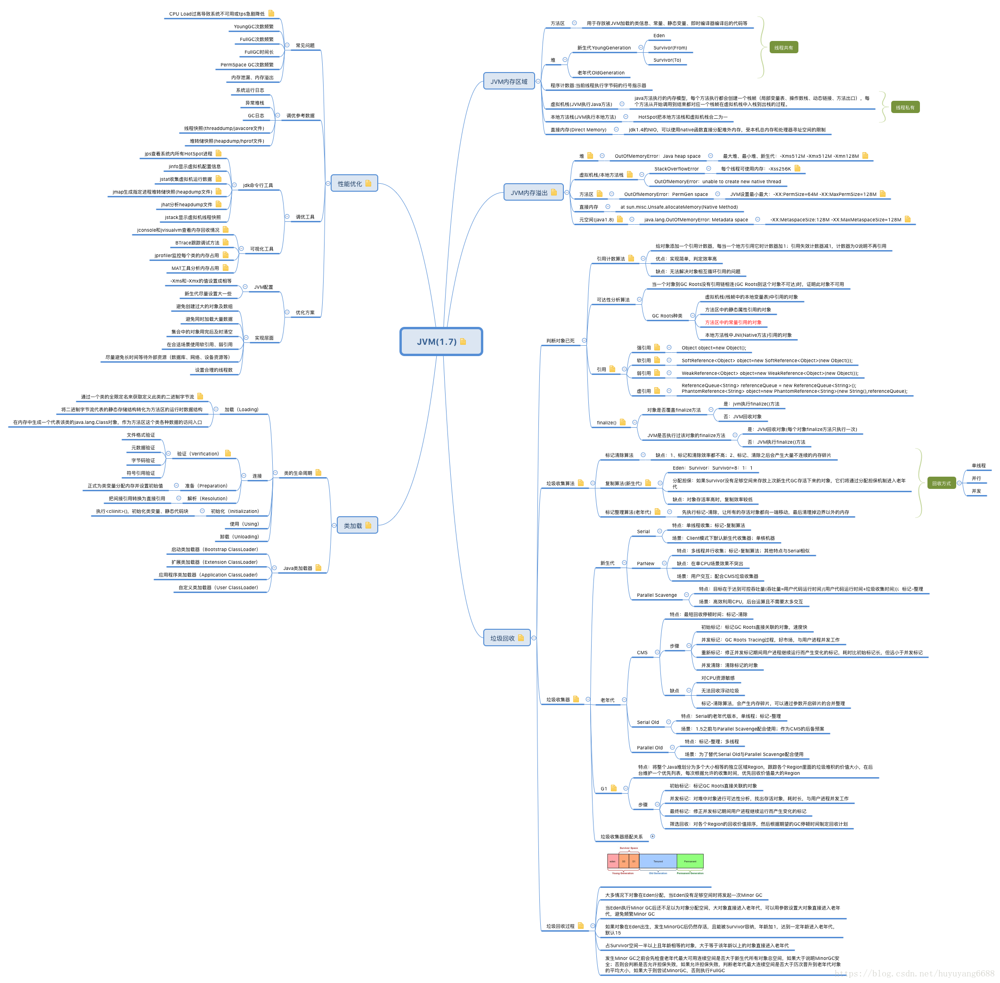
## JVM探究
- 1.请你谈谈JVM的理解？java8虚拟机和之前的变化更新？
- 2.什么是OOM，什么是栈溢出StackOverFlowError？怎么分析？
    - Out Of Memory 内存用完了 源于java.lang.OutOfMemoryError
    - 内存泄露：申请使用完的内存没有释放，导致虚拟机不能再次使用该内存，此时这段内存就泄露了，因为申请者不用了，而又不能被虚拟机分配给别人用。
    - 内存溢出：申请的内存超出了JVM能提供的内存大小，此时称之为溢出。
- 3.JVM的常见调优参数有哪些？
- 4.内存快照如何抓取，怎么分析Dump文件?知道吗？
    - Dump文件是进程的内存镜像，可以把程序的执行状态通过调试器保存到dump文件中。
    - 主要是用来在系统中出现异常或者崩溃的时候来生成dump文件，然后用调试器进行调试，这样就可以把生产环境中的dmp文件拷贝到自己的开发机上，调试就可以找到程序出错的位置。
- 5.谈谈JVM中，类加载器你认识吗？  
    - rt-jar ext application
    
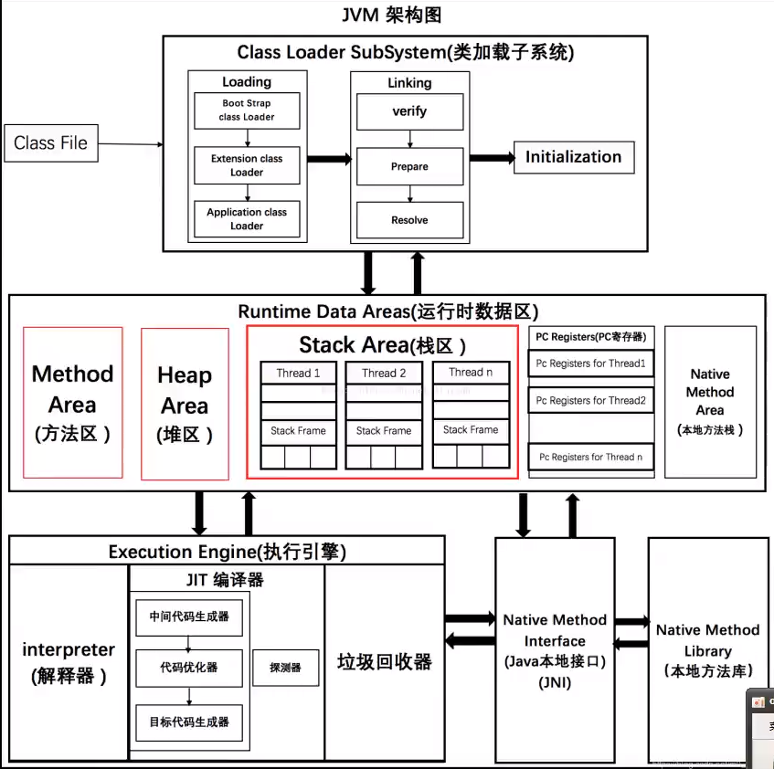

- 1.JVM的位置
  
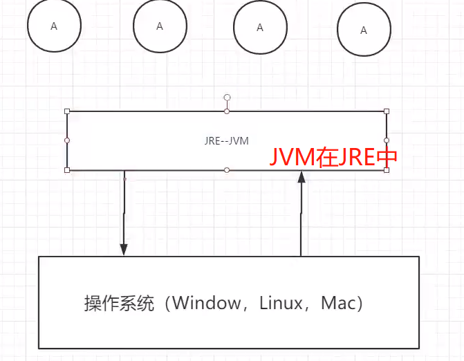

- 2.JVM体系结构
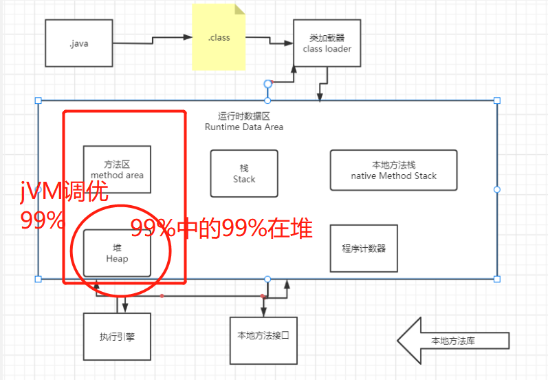
- 3.类加载器
  - 作用：加载Class文件，new Student();
  - 类是一个模板是抽象的，而对象是具体的
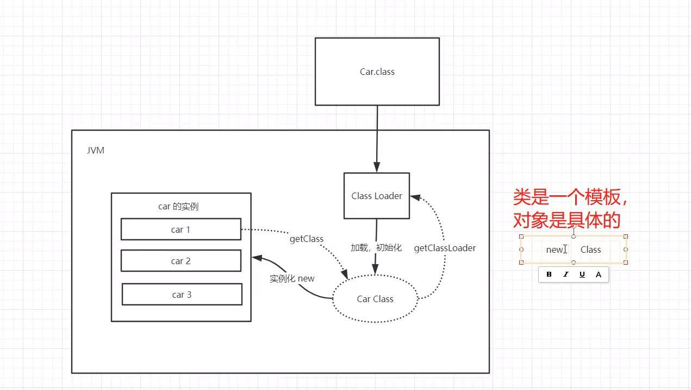
  - （1）.虚拟机自带加载器
  - （2）.启动类（根）加载器
      - rt.jar java的核心都在里面
  - （3）.扩展类加载器
  - （4）.应用程序（系统类）加载器
- 4.双亲委托机制（类加载器）-----自定义String 
  - （1）.类加载器收到类加载请求！  - - （大部分自己编的都在AppClassLoader）
  - （2）.将这个请求向上委托给父类加载器去完成，一直向上委托，直到启动类加载器
  - （3）.启动类加载器检查是否能够加载当前这个类，能加载就结束，使用当前加载器，否则，抛出异常，通知子加载器进行加载
  - （4）.重复步骤3
  - （5）.都找不到ClassNotFound
  - ```
        public class String {
        //双亲委托机制 ：安全
        //1.APP -->EXC--->Boot(最终执行 )
        //Boot里没有--->EXC里没有--->App
    
        public String toString(){
            return "hello";
        }
    
        public static void main(String[] args) {
            String s = new String();
            s.toString();
            }
    
        }
   ```
  
- 5.沙箱安全机制
    - Java安全模型的核心就是Java沙箱（sandbox），什么是沙箱？沙箱是一个限制程序运行的环境。 
    - 沙箱机制就是将 Java 代码限定在虚拟机(JVM)特定的运行范围中，并且严格限制代码对本地系统资源访问，通过这样的措施来保证对代码的有效隔离，防止对本地系统造成破坏。
    - 沙箱主要限制系统资源访问，那系统资源包括什么？——CPU、内存、文件系统、网络。不同级别的沙箱对这些资源访问的限制也可以不一样。
  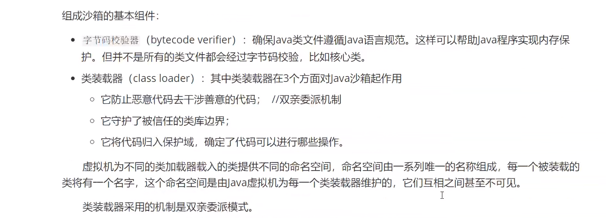
- 6.Native
    - 带了native关键字，说明是在调用c语言库
    - 会进入本地方法栈
    - 调用本地方法本地接口 JNI（本地方法接口）
    - JNI 扩展java类的使用，融合不同的编程语言为java所用。
    - 他在内存中专门开辟了一块标记区域：Native Method Stack，登记native方法
    - 在最终执行的时候，加载本地方法库中的方法通过JNI
- 7.PC寄存器
    - 程序计数器  （有序不乱）
- 8.方法区
    - 共享的
    - 所有线程共享的所有字段和方法字节码，以及一些特殊的方法，构造函数，接口都在这定义
    - 类的信息，普通的常量静态变量编译后的
  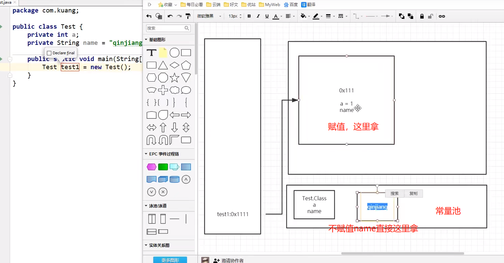
      
## 静态变量，常量（final），类信息（构造方法，接口定义），运行时的常量存在方法区。但是，实例化变量存在堆内存中，与方法区无关。

- 9.栈
    - （1）栈：数据结构
      - a.栈：先进后出，后进先出：桶   ---》喝多了吐
      - b.队列：先进先出:(FIFO：First Input First Output) ---》吃多了拉
      - c.？？？为啥main先先执行，最后再结束
      - e.栈：栈内存，主管程序的运行，生命周期和线程同步
      - f.线程结束，栈内存也就释放了，对于栈来说，不存在垃圾回收机制
      - g.一旦线程结束，栈就Over了。
    - （2）栈：八大基本类型+对象引用+实例的方法
    - （3）栈运行原理：栈帧
  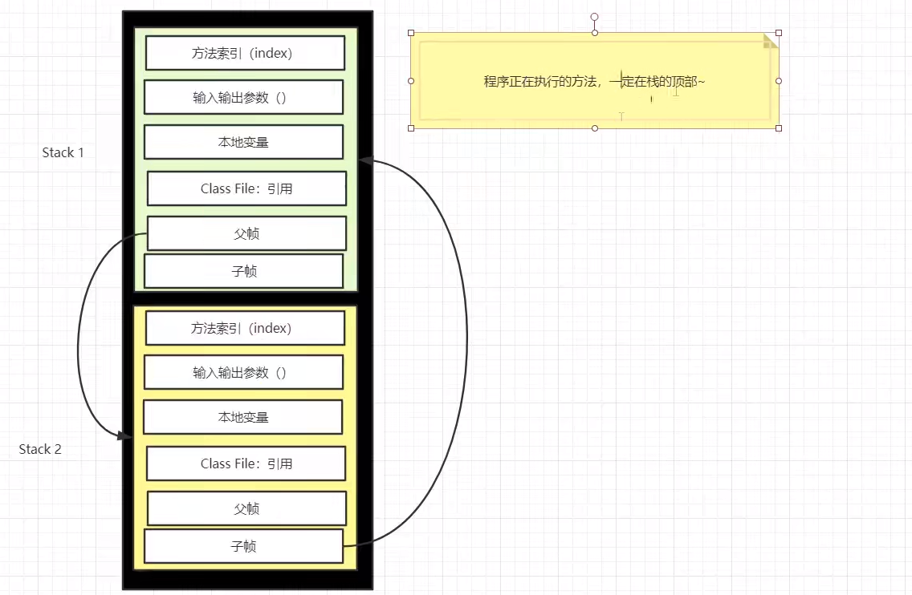
      
    - （4）栈满了，就会错误，StackOverflowError 
    - （5）栈，堆，方法区
  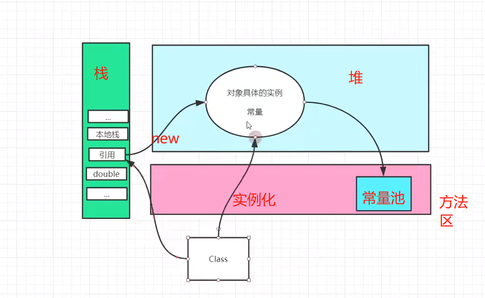
      
- 10.三种JVM
    - Sun公司 HotSpot `Java HotSpot(TM) Client VM (build 24.79-b02, mixed mode, sharing)`
    - BEA JRovkit
    - IBM j9 vm
  - 我们都是HotSpot
  
- 11.堆
    - （1）Heap 一个JVM只有一个堆内存，堆内存的大小是可以调节的
    - （2）类加载器读取到类文件后，一般把什么东西放在堆中？类，方法，常量，变量~保存我们引用类型的真实对象：
    - （3）堆内存还要细分三个区域
      - 新手区（伊甸园区）-Eden Space   ---轻量级的垃圾回收（轻GC）
      - 养老区                        ---重量级的垃圾回收（重GC-FULL GC）
      - 永久区  -- 存储区
  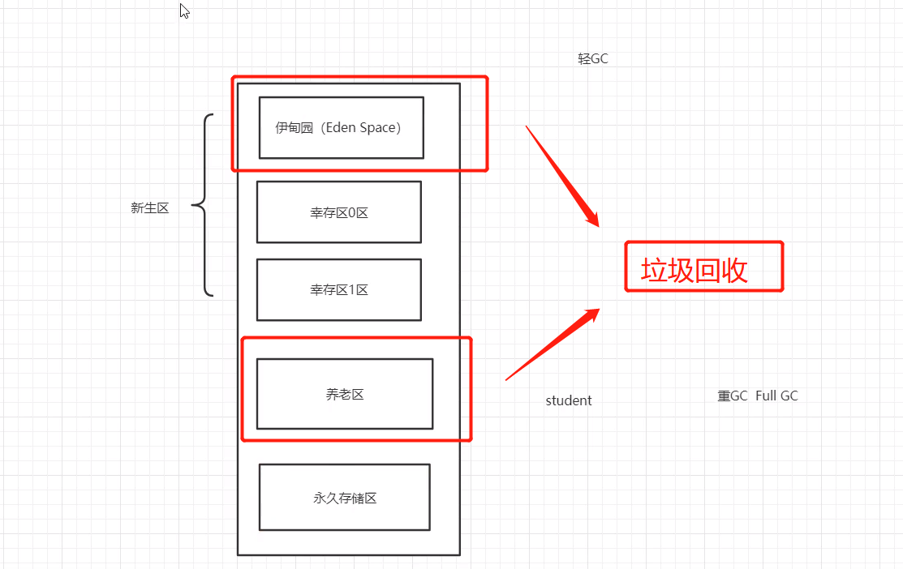
      - 垃圾回收主要在伊甸园区和养老区
    - （4）堆溢出OOM
  


## OOM的处理
- 1.尝试将堆内存调大add VM option
  - //-Xms1024m -Xmx1024m -XX:+PrintGCDetails
  - -Xms 设置初始内存分配大小（默认/164） 
  - -Xmx 设置最大分配内存(默认1/4) 
  - -XX:+PrintGCDetails 打印GC的清理信息  
  - -XX:+HeapDumpOnOutOfMemoryError oom的Dump 
- 2.分析内存，看哪里出错了（专业工具）内存快照工具MAT，Jprofiler（idea插件里安装，百度下载）
    - MAT，Jprofiler  分析Dump内存文件，快速定位内存泄露   获得堆中的对象
    - 获得大的对象           
- Dubug，一行行分析代码。
  
- Jprofiler的使用，首先下载idea中的Jprofiler插件
   - 下载网页中的Jprofiler的应用 
   - -Xms1m -Xmx8m -XX:+HeapDumpOnOutOfMemoryError
   -然后会生成一个文件，打开，然后在左栏找下使用量最大的，找到了---
     
-  制造OOM操作 
   - 想法:堆溢出,也就是将堆中的元素不断增加
   - ```
        //java.lang.OutOfMemoryError OOM操作
        public class TestOOM {
        public static void main(String[] args) {
        String s = "CESHICEHSIHCIEHSICHEISHCISHCIHCEIHCIEHCIEHCIEHCIEH";
        while(true){
        s = s + s;
        }
        
            }
        }

     ```  
- 获取JVM的内存  
      ```

        public class JvmMemoryTest {
        public static void main(String[] args) {
            //-Xms1024m -Xmx1024m -XX:+PrintGCDetails
            long l1 = Runtime.getRuntime().maxMemory(); //最大内存
            long l2 = Runtime.getRuntime().totalMemory();//初始化内存
        
               System.out.println("max"+ l1 + "Byte  " + (l1/(double)1024/1024) + "MB" );
               System.out.println("total"+ l2 + "Byte  " + (l2/(double)1024/1024) + "MB" );
        
            }
        }
      
        //控制台输出：
        /*max1029177344Byte  981.5MB
        total1029177344Byte  981.5MB
        Heap
        PSYoungGen      total 305664K, used 20971K [0x00000000eab00000, 0x0000000100000000, 0x0000000100000000)
        eden space 262144K, 8% used [0x00000000eab00000,0x00000000ebf7afb8,0x00000000fab00000)
        from space 43520K, 0% used [0x00000000fd580000,0x00000000fd580000,0x0000000100000000)
        to   space 43520K, 0% used [0x00000000fab00000,0x00000000fab00000,0x00000000fd580000)
        ParOldGen       total 699392K, used 0K [0x00000000c0000000, 0x00000000eab00000, 0x00000000eab00000)
        object space 699392K, 0% used [0x00000000c0000000,0x00000000c0000000,0x00000000eab00000)
        Metaspace       used 3509K, capacity 4500K, committed 4864K, reserved 1056768K
        class space    used 389K, capacity 392K, committed 512K, reserved 1048576K*/

      ```


  - jdk8以后永久区改为原空间
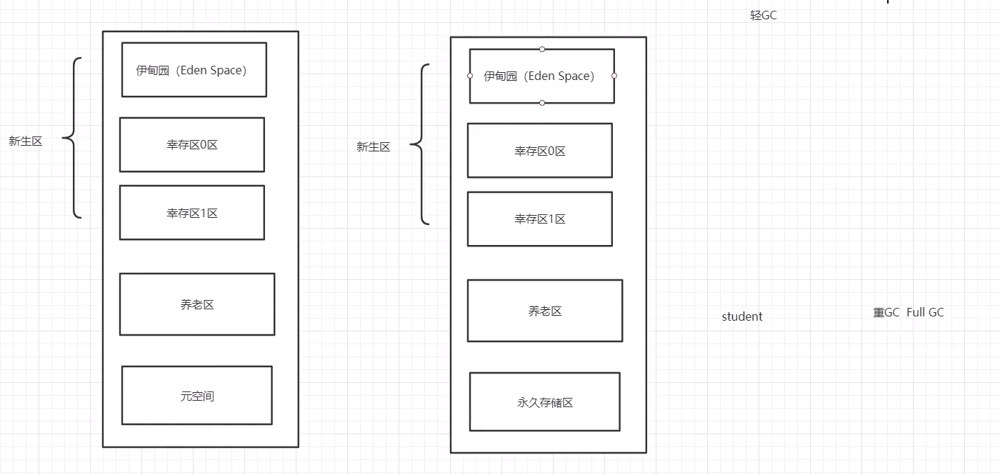

- 12.新生区，老年区
    - 新生区 诞生和成长的地方，甚至死亡
    - 伊甸园区；所有对象都是在伊甸园区new出来的
    - 幸存者区（0，1）
  - 真理：99%的对象都是临时对象！
- 13.永久区
  - (1)常驻内存的，用来存放JDK自带的Class对象，Interface元数据，存储java运行的环境或类信息
  - (2)不存在垃圾回收--关闭Vm虚拟机会干释放这个区域的内存  
  - (3)常量池在java用于保存在编译期已确定的，已编译的class文件中的一份数据。它包括了关于类，方法，接口等中的常量，也包括字符串常量  
    - jdk1.6之前：永久代，常量池在**方法区**中
    - jdk1.7 ：永久代，提出去永久代，常量池在**堆**中
    - jdk1.8 ：无永久代，常量池在**元空间**  -- 元空间--逻辑上存在，物理上不存在
  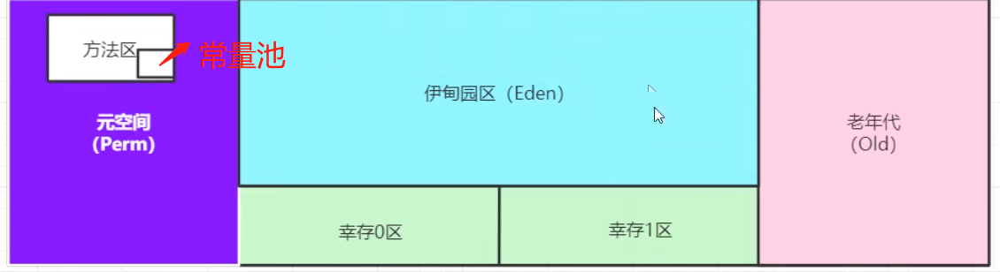
      


- 14.堆内存调优
- 15.GC垃圾回收器
    - 1.常用算法
    
- 16.JMM

## jvm 参数介绍：
- -XX:+TraceClassLoading,用于追踪类的加载信息并打印出来。
  - 所有的参数都是： 
  - -XX:+<option> ， 表示开启option选项 
  - -XX:-<option> ， 表示关闭option选项 
  - -XX:+<option>=<value> 表示将option选项的值设置为value
- 举例:-XX:+PrintGCDetails


## Java 方法有两种返回方式：
  - 1. return 语句。
  - 2. 抛出异常。
## 本地方法栈 Native Method Stack

## 栈溢出
- 两对象互相无限调用
  ```
    //方法a调用b，b再调用a
    public class TestStackOverflow {
        public static void main(String[] args) {
            new TestStackOverflow().a();    
        }
        public void a(){
           b();
        }
    
        public void b(){
            a();
        }
    
    }
  
  ```

- 类加载过程

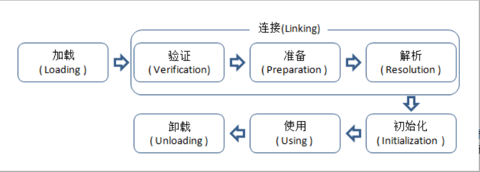
 


## 类加载器
  
- 常量池的概念
  - 如果提前初始化**确定**的常量,那么到时常量直接给调用类
  - 如果常量是未确定的,那么其值就不会被放到调用类的常量池,到时调用时,调用父类,再调用子类

  ```
  
      public class LoadingTest {
          public static void main(String[] args) {
              System.out.println(MyParentTest.str);  // 本质上，调用类并没有直接用用到定义常量的类，因此并不会触发定义常量的类的初始化
                                                      // 这里指的是将常量存放到了MyTest2的常量池中，之后MyTest2与MyParent2就没有任何关系 了。
              
              System.out.println(MyParentTest1.str);
      
          }
      }
      
      
      class MyParentTest{
          // 常量在编译阶段会存入到调用这个常量的方法所在的类的常量池中(将常量存放到了LoadingTest的常量池)
          public static final String str = "hello word";
          static {
              System.out.println("MyParentTest  static block");  // 这一行能输出吗？不会
          }
      }
      
      
      
      class MyParentTest1{
          public static final String str = UUID.randomUUID().toString();  // 当一个常量的值并非编译期间可以确定的，
                                                                          // 那么其值就不会被放到调用类的常量池中，
          // 程序运行时，会导致主动使用这个常量所在的类，显然就会导致这个类被初始化
          static {
              System.out.println("Myparent3 static block"); // 这一行能输出吗？会
      
               }
      }
  
  ```

- 分类
  - 有两种类型的类加载器
    - 1、Java虚拟机自带的加载器
      - ①根类加载器（BootStrap）(BootClassLoader) sun.boot.class.path （加载系统的包，包含jdk核
        心库里的类）
      - ②扩展类加载器（Extension）（ExtClassLoader） java.ext.dirs（加载扩展jar包中的类）
      - ③系统（应用）类加载器（System）(AppClassLoader) java.class.path（加载你编写的类，编译后的类）
    - 2、用户自定义的类加载器
      - Java.long.ClassLoader的子类（继承），用户可以定制类的加载方式

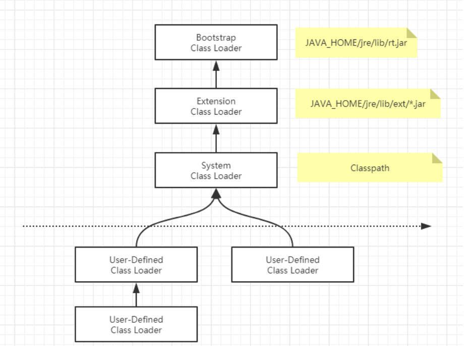


- 双亲委派机制的工作原理：一层一层的 让父类去加载，最顶层父类不能加载往下数，依次类推。
  - 1. 类加载器收到类加载的请求；
    - public class ClassLoaderDemo01 { public static void main(String[] args) { Object object = new Object(); ClassLoaderDemo01 demo01 = new ClassLoaderDemo01(); System.out.println(object.getClass().getClassLoader()); System.out.println(demo01.getClass().getClassLoader()); System.out.println(demo01.getClass().getClassLoader().getParent()); System.out.println(demo01.getClass().getClassLoader().getParent().getParent ()); /*结果：null sun.misc.Launcher$AppClassLoader@18b4aac2 sun.misc.Launcher$ExtClassLoader@1b6d3586 null **/ } } 12345678910111213141516171819
  - 2. 把这个请求委托给父加载器去完成，一直向上委托，直到启动类加载器；
  - 3. 启动器加载器检查能不能加载（使用findClass()方法），能就加载（结束）；否则，抛出异常，通知子加载器进行加载。
  - 4. 重复步骤三；
  

- JNI：Java Native Interface （Java本地方法接口）


## 方法区
- JDK8 彻底将永久代移除出 HotSpot JVM，将其原有的数据迁移至 Java Heap 或 Native
  Heap（Metaspace），取代它的是另一个内存区域被称为元空间（Metaspace）。
  
- 元空间（Metaspace）：元空间是方法区的在 HotSpot JVM 中的实现，方法区主要用于存储类信息、常
  量池、方法数据、方法代码、符号引用等。元空间的本质和永久代类似，都是对 JVM 规范中方法区的实
  现。不过元空间与永久代之间最大的区别在于：元空间并不在虚拟机中，而是使用本地内存。
  
- 可以通过 -XX:MetaspaceSize 和 -XX:MaxMetaspaceSize 配置内存大小


## 常量池
> 常量池中存储编译器生成的各种字面量和符号引用。
- `字面量`就是Java中常量的意思。比如文本字符串，final修饰的常量等。
- `方法引用`则包括类和接口的全限定名，方法名和描述符，字段名和描述符等。

> 常量池有什么用 ？
- 优点：常量池`避免了频繁的创建和销毁对象`而影响系统性能，其实现了`对象的共享`。
  - 如:Integer 常量池（缓存池），和字符串常量池
  
> Integer常量池：
-  == :::基本数据类型比较的是数值，而引用数据类型比较的是内存地址。
- ```
    public void TestIntegerCache()
    {
        public static void main(String[] args)
        {
            
            Integer i1 = new Integer(66);  // 直接在堆中创建对象
            Integer i2 = new integer(66);  // 直接在堆中创建对象
            Integer i3 = 66;  // 变量引用指向常量池中
            Integer i4 = 66;  // 变量引用指向常量池中
            Integer i5 = 150;
            Integer i6 = 150;
            System.out.println(i1 == i2);//false
            System.out.println(i3 == i4);//true
            System.out.println(i5 == i6);//false
        }
        
    }


  ```
  
- i1 和 i2 使用 new 关键字，每 new 一次都会在堆上创建一个对象，所以 i1 == i2 为 false。
- i3 == i4 为什么是 true 呢？Integer i3 = 66 实际上有一步**装箱**的操作，即将 int 型的 66 装箱成 Integer，通过 Integer 的 valueOf 方法。
  ```
    // Integer 的 valueOf 方法很简单，
    // 它判断变量是否在 IntegerCache 的最小值（-128）和最大值（127）之间，
    // 如果在，则`返回常量池中`的内容，否则 new 一个 Integer 对象。
    public static Integer valueOf(int i) {
            if (i >= IntegerCache.low && i <= IntegerCache.high)
                return IntegerCache.cache[i + (-IntegerCache.low)];
            return new Integer(i);
        }
  
  ```
  
- IntegerCache 是 Integer的静态内部类，作用就是将 [-128,127] 之间的数“缓存”在 IntegerCache 类的 cache 数组中，
- valueOf 方法就是调用常量池的 cache 数组，
- 不过是将 i3、i4 `变量引用指向常量池中`，没有真正的创建对象。而new Integer(i)则是直接在堆中创建对象。


> String常量池：
- String 是由**final**修饰的类，是不可以被继承的。
- 通常有两种方式来创建对象。**new(存放在堆中)** 和 **直接赋值**
  - 如:String str = "abcd";
  - 直接赋值:先在`栈上`创建一个 String 类的对象`引用变量` str，
   - 然后通过符号引用去字符串常量池中**找**有没有 “abcd”，如果没有，则将“abcd”`存放到字符串常量池`中，并将栈上的 str `变量引用指向常量池`中的“abcd”。
   - 如果常量池中已经有“abcd”了，则不会再常量池中创建“abcd”，而是直接将 str 引用指向常量池中的“abcd”。
  
> 关于字符串 + 号连接问题：  -- 此时==比较是true
- 程序编译期，JVM就会将其优化为 + 号连接后的值。所以在`编译期其字符串常量的值就确定了`
> 关于字符串引用 + 号连接问题： ---此时==比较是false 本质：new了一个StringBuilder
- 对于字符串**引用**的 + 号连接问题，由于字符串引用在编译期是`无法确定`下来的，在程序的`运行期动态分配并创建新的地址存储对象`。
- new 了一个`StringBuilder对象`，然后使用append方法优化了 + 操作符。`new 在堆上创建对象`


- 在 for 循环中使用 + 连接字符串，每循环一次，就会新建 StringBuilder 对象，append 后就“抛弃”了它。
  如果我们在循环外创建StringBuilder对象，然后在循环中使用 append 方法追加字符串，就可以节省 n-1 次创建和销毁对象的时间。
  所以**在循环中连接字符串**，一般使用 StringBuilder 或者 StringBuffer，而**不是使用 + 号操作**。


> 使用final修饰的字符串
- final 修饰的变量是一个常量，编译期就能确定其值。所以 str1 + "b"就等同于 "a" + "b"，所以结果是 true。

> String对象的intern方法。
  ```
    public static void main(String[] args){
            String s = "ab";
            String s1 = "a";
            String s2 = "b";
            String s3 = s1 + s2;
            System.out.println(s3 == s);//false
            System.out.println(s3.intern() == s);//true
        }
  
  ```
- 调用 intern 方法，返回的是s3的内容（ab）在常量池中的地址值


## 栈（Stack）
- 栈：后进先出 / 先进后出
- 队列：先进先出（FIFO : First Input First Output）
- 栈管理程序运行
  - 存储一些**基本类型的值**、**对象的引用**、**方法**等。
  
- 栈的优势是，存取速度比堆要快，仅次于寄存器，栈数据可以共享。
 
- 说明：
  - 1、栈也叫栈内存，主管Java程序的运行，是在线程创建时创建，它的生命期是跟随线程的生命期，线程结束栈内存也就释放。
  - 2、对于栈来说不存在垃圾回收问题，只要线程一旦结束，该栈就Over，生命周期和线程一致，是线程私有的。
  - 3、方法自己调自己就会导致栈溢出（递归死循环测试）
  


## 堆（Heap）
- Java7之前
 - Heap 堆，一个JVM实例只存在一个堆内存，堆内存的大小是可以调节的，**类加载器**读取了类文件后，需
    要把**类，方法，常变量**放到堆内存中，保存所有引用类型的真实信息，以方便执行器执行，堆内存分为
    三部分：
    - 新生区 Young Generation Space Young/New
    - 养老区 Tenure generation space Old/Tenure
    - 永久区 Permanent Space Perm
 - 堆内存逻辑上分为三部分：新生，养老，永久（元空间 : JDK8 以后名称）

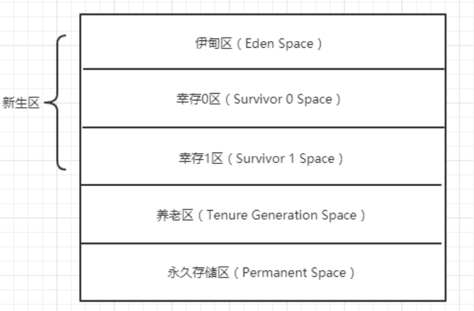

- **GC垃圾回收**主要是在 新生区和养老区，又分为 轻GC 和 重GC，
- 新生区
 - 新生区是**类**诞生，成长，消亡的区域，一个类在这里产生，应用，最后被垃圾回收器收集，结束生命。
 - 新生区又分为两部分：伊甸区（Eden Space）和幸存者区（Survivor Space），所有的类都是在伊甸区
   被new出来的，幸存区有两个：0区 和 1区，当伊甸园的空间用完时，程序又需要创建对象，JVM的垃圾
   回收器将对伊甸园区进行垃圾回收（Minor GC）。
   

- OOM,java heap space异常  ，说明Java虚拟机的堆内存不够，原因如下：
  - 1、Java虚拟机的堆内存设置不够，可以通过参数 -Xms（初始值大小），-Xmx（最大大小）来调整。
  - 2、代码中创建了大量大对象，并且长时间不能被垃圾收集器收集（存在被引用）或者死循环


- 永久区（Perm）
  - 永久存储区是一个常驻内存区域，用于存放JDK自身所携带的Class，Interface的元数据，也就是说它存
    储的是运行环境必须的类信息，被装载进此区域的数据是不会被垃圾回收器回收掉的，关闭JVM才会释
    放此区域所占用的内存。

- 实际而言，方法区（Method Area）和堆一样，是各个线程共享的内存区域，它用于存储虚拟机加载
  的：类信息+普通常量+静态常量+编译器编译后的代码，虽然JVM规范将方法区描述为堆的一个逻辑部
  分，但它却还有一个别名，叫做Non-Heap（非堆），目的就是要和堆分开。
  
- 常量池（Constant Pool）是方法区的一部分，Class文件除了有类的版本，字段，方法，接口描述信息
  外，还有一项信息就是常量池，这部分内容将在类加载后进入方法区的运行时常量池中存放！
  


### 堆内存调优
-
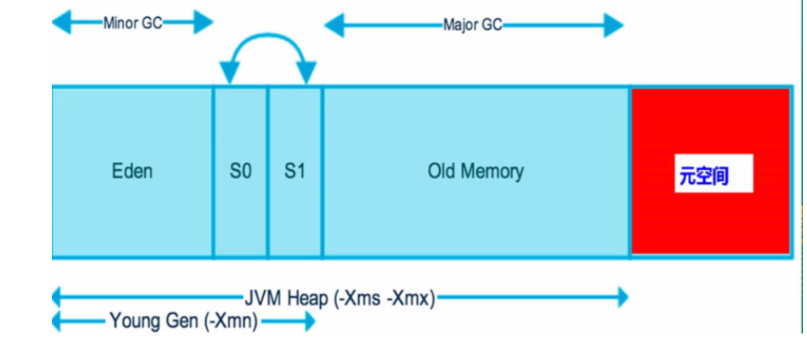


- -Xms ：设置初始分配大小，默认为物理内存的 “1/64”
- -Xmx ：最大分配内存，默认为物理内存的 “1/4”
- -XX:+PrintGCDetails ：输出详细的GC处理日志

- Runtime.getRuntime().maxMemory(); //返回Java虚拟机试图使用的最大内存量 字节
- Runtime.getRuntime().totalMemory(); // 返回Java虚拟机中的内存总量 字节

- Xms1024m -Xmx1024m -XX:+PrintGCDetails 调为1024


### GC
> GC详情
- 记住GC口诀： 分代收集算法
  - 次数频繁Young区，次数较少Old区，基本不动Perm（永久区）区
  - 大部分时候回收的都是指新生代
  
- 因此GC按照回收的区域又分了两种类型，一种是普通的GC（minor GC），一种是全局GC （major GC or Full GC）
  - 普通GC：只针对新生代区域的GC
  - 全局GC：针对老年代的GC，偶尔伴随对新生代的GC以及对永久代的GC

- GC面试题
  - 1、JVM内存模型以及分区，需要详细到每个区放什么
  - 2、堆里面的分区：Eden，Survival from to，老年代，各自的特点。
  - 3、GC的三种收集方法：`标记清除`，`标记整理`，`复制算法`,`引用计数器`的原理与特点，分别用在什么地方？
  - 4、Minor GC 与 Full GC 分别在什么时候发生?
  - 很多的问题其实很简单，只是大家没有去研究而已，下面我们来聊聊几种垃圾回收方法！
   

### GC四大算法
> 引用计数法 说明：了解即可！
- 每个对象有一个引用计数器，当对象被`引用一次则计数器加1`，当对象引用`失效一次，则计数器减1`，对
    于计数器为0的对象意味着是`垃圾对象`，可以被**GC回收**。
  
- 目前虚拟机基本都是采用可达性算法，从GC Roots 作为起点开始搜索，那么整个连通图中的对象边都是
    活对象，对于GC Roots 无法到达的对象变成了垃圾回收对象，随时可被GC回收。
    
> 复制算法（Copying）
> 谁空谁是to
- 当Eden有元素进来时就进null的地方,此时from和to两个都是1,于是就得合并,为0的那个是to,他俩本质就是不停的交换
- 年轻代中使用的是Minor GC，采用的就是复制算法（Copying）
- 一个对象经历了15次GC,就能进入养老区
    
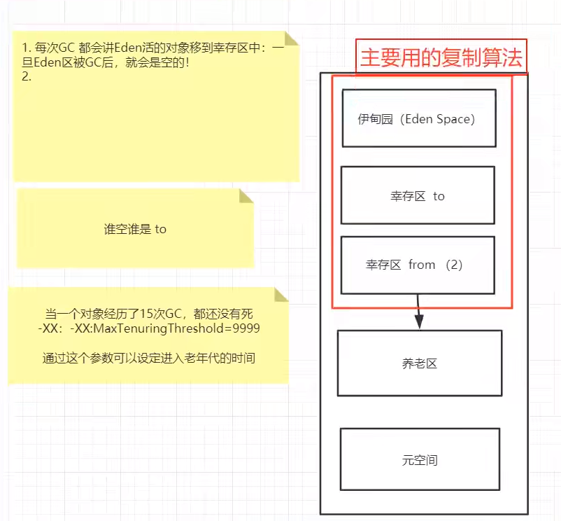

- Minor GC 会把Eden中的所有活的对象都移到Survivor区域中，如果Survivor区中放不下，那么剩下的
  活的对象就被移动到Old generation中，也就是说，一旦收集后，Eden就是变成空的了
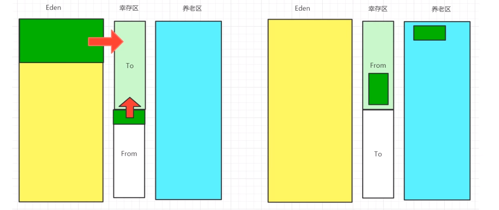  

> 优缺点
- 优点:没有内存的碎片~
- 缺点:浪费了内存空间~:to永远是空的.假设对象100%存活(极端情况)OOM
- 复制算法使用场景:对象存活度较低的时候,新生区--


> 标记清除算法
- 扫描对象:扫描`第一遍`:活着的进行标记,扫描`第二遍`:死的清除
- 说明：老年代一般是由`标记清除`或者是`标记清除与标记整理`的混合实现

- 优点:不需要额外的空间!
- 缺点：两次扫描,这个算法需要暂停整个应用，会产生内存碎片。

> 标记压缩算法
- 压缩:防止内存碎片产生,再次扫描,向一端移动存活的对象,多了一个移动成本

- 总结
 - 内存效率:复制算法>标记清除算法>标记压缩算法(时间复杂度)
 - 内存整齐度:复制算法=标记压缩算法>标记清除算法
 - 内存占用率:标记压缩算法=标记清除算法>复制算法

- 思考:难道没有最优算法吗?
- 没有.只有最合适的算法--->GC:分代收集算法

- 年轻代.
  - 存活率低
  - 复制算法.
  
- 老年代
  - 区域大,存活率高
  - 标记清除+标记压缩混合 实现 ----JVM调优
  
- JMM
 - 1.什么是JMM --- java Memory Model的缩写
 - 2.它干嘛的?---官方,其他人博客,对应的视频.
   - 作用:缓存一致性协议,用于定义数据读写的规则.
   - JMM:定义了线程工作内存和主内存之间的抽象关系,线程之间的共享变量存储在主内存(Main Memory)中,每个线程都有一个私有的本地内存(Local Memory)
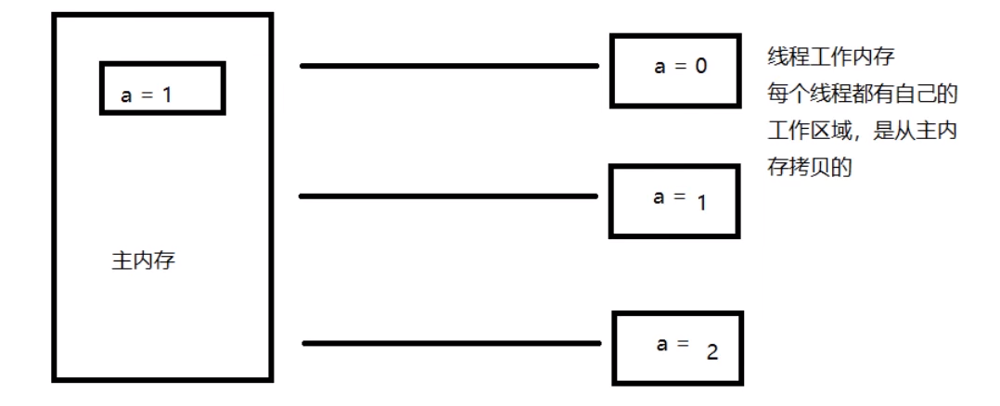

 - 3.它如何去学习?
  - 解决共享对象可见性这个问题:volilate
  - JMM:抽象的概念，理论
  - JMM对这八种指令的使用，制定了如下规则
    - 1.不允许read和load、store和write操作之一单独出现。即使用了read必须load，使用了store必须 write
    - 2.不允许线程丢弃他最近的assign操作，即工作变量的数据改变了之后，必须告知主存
    - 3.不允许一个线程将没有assign的数据从工作内存同步回主内存
    - 4.一个新的变量必须在主内存中诞生，不允许工作内存直接使用一个未被初始化的变量。就是怼变量实
      施use、store操作之前，必须经过assign和load操作
    - 5.一个变量同一时间只有一个线程能对其进行lock。多次lock后，必须执行相同次数的unlock才能解锁
    - 6.如果对一个变量进行lock操作，会清空所有工作内存中此变量的值，在执行引擎使用这个变量前，必须重新load或assign操作初始化变量的值
    - 7.如果一个变量没有被lock，就不能对其进行unlock操作。也不能unlock一个被其他线程锁住的变量
    - 8.对一个变量进行unlock操作之前，必须把此变量同步回主内存
    - JMM对这八种操作规则和对volatile的一些特殊规则就能确定哪里操作是线程安全，哪些操作是线程不安全的了。
      但是这些规则实在复杂，很难在实践中直接分析。所以一般我们也不会通过上述规则进行分析。
      更多的时候，使用java的happen-before规则来进行分析。


