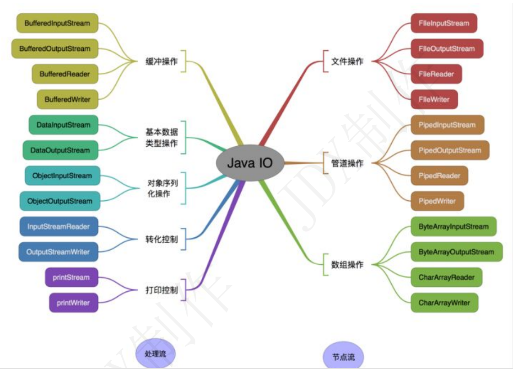

## IO  
 - IO流操作必然try catch 
    - 输出流是null的，目的是将其他源的数据输出
    - 输入流是要读取到数据的，将读取到的数据给别的源

- 初始化：
    - 先声明
    - 再赋值（try catch里）
- 先开始的最后再结束
- 结束：
    - 先判null
    - 再关闭


> Java 中 IO 流分为几种?
- 按照流的流向分，可以分为输入流和输出流；
- 按照操作单元划分，可以划分为字节流和字符流；
- 按照流的角色划分为节点流和处理流
  
- Java Io 流共涉及 40 多个类，这些类看上去很杂乱，但实际上很有规则，而且彼此之间存在非常紧密的
  联系， Java I0 流的 40 多个类都是从如下 4 个抽象类基类中派生出来的。
    - InputStream/Reader: 所有的输入流的基类，前者是字节输入流，后者是字符输入流。
    - OutputStream/Writer: 所有输出流的基类，前者是字节输出流，后者是字符输出流

      




- 既然有了字节流,为什么还要有字符流?
  - 问题本质想问：不管是文件读写还是网络发送接收，信息的最小存储单元都是字节，
    那为什么 I/O 流操作要分为字节流操作和字符流操作呢？
  - `回答：字符流是由 Java 虚拟机将字节转换得到的，问题就出在这个过程还算是非常耗时，并且，如果
  我们不知道编码类型就很容易出现乱码问题。所以， I/O 流就干脆提供了一个直接操作字符的接口，方
  便我们平时对字符进行流操作。如果音频文件、图片等媒体文件用字节流比较好，如果涉及到字符的话
  使用字符流比较好。`


> BIO,NIO,AIO 有什么区别?
- BIO (Blocking I/O): 同步阻塞 I/O 模式，数据的读取写入必须阻塞在一个线程内等待其完成。在
    活动连接数不是特别高（小于单机 1000）的情况下，这种模型是比较不错的，可以让每一个连接
    专注于自己的 I/O 并且编程模型简单，也不用过多考虑系统的过载、限流等问题。线程池本身就是
    一个天然的漏斗，可以缓冲一些系统处理不了的连接或请求。但是，当面对十万甚至百万级连接的
    时候，传统的 BIO 模型是无能为力的。因此，我们需要一种更高效的 I/O 处理模型来应对更高的
    并发量。
- NIO (Non-blocking/New I/O): NIO 是一种同步非阻塞的 I/O 模型，在 Java 1.4 中引入了 NIO 框
    架，对应 java.nio 包，提供了 Channel , Selector，Buffer 等抽象。NIO 中的 N 可以理解为 
    Non-blocking，不单纯是 New。它支持面向缓冲的，基于通道的 I/O 操作方法。 NIO 提供了与传统
    BIO 模型中的 Socket 和 ServerSocket 相对应的 SocketChannel 和 ServerSocketChannel
    两种不同的套接字通道实现,两种通道都支持阻塞和非阻塞两种模式。阻塞模式使用就像传统中的
    支持一样，比较简单，但是性能和可靠性都不好；非阻塞模式正好与之相反。对于低负载、低并发
    的应用程序，可以使用同步阻塞 I/O 来提升开发速率和更好的维护性；对于高负载、高并发的（网
    络）应用，应使用 NIO 的非阻塞模式来开发
- AIO (Asynchronous I/O): AIO 也就是 NIO 2。在 Java 7 中引入了 NIO 的改进版 NIO 2,它是异步
    非阻塞的 IO 模型。异步 IO 是基于事件和回调机制实现的，也就是应用操作之后会直接返回，不
    会堵塞在那里，当后台处理完成，操作系统会通知相应的线程进行后续的操作。AIO 是异步 IO 的
    缩写，虽然 NIO 在网络操作中，提供了非阻塞的方法，但是 NIO 的 IO 行为还是同步的。对于
    NIO 来说，我们的业务线程是在 IO 操作准备好时，得到通知，接着就由这个线程自行进行 IO 操
    作，IO 操作本身是同步的。查阅网上相关资料，我发现就目前来说 AIO 的应用还不是很广泛，
    Netty 之前也尝试使用过 AIO，不过又放弃了。  


## 常用IO操作
### CMD命令扫描全路径
- BAT(或者CMD)文件中DIR *.* /S/ON/B>LIST1.TXT

### 读取
- 
     ```java
        static String read(String pathTxt) throws Exception{
            // pathTxt路径
            try {
                FileReader fileReader = new FileReader(pathTxt);
                BufferedReader bf = new BufferedReader(fileReader);
                // 按行读取字符串
                String str;
    
                while ((str = bf.readLine()) != null) {
                       System.out.println(str);
                }
                bf.close();
                fileReader.close();
            } catch (IOException e) {
                e.printStackTrace();
            }
            
            return returnString;
        }
        
    ```

### 写入
- 
 ```java
        static void write(String name,String path){
        // 写入的文件的路径
            path = "C:\\Users\\lenovo\\Desktop\\公司业务总结\\sqlTable\\noRepeat\\"+path;
            File file=new File(path);//录入文件地址
            if(!file.exists()){
                try {
                    file.createNewFile();
                } catch (IOException e) {
                    e.printStackTrace();
                }
            }
            OutputStream os=null;
            try {
                os=new FileOutputStream(file,false);//false覆盖  true 追加
                byte[] b=name.getBytes();
                os.write(b);//写入
                os.close();//关闭流
            } catch ( Exception e) {
                e.printStackTrace();
            }
        }
    ```

