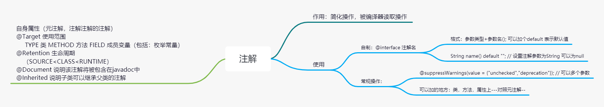
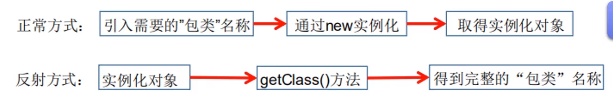
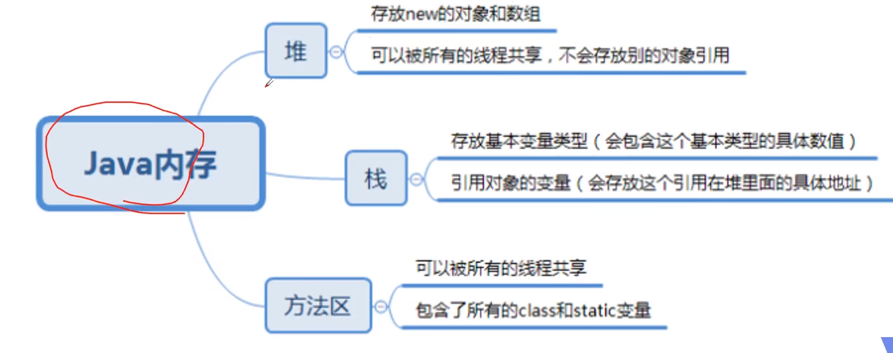
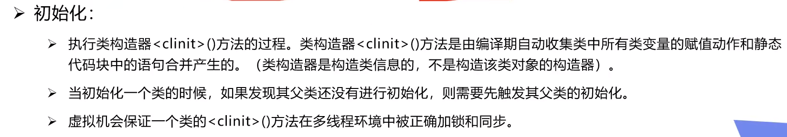
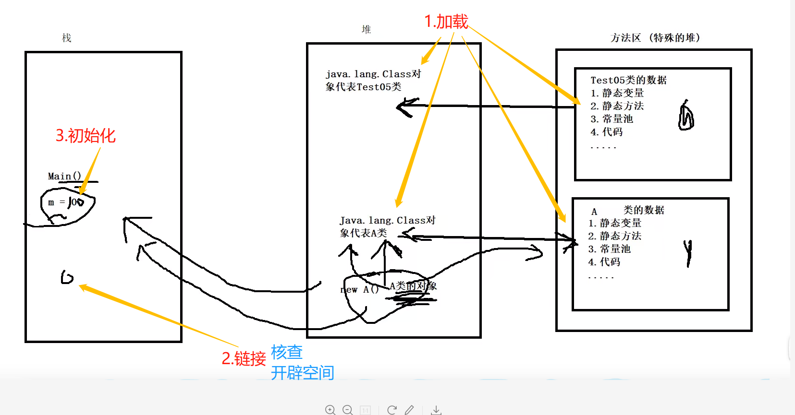
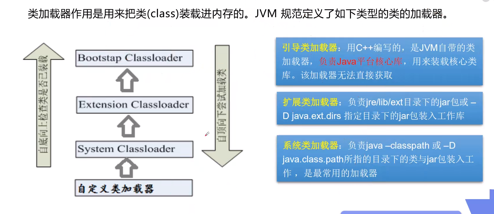
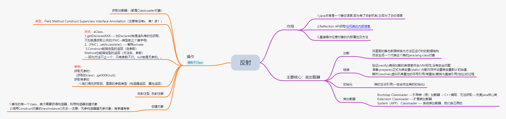

# annotation和反射
- 框架中最基本的就是注解和反射
>
> 注解的作用，类型，积累，使用（新建，操作）
> 
> 反射的机制，思想
> 


## 定义
- 1.Annotation的作用:
  - 不是程序本身，可以对程序作出解释（给写代码的人看---这是个啥）
  - 可以被其它程序（比如编译器）读取
- 2.格式：
  - 注解是以”@注释名“在代码中存在的，还可以添加一些参数值，
  - 例如：@SuppressWarnings(value="unchecked");
- 3.添加的位置：
  - 可以附加在package，class，method，field等上面 
  - 相当于给他们添加了额外的辅助信息，我们可以通过反射机制编程实现对这个数据的访问
  
- 4.内置注解 
  - 很多都是java.lang包下的
  - @Override - 重写 -- 加上就一定要重写，否则报错
  - @Deprecated - 弃用的，
  - @SuppressWarnings - 抑制编译时的警告信息，
    - 与前面的两个注释不同，需要添加参数才可以使用
    - @suppressWarnings("all");
    - @suppressWarnings("unchecked");
    - @suppressWarnings(value = {"unchecked","deprecation"}); // 可以多个参数
    
- 5.元注解
  - 元注解就是**负责注解其它注解**，java定义了四个标准的meta-annotation类型。
  - 可以在java.lang.annotation包中可以找到，(@Target,@Retention,@Document,@Inherited);
  - @Target 使用范围
    - TYPE 类 METHOD 方法  FIELD 成员变量（包括：枚举常量）
  - @Retention 表示什么级别保存该注解信息，用于描述注解的生命周期（SOURCE<CLASS<RUNTIME）
    - SOURCE　源码（自己编的）　CLASS 字节码  RUNTIME 运行时
  - @Document 说明该注解将被包含在javadoc中
  - @Inherited 说明子类可以继承父类的注解


- 6.自定义注解
- 使用@interface 注解名=====来自定义注解，自动继承了java.lang.annotation.Annotation接口
  ```
    // 定义一个注解
    // target 表示我们的注解可以用在哪些地方
    @Target(value = {ElementType.METHOD,ElementType.TYPE})
    // 表示我们的注解在什么地方还有效
    // RUNTIME>CLASS>SOURCE ---包含
    @Retention(value = RetentionPolicy.RUNTIME)
    // Documented 表示是否将注解生成在JAVAdoc中
    @Documented
    
    // Inherited 子类可以继承父类的注解
    @Inherited
    @interface MyAnnotation{
    }
  
  ```
  
- 7.注解参数
- 自制的注解的参数格式：参数类型+参数名(); 可以加个default 表示默认值
- 注解可以显示赋值，如果没有默认值，我们就必须给注解赋值
  - 参数值为value，可以省略value=
  
  ```
    public class TestDemo03 {
    
          // 注解可以显示赋值，如果没有默认值，我们就必须给注解赋值
          @MyAnnotation2(name = "xxx",school = {"山西农业大小，山农"})
          public void test(){
          }
      
          @MyAnnotation3("zjz")   // 参数值为value，可以省略value=
          public void test2(){
          }
        }
        
        // 自定义注解
        @Target({ElementType.TYPE,ElementType.METHOD})
        @Retention(RetentionPolicy.RUNTIME)
        @interface MyAnnotation2{
            // 注解的参数格式：参数类型+参数名(); 可以加个default 表示默认值
            String name() default ""; // 设置注解参数为String 可以为null
            int age() default 0;
            int id() default -1; // 如果默认值为-1，代表不存在
        
            String[] school() default {"清华大学","北京大学"};
        }
        
        
        @interface MyAnnotation3{
            String value();
      }
  
  ```

### 注解总-




# 反射
> java本身是一个静态语言,因为有了反射机制,它成为了动态语言.
- 动态语言,运行时代码可以根据某些条件改变自身结构--C# JavaScript PHP,Python
- 静态语言,运行时结构不可变的语言---java C C++

- 1.java Reflection
  - Reflection(反射)是java被视为动态语言的关键,反射机制允许程序在执行期借助Reflection API获取任何类的内部信息
  - 并且能直接操作任意对象的内部属性及方法.
    - Class c = Clas.forName("java.lang.String");
  - 缺点:对性能有影响,它基本上是一种解释操作.


- 2.主要API
  - java.lang.Class:代表一个类
  - java.lang.reflect.Method 代表类的方法
  - java.lang.reflect.Filed 代表类的成员变量
  - java.lang.reflect.Constructor 代表类的构造器

- 3.一个类在内存中只有一个class对象
  - 一个类被加载后,类的整个结构都会被封装在class中
  - // 只要元素类型与维度一样,就是同一个class
```
   // 只要元素类型与维度一样,就是同一个class
        int[] a = new int[10];
        int[] b = new int[100];
        System.out.println("a:" + a.getClass().hashCode()); // a:356573597
        System.out.println("b:" + b.getClass().hashCode()); // b:356573597
```


## java内存



> 1.类加载器与ClassLoader的理解
> 类加载子系统------
- 加载(Loading):将class文件字节码内容加载到内存,
  - 将里面的静态数据转换为方法区运行时的数据结构
  - 然后生成一个代表这个类的java.lang.class对象
  
- 链接(Link):将java类的二进制代码合并到JVM的运行状态之中的过程---什么时候成为了二进制?
  - 验证(verify):确保加载的类信息**符合JVM规范**,没有安全问题
  - 准备(prepare):正式为类变量(static) **分配内存**并**设置**类**变量默认初始值**的阶段,这些内存都在**方法区**中分配
  - 解析(resolve):虚拟机**常量池**的符号引用(常量名)替换为直接引用(地址)的过程
  
- 初始化:
  - 执行类构造器<clinit>的过程,整合类变量赋值动作，静态代码块中的语句
  




> 类缓存
- 标准的javaSE类加载器可以按要求查找类，但一旦某个类被加载器加载到类加载器，
  它将维护加载（缓存）一段时间。不过JVM垃圾回收机制可以回收这些Class对象

> 类加载器
  - Bootstap Classloader ---引导类（根）加载器 -- C++编写，无法获取---负责java核心类库
  - Extension Classloader ---扩展类加载器
  - System（APP） Classloader --- 系统类加载器，我们自己用的





- 2.什么时候发生类的初始化
  - 1.类的主动引用(一定会发生类的初始化)
    - 虚拟机启动,先初始化main方法所在类
    - new 一个类的对象
    - 调用类的静态成员(除final常量)和静态方法
    - 使用java.lang.reflect包的方法对类进行反射调用
    - 当初始化一个类,如果其父类没有被初始化,则先会初始化它的父类
  - 2.类的被动引用（不会发生类的初始化）
    - 当访问一个静态域的时候，只有真正声明这个域的类才会被初始化。如：当通过子类引用父类的静态变量，不会导致子类初始化。
      - // 不会产生Son类的引用方法   main类被加载  父类被加载  2
      -  System.out.println(Son.b);
    - 通过数组定义类引用，不会触发此类的初始化
      -  使用子类数组，父类，子类都不加载
    - 引用常量不会触发此类的初始化（常量在**链接阶段**就存入调用类的常量池了）
      - 使用子类的常量，父类，子类都不加载
  

## 获取运行时类的完整结构

- 获取class的方式----注意是字符串的参数
  - 1.通过ClassLoader对象的loadClass()方法
   ` ClassLoader.getSystemClassLoader().loadClass("com.my.test.Hello")`
    
  - 2.类名.class
    
  - 3. `Class.forName()`
   - `Class test = Class.forName("com.my.Test");`
  - 4.object.getClass()
    - `public final native Class<?> getClass();`
  

- 一，获取加载器：(都是ClassLoader对象)
  - ClassLoader.getSystemClassLoader();  // 获取系统类（APP）加载器
  - ClassLoader.getSystemClassLoader().getParent();  // 获取系统类加载器的父类---扩展类加载器
  - ClassLoader.getSystemClassLoader().getParent().getParent();// 获取扩展类加载器的父类加载器---根加载器(c/c++写的)
  - Class.getClassLoader(); // 当前类的加载器
- 二，通过反射获取运行时类的完整结构(Class)
  - 都是先通过获取class，再进一步获取其它的
  - Field Method Construct Superclass Interface Annotation（注意有没有s，单？多？）
    - 1.getDeclaredXXX----加Declared就是连私有的也获取，不加就是获取公共的(FMC)--前三个
    - 2.（FMC）.setAccessible() --- 解除private
    - 3.Construct能指定型的返回（定参数）  Method也能指定型的返回（方法名，参数）---因为方法不止一个，只有参数不行。null就是无参的。。
- 获取构造器
  - 获取无参的
    -  Constructor constructor1 = （获取的class）.getConstructor(null); // null就是无参构造器。对象时也是使用无参
  - 获取有参的
    - 1.咱们得先获取到，里面的参数类型--
      - 一种是获取属性，然后自己试。。（获取的class）.getDeclaredField
      - 一种是直接获取构造器 
        - 获取所有的--（获取的class）.getDeclaredConstructors();
        - 指定参数的：（获取的class）.getDeclaredConstructor(String.class, int.class, int.class); // 依据参数获取构造器
- 有了Class对象，能做什么？
  - 1.创建对象：首先的有一个class，其次需要获得构造器，利用构造器创建对象
    - 调用Construct对象的newInstance()方法---**注意**：无参构造器建无参对象，有参建有参
    - 1.类必须有一个无参的构造器
    - 2.类的构造器的访问权限需要足够
  - 思考？如果没有无参构造器就不能创建对象了吗？只要操作的时候明确的调用类中的构造器，并将参数传进去，就可以实例化操作。
    - 1.Class的getDeclaredConstructor(Class…parameterTypes)获取本类的指定形参类型的构造器
    - 2.向构造器的形参中传递一个对象数组进去，里面包含了构造器需要的各个参数
    - 3.通过Constructor实例化对象
  
- setAccessible() --- 解除private
  - Method Field Constructor 都有setAccessible() 
  - 启动和禁用访问安全的开关（private修饰的）
  

> 反射泛型
- java采用泛型擦除的机制来引入泛型，Java中的泛型仅仅是给编译器javac使用的，确保数据安全和免去强制类型转换问题
- 一旦编译完成，所有和泛型有关的类型全部擦除
- 为了反射操作这些类型，java新增了ParameterizedType，GenericArrayType，TypeVariable和WildcardType
  - 如果是方法的，先取方法，再----泛型
  - 取到泛型---test01Method.getGenericParameterTypes();---参数值泛型test01(Map<String, TestBean> map, List<TestBean> list)
  - 如果是返回值泛型（public Map<String,TestBean> test02()）------Type genericReturnType = test02Method.getGenericReturnType(); // return只有一个返回值吧？！  
  - 再遍历取出单个----genericParameterType  注：return本身就单个了  再里面的参数就好了
- 已知java.util.Map<java.lang.String, com.TestDemo.TestBean>，，，再取里面的参数
- ((ParameterizedType) genericParameterType).getActualTypeArguments();

 

- invoke
  `// invoke:激活的意思
  // (对象，"方法的值")`
  - 使用:
  - 1. invoke(proxy,method,args);         --------proxy代理对象 --args可以为null
  - 方法名.invoke(Obj,args);   --- 给方法赋值  
- 框架中经常会会用到method.invoke()方法，用来执行某个的对象的目标方法。
  以前写代码用到反射时，总是获取先获取Method，然后传入对应的Class实例对象执行方法。
  
- invoke方法时，发现invoke方法居然包含多态的特性，这是以前没有考虑过的一个问题


> 反射注解
- ORM
  - Object relation Mapping--> 对象关系映射
  - 类-表，属性-字段，对象-记录
- 调用者.getAnnotation(注解Class);


### 反射总：


