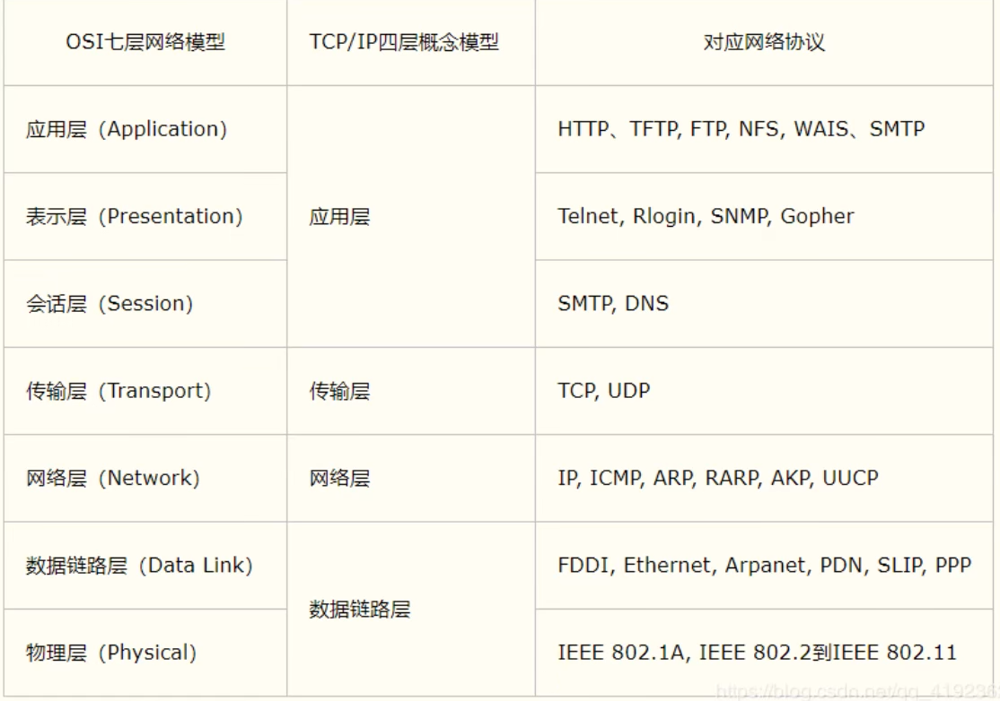
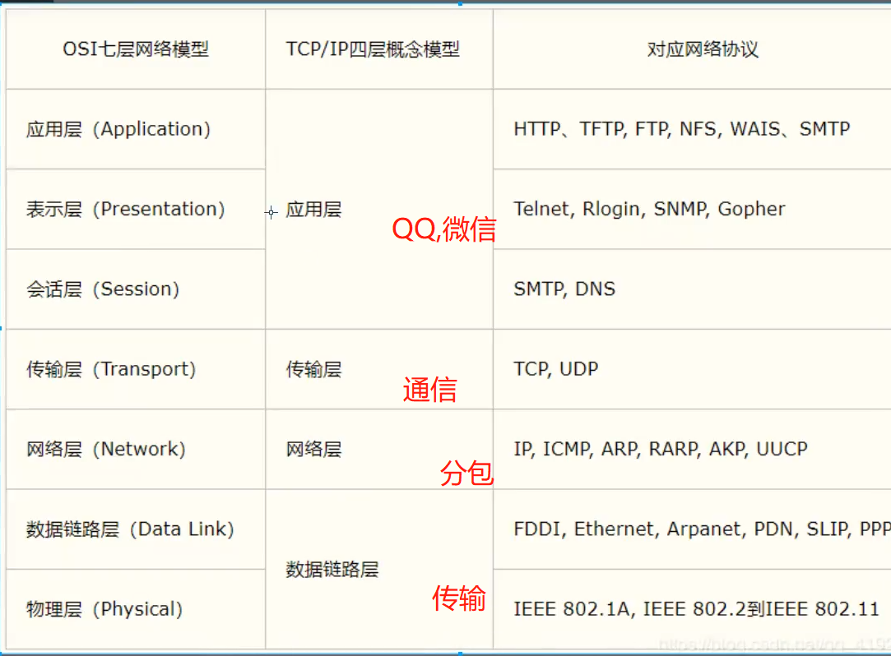
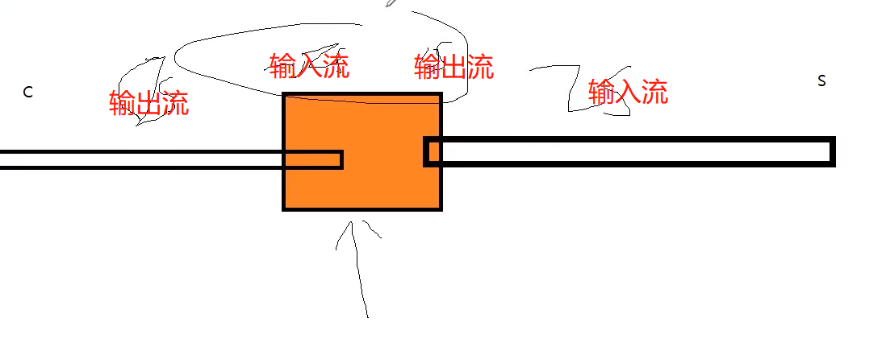
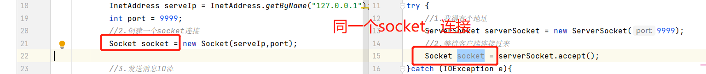
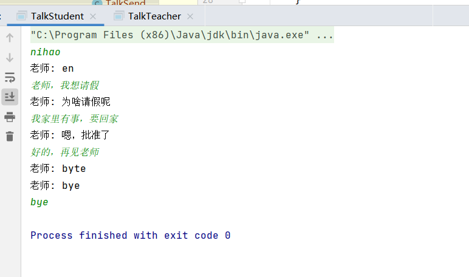
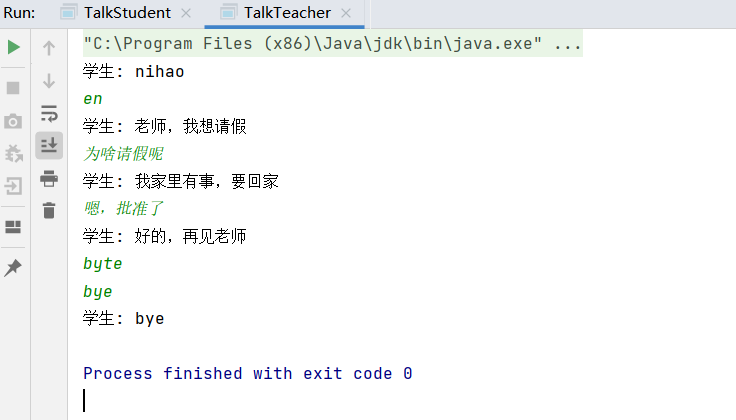
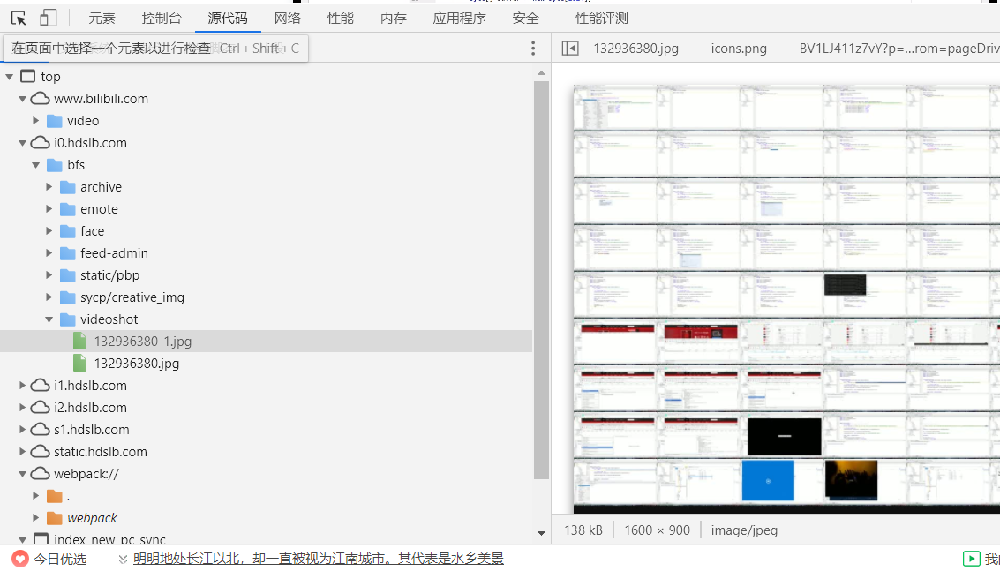

# 网络编程
 - 本阶段代码可从gitee上拉取---https://gitee.com/zhangjzm/study-demo.git
 - 网络编程可以说是套接字编程socket

## 概述：
  - TCP：打电话--连接-接了-通话
  - UDP：发短信--发送了就完事了--接收

   - 计算机网络，是指将**地理位置不同**的具有独立功能的**多台计算机及其外部设备**，**通过通信线路连接**起来，
在网络操作系统，网络管理软件及**网络通信协议**的管理和协调下，实现**资源共享**和信息传递的计算机系统

## 目的：
  - 网络编程的目的：无线电台……传播信息，数据交换。通信

    - 1.如何精确的定位网络上的一个主机 192.168.16.124：端口
    - 2.找到这个主机，如何传输数据


 -  javaweb：网页编程 B/S
  - 网络编程：TCP/IP C/S


## 如何实现网络通信
  - 1.知道双方的地址 
    - ip 端口号
  - 2.规则
     
    -  目前主要是：TCP，UDP

- 小结：
  - 1.网络编程的两个主要问题：；
       - 如何准确的定位到一台或多台主机 
       - 找到主机之后如何进行通信
  - 2.网络编程的要素：
       - IP和端口号：IP
       - 网络通信协议：TCP,UDP
  - 3.万物皆对象


## IP
- ip地址：InetAddress
  - 唯一定位到一台计算机
  - 127.0.0.1：本机localhost
- ip地址分类
  - IPV4/IPV6
    - IPV4：127.0.0.1 四个字节组成 0-255 42亿
    - IPV6：          八个字节组成
  - 公网（互联网）-私网（局域网）  
    
- 域名：记忆IP问题

## 端口
- 端口表示计算机上一个程序的进程
    - 不同的进程有不同的端口号，用来区分软件
    - 被规定0-65535
    - TCP，UDP：65535*2 TCP用80，UDP也可以80  单个协议下，端口号不能冲突
    - 端口分类：
      - 公有端口 0-1023
           - HTTP：80
           - HTTPS：443
           - FTP：21  
           - SSH，SFTP：22  （目前用到） 文件传输
           - Telent：23
      - 程序注册端口：1024-49151，分配给用户或者程序
           - tomcat 8080  在conf/serve.xml中配置
           - MYSQL 3306 
           - Oracle 1521
      - 动态，私有：49152-65535
  
```
  netstat -ano #查看端口
  netstat -ano|findstr "111" #查看指定的端口
  tasklist|findstr "8696" #查看指定端口的进程      
```


## 通信协议
- 协议：约定，好比普通话
- 网络通信协议：速率，传输码率，代码结构，传输控制
- 大事化小：分层：
- TCP/IP协议簇：实际上是一组协议
    - 重要： 
        - TCP：用户传输协议
        - UPD：用户数据报协议
    出名的协议：
        - TCP：用户传输协议
        - IP：网络互连协议
    




## TCP UDP对比：
- TCP：打电话
    - 连接，稳定
    - 三次握手 四次挥手     
    ```
    三次握手：最少三次，保证稳定连接
    A:你愁啥？
    B:瞅你咋滴？
    A：干一场
    
    四次挥手：
    A:我要走了
    B:你真的要走了吗？
    B:你真的真的要走了吗？
    A:我真的要走了！
    ```
  
    - 客户端，服务端
    - 传输完成，释放连接，效率低
- UDP：发短信
    - 不连接，不稳定
    - 客户端，服务端：没有明确的界限
    - 不管有没有准备好，都可以发给你
    - 导弹
    - DDOS：洪水攻击！饱和攻击（多个干掉你）





## TCP
- 客户端
    - 1.连接服务器Socket
    - 2.发送消息
    
- 服务端
    - 1.建立服务的端口 ServerSocket
    - 2.等待用户的连接 accept
    - 3.接收用户的消息

## 客户端，服务端互通的代码：


```

//CLient客户端
public class TcpClientDemo01 {
    public static void main(String[] args) throws UnknownHostException {

        Socket socket = null;
        OutputStream  os = null;

        try {
            //1.要知道服务器地址，端口号
            InetAddress serveIp = InetAddress.getByName("127.0.0.1");
            int port = 9999;
            //2.创建一个socket连接
            socket = new Socket(serveIp,port);

            //3.发送消息IO流
            os = socket.getOutputStream();

            os.write("你好".getBytes());

        }catch (Exception e){
            e.printStackTrace();
        }finally {
            if(os != null){
                try{
                    os.close();
                }catch (IOException e){
                    e.printStackTrace();
                }
            }

            if(socket != null){
                try {
                    socket.close();
                }catch (IOException e){
                    e.printStackTrace();
                }
            }


        }
    }
}

```


```java
//Server服务器
public class TcpServerDemo01 {
    public static void main(String[] args) {

        ServerSocket serverSocket = null;
        Socket socket = null;
        InputStream is = null;
        ByteArrayOutputStream baos = null;
        try {
            //1.我得有个地址
             serverSocket = new ServerSocket(9999);
            //2.等待客户端连接过来
             socket = serverSocket.accept();
            //3.读取客户端的消息
             is = socket.getInputStream();
            //管道流
             baos = new ByteArrayOutputStream();
            byte[] buffer = new byte[1024];
            int len;
            while ((len=is.read(buffer))!=-1){
                baos.write(buffer,0,len);
            }

            System.out.println(baos.toString());


        }catch (IOException e){
            e.printStackTrace();
        }finally {

            //关闭资源，先判断不是null，再关闭流
            if(baos != null){
                try {
                    baos.close();
                } catch (IOException e) {
                    e.printStackTrace();
                }
            }


            if(is != null){
                try {
                    is.close();
                } catch (IOException e) {
                    e.printStackTrace();
                }
            }

            if(socket != null){
                try {
                    socket.close();
                } catch (IOException e) {
                    e.printStackTrace();
                }
            }

            if(serverSocket != null){
                try {
                    serverSocket.close();
                } catch (IOException e) {
                    e.printStackTrace();
                }
            }

        }

    }
}

```


```
    //一直接收客户端的发送
    try {
            //1.我得有个地址
             serverSocket = new ServerSocket(9999);
             while (true) {  //循环监听
                 //2.等待客户端连接过来
                 socket = serverSocket.accept();
                 //3.读取客户端的消息
                 is = socket.getInputStream();
                 //管道流
                 baos = new ByteArrayOutputStream();
                 byte[] buffer = new byte[1024];
                 int len;
                 while ((len = is.read(buffer)) != -1) {
                     baos.write(buffer, 0, len);
                 }

                 System.out.println(baos.toString());

             }

        }

```
## 实现文件上传
- 思路:1.使用socket建立连接，2.通过IO流传输文件 3.传输完成，关闭连接（适用于两台主机交互）
- 由于是test，所以直接省去了异常的处理，采用方法throws Exception，正式开发要独立抛出
- 客户端代码
```
//客户端
public class TCP_ClientDemo02 {
    //不一个个try catch 抛出异常
    public static void main(String[] args) throws Exception {
        //1.创建一个Socket连接，获取到服务器地址，端口
        Socket socket = new Socket(InetAddress.getByName("127.0.0.1"), 9000);
        //2.创建一个输出流
        OutputStream os = socket.getOutputStream(); //此时null的
        //3.文件流 --- 读取文件
        FileInputStream fis = new FileInputStream(new File("picture.jpg"));
        //4.写出文件
        byte[] buffer = new byte[1024];
        int len;  //输出的时候，从0到末尾都写出去
        while((len=fis.read(buffer))!=-1){  //read fis.将文件写入到buffer
            os.write(buffer,0,len);   //此时os将buffer中的数据写出去
        }

        //通知服务器，我已经结束了
        socket.shutdownOutput();//我已经传输完了！

        //确定服务器接收完毕，才能够断开连接
        InputStream inputStream = socket.getInputStream();
        //String byte 字符串管道流
        ByteArrayOutputStream baos = new ByteArrayOutputStream();

        byte[]  buffer2 = new byte[1024];
        int len2;
        while ((len2=inputStream.read(buffer2))!=-1){
            baos.write(buffer2,0,len2);
        }

        System.out.println(baos.toString());
        //5.关闭资源
        baos.close();
        inputStream.close();
        fis.close();
        os.close();
        socket.close();

    }

}

```

- 服务端代码
```
//服务端
public class TCP_ServeDemo02 {

    public static void main(String[] args) throws Exception {
        //1.创建服务 创建一个端口号
        ServerSocket serverSocket = new ServerSocket(9000);
        //2.监听客户端连接
        Socket socket = serverSocket.accept();//阻塞式监听，会一直等待客户端连接
        //3.获取输入流
        InputStream is = socket.getInputStream(); //此时将socket拿来的数据放入输入流
        //4.文件输出
        FileOutputStream fos = new FileOutputStream(new File("receive.jpg")); //空文件
        byte[] buffer = new byte[1024];
        int len;  //输出的时候，从0到末尾都写出去
        while ((len=is.read(buffer))!= -1){  //read is.将文件数据写入到buffer
            fos.write(buffer,0,len);   //fos将buffer中的数据写到文件
        }

        //通知客户端我接收完毕了
        OutputStream os = socket.getOutputStream();
        os.write("我接收完毕了，你可以断开了".getBytes());

        //关闭资源
        fos.close();
        is.close();
        socket.close();
        serverSocket.close();
    }
}

```


- Tomcat
  - 服务器
    - 自定义s
    - Tomcat服务器 s  java后台开发
    
  - 客户端
    - 自定义C
    - 浏览器 B


## UDP
- 发短信，不用连接，需要对方地址,思路：
    - UDP采用DatagramSocket建立连接
    - DatagramPacket建立数据包
    - socket.send(packet);发送
- 客户端
```java
//客户端，不需要服务器
public class UdpClientDemo01 {
    public static void main(String[] args) throws Exception {
        //1.建立一个Socke

        DatagramSocket socket = new DatagramSocket();
        //2.建个包
        String msg = "你好啊，服务器";
        //发送给谁
        InetAddress localhots = InetAddress.getByName("localhost");
        int port = 9090;

        //准备数据（字符变字节），数据的起末位置，发送给谁
        DatagramPacket packet = new DatagramPacket(msg.getBytes(), 0, msg.getBytes().length, localhots, port);

        //3.发送包
        socket.send(packet);

        //4.关闭流
        socket.close();
    }

}

```

- 接收端
```java
//接收端，UDP不需要服务端，此处为模拟
public class UdpServerDemo01 {

    public static void main(String[] args) throws Exception {
        //开放端口
        DatagramSocket socket = new DatagramSocket(9090);

        //接收数据包
        byte[] buffer = new byte[1024]; //得有空间
        DatagramPacket packet = new DatagramPacket(buffer, 0, buffer.length); //接收包

        socket.receive(packet); //阻塞接收，相当于活着，活着才能随时接收包裹

        System.out.println(new String(packet.getData(),0, packet.getLength()));
        System.out.println(packet.getAddress().getHostAddress());

        //4.关闭流
        socket.close();


    }
}

```

## UDP实现控制台输入
- 思路：使用System.in来进行阻塞输入


```java
public class UdpSenderChart01 {
    public static void main(String[] args) throws Exception{
        DatagramSocket socket = new DatagramSocket(8888);

        //准备数据：控制台读取 System.in
        BufferedReader reader = new BufferedReader(new InputStreamReader(System.in));

        while (true){
            String data = reader.readLine();
            byte[] datas = data.getBytes();

            DatagramPacket packet = new DatagramPacket(datas,0,datas.length,new InetSocketAddress("localhost",6666));

            socket.send(packet);
            if(data.equals("bye")){
                break;
            }
        }
        socket.close();
    }
}


```


```java
public class UdpReceiveChart01 {
    public static void main(String[] args) throws Exception{
        DatagramSocket socket = new DatagramSocket(6666);

        while(true){
            //准备接收包裹
            byte[] container = new byte[1024];

            DatagramPacket packet = new DatagramPacket(container,0,container.length);
            socket.receive(packet); //阻塞式接收包裹
            //断开连接
            byte[] data = packet.getData();   //取到数据
            String receiveData = new String(data,0, packet.getLength());  //此时取packet的length，因为取字节流的那便是1024个长度
            System.out.println(receiveData);
            //判断遇到bye，断开连接
            if(receiveData.equals("bye")){
                break;
            }
        }
        socket.close();
    }
}


```


## UDP两人聊天，实现多线程
- 思路：
    - 同样是有接收方和输出方，但是是采用线程的方式进行编写
    - 创建两个start类，来模仿聊天
  



```java
//发送端，实现Runnable
public class TalkSend implements Runnable{

    DatagramSocket  socket  =   null;
    BufferedReader  reader  =   null;
    private int  fromPort;
    private String  toIP;
    private int toPort;

    public TalkSend(int fromPort, String toIP, int toPort) {
        this.fromPort = fromPort;
        this.toIP = toIP;
        this.toPort = toPort;
        try {
            socket = new DatagramSocket(fromPort);    //用于连接Socke，这是sender的port
            reader = new BufferedReader(new InputStreamReader(System.in)); //使用BufferedReader读取控制台输入的数据
        } catch (Exception e) {
            e.printStackTrace();
        }
    }

    @Override
    public void run() {

        while (true) {
            try {
                String data = reader.readLine();  //此时为一行一行读的功能，将读到的字符串给data
                byte[] datas = data.getBytes();   //转为字节
                //数据放入容器，并指定对方的IP和端口
                DatagramPacket packet = new DatagramPacket(datas,0,datas.length,new InetSocketAddress(this.toIP,this.toPort));
                //发送
                socket.send(packet);
                if(data.equals("bye")){    //结束语句
                    break;
                }
            }catch (Exception e){
                e.printStackTrace();
            }

        }
        socket.close();
    }
}

```

```java

//接收方
public class TalkReceive implements Runnable{

    DatagramSocket socket  =   null;
    private int port;
    private String msgFrom;

    public TalkReceive(int port,String msgFrom) {
        this.port = port;
        this.msgFrom = msgFrom;
        try {
            socket = new DatagramSocket(port);   //这是我接收端的端口
        } catch (SocketException e) {
            e.printStackTrace();
        }
    }

    @Override
    public void run() {

        while (true) {
            try {
                //准备接收包裹
                byte[] container = new byte[1024];
                //接收的容器，没容器，数据没地放
                DatagramPacket packet = new DatagramPacket(container,0,container.length);
                socket.receive(packet); //阻塞式接收到包裹

                byte[] data = packet.getData();   //取到字节数据
                String receiveData = new String(data,0, packet.getLength());  //转为字符串，此时取packet的length，因为取data.length的那便是1024个长度
                System.out.println(msgFrom+ ": " + receiveData); //输出数据
                //判断遇到bye，断开连接
                if(receiveData.equals("bye")){
                    break;
                }
            } catch (Exception e) {
                e.printStackTrace();
            }
        }
        socket.close();
    }
}

```

```java
//学生端
public class TalkStudent {
    public static void main(String[] args) {
        //开启两个线程
        new Thread(new TalkSend(7777,"localhost",9999)).start();
        new Thread(new TalkReceive(8888,"老师")).start(); //学生接收到的是老师发来的，所以msg为老师
    }
}

```

```java
//老师端
public class TalkTeacher {
    public static void main(String[] args) {
        new Thread(new TalkSend(5555,"localhost",8888)).start();
        new Thread(new TalkReceive(9999,"学生")).start();//老师接收到的是学生发来的，所以msg为学生
    }
}


```


## URL
- URL 统一资源定位器，定位互联网上的某一个资源
    - -----https://www.baidu.com/
    - DNS域名解析  www.baidu.com  解析成XXX.XX.XX.XX
    - 五部分组成：协议，ip地址，端口，项目名，资源（可少不可多）
      - ip地址与域名是一对多的关系。一个ip地址可以对应多个域名，但是一个域名只有一个ip地址。
  ```
    协议：//ip地址：端口/项目名/资源
  ```
  

## 爬取网站：
- 找下载内容---右键审查元素

```java
  //爬取
  public class UrlDown {
    public static void main(String[] args) throws Exception{
      //1.下载地址  //不管是什么类型都可下，前提是找到地址
      URL url = new URL("https://gitee.com/zhangjzm");
      //2.连接到这个资源  HTTP
      HttpURLConnection   urlConnection   =  (HttpURLConnection)url.openConnection();
      //输入流
      InputStream inputStream = urlConnection.getInputStream();
      //文件流
      FileOutputStream fos = new FileOutputStream("paqu.html");  //对应好要下载的格式
  
      //字节形式传输  
      byte[] buffer = new byte[1024];
      int len;
      while((len=inputStream.read(buffer))!=-1){
        fos.write(buffer,0,len); //写出这个数据  -- 到fos
      }
  
      fos.close();
      inputStream.close();
      urlConnection.disconnect(); //断开连接
  
    }
  }

```
 