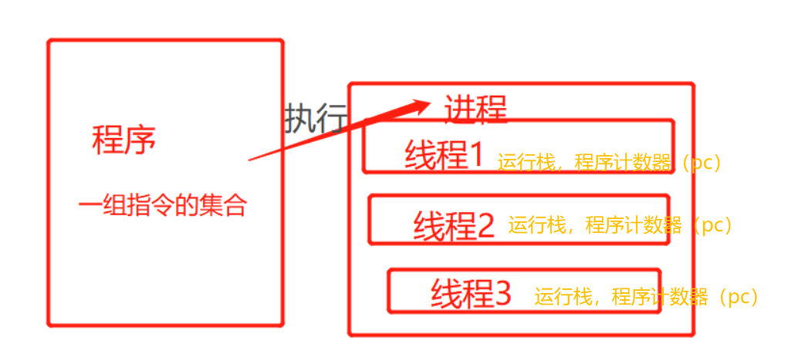
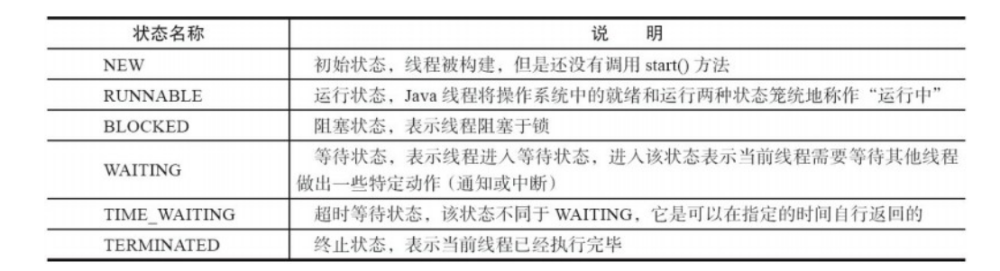
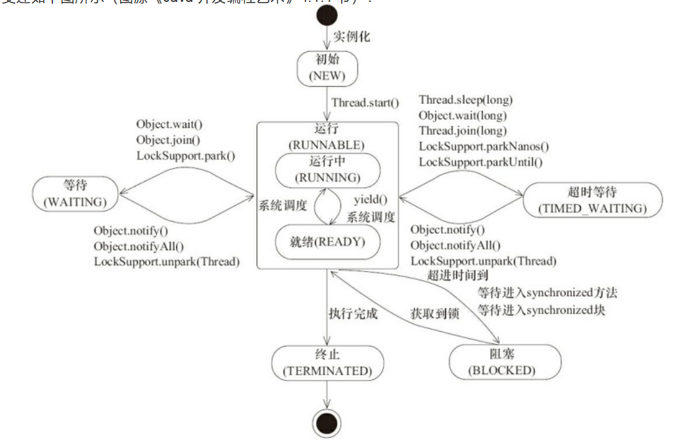

# 多线程
> 基本操作
> 干什么的？---网页3s原则，用户体验（异步处理）
> 怎么做？


- [⑥Note_多线程](zh-cn/java/NOTES/Note_多线程.md)
- [⑧并发](zh-cn/java/NOTES/并发.md)
- [NOTES_ThreadStudey](zh-cn/java/NOTES/Thread/NOTES_ThreadStudey.md)
- [NOTES_ThreadSynchronization](zh-cn/java/NOTES/Thread/NOTES_ThreadSynchronization.md)

## 概述
- 1.程序（program）：是为了完成特定任务、用某种语言编写的**一组指令的集合**。即指一段静态代码。
- 2.进程（process）：是资源（CPU、内存等）分配的基本单位，是程序的**一次执行过程**，或者正在运行的一个程序。是一个动态的过程：有自身的产生、存在和消亡的生命周期。如运行中的QQ。
  - 程序是静态的，进程是动态的。
  - 进程作为资源分配的单位，系统在运行时会为每个进程分配不同的内存区域。
- 3.线程（thread）：线程是一条执行路径，是程序执行时的最小单位，是进程的一个执行流，是CPU调度和分派的基本单位，一个进程可以由多个线程组成，线程间共享进程的所有资源，**每个线程拥有自己独立的运行栈和程序计数器(pc)**。

  
  - 一个进程中的多个线程**共享相同的内存单元/内存地址空间** 
  -   ---> 它们从同一个堆中分配对象，可以访问相同的变量和对象。这就使得线程间通信更简便、高效，同时也带来安全隐患。 
- 4.单核CPU和多核CPU的理解
  - 单核CPU在一个时间单元内，只能执行一个线程的任务，所以在此基础创建多线程是一种假的多线程。多核CPU才能更好的发挥多线程的效率。
  - 一个Java应用程序，至少有三个线程：main()主线程，gc()垃圾回收线程，异常处理线程。
  - 查看CPU数：  在Windows中，在cmd命令中输入“wmic”，或者直接win+R输入wmic
  ```html
    然后在出现的新窗口中分别输入
    “cpu get Name”,
    “cpu get NumberOfCores”,
    “cpu get NumberOfLogicalProcessors”
    /?来显示帮助
    即可查看物理CPU数、CPU核心数、线程数
  ```
- 5.为什么要使用多线程：
  
  - 多线程可以提高程序的效率。
  
- 6.**何时需要使用多线程**（任务多，要等待）
  
  - 程序需要**同时执行两个或多个任务**。
  - 程序需要**实现一些需要等待的任务**，如文件读写、网络操作、搜索等。
  - 需要一些后台运行的程序时
  
## 线程状态
- 在运行的生命周期中的指定时刻只可能处于下面 6 种不同状态的其中一个状态
- NEW RUNNABLE BLOCKED WAITING TIME_WAITING TERMINATED




- 1.线程创建之后它将处于 NEW（新建）状态，调用 start() 方法后开始运行，线程这时候处于
  READY（可运行）状态。可运行状态的线程获得了cpu时间片（timeslice）后就处于RUNNING（运
  行）状态。
- 2.操作系统隐藏 Java 虚拟机（JVM）中的 READY 和 RUNNING 状态，它只能看到 RUNNABLE 状
  态，所以 Java 系统一般将这两个状态统称为 RUNNABLE（运行中） 状态 。
- 3.当线程执行 wait() 方法之后，线程进入 WAITING（等待）状态。进入等待状态的线程需要依靠其他
     线程的通知才能够返回到运行状态，而 TIME_WAITING(超时等待) 状态相当于在等待状态的基础上增
     加了超时限制，比如通过 sleep（long millis）方法或 wait（long millis） 方法可以将 Java 线程
     置于 TIMED WAITING 状态。当超时时间到达后 Java 线程将会返回到 RUNNABLE 状态。当线程调用同
     步方法时，在没有获取到锁的情况下，线程将会进入到 BLOCKED（阻塞） 状态。线程在执行
     Runnable 的 run() 方法之后将会进入到 TERMINATED（终止）状态。


## 时间片
- 时间片
  - 当前一个线程要使用CPU的时候，CPU会分配给这个线程一小段时间（毫秒级别），这段时间就叫做时间片，也就是该线程允许使用CPU运行的时间，在这个期间，线程拥有CPU的使用权。
  - 如果在一个时间片结束时，线程还在运行，那么这时候，该线程就需要停止运行，并交出CPU的使用权，然后等待下一个CPU时间片的分配。
  - 所以，在宏观上，一段时间内，我们感觉俩个线程在同时运行代码，其实在微观中，这俩个线程在使用一个CPU的时候，它们是交替着运行的，每个线程每次都是运行一个很小的时间片，然后就交出CPU使用权，只是它们俩个交替运行的速度太快了，给我们的感觉，好像是它们俩个线程在同时运行。
- 调度
  - 当俩个或多个线程使用一个CPU来运行代码的时候，在操作系统的内核中，就会有相应的算法来控制线程获取CPU时间片的方式，从而使得这些线程可以按照某种顺序来使用cpu运行代码，这种情况被称为线程调用。
  - 常见的调度方式：
    - 时间片轮转
      - 所有线程轮流使用 CPU 的使用权，平均分配每个线程占用 CPU 的时间。
    - 抢占式调度
      - 系统会让优先级高的线程优先使用 CPU（提高抢占到的概率），但是如果线程的优先级相同，那么会随机选择一个线程获取当前CPU的时间片。

##  hello,单线程

- Thread类


  - 实现线程的方式有：继承Thread类，重现run()方法；
  - 实现Runable接口，实现run()方法；
  - 实现Callable接口，线程结束后有返回值


Java 多线程知识基础:
1. 什么是线程和进程? 
2. 请简要描述线程与进程的关系,区别及优缺点？
3. 说说并发与并行的区别? 
4. 为什么要使用多线程呢? 
5. 使用多线程可能带来什么问题? 
6. 说说线程的生命周期和状态? 
7. 什么是上下文切换? 
8. 什么是线程死锁?如何避免死锁? 
9. 说说 sleep() 方法和 wait() 方法区别和共同点?
10. 为什么我们调用 start() 方法时会执行 run() 方法，为什么我们不能直接调用 run() 方法？
    Java 多线程知识进阶：
    
1. synchronized 关键字:① 说一说自己对于 synchronized 关键字的了解；② 说说自己是怎么使用
   synchronized 关键字，在项目中用到了吗;③ 讲一下 synchronized 关键字的底层原理；④ 说说
   JDK1.6 之后的 synchronized 关键字底层做了哪些优化，可以详细介绍一下这些优化吗；⑤ 谈谈
   synchronized 和 ReentrantLock 的区别。
2. volatile 关键字： ① 讲一下 Java 内存模型；② 说说 synchronized 关键字和 volatile 关键字的区
   别。
3. ThreadLocal：① 简介；② 原理；③ 内存泄露问题。
4. 线程池：① 为什么要用线程池？；② 实现 Runnable 接口和 Callable 接口的区别；③ 执行
   execute() 方法和 submit() 方法的区别是什么呢？；④ 如何创建线程池。
5. Atomic 原子类: ① 介绍一下 Atomic 原子类；② JUC 包中的原子类是哪 4 类?；③ 讲讲
   AtomicInteger 的使用；④ 能不能给我简单介绍一下 AtomicInteger 类的原理。
6. AQS ：① 简介；② 原理；③ AQS 常用组件。


- 后台线程：指为其他线程提供服务的线程，也称为守护线程。JVM的垃圾回收线程就是一个后台线程。
- 前台线程：是指接受后台线程服务的线程，其实前台后台线程是联系在一起，就像傀儡和幕后操纵者一样的关系。傀儡是前台线程、幕后操纵者是后台线程。
- 由前台线程创建的线程默认也是前台线程。
- 可以通过isDaemon()和setDaemon()方法来判断和设置一个线程是否为后台线程。

- main()函数即主函数，是一个前台线程，前台进程是程序中必须执行完成的，而后台线程则是java中所有前台结束后结束，不管有没有完成，后台线程主要用与内存分配等方面。                                                                                          
  前台线程和后台线程的区别和联系：
  - 1、后台线程不会阻止进程的终止。属于某个进程的所有前台线程都终止后，该进程就会被终止。所有剩余的后台线程都会停止且不会完成。
  - 2、可以在任何时候将前台线程修改为后台线程，方式是设置Thread.IsBackground 属性。
  - 3、不管是前台线程还是后台线程，如果线程内出现了异常，都会导致进程的终止。 
  - 4、托管线程池中的线程都是后台线程，使用new Thread方式创建的线程默认都是前台线程。
- 说明：   
- 应用程序的主线程以及使用Thread构造的线程都默认为前台线程                      
- 使用Thread建立的线程默认情况下是前台线程，在进程中，只要有一个前台线程未退出，进程就不会终止。
  主线程就是一个前台线程。而后台线程不管线程是否结束，只要所有的前台线程都退出（包括正常退出和异常退出）后，进程就会自动终止。
  一般**后台线程用于处理时间较短的任务**，如在一个Web服务器中可以利用后台线程来处理客户端发过来的请求信息。
  而**前台线程一般用于处理需要长时间等待的任务**，如在Web服务器中的监听客户端请求的程序，或是定时对某些系统资源进行扫描的程序
  


