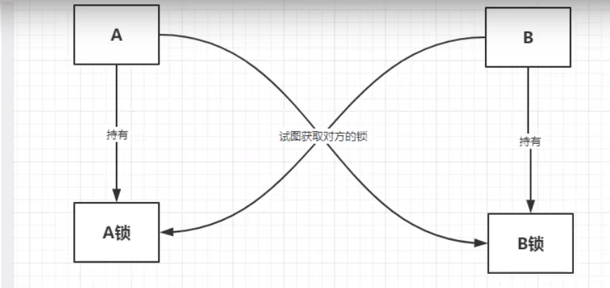

# 并发编程

## 1.线程与进程
> 一句话说出来
- 一个进程包括多个线程,至少一个.java默认,2个线程!!!---main,GC
- 如:开了一个idea,我们写代码,它会自动保存---线程负责

- 以前建一个线程:Thread,Runnable,Callable
- **java真的可以开启线程吗**???---开不了
- 使用本地方法 private native void start0(); 底层C++开启的
> 并发,并行
- **并发**:多线程操作**同一个资源**,即资源在操作方法外
    - CPU一核,模拟出多线程,---天下武功,唯快不破,快速交替
- **并行**:多个人一起行走,
    - CPU多核,多个线程可以一起执行;**线程池**
  
- 查看CPU数
  
  ```
      // 获取CPU的核数
          // CPU,密集型,IO密集型
          System.out.println(Runtime.getRuntime().availableProcessors());
  
  ```

- 并发编程的**本质**:充分利用电脑CPU资源
- 所有公司都很看重

## 2.回顾
> 线程有哪几个状态
- NEW RUNNABLE  BLOCKED WAITING TIMED_WAITING  TERMINATED
- 新生 运行      阻塞     等待(死等)  超时等待      终止
  

> wait/sleep 区别
- 1.来自不同类
  - wait==>object 
  - sleep==>Thread
  - 公司用:TimeUnit ==>concurrent工具类
  
- 2.关于锁的释放
  - wait 会释放锁
  - sleep 睡觉了,抱着锁睡觉,不会释放.
  
- 3.使用范围:
  - wait  必须同步代码块
  - sleep 可以任何地方睡
  

## 3.lock锁(重点)
> 传统Synchronized
- 线程一个单独的资源类,他没有任何附属!!!所以lambda

> Lock
- 可重入锁:ReentrantLock
  - 公平锁:十分公平,先来后到
  - **非公平锁:可以插队(默认)**   ---因为公平了等的时间啥的太长,太慢
  
- zjz说: 
  - 三步:第一步外部,建锁
  - 内部,方法内业务代码前加锁,业务代码后解锁
  


> Synchronized 和 lock的区别
- 1.Synchronized 内置的java关键字,Lock是一个java类
- 2.Synchronized 无法判断获取锁的状态,Lock可以判断是否获取到了锁
- 3.Synchronized 会**自动**释放锁,lock必须要**手动**释放锁! 不释放就会死锁
- 4.Synchronized 线程1(获得锁,阻塞)  线程2(等待,傻傻的等)  -- lock就不一定等待了 lock可以使用trylock()来尝试获取锁
- 5.Synchronized 可重入锁,不可以中断,非公平的.Lock 可重入锁,可判断锁,公平不公平有设置方法
- 6.Synchronized 适合锁少量的代码同步问题,Lock锁,适合**锁大量的同步代码**


> 锁是什么?如何判断锁的是谁?
- 生产者,消费者问题- 判断等待,业务,通知
- 大有门道,
  - 以前的,synchronized版 wait notify
  - 现在:JUC

- zjz说:
  - 生产者,消费者,无非就是三要素,一个判断---等待(判断是否满足,不满足就等待),通知(唤醒),notify()

- 问题:ABCD四个线程
  - 虚假唤醒: 等待应该总存在循环中--->放在while()
  - if判断,只会判断一次,while是总是会去判断


> Lock版的生产者,消费者
- condition 提供等待和唤醒
- lock加锁---加锁,业务,解锁
- 判断等待,业务,唤醒


> 任何一个新技术,绝对不仅仅是覆盖原来的技术,还有优势和补充.
> 
> Condtion
- 精准通知和唤醒进程


### 8锁现象
> 8锁现象
- 如何判断锁的是谁,知道什么是锁,锁到底锁的是谁?
- 对象,Class

- static 就会锁class


- 1.标准情况下,两个线程先打印发短信还是打电话?---同一个锁(synchronized)下,先拿锁的先执行
- 2.延迟4秒,两个线程先打印发短信还是打电话/---同一个锁(synchronized)下,先拿锁的先执行
- 3.增加一个普通方后!是先执行发短信还是hello?   
   普通方法先调用
- 4.两个对象,两个同步方法,发短信还是打电话?
    如果一个锁有延迟,先走不延迟的那个
  
- 5.加static锁的是class
- 6.两个对象----同样也是由class进行了,而非方法

- 7.一个延时的静态同步方法,一个普通同步方法 --- 先走普通同步方法
- 8.两个对象.一个延时的静态同步方法,一个普通同步方法 --- 先走普通同步方法


> 小结
- new this 具体的一个手机
- static Class 唯一的一个模板


## 6.集合不安全


> ArrayList的不安全
- 最好就是JUC下的CopyOnWriteArrayList  写入时复制保证安全----关键它没使用线程同步,所以快
  
  ```
     // ArrayList 并发下不安全,解决方案
     // 1.  List<String> list1 = new Vector<>();  // Vector 出来的比ArrayList出来的早
     // 2. List<String> list1 = Collections.synchronizedList(new ArrayList<>());
     // 3. List<String> list1 = new CopyOnWriteArrayList<>();  JUC包下的 
  
          List<String> list1 = new CopyOnWriteArrayList<>();  // 写入时复制, COW 计算机程序设计领域的一种优化策略
        // 多线程调用时,list,读取的时候,固定的,写入时存在覆盖
        // 在写入时避免覆盖,造成数据问题
        // 读写分离 mycat
          // CopyOnWriteArrayList 比Vector 牛逼在哪里---只要由synchronized效率一般都低
  
  
  
  ```
  
> Set不安全
  
  ```
    //        HashSet<String> set = new HashSet<>();
    //        Set<String> set = Collections.synchronizedSet(new HashSet<>());  // 使用Collections
            Set<String> set = new CopyOnWriteArraySet<>();  // 使用JUC
  
  ```

- HashSet底层- HashMap
  - 用了人家的key
  - add的时候就是:map.put.... ---map的key是无法重复的!
  
  ```
  
    public HashSet() {
        map = new HashMap<>();
        }
      
  ```


> HashMap的不安全---ConcurrentXXX
- map的基本操作


  
  ```
  //        Collections.synchronizedMap()
  //        new ConcurrentMap<>()
          ConcurrentHashMap<String, Object> map = new ConcurrentHashMap<>();
  
  
  ```


## Callable
- 多线程中，第3种获得多线程的方式，Callable。它与Runnable有什么区别呢？
 - 是否有返回值
 - 是否抛异常
 - 方法不一样，一个是call，一个是run

- 创建线程的目的就是为了让线程去执行我们的方法,
  - 线程里写我们的业务,
  - 主函数调用---- Thread thread = new Thread(race,"兔子");  // race是实现Runnable的类
      - 这段代码就是new了一个线程对象,将参数(实现Runnable的对象)放进去
  - 有.start()方法的是线程

- 直接lambda的方式是直接启动一个线程对象,里面的业务方法是Runnable的函数式接口,然后写的方法就相当于实现类写的


> 代码测试


- Callable

  
- **细节**:
  - 1.有缓存
  - 2.结果可能需要等待,会阻塞
  

## 8.常用辅助类
- 8.1 CountDownLatch---计数器,,,记完再向下执行
  - 允许一个或者多个线程等待直到其它线程中执行的一组操作完成的同步辅助
  - 就是当一部分线程执行完,再执行下一步,
  
  ```
  
      public class CountDownLatchTest {
          // 总数是6
          public static void main(String[] args) throws InterruptedException {
      
              // 必须完成某个任务才能到下一个方法时使用
              CountDownLatch countDownLatch = new CountDownLatch(6);
      
              for (int i = 0; i < 6; i++) {
                  new Thread(()->{
                      System.out.println(Thread.currentThread().getName()+"--离开---");
                      countDownLatch.countDown();
                  },String.valueOf(i)).start();
              }
      
              countDownLatch.await(); // 等待计数器归0,然后再向下执行
      
              System.out.println("Close door");
          }
      }
      
  
  ```


- 8.2 CyclicBarrier---加法计数器
- 

  ```
  
      CyclicBarrier cyclicBarrier = new CyclicBarrier(7,()->{
              System.out.println("Game Over");
          });
  
  ```
  
- cyclicBarrier.await(); // 计数..


- 8.3 Semaphore
- 


  ```
  
         // 线程数量:停车位 ! 限流!
        Semaphore semaphore = new Semaphore(3);
          
          
        // acquire() 得到
         semaphore.acquire();
                
                      
                      
        // release() 释放
        semaphore.release();
  
  
  ```


##  9.读写锁--独占锁(写锁),共享锁(读锁)
- ReadWriteLock
 -  private ReadWriteLock readWriteLock= new ReentrantReadWriteLock();
  -   readWriteLock.writeLock().lock();    readWriteLock.writeLock().unlock();
  -  readWriteLock.readLock().lock();     readWriteLock.readLock().unlock();
- 独占锁(写锁),共享锁(读锁)
  - 独占锁  一次只能被以一个线程占用
  - 共享锁:多个线程同时占有
  


## 阻塞队列
> BlockingQueue  
- 阻塞
- 队列---FIFO


> 什么场景使用:
- BlockingQueue 阻塞队列  Deque(双端队列)  AbstractQueue
- 什么情况我们使用阻塞队列:线程池(源码就有),多线程并发处理!


> 队列的位置


> 使用:
- 添加 - 移除
- 对应四组API
  - 1.抛出异常
  - 2.不会抛异常
  - 3.阻塞 等待
  - 4.超时等待
  


- SynchronousQueue 同步队列 --- put了就得取出来,然后才能继续
- 没有容量
  - 进去一个元素,必须的等待取出来后,才能往里面放一个元素'
  - put,take


## 线程池(重点)
- 使用线程池了,就要用线程池创建线程
> 池化技术
- 程序的运行,本质:占用系统的资源!! 优化资源的使用!==>池化技术
- 线程池,连接池,内存池,对象池...创建,销毁,十分浪费资源

> 技术配置
- 事先准备好一些资源,有人要用,就来这里拿,用完后还回来

- 默认大小:2
- 线程池的好处:
  - 1.降低资源的消耗
  - 2.提高响应速度
  - 3.方便管理
  
- **线程复用,可以控制最大并发数,管理线程**

### 线程池:三大方法,7大参数,4种拒绝策略
- Executors 工具类,三大方法                  ------创建一个线程池
- newSingleThreadExecutor()   // 单个线程处理
- newFixedThreadPool(5);    // 创建一个固定的线程池大小
- newCachedThreadPool();    // 可伸缩的,遇强则强,遇弱则弱


> 七大参数


  ```
  
     ThreadPoolExecutor(
       int corePoolSize, 
       int maximumPoolSize, 
       long keepAliveTime, 
       TimeUnit unit,
       BlockingQueue<Runnable> workQueue, 
       ThreadFactory threadFactory,
       RejectedExecutionHandler handler
         )  
  ```

- corePollSize ：核心线程数。在创建了线程池后，线程中没有任何线程，等到有任务到来时才创建
  线程去执行任务。默认情况下，在创建了线程池后，线程池中的线程数为0，当有任务来之后，就会创建
  一个线程去执行任务，当线程池中的线程数目达到corePoolSize后，就会把到达的任务放到缓存队列当
  中。
  
- maximumPoolSize ：最大线程数。表明线程中最多能够创建的线程数量，此值必须大于等于1
- keepAliveTime ：空闲的线程保留的时间
- TimeUnit ：空闲线程的保留时间单位。
- BlockingQueue< Runnable> ：阻塞队列，存储等待执行的任务。参数有ArrayBlockingQueue、
  LinkedBlockingQueue、SynchronousQueue可选。
  
- ThreadFactory ：线程工厂，用来创建线程，一般默认即可
- RejectedExecutionHandler ：队列已满，而且任务量大于最大线程的异常处理策略。有以下取值


> 手动创建一个线程池

  ```
  
      public class BuildPool {
          public static void main(String[] args) {
              ExecutorService threadPool = new ThreadPoolExecutor(
                      2,  // corePoolSize
                      5,  // maximumPoolSize
                      3,  // keepAliveTime
                      TimeUnit.SECONDS,
                      new LinkedBlockingQueue<>(3),
                      Executors.defaultThreadFactory(),
                 //   new ThreadPoolExecutor.AbortPolicy()// 不处理,抛出异常
                 //    new ThreadPoolExecutor.CallerRunsPolicy() // 哪来的去哪里,目前是main执行
                 //    new ThreadPoolExecutor.DiscardPolicy() // 队列满了就丢掉,不会抛出异常
                      new ThreadPoolExecutor.DiscardOldestPolicy() // 队列满了就和最早的去竞争,不会抛出异常
                );
      
              try {
                  // 最大承载:Queue+max ,目前:5+3 = 8
                  // 超出最大承载:
                  for (int i = 0; i < 15; i++) {
                      threadPool.execute(()->{
                          System.out.println(Thread.currentThread().getName()+"执行");
                      });
                  }
              } catch (Exception e) {
                  e.printStackTrace();
              } finally {
                  threadPool.shutdown();
              }
          }
      }
      
  
  
  
  ```

- 最大线程到底如何去定义(调优)
  - 1.CPU 密集型,,几核就是几,CPU效率最高
    -   System.out.println(Runtime.getRuntime().availableProcessors());
  - 2.IO  密集型
    - 判断你程序中十分耗IO的线程
    - 程序:15个大型任务, IO十分占用资源!


## 四大函数式接口(必须掌握)
- 新时代程序员:lambda表达式,链式编程,函数式接口,Stream流式计算
> 函数式接口
- 只有一个方法的接口
 -  @FunctionalInterface
- foreach(消费者类型的函数式接口)


- 函数型接口，有一个输入，有一个输出
  ```
  
    // 单参数String单返回 ------ Function function = o->o(操作);
    Function function = (Str)->{return Str;};
          function.apply("dsasd");
  ```  


- 断定型接口，有一个输入参数，返回只有布尔值。
  
  ```
          Predicate<String> predicate = (str) ->{return str.isEmpty();};
        System.out.println(predicate.test(""));   // true
  ```

- Consumer 消费型接口
- Supplier 供给型接口


### 流式计算
- 什么是流式计算
- 存储+计算
- 存储:集合,数据库---存东西
- 计算应该交给流操作!!!
  
  ```

      // 链式编程  // 集合就是存储,计算交给Stream流
      users.stream().
               filter(user -> {return user.getId()%2==0;})  // 偶数
              .filter(user -> {return user.getAge()>23;})   // 大于23岁
              .map(user -> {return user.getName().toUpperCase();})
              .sorted((u1,u2)->{return -u1.compareTo(u2);})
              .limit(1)
              .forEach(System.out::println);

  
  ```


### ForkJoin
> 什么是ForkJoin
- JDK1.7出现
- 作用:并行执行任务,提高效率.大数据量!
- 大数据:MapReduce---大任务拆分成小任务


> 特点:工作窃取:
- 比如B线程完成了自己的任务,会去偷A的任务去执行
- 这个里面维护的都是双端队列

> ForkJoin操作


## 异步回调
- 之前前后端的ajax,异步调用
- Future接口,----使用CompletableFuture进行异步回调

- 过程:异步执行,成功回调||失败回调


## Volatile
> 变量上加Volatile
- Volatile 是java提高的**轻量级**的**同步机制**
- 1.保证可见性---JMM
- 2.**不保证原子性**   ---使用JUC的原子类解决
- 3.禁止指令重排  --- 内存屏障
  
> 指令重排
- 什么是指令重排?---你写的程序,计算机并不是按照你写的那样去执行.
- 源代码-->编译器优化-->指令并行也可能重排--->内存系统也可能重排-->执行
- 处理器在进行指令重排的时候,考虑:数据之间的依赖----


- volatile 可以避免指令重排
- 内存屏障,CPU指令,作用:  
  - 1.保证特定的操作执行顺序
  - 2.可以保证某些变量的内存可见性(利用这些特性volatile实现了可见性)
- 内存屏障:在单例模式中使用的最多....  


## JMM
- JMM:java内存模型,不存在的东西,是一个概念,约定!
- 1、线程解锁前，必须把共享变量的值`立刻`刷新回主内存
- 2、线程加锁前，必须读取主内存的最新值到自己的工作内存
- 3、加锁解锁是同一把锁


> 内存交互操作
- 内存交互操作有8种，虚拟机实现必须保证每一个操作都是原子的，不可在分的（对于double和long类
  型的变量来说，load、store、read和write操作在某些平台上允许例外）
  - lock （锁定）：作用于主内存的变量，把一个变量标识为线程独占状态
  - unlock （解锁）：作用于主内存的变量，它把一个处于锁定状态的变量释放出来，释放后的变量才可以被其他线程锁定
  - read （读取）：作用于主内存变量，它把一个变量的值从主内存传输到线程的工作内存中，以便随后的load动作使用
  - load （载入）：作用于工作内存的变量，它把read操作从主存中变量放入工作内存中
  - use （使用）：作用于工作内存中的变量，它把工作内存中的变量传输给执行引擎，每当虚拟机遇到一个需要使用到变量的值，就会使用到这个指令
  - assign （赋值）：作用于工作内存中的变量，它把一个从执行引擎中接受到的值放入工作内存的变量副本中
  - store （存储）：作用于主内存中的变量，它把一个从工作内存中一个变量的值传送到主内存中，以便后续的write使用
  - write （写入）：作用于主内存中的变量，它把store操作从工作内存中得到的变量的值放入主内存的变量中


- 线程A感知不到线程B操作了值的变化！如何能够保证线程间可以同步感知这个问题呢？只需要使用Volatile关键字即可！
  volatile 保证线程间变量的可见性，简单地说就是当线程A对变量X进行了修改后，
 - 在线程A后面执行的其他线程能看到变量X的变动，更详细地说是要符合以下两个规则:
  - 线程对变量进行修改之后，要立刻回写到主内存。
  - 线程对变量读取的时候，要从主内存中读，而不是缓存


### 指令重排
> 写的程序,计算机不是按照写的那样去执行的
> 
> 源代码-->编译器优化的重排-->指令并行也可能会重排-->内存系统也会重排-->执行
>
- `处理器在进行指令重排时.规范:数据之间的依赖性!!!`

- volatile可以避免指令重排
- 内存屏障,CPU指令:
  - 1.保证特定的操作的执行顺序
  - 2.可以保证某些变量的内存可见性(利用这些特性,就可以保证volatile的可见性)
  
- 内存屏障:禁止上面指令和下面指令顺序交换!!----而volatile保证这个变量上下执行时都加一个内存屏障


### CAS
- 什么是CAS--->期望的一个值,那么就更新这个值 
- 比较并交换--compareAndSet--->compareAndSwapInt

  ```
        AtomicInteger atomicInteger = new AtomicInteger(2020);
        // 期望,更新
        // public final boolean compareAndSet(int expect, int update)
        // 如果我期望的值达到了,那么就更新,否则,就不更新
        atomicInteger.compareAndSet(2020,2021);

        System.out.println(atomicInteger.get());
  ```


- 自旋锁:do--while----不满足一直执行
  ```
  
     public final int getAndAddInt(Object var1, long var2, int var4) {
          int var5;
          do {
              var5 = this.getIntVolatile(var1, var2);
          } while(!this.compareAndSwapInt(var1, var2, var5, var5 + var4));
  
          return var5;
      }
  
  ```

- 总结:
  - CAS:比较当前内存的值和主内存中的值,如果值是期望的,那么执行操作,否则不执行--此时会一直循环(自旋锁)
  - 缺点:
    - 1.耗时
    - 2.一次性只能保证一个共享变量的原子性
    - 3.ABA问题


###  unsafe
- java无法操作内存,java可以调用C++,C++可以操作内存
  - unsafe,java的后门,可以通过这个类操作内存


### ABA
- CAS:ABA问题---狸猫换太子

  
- 原子引用,带版本号的操作
- Integer使用了对象缓存机制,默认范围是-128~127,,
  推荐使用**静态工厂方法valueOf获取对象实例**,而不是new,因为valueOf()使用缓存,而**new一定会创建新的对象分配新的内存空间**.
  

- 所有相同类型的包装类对象之间值的比较,全部使用equals方法比较,
  - Integer var =?在-128~127之间赋值,Integer对象是在IntegerCache.cache产生的,会复用已有对象,这个区间的Integer值可以用==进行比较
  - 但是这个区间外的所有数据`<-128`,,,`>127` 都会在堆上产生,不会复用已有对象,这是一个**大坑**,推荐使用equals判断


### 各种锁
> 1.公平锁:非常公平.不能插队,先来后到
> 非公平锁:非常不公平,不能插队,(默认非公平,毕竟不能需要3s等3小时)
  ```
    Lock lock = new ReentrantLock(true);  // true为公平锁
  ```
  
> 2.可重入锁--递归锁
- 所有锁都是可重入锁,
- 定义:拿到外面的锁之后,就可以拿到里面的锁,自动获得.
- 注意:lock锁必须配对,否则死在里面


> 3.自旋锁
- 不断的尝试,直到成功为止
  
  ```
      // 自旋锁
      public class SpinLockDemo {
          // CAS
          // 不写参数,默认null  数值 0
          AtomicReference<Thread> atomicReference = new AtomicReference<>();
          //加锁
      
          public void myLock(){
              Thread thread = Thread.currentThread();
              System.out.println(Thread.currentThread().getName()+" ===>mylock");
              // 自旋锁
              while (atomicReference.compareAndSet(null,thread)){
      
              }
          }
      
          // 解锁
          public void myUnLock(){
              Thread thread = Thread.currentThread();
              System.out.println(Thread.currentThread().getName()+" ===>myUnlock");
              // 自旋锁
              atomicReference.compareAndSet(thread,null);
          }
      
      }
  
  ```


> 死锁 - 一个锁里锁着另一个锁
 


- synchronized(lockA){     synchronized(lockB)    }
- 一个线程手里拿两个资源
- 多个线程各自占有一些共享资源 , 并且互相等待其他线程占有的资源才能运行 ,
  而导致两个或者多个线程都在等待对方释放资源 , 都停止执行的情形 .
  某一个同步块同时拥有**两个以上对象的锁**时 , 就可能会发生**死锁**的问题


> 解死锁
- 解开死锁的条件,破坏之一
- 产生死锁的四个必要条件：
  - 1. 互斥条件：一个资源每次只能被一个进程使用。
  - 2. 请求与保持条件：一个进程因请求资源而阻塞时，对已获得的资源保持不放。
  - 3. 不剥夺条件 : 进程已获得的资源，在末使用完之前，不能强行剥夺。
  - 4. 循环等待条件 : 若干进程之间形成一种头尾相接的循环等待资源关系

> 解决办法:
- 1.使用`jps - l`定位进程号:
- 2.使用`jstack进程号` 找到死锁问题


### 面试,工作中遇到的问题
- 1.日志
- 2.堆栈信息


## 不完全的图


