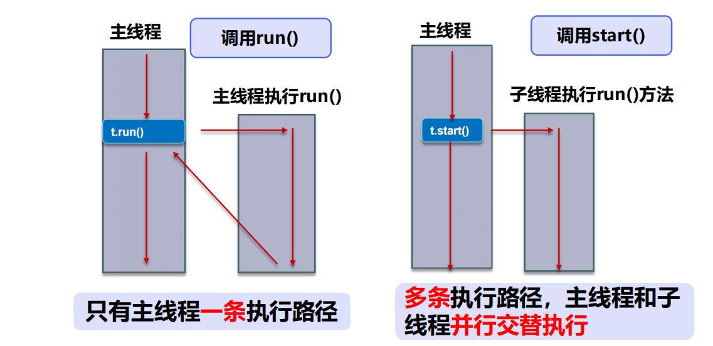
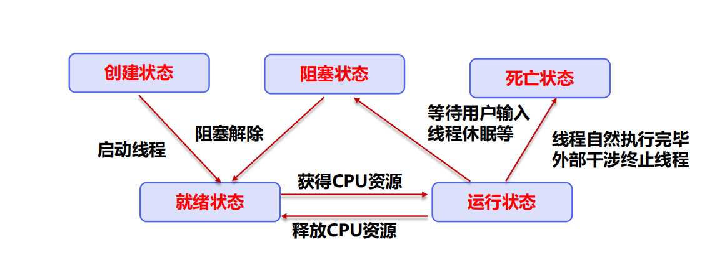
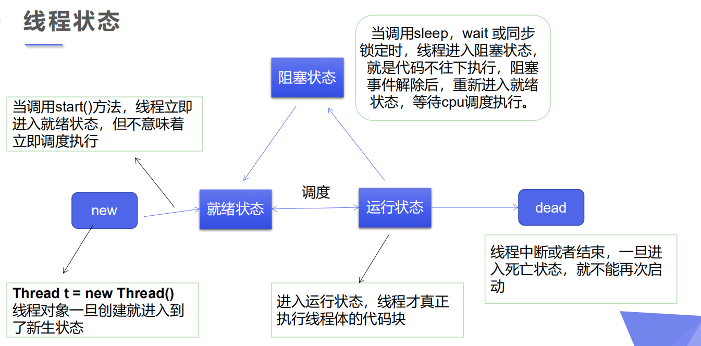
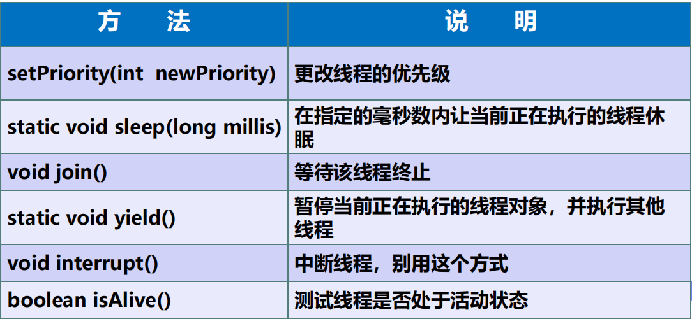

# 线程
- 目标:了解为啥它这么流行? 如何解决掉面试官的问题?如何把它用起来
- 作用: ---用于什么场景
- 怎么用:
  

- [⑥Note_多线程](zh-cn/java/NOTES/Note_多线程.md)
- [⑧并发](zh-cn/java/NOTES/并发.md)
- [NOTES_ThreadStudey](zh-cn/java/NOTES/Thread/NOTES_ThreadStudey.md)
- [NOTES_ThreadSynchronization](zh-cn/java/NOTES/Thread/NOTES_ThreadSynchronization.md)

## 定义:



- 没run不执行,但run只是一个普通方法

- t1.run();  只是调用了一个普通方法，并没有启动另一个线程，程序还是会按照顺序执行相应的代码。

- t1.start();  则表示，重新开启一个线程，不必等待其他线程运行完，只要得到cup就可以运行该线程。
- 原因:
 - 首先看下run方法,发现里面走一个target
    ```
        @Override
        public void run() {
            if (target != null) {
                target.run();
            }
        }
    
    
    ```
   
 - 再看tatget,发现它是一个Runnable对象
`/* What will be run. */
private Runnable target;`
   
- 那么Thread类中的run方法就是说：如果有**Runnable子类对象**（当然Runable是接口，没有直接对象），**就会调用run方法**，如果没有该对象，则什么操作都没有！

  


- 线程就是独立的执行路径；
- 在程序运行时，即使没有自己创建线程，后台也会有多个线程，如主线程，gc线程； 
- main() 称之为主线程，为系统的入口，用于执行整个程序；
- 在一个进程中，如果开辟了多个线程，线程的运行由调度器安排调度，调度器是与 操作系统紧密相关的，先后顺序是不能认为的干预的。
- 对同一份资源操作时，会存在资源抢夺的问题，需要加入并发控制；
- 线程会带来额外的开销，如cpu调度时间，并发控制开销。
- **每个线程在自己的工作内存交互，内存控制不当会造成数据不一致**


## 创建:
### 创建线程方式一:继承Thread类,重写run()方法,调用start
- 自定义线程类继承Thread类 
- 重写run()方法，编写线程执行体
- 创建线程对象，调用start()方法启动线程

- 总结:注意,线程开启不一定立即执行,由CPU调度


- 开始:要想操作多线程,注意就是对IO文件进行
- 1.下载commons-io包jar
- 新建lib,放进去,然后右键add as library 
- 下载东西..
  
    ```
    
        public class TestThreadDown extends Thread{
        
            private String url; // 网络图片的地址
            private String name; // 保存的文件名
        
            public  TestThreadDown(String url,String name){
                this.url=url;
                this.name=name;
            }
            
            // 下载图片线程的执行体
            @Override
            public void run() {
              WebDownloader webDownloader = new WebDownloader();
                webDownloader.downloader(url,name);
                System.out.println("下载了文件名为:"+name);
            }
        
        
            public static void main(String[] args) {
                TestThreadDown t = new TestThreadDown("https://img2020.cnblogs.com/blog/2508133/202109/2508133-20210920182859176-1378059383.png","1.png");
                TestThreadDown t1 = new TestThreadDown("https://img2020.cnblogs.com/blog/2508133/202109/2508133-20210920182847694-1327752584.png","2.png");
                TestThreadDown t2 = new TestThreadDown("https://img2020.cnblogs.com/blog/2508133/202109/2508133-20210920183237097-1882601877.png","3.png");
        
                /*
                 * 下载了文件名为:3.png
                 * 下载了文件名为:2.png
                 * 下载了文件名为:1.png
                 * */
                
                t.start();
                t1.start();
                t2.start();
                
            }
        }
        
        // 下载器
        class WebDownloader{
            // 下载方法
            public void downloader(String url,String name) {
                try {
                    FileUtils.copyURLToFile(new URL(url),new File(name));
                } catch (IOException e) {
                    e.printStackTrace();
                    System.out.println("IO异常,downloader方法出现的问题");
                }
        
        
            }
        }
        
    ```
  
### 实现Runnable
- 定义MyRunnable类实现Runnable接口 
- 实现run()方法，编写线程执行体 
- 创建线程对象，调用start()方法启动线程
- -------------------------------------推荐使用Runnable接口,因为Thread单继承的局限..
    ```
        package com.ThreadStudy;
        
        public class TestThread2 implements Runnable{
            @Override
            public void run() {
                for (int i = 0; i < 20; i++) {
                    System.out.println("run方法:---->"+i);
                    
                }
            }
        
        
            public static void main(String[] args) {
        
                // 创建一个Runnable接口的实现类对象,
                TestThread2 testThread2 = new TestThread2();
                // 创建线程对象,通过线程对象来开启我们的线程,代理,把我们的对象丢进去
                Thread thread = new Thread(testThread2);
                thread.start();
        
        //        new Thread(testThread2).start();
        
                for (int i = 0; i < 20; i++) {
                    System.out.println("main方法:--->"+i);
                }
        
        
        
        
        
        
        
            }
        }
        
    
    
    ```


### 小结
- 1.继承Thread类
  - 子类**继承Thread类具备多线程能力**
  - 启动线程：子类对象. start() 
  - 不建议使用：避免OOP单继承局限性
  
- zjz记
  - 因为继承了,所以我们的对象成为了一个线程对象
  - 这也使得有了很多局限性,
  - 我们想要的线程应该是类似于代理
  
- 2.实现Runnable接口 
  - 实现接口Runnable具有多线程能力 
  - 启动线程：传入目标对象+Thread对象.start() 
  - 推荐使用：避免单继承局限性，灵活方便，方便同一个对象被多个线程使用
- zjz记 
  - 采用Runnable方式可以避免Thread方式由于Java单继承带来的缺陷-推荐使用
  - Thread 的对象有很多有意思的做法,比如赋予ID,Name等等
  - 它的本质是,我们的对象依旧是我们的对象,但是可以**使用线程对象来包裹我们的对象**,线程对象具备我们对象的能力.


### zjz的思考
- 1.单线程是什么?到底能干啥???
  - 单线程是为了能与main线程同时运行,然后**能抢CPU时间**(这个是主要的!!!),
    - 普通方法被调用时,不会抢夺时间片的,一切顺着主main来
    - 而单线程的创建是直接创一个类对象,但是通过start的方式,去运行独有的run方法!---此时就会有main线程同你的单线程一起跑!!
  - 应用:也就是减少一些运行时间,让你的方法不在被main约束(从上到下运行).---
    - 比如你的main中有两个方法运行,它们依旧按照从上往下,而Thread不遵从的(main1跑完--->main2----中间混合着线程跑)
    - 但是对于同一个run方法里的方法,还是按照顺序执行的,(run1跑完-->run2)
- 2.多线程是什么?怎么跑?
  - 先知道怎么区分吧 Thread.currentThread().getName()    // 获取当前线程的名字
  - 然后测试时发现,将公共数(n)定义在run方法中,每个人都会执行n次
    - 但是定义在类中,它们会共同执行这个数
    - 原因:线程跑的就是run里面的东西,run里面的执行结是影响类的
      - 如果定义在方法体中的数,那么每个线程运行这个方法时都会获得到一个新的n,那肯定跑n次啊
      - 如果是定义在类中的,它们共同使用这个,每个人的行为会影响着这个数,包括主函数
  

- 多线程的两种情况
  - 1.每个人跑每个人的,互不干扰...(目标在run中)---并行
    - 所以此时每个线程都是一个独立的个体,它们每个都拥有方法的全部东西.
    - 所以:::线程间共享进程的所有资源，**每个线程拥有自己独立的运行栈和程序计数器(pc)**。
  - 2.好几个人抢一个,,,(目标在类中)---很多时候目标都是在类中的,因为不会让你经常变run...
  

- 举例
  - 龟兔赛跑
    - 目的:找到谁是跑的最快的
    - 本篇主要是解决怎么中断比赛: 出了直接退出的System.exit();
    - 还可以采用注入式的方式控制for的 break;---还可以使用while进行判断循环
    - run 方法由boolean flag控制是否break;run提供它的步数给Over
    - 而flag由Over方法控制,Over提供true false
    - 而Over由winner控制,,,第一波时获取一个对象,第二波时如果已经有对象了一直阻断交易(重点)
    - 其它情况正常运行就行
    - 它采用的时切入式的控制
  
  ```
  
      public class Race implements Runnable{
      
          // 获得胜利者,核心控制
          private static String winnner;
          @Override
          public void run() {
              for (int i = 1; i < 101; i++) {
                  System.out.println(Thread.currentThread().getName()+"--->跑了"+i+"米");
                 
                  // 判断是否结束,此时切入控制
                  boolean flag = gameOver(i);
                  if (flag){
      //                System.exit(0);
                      break;
                  }
              }
      
          }
      
      
      // 判断结束
          public Boolean gameOver(int steps){
              // 获取胜利者
              if(steps>=100){
                  winnner = Thread.currentThread().getName();
                  System.out.println("Winner is "+winnner);
                  return true;
              }
      
              // 不断阻断运行
              if(winnner!=null){
                  return true;
              }
      
              return false;
          }
      
      
          public static void main(String[] args) {
              Race race = new Race();
      
              Thread thread = new Thread(race,"兔子");
              Thread thread1 = new Thread(race,"乌龟");
      
              thread.start();
              thread1.start();
      
          }
      }
      
  
  
  ```


### 实现Callable接口(了解)
- 1.实现Callable接口，需要返回值类型 
- 2.重写call方法，需要抛出异常 
- 3.创建目标对象 
- 4.创建执行服务：ExecutorService ser = Executors.newFixedThreadPool(1); 
- 5.提交执行：Future<Boolean> result1 = ser.submit(t1); 
- 6.获取结果：boolean r1 = result1.get() 
- 7.关闭服务：ser.shutdownNow();

   ```
           /*
          * 线程创建方式3
          *
          * 实现Callable接口
          *
          * */
  
          public class TestCallable implements Callable<Boolean> {
          
          
              private String url; // 网络图片的地址
              private String name; // 保存的文件名
          
              public  TestCallable(String url,String name){
                  this.url=url;
                  this.name=name;
              }
          
              // 下载图片线程的执行体
              @Override
              public Boolean call() {
                  WebDownloader webDownloader = new WebDownloader();
                  webDownloader.downloader(url,name);
                  System.out.println("下载了文件名为:"+name);
                  return true;
              }
          
          
              public static void main(String[] args) throws ExecutionException, InterruptedException {
                  TestCallable t0 = new TestCallable("https://img2020.cnblogs.com/blog/2508133/202109/2508133-20210920182859176-1378059383.png","1.png");
                  TestCallable t1 = new TestCallable("https://img2020.cnblogs.com/blog/2508133/202109/2508133-20210920182847694-1327752584.png","2.png");
                  TestCallable t2 = new TestCallable("https://img2020.cnblogs.com/blog/2508133/202109/2508133-20210920183237097-1882601877.png","3.png");
          
                  /*
                   * 下载了文件名为:3.png
                   * 下载了文件名为:2.png
                   * 下载了文件名为:1.png
                   * */
          
                  // 创建执行服务
                  ExecutorService executorService = Executors.newFixedThreadPool(3);
                  // 提交执行
                  Future<Boolean> result0 = executorService.submit(t0);
                  Future<Boolean> result1 = executorService.submit(t1);
                  Future<Boolean> result2 = executorService.submit(t2);
                  // 获取结果
                  Boolean r1 = result0.get();
                  Boolean r2 = result1.get();
                  Boolean r3 = result2.get();
          
                  // 关闭服务
          
                  executorService.shutdownNow();
          
              }
          }
          
          
          // 下载器
          class WebDownloader{
              // 下载方法
              public void downloader(String url,String name) {
                  try {
                      FileUtils.copyURLToFile(new URL(url),new File(name));
                  } catch (IOException e) {
                      e.printStackTrace();
                      System.out.println("IO异常,downloader方法出现的问题");
                  }
          
          
              }
          }
           
       
       
   ```


# 线程状态
- 五大状态









- 方法
 - setPriority(int newPriority)  更改线程的优先级
 - static void sleep(long millis) 在指定的毫秒数内让当前正在执行的线程休眠
 - void join()   等待该线程终止
 - static void yield() 暂停当前正在执行的线程对象，并执行其他线程
 - boolean isAlive() 测试线程是否处于活动状态


## 停止线程 ---stop
- 不推荐使用JDK提供的 stop()、 destroy()方法。【已废弃】 
- 推荐线程自己停止下来 
- 建议使用一个标志位进行终止变量 当flag=false，则终止线程运行
  
### 1.停止方法一,让线程自己执行到某一部分停止
> 思路:如果只有一个外切标志,是无法指挥停止的
> 
> 因为它不知道线程运行到哪里了
> 
> 所以我们需要---线程返回一个状态---停止方法获取状态---然后让线程停止
>
 
- 1.设置方法,,,,获得标志进行改变 -- 一个方法
- 2.run中加停止..1.送状态 2.方法控制停止 --- 两个if
 
  ```
      /*
      *
      * 两个线程运行
      * 某一个到80次全部停止
      *
      * */
      
      public class TestThreadStop implements Runnable{
          String Status; // 线程要的状态
          
          @Override
          public void run() {
                  for (int i = 0; i < 100; i++) {
                      System.out.println(Thread.currentThread().getName()+"线程运行次数:"+i);
                      if(i==10){
                          Status = "stop"; // 停止状态发送
                      }
                       // 停止方法
                      if(stopThread(Status)){
                          break;
                      }
                  }
              }
      
              public boolean stopThread(String Status){
      
              if(Status!=null){
                return true;
              }
              return false;
          }
      
      
          public static void main(String[] args) {
      
              TestThreadStop testThreadStop = new TestThreadStop();
              new Thread(testThreadStop,"线程1").start();
              new Thread(testThreadStop,"线程2").start();
      
          }
      }
  
  
  ```  
  

## 思考
- 为啥  while (stopThread(Status))这个就不能控制,,
  - 因为这个for本来就是抓住一次就运行完了..可以在里面设置成i++修改
  - 总:run里面的东西,只有抓住机会就跑了,,,所以卡点时要多思考,比如while里写for---while肯定限制不住for,for要跳出,只能break;exit();
    
  ```
     @Override
        public void run() {
            // 控制线程运行
            int i = 0;
            while (stopThread(Status)){
                    System.out.println(Thread.currentThread().getName()+"线程运行次数:"+ (i++));
                    if(i==10){
                        Status = "stop"; // 停止状态发送
                    }
                }
            }
  
  
  ```


### 暂停方法二,让外部控制线程的停止

-  1.设置一个标志位
    `private  boolean flag = true;`
     
  - 2.创建停止方法
    - 直接使用while将线程的执行体给括住
  - 3.由其它东西来提供一个false,这个即可终止
  

  ```
  
      // 1.设置一个标志位
      private  boolean flag = true;
  
      @Override
      public void run() {
          int i = 0;
          while (flag){
              System.out.println("run --- Thread"+i++);
          }
      }
  
      // 2.设置一个公开的方法停止线程,用于转换标志位状态
  
      public void stop(){
          this.flag=false;
      }
  // 3.比如main调用
  bean.stop();
  ```


## 线程休眠---sleep
- sleep (时间) 指定当前线程阻塞的毫秒数； 1s=1000ms
- sleep存在异常InterruptedException；
- sleep时间达到后线程进入就绪状态；
- sleep可以模拟网络延时，倒计时等。
- **每一个对象都有一个锁，sleep不会释放锁；**


- 模拟网络延时:放大问题的发生性

- 模拟倒计时:::非常常见了
- 比如3s内关闭窗口,返回页面..
  ```
  
      // 模拟倒计时
      public void countDown() throws InterruptedException {
          int num = 10;
          while (true){
              Thread.sleep(1000);
              System.out.println(num--);
              if (num<=0){
                  break;
              }
          }
      }
  
  ```


## 线程礼让---Thread.yield();
- 礼让线程，让当前正在执行的线程暂停，但不阻塞
- 将线程从运行状态转为就绪状态 
- 让cpu重新调度，礼让不一定成功！看CPU心情


## 插队 Join
- Join合并线程，待此线程执行完成后，再执行其他线程，其他线程阻塞
- 可以想象成插队
- 使用:插队的人将它的线程bean.join();写到别人的方法体中进插队
- 插队,意味着VIP跑完,其它线程再继续


## 线程状态观测
- Thread.State
- 线程状态;
  - NEW 尚未启动的线程处于此状态
  - RUNNABLE 在java虚拟机中执行的线程处于此状态
  - BLOCKED 被阻塞等待监视器锁定的线程处于此状态
  - WAITING 正在等待另一个线程执行特定动作的线程处于此状态
  - TIMED_WAITING 正在等待另一个线程执行动作达到指定等待时间的线程处于此状态
  - TERMINATED 已退出的线程处于此状态
  
- 死亡后的线程不能再次启动了,即不能两次start();


## 线程优先级
- Java提供一个线程调度器来监控程序中启动后进入就绪状态的所有线程，线程调度 器按照优先级决定应该调度哪个线程来执行。
- 线程的优先级用数字表示，范围从1~10
  -  Thread.MIN_PRIORITY = 1; 
  -  Thread.MAX_PRIORITY = 10; 
  -  Thread.NORM_PRIORITY = 5; 
-  使用以下方式改变或获取优先级 
  - getPriority() . setPriority(int xxx)


## 守护(daemon)线程
- 线程分为用户线程和守护线程 
- 虚拟机必须确保用户线程执行完毕
- 虚拟机不用等待守护线程执行完毕
  - 如,后台记录操作日志,监控内存,垃圾回收等待.


### 静态代理
  ```
      
      /*
      *
      * 静态代理模式总结:
      * 真实对象和代理对象都要实现同一个接口
      * 代理对象要代理真实角色
      *
      * 代理对象可以做好多真实对象做不了的事
      * 真实对象专注做自己的事
      *
      * */
      
      public class StaticProxy {
      
          public static void main(String[] args) {
      
              new Thread(()-> System.out.println("XXX")).start();
      
              You you = new You();
              WeddingCompany weddingCompany = new WeddingCompany(you);
              weddingCompany.HappyMarry();
      
          }
      
      }
      
      
      interface Marry{
          // 人间四大喜事 ---久旱逢甘霖  他乡遇故知  洞房花烛夜 金榜提名时
          void HappyMarry();
      }
      
      
      // 真实角色,你去结婚
      class You implements Marry{
          @Override
          public void HappyMarry() {
              System.out.println("Marry");
          }
      }
      
      
      // 代理角色,帮助你结婚
      class WeddingCompany implements Marry{
      
          // 代理真实目标对象
          private Marry target;
      
          // 代理关键!!!
          public setTarget(Marry target) {
              this.target = target;
          }
        
        public getTargetMethod() {
               this.target.HappyMarry(); // 真实对象
          }
      
          
      
      
          @Override
          public void HappyMarry() {
              before();
             getTargetMethod(); // 调用真实对象的方法
              after();
          }
      
          private void before() {
              System.out.println("结婚之前,布置现场");
          }
      
          private void after() {
              System.out.println("结婚之后,OVER");
          }
      }
      
      
  ```


    