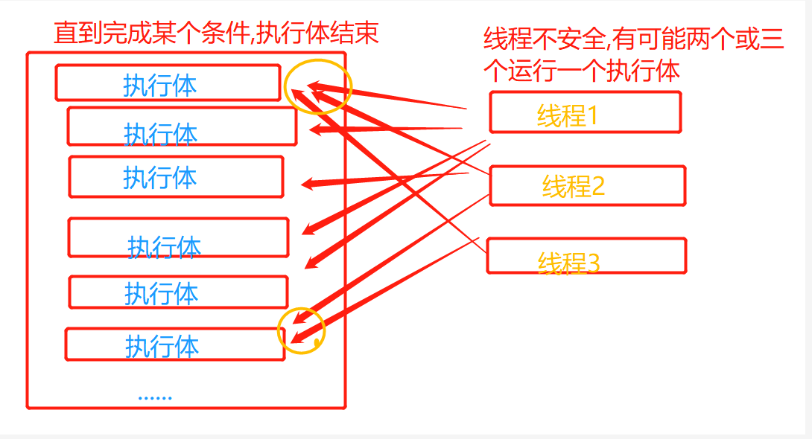
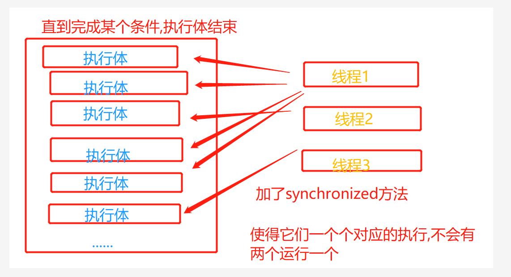
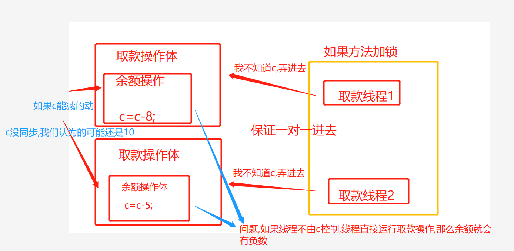

# 同步

- [⑥Note_多线程](zh-cn/java/NOTES/Note_多线程.md)
- [⑧并发](zh-cn/java/NOTES/并发.md)
- [NOTES_ThreadStudey](zh-cn/java/NOTES/Thread/NOTES_ThreadStudey.md)
- [NOTES_ThreadSynchronization](zh-cn/java/NOTES/Thread/NOTES_ThreadSynchronization.md)

> 多个线程操作同一个资源--遇到的问题-并发
> 
> 之前说的在run方法体外的资源
>
- 线程同步
- 队列-----排队 . 一个个来.
- 处理多线程问题时 , 多个线程访问同一个对象 , 并且某些线程还想修改这个对象 . 这时候我们就需要线程同步 . 
  **线程同步其实就是一种等待机制**,多个需要同时访问此对象的线程进入这个对象的等待池形成队列,等待前面线程使用完毕,下一个线程再使用
  

## 队列和锁
- 队列:让这批人排起队伍来
- 锁:进厕所.你进去得关门,要不别人都进去了..
    - 每个线程对象都有一把锁
    
## 线程同步
- 由于同一进程的多个线程共享同一块存储空间 , 
  在带来方便的同时,也带来了访问冲突问题,
  为了保证数据在方法中被访问时的正确性,
  在访问时加入锁机制 synchronized ,
  当一个线程获得对象的排它锁, 独占资源 ,
  **其他线程必须等待**,使用后释放锁即可 .
  存在以下问题:
  - 一个线程持有锁会导致其他所有需要此锁的线程挂起 ;
  - 在多线程竞争下,加锁,释放锁会导致比较多的上下文切换和调度延时,引起性能问题;  
  - 如果一个优先级高的线程等待一个优先级低的线程释放锁会导致优先级倒置,引起性能问题  
 

### 思考
- 只使用队列+锁可以解决掉吗?
- 我觉得会引发其它问题,比如我要出厕所,厕所门被堵了...


- 每个线程在自己的工作内存交互，内存控制不当会造成数据不一致
- sleep模拟网络延时**:放大问题的发生性**


## 线程不安全的举例
- 火车票
- 银行交易
- list --->启动线程,添加,,,最后不满足要的次数,即便sleep



## 线程同步方法--方法,块
- 对象可以保护到
  - 由于我们可以通过 private 关键字来保证数据对象只能被方法访问 , (使用后,只能同类下的方法对它进行操作了)
  - 所以我们只需要针对方法提出一套机制 , 
    这套机制就是 synchronized 关键字, 
  - 它包括两种用法 : **synchronized 方法** **和synchronized 块**

## 使用
- synchronized方法:---
> 锁住线程要操作的对象,,,这样保证我们每个start的线程不会乱争抢..
> 
> 类似于锁住整个线程运行环节,这个环节完了,下个环节再来
> 
  - 之前不加方法 synchronized 线程之间的乱抢
  - 加了之后,线程没办法乱抢了
  - synchronized 加在方法中默认锁定的是对象
  - 弊端:只能对于单个的对象操作才能锁住,因为默认锁class对象..



- 加了synchronized,使得执行体的问题解决了,问题执行体内部也有线程问题


- synchronized 块---解决**未抓住控制核心**
> 方法锁住对象,只能保证每个start的线程不会乱争抢,可是我们如果涉及到一个交易,涉及到多个操作时?
> 
> 我们的主体不再是整个环节,而是其中的某一部分就发生问题
> 
  
- 当操作对象不再是class对象,而且不止一个对象




- 所以我们应该锁的是**增删改的操作对象**


## JUC
- 这是一个并发领域的东西 -- util包下
- import java.util.concurrent.CopyOnWriteArrayList;
- 和新建对象使用的Callable是一个包

## 死锁 -- 一个锁里包着另一个锁
- 多个线程各自占有一些共享资源 , 并且互相等待其他线程占有的资源才能运行 ,
  而导致两个或者多个线程都在等待对方释放资源 , 都停止执行的情形 .
  某一个同步块同时拥有**两个以上对象的锁**时 , 就可能会发生**死锁**的问题
  
  ```
    ------死锁------------------
  
        // 化妆,互相持有对方的锁,就是需要拿到对方的资源
        private void makeup() throws InterruptedException {
            if(choice==0){
                synchronized (lipstick){  // 获得口红的锁
                    System.out.println(this.girlName+"获得口红的锁");
                    Thread.sleep(1000);
                    synchronized (mirror){  // 一秒获得镜子的锁
                        System.out.println(this.girlName+"一秒种后,获得镜子的锁");
                    }
                }
            }else {
                synchronized (mirror){  // 获得镜子的锁
                    System.out.println(this.girlName+"获得镜子的锁");
                    Thread.sleep(2000);
                    synchronized (lipstick){  // 二秒获得口红的锁
                        System.out.println(this.girlName+"二秒种后,获得口红的锁");
                    }
                }
            }
        }
  
  
  
  
  ```

- zjz的思考
  - 一个线程手里拿两个资源
  - 一个线程拿A等B 另一个拿B等A   --- 编写方式:锁里写锁...  


- 死锁好像是比如多个东西要进行两个单独的东西,比如--两个人:吃饭--打开锅盖,拿公筷--两件事
- 而死锁的发生就是,我拿公筷的时候就得打开锅盖
  - 我打开锅盖得时候就得拿公筷...
  
- 而正常得两件事---1.对象1:拿公筷,然后打开锅盖
  - 对象2:打开锅盖,然后拿公筷..
  
- 此时,互相等着彼此的放开-----


## 产生死锁的四个条件
- 产生死锁的四个必要条件：
  - 1. 互斥条件：一个资源每次只能被一个进程使用。 
  - 2. 请求与保持条件：一个进程因请求资源而阻塞时，对已获得的资源保持不放。 
  - 3. 不剥夺条件 : 进程已获得的资源，在末使用完之前，不能强行剥夺。 
  - 4. 循环等待条件 : 若干进程之间形成一种头尾相接的循环等待资源关系


## lock(锁)
- 从JDK 5.0开始，Java提供了更强大的线程同步机制——通过显式定义同步锁对象来实现同步。同步锁使用Lock对象充当 
- java.util.concurrent.locks.Lock接口是控制多个线程对共享资源进行访问的工具。 
  锁提供了对共享资源的独占访问，每次只能有一个线程对Lock对象加锁，线程开 始访问共享资源之前应先获得Lock对象
- ReentrantLock 类实现了 Lock ，它拥有与 synchronized 相同的并发性和内存语义，
  在实现线程安全的控制中，比较常用的是ReentrantLock，可以显式加锁、释放锁。
  

-  // 定义lock锁 private final ReentrantLock lock = new ReentrantLock();
-  lock.lock(); // 加锁
-  lock.unlock(); // 解锁
- 可以将加解定义在try finally里


- synchronized 与 Lock 的对比
- Lock是显式锁（手动开启和关闭锁，别忘记关闭锁）synchronized是隐式锁，出了作用域自动释放 
  - Lock只有**代码块锁**，synchronized有**代码块锁和方法锁** 
  - 使用Lock锁，JVM将花费较少的时间来调度线程，性能更好。并且具有更好的扩展 性（提供更多的子类）
  - 优先使用顺序： 
   - Lock > 同步代码块（已经进入了方法体，分配了相应资源）> 同步方法（在方 法体之外）


### 同步方法 : `public synchronized void method(int args) {}`
- synchronized方法**控制对 “对象” 的访问** , 每个对象对应一把锁 , 
  每个synchronized方法都必须获得调用该方法的对象的锁才能执行, 否则线程会阻塞 ,
  方法一旦执行, 就独占该锁,直到该方法返回才释放锁,后面被阻塞的线程才能获得这个锁,继续执行

- 缺陷 : 若将一个大的方法申明为synchronized 将会影响效率


### 同步方法弊端
- 方法中**需要修改的内容**才需要锁,锁的太多,浪费资源
- 同步块
- 同步块 : synchronized (Obj ) { }
  - Obj 称之为 同步监视器
  - Obj 可以是任何对象 , 但是推荐使用共享资源作为同步监视器
  - 同步方法中无需指定同步监视器 , 因为同步方法的同步监视器就是this , 就是这个对象本身 , 或者是 class [反射中]
  
- 同步监视器的执行过程
  - 1. 第一个线程访问 , 锁定同步监视器 , 执行其中代码 .
  - 2. 第二个线程访问 , 发现同步监视器被锁定 , 无法访问
  - 3. 第一个线程访问完毕 , 解锁同步监视器 .
  - 4. 第二个线程访问, 发现同步监视器没有锁 , 然后锁定并访问
  


## 线程协作---实现不同线程之间的消息传递 (通信)
> 怎么通信??
> 
> 有一个控制,控制它可以进行,不进行就行了...
> 
- 生产者消费者模式(问题)
- 应用场景 : 生产者和消费者问题
  - 假设仓库中只能存放一件产品 , 生产者将生产出来的产品放入仓库 , 消费者将仓库中产品取走消费 .
  - 如果仓库中没有产品 , 则生产者将产品放入仓库 , 否则停止生产并等待 , 直到仓库中的产品被消费者取走为止 .
  - 如果仓库中放有产品 , 则消费者可以将产品取走消费 , 否则停止消费并等待 , 直到仓库中再次放入产品为止
  

- 这是一个线程同步问题 , 生产者和消费者共享同一个资源 , 并且生产者和消费者之 间相互依赖 , 互为条件 . 
- 对于生产者,没有生产产品之前,要通知消费者等待.而生产了产品之后,又需要马上通知消费者消费
- 对于消费者,在消费之后,要通知生产者已经结束消费,需要生产新的产品以供消费. 
- 在生产者消费者问题中 , 仅有synchronized是不够的 
- synchronized 可阻止并发更新同一个共享资源 , 实现了同步
- synchronized 不能用来实现不同线程之间的消息传递 (通信)


- Java提供了几个方法解决线程之间的通信问题
  - wait() 表示线程一直等待,直到其他线程通知,与sleep不同,会释放锁
  - wait(long timeout) 指定等待的毫秒数
  - notify() 唤醒一个处于等待状态的线程
  - notifyAll() 唤醒同一个对象上所有调用wait()方法的线程 , 优先级别高的线程优先调度
  
- 注意 : 均是Object类的方法 , 都只能在同步方法或者同步代码块中 使用,否则会抛出异常IllegalMonitorStateException

- 解决方式1
  - 并发协作模型 “ 生产者 / 消费者模式 ” --->管程法
  - 生产者 : 负责生产数据的模块 (可能是方法 , 对象 , 线程 , 进程) ; 
    - 消费者 : 负责处理数据的模块 (可能是方法 , 对象 , 线程 , 进程) ; 
    - 缓冲区 : 消费者不能直接使用生产者的数据 , 他们之间有个 “ 缓冲区
- 生产者将生产好的数据放入缓冲区 , 消费者从缓冲区拿出数据

- zjzThinking:
- 缓冲区的办法
- 主要用的是当到达某一个点时,设置一个wait(); 当满足时设置一个notifyAll() 唤醒同一个对象的所有wait()
- 类似于开关,将每个东西的开关都写进公共方法,由公共方法提供开关


- 解决方式2 
  - 并发协作模型 “ 生产者 / 消费者模式 ” --->信号灯法

- zjzThinking
  
- 还是有个中介,,
- 主要是利用一个标志位来进行判断--满足执行,不满足不执行
- 其实两种方法都是设置一个开关..

- 总之:两个线程之间是无法直接交互的,还是需要一个中间量
  - 可以思考之前的单个线程的stop方法,这个差不多,只是再多一个start


### 使用线程池
> 明白:怎么造一个,有什么用,怎么用
> 
- 背景：经常创建和销毁、使用量特别大的资源，比如并发情况下的线程，对性能影响很大
- 思路：提前创建好多个线程，放入线程池中，使用时直接获取，使用完放回池中。 可以避免频繁创建销毁、实现重复利用。类似生活中的公共交通工具

- 好处：
  - 提高响应速度（减少了创建新线程的时间）
  - 降低资源消耗（重复利用线程池中线程，不需要每次都创建）
  - 便于线程管理(....) 
    - corePoolSize：核心池的大小 
    - maximumPoolSize：最大线程数 
    - keepAliveTime：线程没有任务时最多保持多长时间后会终止


- 使用:
  - JDK 5.0起提供了线程池相关API：ExecutorService 和 Executors
  - ExecutorService：真正的线程池接口。常见子类ThreadPoolExecutor
    - void execute(Runnable command) ：执行任务/命令，没有返回值，一般用来执 行Runnable 
    - <T> Future<T> submit(Callable<T> task)：执行任务，有返回值，一般又来执行 Callable 
    - void shutdown() ：关闭连接池

  - Executors：工具类、线程池的工厂类，用于创建并返回不同类型的线程池


