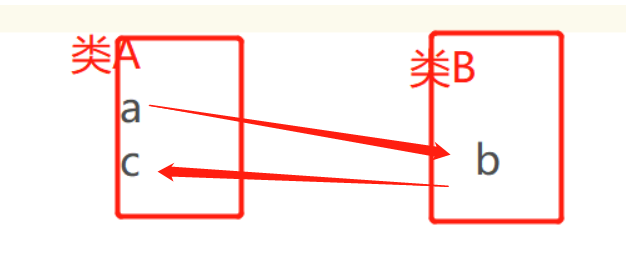

## Interface And Abstract 都不能被final修饰
## 没构造器就new不出来   抽象类可以有构造器，但是不能实例化

## Interface
- 三个词概括：规范，扩展，回调

- 接口的特性
    - 接口可以被继承，可以多继承   抽象类可以实现接口
    - 1)接口不能new一个对象,他不是类
        - ex:Interface名 i1 = new Interface名(); 是错误的
    - 2)接口的方法没有body,既不能有{}；

    - 3)实现类使用关键字implements实现对应接口。实现类必须实现接口的所有方法。

    - 4)接口的所有修饰字只能为public，接口不能有实例但是去可以声明接口变量，只不过变量必须指向实现类。

    - 5)接口不能有实例域但是可以定义常量。

    - 6)接口可以有多个实现类，实现类也可以引用多个接口，但抽象类的子类只能继承一个父类。

## 接口回调

- 理解：类A的一个方法a  通过调用类B的一个方法b   去调用类A的另一个方法c。

- 其实就是一个类去请求另一个类后得到回复再去调用本类的另一个方法，
    - 同步回调：
        - 就是方法b中的逻辑执行完再去执行方法c，
    - 异步回调：
        - 就是b和c一起执行。
    - 有人问：为什么不直接通过a去调用b呢？答案很简单，生活中有些事总不能自己解决，学生有问题总不能自问自答吧。

