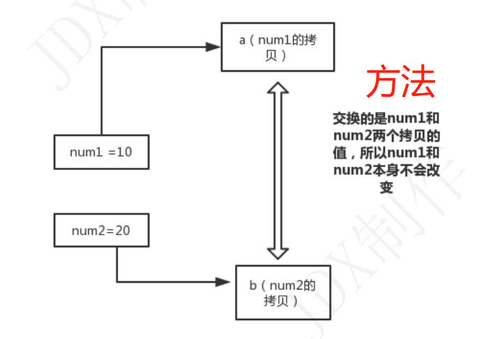
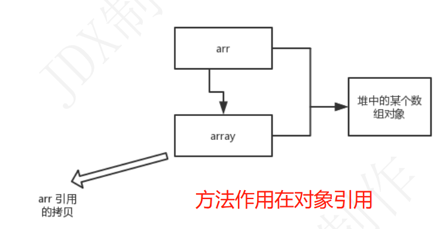
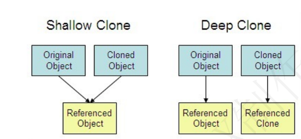
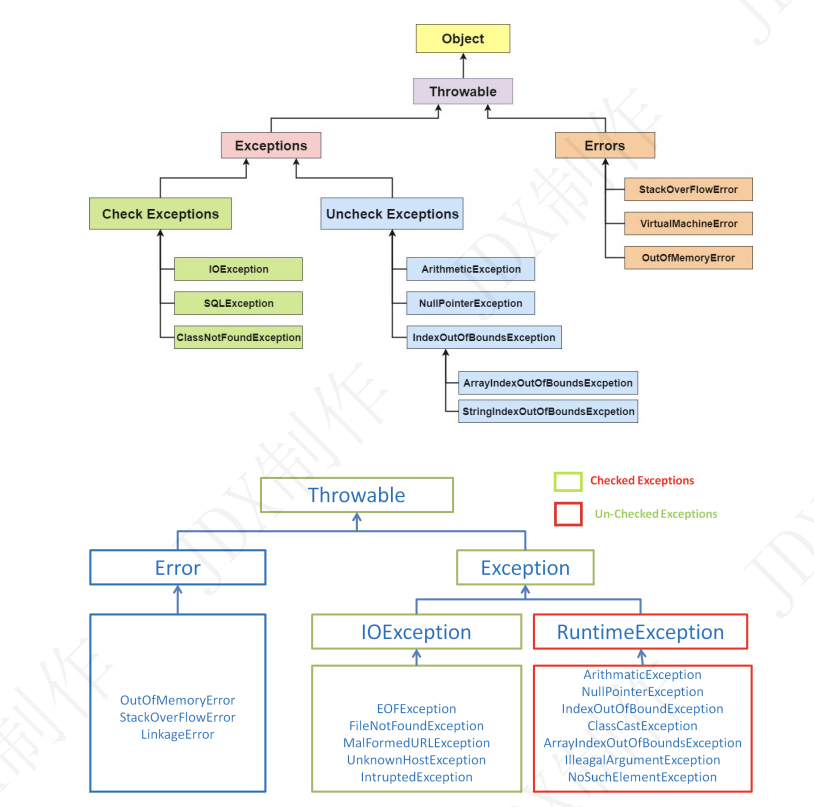

# look java中高级核心总结

## java
### 基础
- 1.web应用程序服务器会将 JSP 转换为 Java servlet，并且需要使用 JDK 来编译 servlet。
    - 而且jsp本质就是一个servlet，再本质就是java
    
- 2.OpenJDK是开源的，Oracle JDK是官方的
   - Oracle JDK 比 OpenJDK 更稳定。
   - OpenJDK 和 Oracle JDK 的代码几乎相同，但 Oracle JDK 有更多的类和一些错误修复。 
   - 因此，如果您想开发企业/商业软件，我建议您选择 Oracle JDK，因为它经过了彻底的测试和稳定。
   - 某些情况下，有些人提到在使用 OpenJDK 可能会遇到了许多应用程序崩溃的问题，但是，只需切换到 Oracle JDK 就可以解决问题；

- 3.`==`
```
String a = new String("ab"); // a 为一个引用 
String b = new String("ab"); // b为另一个引用,对象的内容一样 
String aa = "ab"; // 放在常量池中 
String bb = "ab"; // 从常量池中查找 
  if (aa == bb) // true 
  System.out.println("aa==bb"); 
  
  if (a == b) // false，非同一对象 
  System.out.println("a==b"); 
  
  if (a.equals(b)) // true 
  System.out.println("aEQb"); 
  
  if (42 == 42.0) { // true 
  System.out.println("true"); 
}
```
- 4.装箱拆箱：使用+会自动拆箱
  ```
    Integer i4 = new Integer(40); 
    Integer i5 = new Integer(40); 
    Integer i6 = new Integer(0);
    System.out.println("i4=i5 " + (i4 == i5)); // false
    System.out.println("i4=i5+i6 " + (i4 == i5 + i6)); // true
    System.out.println("40=i5+i6 " + (40 == i5 + i6)); // true
  ```
  - 语句 i4 == i5 + i6，因为+这个操作符不适用于 Integer 对象，首先 i5 和 i6 进行自动拆箱操作，进行数
    值相加，即 i4 == 40。
  -  然后 Integer 对象无法与数值进行直接比较，所以 i4 自动拆箱转为 int 值 40，最
    终这条语句转为 40 == 40 进行数值比较。

- 5.为什么 Java 中只有值传递？
  
  `首先回顾一下在程序设计语言中有关将参数传递给方法（或函数）的一些专业术语。按值调用(call by
  value)表示方法接收的是调用者提供的值，而按引用调用（call by reference)表示方法接收的是调用
  者提供的变量地址。一个方法可以修改传递引用所对应的变量值，而不能修改传递值调用所对应的变量
  值。 它用来描述各种程序设计语言（不只是 Java)中方法参数传递方式。`

- 6.Java 程序设计语言总是采用按值调用。也就是说，方法得到的是所有**参数值**的一个**拷贝**
  - 方法不能修改传递给它的任何参数变量的内容
  - 但是方法改对象的引用就可以改变它的值
  

    


  - Java 程序设计语言对对象采用的不是引用调用，实际上，对象引用是按值传递的。
  - 下面再总结一下 Java 中方法参数的使用情况：
    - 一个方法不能修改一个基本数据类型的参数（即数值型或布尔型）。
    - 一个方法可以改变一个对象参数的状态。
    - 一个方法不能让对象参数引用一个新的对象。
  
- 7.深拷贝 vs 浅拷贝
  - 1）. 浅拷贝：对基本数据类型进行值传递，对引用数据类型进行引用传递般的拷贝，此为浅拷贝。
  - 2）. 深拷贝：对基本数据类型进行值传递，对引用数据类型，创建一个新的对象，并复制其内容，此为深拷贝。


- 8.返回值方法的特殊使用 return --- 直接中断方法
  - 用于一些简易的筛选
```
// return在无返回值方法的特殊使用 
public void f5(int a) {
 if (a>10) 
 {
  return;//表示结束所在方法 （f5方法）的执行,下方的输出语句不会执行 
  }
   System.out.println(a); 
   }
```


- 9.面向对象和面向过程的区别
  - 面向过程 ：
    - 面向过程**性能**比面向对象高。 
    - 因为类调用时需要实例化，开销比较大，比较消耗资源 
    - 所以当性能是最重要的考量因素的时候，比如单片机、嵌入式开发、Linux/Unix 等一般采用面向过程开发。
    - 但是，面向过程没有面向对象易维护、易复用、易扩展。
  - 面向对象 ：
    - **面向对象易维护、易复用、易扩展**。 
    - 因为**面向对象有封装、继承、多态性的特性**，所以可以设计出**低耦合**的系统，使系统更加灵活、更加易于维护。
    - 但是，面向对象性能比面向过程低。
  - 速度慢的原因:java 是半编译语言，最终执行代码不是可以直接被 CPU 执行的二进制机械码
  
`  类调用时需要实例化这个并不是根本原因，面向过程也需要分配内存，计算内存偏移量，Java 性能差的主要原因并不
  是因为它是面向对象语言，而是 Java 是半编译语言，最终的执行代码并不是可以直接被 CPU 执
  行的二进制机械码。
  而面向过程语言大多都是直接编译成机械码在电脑上执行，并且其它一些面向过程的脚本语言性
  能也并不一定比 Java 好。`

- 10.构造器不能被重写，可以重载
- 11.成员变量与局部变量的区别
  - 1）从语法形式上看:成员变量是属于类的（在类里面直接定义），而局部变量是在方法中定义的变量或是方法的参数；
  - 2）它们两个都可以被final修饰。成员变量可以被public,private,static 等修饰符所修饰，局部不行。
  - 3）从变量在内存中的存储方式来看:如果成员变量是**使用static修饰**的，那么这个成员变量是**属于类**
    的，如果**没有使用static修饰**，这个成员变量是属于**实例**的。
  - 4）实例的话就是对象了，而对象存在于堆内存，局部变量则存在于栈内存。
  - 5）从变量在内存中的生存时间上看:成员变量是对象的一部分，它随着对象的创建而存在，而局部变量随着方法的调用而自动消失。
  - 6）成员变量如果没有被赋初值:则会自动以类型的默认值而赋值
    （一种情况例外:被 final 修饰的成员变量也必须显式地赋值），而局部变量则不会自动赋值。  

- 12.对象实体与对象引用有何不同?
    - new 创建对象实例（对象实例在堆内存中），对象引用指向对象实例（对象引用存放在栈内存中）。
    - 一个对象引用可以指向 0 个或 1 个对象（一根绳子可以不系气球，也可以系一个气球）;
      - 刚初始化，就指向null 因为堆中此时没它对应的值，还没映射 XX x = new XX();
    - 一个对象可以有 n 个引用指向它（可以用 n 条绳子系住一个气球）。
      -  XX x1 = new XX();  XX x2 = new XX(); x2 = x1;
- 13，无参构造器
  - 如果我们自己添加了类的构造方法（无论是否有参），Java 就不会再添加默认的无参数的构造方法了，
  - 这时候，就不能直接 new 一个对象而不传递参数了（编译报错）
  
- 14.对象的相等与指向他们的引用相等,两者有什么不同?
  - 对象的相等（值），比的是内存中存放的内容是否相等。
  - 而引用相等（地址），比较的是他们指向的内存地址是否相 等。

- 15.封装---隐藏属性，提供访问的方法
  - 在set中限定一些不安全的情况
  - 指把一个对象的状态信息（也就是**属性**）**隐藏**在对象内部，不允许外部对象直接访问对象的内部
    信息。但是可以**提供**一些可以被外界**访问的方法**来操作属性。就好像我们看不到挂在墙上的空调的内部
    的零件信息（也就是属性），但是可以通过遥控器（方法）来控制空调。如果属性不想被外界访问，我
    们大可不必提供方法给外界访问。但是如果一个类没有提供给外界访问的方法，那么这个类也没有什么
    意义了。就好像如果没有空调遥控器，那么我们就无法操控空凋制冷，空调本身就没有意义了（当然现
    在还有很多其他方法 ，这里只是为了举例子）。
- 16.继承如下 3 点请记住：--拥有所有父类的属性，方法，可扩展
    1）. 子类拥有父类对象所有的属性和方法（包括私有属性和私有方法），但是父类中的私有属性和方法，子类是无法访问，只是拥有。
    2）. 子类可以拥有自己属性和方法，即子类可以对父类进行扩展。
    3）. 子类可以用自己的方式实现父类的方法。
- 17.多态 -- 一个对象具有多种的状态，，，父类的引用指向子类的实例
  - 多态不能调用“只在子类存在但在父类不存在”的方法；
  - (有些是不能继承的，比如子类有了自己的梦想，而父类没有，此时只能调用自己的对象实例,但是也能调用父类的方法)

`多态的特点:
  对象类型和引用类型之间具有继承（类）/实现（接口）的关系；
  对象类型不可变，引用类型可变；
  方法具有多态性，属性不具有多态性；
  引用类型变量发出的方法调用的到底是哪个类中的方法，必须在程序运行期间才能确定；
  多态不能调用“只在子类存在但在父类不存在”的方法；
  如果子类重写了父类的方法，真正执行的是子类覆盖的方法，如果子类没有覆盖父类的方法，执行
  的是父类的方法。`

- 18.接口和抽象类的区别是什么？
`  1. 接口的方法默认是 public，所有方法在接口中不能有实现(Java 8 开始接口方法可以有默认实
     现），而抽象类可以有非抽象的方法。
  2. 接口中除了 static、final 变量，不能有其他变量，而抽象类中则不一定。
     //设置name的方法 public void setName(String name) { this.name = name; } }
  3. 一个类可以实现多个接口，但只能实现一个抽象类。接口自己本身可以通过 extends 关键字扩展
     多个接口。
  4. 接口方法默认修饰符是 public，抽象方法可以有 public、protected 和 default 这些修饰符（抽象
     方法就是为了被重写所以不能使用 private 关键字修饰！）。
  5. 从设计层面来说，抽象是对类的抽象，是一种模板设计，而接口是对行为的抽象，是一种行为的规
     范。`
  - 备注：
    - 1. 在 JDK8 中，接口也可以定义静态方法，可以直接用接口名调用。实现类和实现是不可以调
       用的。如果同时实现两个接口，接口中定义了一样的默认方法，则必须重写，不然会报错。
    - 2. jdk9 的接口被允许定义私有方法 。

- 19 String StringBuffer 和 StringBuilder 的区别是什么? String 为什么是不可变的?
  - 简单的来说： String 类中使用 final 关键字修饰字符数组来保存字符串， private final char value[] ，所以 String 对象是不可变的。
  - 而 StringBuilder 与 StringBuffer 都继承自 AbstractStringBuilder 类，
    在AbstractStringBuilder 中也是使用字符数组保存字符串 char[]value 
    但是没有用 final 关键字修饰，所以这两种对象都是可变的。
  - StringBuilder 与 StringBuffer 的构造方法都是调用父类构造方法也就是AbstractStringBuilder 实现的，

  - 线程安全性
 
  ` String 中的对象是不可变的，也就可以理解为常量，线程安全。 AbstractStringBuilder 是 StringBuilder 与 StringBuffer 的公共父类，定义了一些字符串的基本操作，如
    expandCapacity 、 append 、 insert 、 indexOf 等公共方法。 StringBuffer 对方法加了同步锁或
    者对调用的方法加了同步锁，所以是线程安全的。 StringBuilder 并没有对方法进行加同步锁，所以
    是非线程安全的`

  - 性能

  `每次对 String 类型进行改变的时候，都会生成一个新的 String 对象，然后将指针指向新的
  String 对象。 StringBuffer 每次都会对 StringBuffer 对象本身进行操作，而不是生成新的对象
  并改变对象引用。相同情况下使用 StringBuilder 相比使用 StringBuffer 仅能获得 10%~15% 左
  右的性能提升，但却要冒多线程不安全的风险。`

  - 对于三者使用的总结：
    - 1. 操作少量的数据: 适用 String 
    - 2. **单线程**操作字符串缓冲区下操作**大量数据**: 适用 StringBuilder 
    - 3. **多线程**操作字符串缓冲区下操作**大量数据**: 适用 StringBuffer
  
- 20.Object方法
    - getClass()   hashCode() equals(Object obj)  clone()--(要重写此方法) toString() notify() notifyAll()
    - wait(long timeout)  wait(long timeout, int nanos) wait()  finalize()
    
    ```
        Object 类是一个特殊的类，是所有类的父类。它主要提供了以下 11 个方法：
        public final native Class<?> getClass()//native方法，用于返回当前运行时对象的Class对象，使用了final关键字修饰，故不允许子类重写。 
        public native int hashCode() //native方法，用于返回对象的哈希码，主要使用在哈希表中，比如 JDK中的HashMap。
        public boolean equals(Object obj)//用于比较2个对象的内存地址是否相等，String类对该方法进 行了重写用户比较字符串的值是否相等。 
        protected native Object clone() throws CloneNotSupportedException//naitive方法， 用于创建并返回当前对象的一份拷贝。
        // 一般情况下，对于任何对象 x，表达式 x.clone() != x 为true， x.clone().getClass() == x.getClass() 为true。Object本身没有实现Cloneable接口，所以不重写clone方法并且进行调用的话会发生CloneNotSupportedException异常。 
        public String toString()//返回类的名字@实例的哈希码的16进制的字符串。建议Object所有的子类都重写这个方法。
        public final native void notify()//native方法，并且不能重写。唤醒一个在此对象监视器上等 待的线程(监视器相当于就是锁的概念)。如果有多个线程在等待只会任意唤醒一个。 
        public final native void notifyAll()//native方法，并且不能重写。跟notify一样，唯一的区 别就是会唤醒在此对象监视器上等待的所有线程，而不是一个线程。 
        public final native void wait(long timeout) throws InterruptedException//native 方法，并且不能重写。暂停线程的执行。注意：sleep方法没有释放锁，而wait方法释放了锁 。timeout是 等待时间。 
        public final void wait(long timeout, int nanos) throws InterruptedException//多了 nanos参数，这个参数表示额外时间（以毫微秒为单位，范围是 0-999999）。 所以超时的时间还需要加上 nanos毫秒。 
        public final void wait() throws InterruptedException//跟之前的2个wait方法一样，只不过该方法一直等待，没有超时时间这个概念 
        protected void finalize() throws Throwable { }//实例被垃圾回收器回收的时候触发的操作
    
    ```

- 21.hashCode 与 equals (重要)
  - 面试官可能会问你：“你重写过 hashcode 和 equals 么，为什么重写 equals 时必须重写 hashCode 方法？”
  -  hashCode（）介绍--键值对(key-value)
    
     `hashCode() 的作用是获取哈希码，也称为散列码；它实际上是返回一个 int 整数。这个哈希码的作用是
     确定该对象在哈希表中的索引位置。hashCode() 定义在 JDK 的 Object.java 中，这就意味着 Java 中的
     任何类都包含有 hashCode() 函数。
     散列表存储的是键值对(key-value)，它的特点是：能根据“键”快速的检索出对应的“值”。这其中就利用
     到了散列码！（可以快速找到所需要的对象）`
  - 为什么要有 hashCode
     `我们先以“HashSet 如何检查重复”为例子来说明为什么要有 hashCode： 当你把对象加入 HashSet
     时，HashSet 会先计算对象的 hashcode 值来判断对象加入的位置，同时也会与该位置其他已经加入的
     对象的 hashcode 值作比较，如果没有相符的 hashcode，HashSet 会假设对象没有重复出现。但是如
     果发现有相同 hashcode 值的对象，这时会调用 equals() 方法来检查 hashcode 相等的对象是否真的
     相同。如果两者相同，HashSet 就不会让其加入操作成功。如果不同的话，就会重新散列到其他位置。这样我
    们就大大减少了 equals 的次数，相应就大大提高了执行速度。`
    - hashCode() 的作用就是获取哈希码，也称为散列码；它实际上是返回一个 int 整数。
     ` 这个哈希码的作用是确定该对象在哈希表中的索引位置。 hashCode() 在散列表中才有用，在其它
      情况下没用。在散列表中 hashCode() 的作用是获取对象的散列码，进而确定该对象在散列表中的位置`。

   - hashCode() 的默认行为是对堆上的对象产生独特值。如果没有重写 hashCode()，则该 class 的两个对象无论如何都不会相等（即使这两个对象指向相同的数据）


- 22.Java 序列化中如果有些字段不想进行序列化，怎么办？
    - 对于不想进行序列化的变量，使用 transient 关键字修饰。
    - transient 关键字的作用是：阻止实例中那些用此关键字修饰的的变量序列化；当对象被反序列化时，
    - 被transient 修饰的变量值不会被持久化和恢复。transient 只能修饰变量，不能修饰类和方法。
    

## java开始
- 1.异常




- 1.RuntimeException。RuntimeException 异常由 Java 虚拟机抛出。
  - NullPointerException（要访问的变量没有引用任何对象时，抛出该异常）、
  - ArithmeticException（算术运算异常，一个整数除以 0时，抛出该异常）
  - ArrayIndexOutOfBoundsException （下标越界异常）。
   - 注意：异常和错误的区别：异常能被程序本身处理，错误是无法处理

-  2.Throwable 类常用方法
   - public string getMessage() :返回异常发生时的简要描述
   - public string toString() :返回异常发生时的详细信息
   - public string getLocalizedMessage() :返回异常对象的本地化信息。使用 Throwable 的
   - 子类覆盖这个方法，可以生成本地化信息。如果子类没有覆盖该方法，则该方法返回的信息与
   - getMessage（） 返回的结果相同
   - public void printStackTrace() :在控制台上打印 Throwable 对象封装的异常信息  


- 3.try-catch-finally（核心）
    - try 块： 用于捕获异常。其后可接零个或多个 catch 块，如果没有 catch 块，则必须跟一个 finally块。
    - catch 块： 用于处理 try 捕获到的异常。
    - finally 块： 无论是否捕获或处理异常，finally 块里的语句都会被执行。
    - 当在 try 块或 catch 块中**遇到 return 语句**时，finally 语句块将**在方法返回之前被执行**。
    

- 4.在以下 4 种特殊情况下，finally 块不会被执行：
    -  1. 在 finally 语句块第一行发生了异常。 因为在其他行，finally 块还是会得到执行
    -  2. 在前面的代码中用了 System.exit(int)已退出程序。 exit 是带参函数 ；若该语句在异常语句之后，finally 会执行
    -  3. 程序所在的线程死亡。
    -  4. 关闭 CPU。


- 5.使用 try-with-resources(try(执行体){逻辑代码}) 来代替 try-catch-finally
- 原因:面对必须要关闭的资源，我们总是应该优先使用try-with-resources而不是 try-finally 。随之产
  生的代码更简短，更清晰，产生的异常对我们也更有用。
  - try-with-resources 语句让我们更容易编写必须要关闭的资源的代码，若采用 try-finally 则几乎做不到这点。
    
- 注意：使用被坑--- 它会自动使用一下，然后关闭。。。所以逻辑得写在{} 里面，，，，对于分开使用执行体的，不要用。。。
    
```
try (Scanner scanner = new Scanner(new File("test.txt"))) {
 while (scanner.hasNext()) {
  System.out.println(scanner.nextLine()); 
  } 
  } catch (FileNotFoundException fnfe) {
   fnfe.printStackTrace(); 
   }
```


