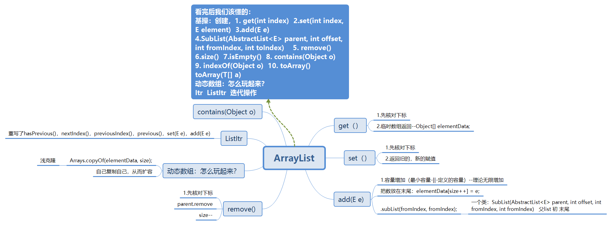
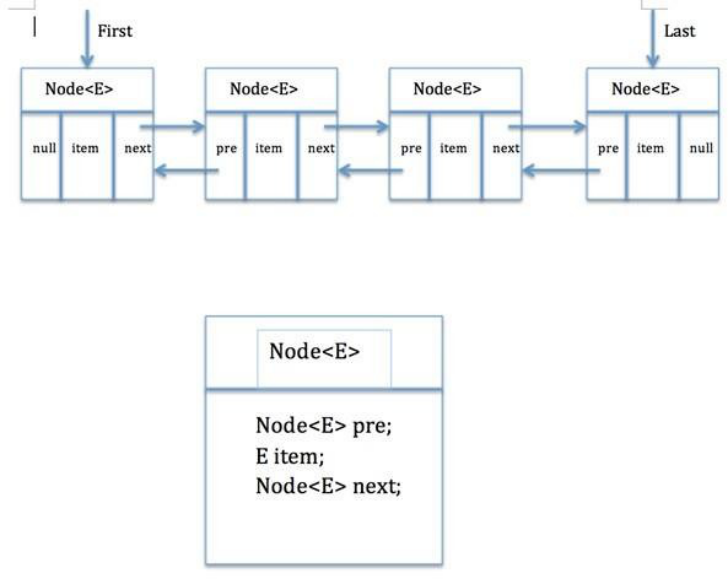
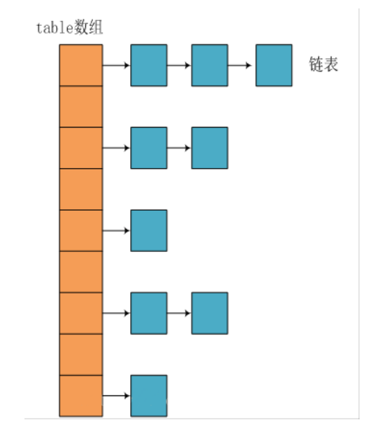
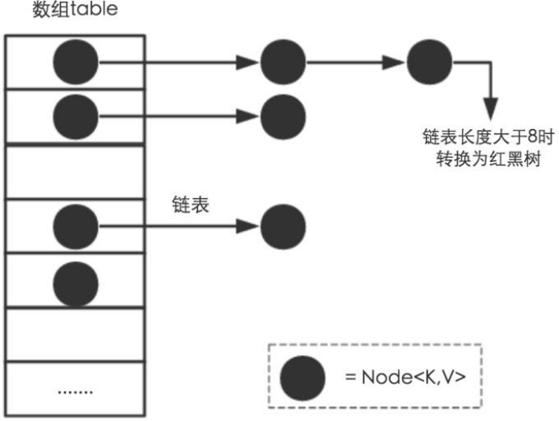

# 容器
> 

# ArrayList
## 介绍，原理，如果造一个？-->组件+整合
- 1.ArrayList 的底层是数组队列，相当于动态数组。
  - 我们学数据结构的时候就知道了线性表的**顺序存储**，插入删除元素的时间复杂度为O（n）,求表长以及增加元素，取第i元素的时间复杂度为O（1）
- 2.ArrayList 继承了AbstractList，实现了List。它是一个数组队列，**提供了相关的添加、删除、修改、遍历等功能**。
- 3.ArrayList 实现了RandomAccess 接口， RandomAccess 是一个标志接口，表明实现这个这个接
  口的 List 集合是支持**快速随机访问**的。在 ArrayList 中，我们即可以通过元素的序号快速获取元素对
  象，这就是快速随机访问
- 4.ArrayList 实现了Cloneable接口，即覆盖了函数 clone()，能被克隆。
- 5.ArrayList 实现java.io.Serializable接口，这意味着ArrayList支持序列化，能通过序列化去传输  
- 6.和 Vector 不同，ArrayList 中的操作不是线程安全的！所以，建议在单线程中才使用 ArrayList，
  而在多线程中可以选择 Vector 或者 CopyOnWriteArrayList。
  
- ArrayList实现的全是标志  
  - 初始为0，当加入一个元素时为10
  
- System.arraycopy()方法实现数组自己复制自己
  - elementData:源数组;index:源数组中的起始位置;elementData：目标数组(此处为新数组)；index + 1：目标数组中的起始位置； size - index：要复制的数组元素的数量；
   -  `System.arraycopy(elementData, index, elementData, index + 1, size - index);`
  
- copyOf---elementData：要复制的数组；size：要复制的长度   Arrays.copyOf(elementData, size);  
  - 联系：
    - 看两者源代码可以发现 copyOf() 内部调用了 System.arraycopy() 方法
  - 区别：
    - 1. arraycopy()需要目标数组，将原数组拷贝到你自己定义的数组里，而且可以选择拷贝的起点和长度以及放入新数组中的位置
    - 2. copyOf()是系统自动在内部新建一个数组，并返回该数组。

- ArrayList有四个内部类，
  
   ```
      (1)private class Itr implements Iterator<E> 
      (2)private class ListItr extends Itr implements ListIterator<E> 
      (3)private class SubList extends AbstractList<E> implements RandomAccess 
      (4)static final class ArrayListSpliterator<E> implements Spliterator<E>
   ```
  
  - 其中的**Itr**是实现了Iterator接口，同时重写了里面的hasNext()， next()， remove() 等方法；
  - 其中的**ListItr** 继承 Itr，实现了ListIterator接口，同时重写了hasPrevious()，nextIndex()，previousIndex()，previous()，set(E e)，add(E e) 等方法，
  - 所以这也可以看出了Iterator和ListIterator的区别: ListIterator在Iterator的基础上增加了添加对象，修改对象，逆向遍历等方法，这些是Iterator不能实现的。


 


# LinkedList
## 介绍：
- Deque 队列+List+链表 
  - LinkedList是一个实现了List接口和Deque接口的双端链表。
  - LinkedList底层的链表结构使它支持高效的插入和删除操作，另外它实现了Deque接口，使得LinkedList类也具有队列的特性;
  - LinkedList不是线程安全的，如果想使LinkedList变成线程安全的，可以调用静态类Collections类中的synchronizedList方法：
  - `List list=Collections.synchronizedList(new LinkedList(...));`
  



- 这个类就代表双端链表的节点Node。这个类有三个属性，分别是前驱节点，本节点的值，后继结点
```java
    private static class Node<E> {
        E item;//节点值
        Node<E> next;//后继节点
        Node<E> prev;//前驱节点
        Node(Node<E> prev, E element, Node<E> next) { 
            this.item = element;
            this.next = next; 
            this.prev = prev;
        }
        }
```

- add方法
  - add(E e) 方法：将元素添加到链表尾部
  - add(int index,E e)：在指定位置添加元素
  - addAll(Collection c )：将集合插入到链表尾部
  - addFirst(E e)： 将元素添加到链表头部
  - addLast(E e)： 将元素添加到链表尾部，与 add(E e) 方法一样
```
    public boolean add(E e) { 
      linkLast(e);//这里就只调用了这一个方法 
      return true; 
    }
    
    /*** 链接使e作为最后一个元素。 */ 
    void linkLast(E e) { 
        final Node<E> l = last;
       final Node<E> newNode = new Node<>(l, e, null);
        last = newNode;//新建节点 
      if (l == null) 
          first = newNode; 
      else
           l.next = newNode;
      //指向后继元素也就是指向下一个元素
          size++; 
          modCount++; 
          
        }
```

- get方法
  - get(int index)： 根据指定索引返回数据
  
- 根据对象得到索引的方法
  - int indexOf(Object o)： 从头遍历找
  - int lastIndexOf(Object o)： 从尾遍历找

- 检查链表是否包含某对象的方法：
  - contains(Object o)： 检查对象o是否存在于链表中

- 删除
  - remove() ,removeFirst(),pop(): 删除头节点
  - removeLast(),pollLast(): 删除尾节点
  - remove(Object o): 删除指定元素


# HashMap（重点）
> HashMap 主要用来存放键值对，它基于哈希表的Map接口实现，是常用的Java集合之一。

- JDK1.8 之前 HashMap 由 数组+链表 组成的，数组是 HashMap 的主体，链表则是主要为了解决哈希
冲突而存在的（“拉链法”解决冲突）.
- JDK1.8 以后在解决哈希冲突时有了较大的变化，当链表长度大于阈 值（默认为 8）时，
  将链表转化为红黑树（将链表转换成红黑树前会判断，如果当前数组的长度小于 64，
  那么会选择先进行数组扩容，而不是转换为红黑树），以减少搜索时间，具体可以参考
  treeifyBin 方法。
## 底层数据结构分析
- JDK1.8之前
   -  1. JDK1.8 之前 HashMap 底层是 **数组和链表** 结合在一起使用也就是 **链表散列**。HashMap 通过 key 的
    hashCode 经过扰动函数处理过后得到 hash 值，然后通过 (n - 1) & hash 判断当前元素存放的位
    置（这里的 n 指的是数组的长度），如果当前位置存在元素的话，就判断该元素与要存入的元素的
    hash 值以及 key 是否相同，如果相同的话，直接覆盖，不相同就通过拉链法解决冲突。
    所谓扰动函数指的就是 HashMap 的 hash 方法。使用 hash 方法也就是扰动函数是为了防止一些实现
    比较差的 hashCode() 方法 换句话说使用扰动函数之后可以减少碰撞。
    - 2.JDK 1.8 HashMap 的 hash 方法源码:
         - JDK 1.8 的 hash方法 相比于 JDK 1.7 hash 方法更加简化，但是原理不变。
    ```
    
          static final int hash(Object key) {
            int h;
            // key.hashCode()：返回散列值也就是hashcode
            // ^ ：按位异或 
            // >>>:无符号右移，忽略符号位，空位都以0补齐 
            return (key == null) ? 0 : (h = key.hashCode()) ^ (h >>> 16);  // 两次
            }
    ```         
      - 对比一下 JDK1.7的 HashMap 的 hash 方法源码
    ```
      static int hash(int h) {
          // This function ensures that hashCodes that differ only by 
         // constant multiples at each bit position have a bounded 
         // number of collisions (approximately 8 at default load factor). 
         h ^= (h >>> 20) ^ (h >>> 12);   // 4次 >>> 两次 ^ 两次
         return h ^ (h >>> 7) ^ (h >>> 4); // 4次
        }
  
    ```
  - 相比于 JDK1.8 的 hash 方法 ，JDK 1.7 的 hash 方法的性能会稍差一点点，因为毕竟扰动了8次。
  
- “拉链法” 就是：将链表和数组相结合。
  也就是说创建一个链表数组，数组中每一格就是一个链表。
  若遇到哈希冲突，则将冲突的值加到链表中即可
  



- JDK1.8之后
- 相比于之前的版本，jdk1.8在解决哈希冲突时有了较大的变化，当链表长度大于阈值（默认为8）时， 将链表转化为红黑树，以减少搜索时间。


