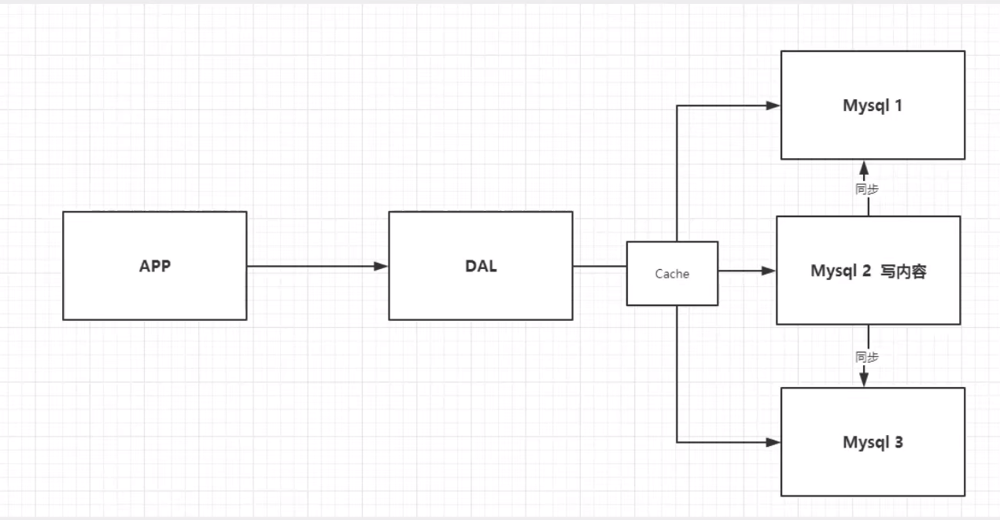
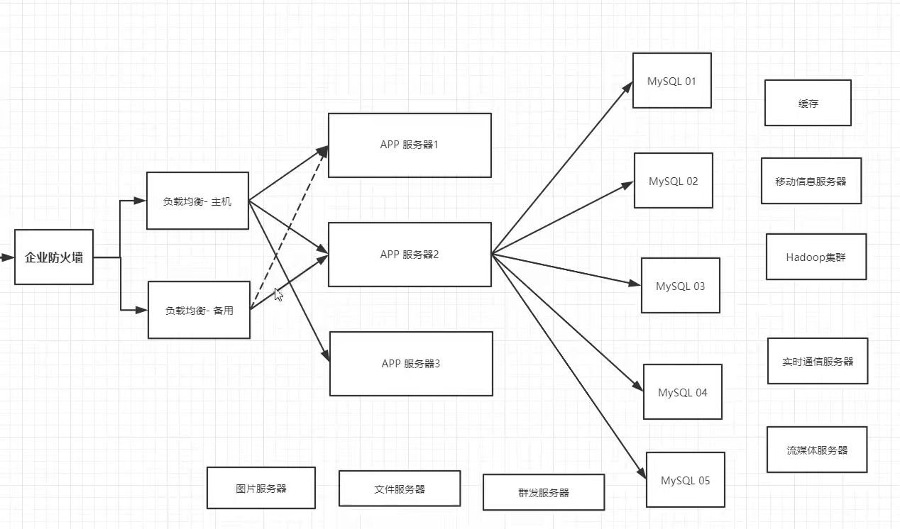
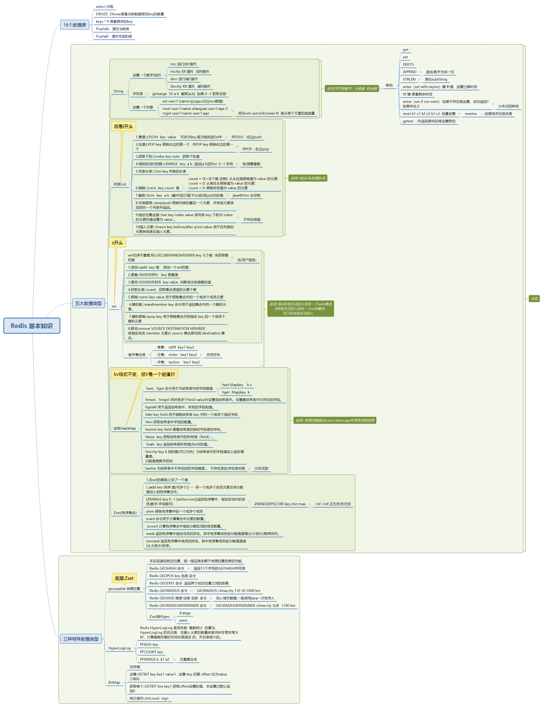

# Redis
> Redis是什么
> 


## 简介
> Redis：Remote Dictionary Server（远程字典服务器）
- 是完全开源免费的，用C语言编写的，遵守BSD协议，是一个高性能的**（Key/Value）**分布式内存数据
  库，基于**内存运行**，并**支持持久化的NoSQL数据库**，是当前最热门的NoSQL数据库之一，也被人们称为
  数据结构服务器
 

 
> 1.单机MySQL的年代
> 
> 2.Memcached(缓存)+MySQL+垂直拆分(读写分离)
> 
> 3.分库分表+水平拆分+MySQL集群
- 数据库本质:(读,写)
- 早些年MyISM:表锁(100万  查一个,,整个用户表锁起来) ---高并发,严重的锁问题
- InnoDB:行锁
- 慢慢的使用分库分表来解决写的压力!!!MySQl在那个年代推出了表分区
> 目前基本的互联网项目




  
### NoSQL
- NoSQL = Not Only SQL，(不仅仅是SQL)
  - 泛指非关系型的数据库，随着互联网Web2.0网站的兴起，传统的关系数据库在应付web2.0网站，特别
  是超大规模和高并发的社交网络服务类型的Web2.0纯动态网站已经显得力不从心，暴露了很多难以克服
  的问题，而非关系型的数据库则由于其本身的特点得到了非常迅速的发展，

- Map<String,Object>使用键值对来控制
    
- NoSQL数据库的产生就是为了解决大规模数据集合多种数据种类带来的挑战，尤其是大数据应用难题，包括超大规模数据的存储。
  
- 关系实际上是一张二维表,表的每一行是一个元素,每一列是一项属性,而一个元组就是该关系所涉及的属性集的笛卡尔积的一个元素.
  - 一个关系模式应当是一个5元组.定义关系的描述称为关系模式）.
    它可以形式化地表示为：R（U,D,dom,F）
  - 其中R为关系名,U为组成该关系的属性名集合,D为属性组U中属性所来自的域,dom为属性向域的映象集合,F为属性间数据的依赖关系集合.
  
> NoSQL的特点
- 解耦!
  - 1.方便扩展(数据之间没有关系,很好扩展!) 
  - 2.大数据量高性能(Redis 一秒可以写8w次,读取11w次,NoSQL的缓存记录级,是一种细粒度的缓存,性能会比较高!)  
  - 3.数据类型多样性的(不需要实现设计数据库!随去随用!!如果是数据量十分大的表,那就无法设计了!)，但是一个共同的特点都是去掉关系数据库的关系型特性。
    - **数据之间无关系**，这样就非常容易扩展，也无形之间，在架构的层面上带来了可扩展的能力。
  - 4.传统RDBMS和NoSQL
    - 1.传统的RDBMS
      - (1)结构化组织
      - (2)SQL
      - (3)数据和关系都存在单独的表中(row col)
      - (4)操作数据定义语言
      - (5)严格的一致性  基础事务
  
    - 2.NoSQL
      - (1)不仅仅是SQL
      - (2)没有固定的语言
      - (3)键值对存储,列存储,文档存储,图形数据库(社交关系)
      - (4)最终一致性
      - (5)CAP定理和BASE  (异地多活) 初级架构师
      - (6)高性能,高可用,高可扩
 
> 了解3V+3高
- 大数据时代的3V:主要是描述问题的
  - 1.海量:Volume
  - 2.多样:Variety
  - 3.实时:Velocity

- 大数据时代的3高:主要是对程序的要求
  - 1.高并发
  - 2.高可扩
  - 3.高性能
 
> 当下的应用是 SQL 和 NoSQL 一起使用，技术没有高低之分，就看你怎么用，对吧！
- NoSQL你如何设计
  - BSON是一种类json的一种二进制形式的存储格式，简称Binary JSON，它和JSON一样，支持内嵌的文档
    对象和数组对象


> NoSQL的四大分类
- 1.KV键值对
  - 新浪:Redis
  - 美团:Redis+Tair
  - 阿里,百度:Redis+memcache
  
- 2.文档型数据库(Bson格式和json一样)
  - MongoDB(一般必须要掌握)
    - MongoDB基于分布式文件存储的数据库(C++编写),主要用来处理大量的文档!
    - MongoDB介于关系,非关系数据库中的交集.MongoDB是非关系型数据库中功能最丰富的,最像关系数据库的.
  
- 3.列存储的数据库
  - HBase
  - 分布式文件数据库
  
- 4.图关系型数据库
  - 存数据结构中的图,非图片---用于朋友圈社交网络,广告推荐!
  - Neo4j,InfoGrid;
  


## Redis入门
> Redis：Remote Dictionary Server（远程字典服务器）
- 开始正题:
  - Redis与其他key-value缓存产品有以下三个特点
   - Redis支持数据的持久化，可以将内存中的数据保持在磁盘中，重启的时候可以再次加载进行使用。
   - Redis不仅仅支持简单的 key-value 类型的数据，同时还提供list、set、zset、hash等数据结构的存储。
   - Redis支持数据的备份，即master-slave模式的数据备份。
> Redis能干嘛
- 1.内存断电即失,所以持久化很重要(RDB,AOF)
- 2.内存存储和持久化：redis支持**异步**将内存中的数据写到硬盘上，**同时不影响**继续服务
- 3.取最新N个数据的操作，如：可以将最新的10条评论的ID放在Redis的List集合里面
   - 发布、订阅消息系统
   - 地图信息分析
   - 定时器、计数器
- 4.特性
  - 多样数据类型
  - 持久化和复制，RDB、AOF
  - 集群  
  - 事务的控制

- windows下载地址：https://github.com/dmajkic/redis/downloads ( 素材提供 )
- Linux:下载地址 http://download.redis.io/releases/redis-5.0.7.tar.gz
  - 压缩包解压到opt下 然后make
  - 启动的东西在/usr/local/bin
  - /usr/local/bin/zjzconfig 将redis.config中的daemonize yes
  

- redis-cli.exe 客户端
- redis-server.exe 服务端


- 一般下载Linux的使用
-  http://download.redis.io/releases/redis-5.0.7.tar.gz


- 查看默认安装目录：usr/local/bin
- /usr 这是一个非常重要的目录，类似于windows下的Program Files,存放用户的程序


## Linux下Redis启动
- /usr/local/bin下使用命令
  - 服务端启动::./redis-server zjzconfig/redis.conf
    -  src]# ./redis-server /www/server/redis/redis.conf
  - 客户端启动::;redis-cli -p 6379   ./redis-cli -h localhost -p 6379
  
- reids命令中:shutdown关闭连接,然后exit退出

- 查看进程:ps -ef|grep redis


## 3.使用java客户端访问远程redis服务
> 因为redis本身默认是不支持远程地址访问的，所以我们需要先配置一下redis
- 1.编辑安装目录下的redis.conf文件，注释掉本地ip绑定,
  - #bind 127.0.0.1
- 2.在本地客户端中设置登录密码
  - $ config set requirepass mypwd
- 这样基本就可以啦
- 具体的这块配置参考:
  - https://www.cnblogs.com/y-l-h/p/7930085.html
  - https://www.cnblogs.com/machanghai/p/5497043.html


## redis 
### 文件解释
- redis-benchmark  压力测试工具---官方自带
```
  # 测试一：100个并发连接，100000个请求，检测host为localhost 端口为6379的redis服务器性能
    redis-benchmark -h localhost -p 6379 -c 100 -n 100000
 # 测试出来的所有命令只举例一个！
  ====== SET ====== 
  100000 requests completed in 1.88 seconds # 对集合写入测试
   100 parallel clients # 每次请求有100个并发客户端
  3 bytes payload # 每次写入3个字节的数据，有效载荷
   keep alive: 1 # 保持一个连接，一台服务器来处理这些请求
      
      
  17.05% <= 1 milliseconds 
  97.35% <= 2 milliseconds 
  99.97% <= 3 milliseconds 
  100.00% <= 3 milliseconds # 所有请求在 3 毫秒内完成 
  53248.14 requests per second # 每秒处理 53248.14 次请求

```  


> 基本数据库常识

- 默认16个数据库，类似数组下标从零开始，初始默认使用零号库
- select 切库
- DBSIZE  Dbsize查看当前数据库的key的数量
- keys * # 查看具体的key
- Flushdb：清空当前库
- Flushall：清空全部的库

> redis单线程
- 为什么redis是单线程
  - 我们首先要明白，Redis很快！官方表示，因为Redis是**基于内存**的操作，CPU不是Redis的瓶颈，Redis
  的瓶颈最有可能是机器内存的大小或者网络带宽。既然单线程容易实现，而且CPU不会成为瓶颈，那就
  顺理成章地采用单线程的方案了！
- Redis是C语言写的.官方提供10w+的QPS,这个完全不比使用Key-value的Memcache差!!

> Redis为什么这么快？
- 1）误区一::**高性能服务器**一定是多线程来实现的
- 2)误区二::多线程(CPU上下文切换)一定比单线程效率高，其实不然！
    - CPU>内存>硬盘的速度都有了解了！
- 3）redis 核心就是:::**数据全都在内存里**,单线程的去操作就是效率最高的，
    - 多线程的本质就是 CPU 模拟出来多个线程的情况，这种模拟出来的情况就有一个代价，就是上下文的切
    换(耗时操作!!)，对于一个内存的系统来说，它没有上下文的切换就是效率最高的。
    - redis 用 单个CPU 绑定一块内存的数据,**多次读写的时候，都是在一个CPU上完成的**，所以它是单线程处
    理这个事。**在内存的情况下，这个方案就是最佳方案。**
    - 因为一次CPU上下文的切换大概在 1500~2000ns 。从内存中读取 1MB 的连续数据，耗时大约为 250us
  
## 五大数据类型
> Redis-key

> 可以设置一个数字(如0)
- 对它使用incr 进行加1操作
- 对它使用decr 进行减1操作
- INCRBY XX 值N   加N操作
- DECRBY XX 值N   减N操作


> 1.String （字符串类型）
- String类型是二进制安全的，意思是redis的string可以包含任何数据，比如jpg图片或者序列化的对象。
- String类型是redis最基本的数据类型，一个redis中字符串value最多可以是512M。

> 2.Hash（哈希，类似 Java里的Map）
- Redis hash 是一个键值对集合。
- Redis hash 是一个String类型的field和value的映射表，hash特别适合用于存储对象。
- 类似Java里面的Map<String,Object>

> 3.List（列表）
- Redis列表是简单的字符串列表，按照插入顺序排序，你可以添加一个元素到列表的头部（左边）或者尾部（右边）。
- 它的底层实际是个链表 !
  ```
  
      列表List
          可以玩成栈,队列,阻塞队列
          都是l开头
          塞值::LPUSH  key  value    可多次key,每次就放进list中
              RPUSH --右边push
          出值:LPOP key 移除左边的第一个   RPOP key 移除右边的第一个
              RPOP --右边pop
          Lindex key num   获取下标值
          LRANGE  key  a b  返回[a b]的list  0 -1 所有
              栈:倒着拿数
          Llen key 列表的长度
          Lrem  key count  值
              count > 0(>总个数,全删): 从头往尾移除值为 value 的元素;
      count < 0: 从尾往头移除值为 value 的元素;
      count = 0: 移除所有值为 value 的元素
          ltrim  key  a b  (截中间)只留下list区间[a,b]内的值
              java中trim 去空格
          rpoplpush 移除列表的最后一个元素，并将该元素添加到另一个列表并返回。
          lset key index value 将列表 key 下标为 index 的元素的值设置为 value 。
              不存在报错
          linsert key before/after pivot value 用于在列表的元素前或者后插入元素。
  
  ```
- 总结
  - 它是一个字符串链表，left，right 都可以插入添加
    - 如果键不存在，创建新的链表
    - 如果键已存在，新增内容
    - 如果值全移除，对应的键也就消失了
    - 链表的操作无论是头和尾效率都极高，但假如是对中间元素进行操作，效率就很惨淡了。


> 4.Set（集合）
- Redis的Set是String类型的无序集合，它是通过HashTable实现的!


> 5.Zset（sorted set：有序集合）
- Redis zset 和 set 一样，也是String类型元素的集合，且不允许重复的成员。
- 不同的是每个元素都会关联一个double类型的分数。
- Redis正是通过分数来为集合中的成员进行从小到大的排序，zset的成员是唯一的，但是分数(Score)却可以重复。


> 使用:
- 案例思路:set排序,存储班级成绩表,工资表排序
- 普通消息:1.重要消息,2.带权重进行判断!
- 排行榜应用实现,


## 三种特殊数据类型
> geospatial 地理位置
  - https://www.redis.net.cn/order/3685.html
    - redis-cli --raw -p 6379  


> HyperLogLog
- Redis HyperLogLog 是用来做  基数统计  的算法，HyperLogLog 的优点是，在输入元素的数量或者体积非常非常大时，计算基数所需的空间总是固定 的、并且是很小的。
- PFADD key
- PFCOUNT key
- PFMERGE k  k1 k2
- 无重复合成

- 什么是基数？
  - 比如数据集 {1, 3, 5, 7, 5, 7, 8}， 那么这个数据集的基数集为 {1, 3, 5 ,7, 8}, 基数(不重复元素)为5。
  - 基数估计就是在误差可接受的范围内，快速计算基数。

> 优点:占用的内存是固定的,2^64不同的元素的技术,只需要12kb的内存..
- 网页的UV(一个人访问一个网站多次,但是还是算做一个人!)
- 传统的方式,set保存用户的ID,然后就可以统计set中的元素数量作为标准判断!

- 0.81%错误率!统计UV任务,可以忽略不计.


> BitMap
- 位存储
- 统计用户信息,活跃,不活跃!登录,,未登录!打卡,365天打卡! 两个状态的,都可以使用Bitmaps!
- Bitmaps位图,数据结构!都是操作二进制位来进行记录,就只有0和1状态
- 365天 = 365 bit 
  
  ```
    127.0.0.1:6379> setbit sign 0 1
    0
    127.0.0.1:6379> setbit sign 1 1
    0
    127.0.0.1:6379> setbit sign 2 1
    0
  ```
  

- 查看
  
   ```
   127.0.0.1:6379> setbit sign 3 0
    0
    127.0.0.1:6379> getbit sign 3
    0
   
   ```
  
- config get requirepass  获取密码
- config set requirepass  设置密码
- 设置后,每次进去都得先auth 密码   ---登录


- 一般命令完成后使用save保存





