# Redis-Core
- 事务


## 事务 --秒杀!!!
> 本质:一组命令的集合,一个事务的所有命令都会被序列化,在事务执行过程中,会按照顺序执行!
> 
> 特性:一次性,顺序性,排它性!执行一些列的命令!
- ---队列 set set set...执行操作---
  
- 1.Redis事务没有隔离级别的概念!--本来就一组命令的集合,还怎么各个隔离..
- 2.所有的命令在事务中,并没有直接被执行!只有发起执行命令的时候才会被执行!Exec  
- 3.Redis**单条命令保证原子性的**,但是**Redis的事务不保证原子性**!
    - 不适合做交易,,一组交易中,一个增加成功,另一个不一定成功..

- redis的事务:
    - 开启事务(multi)
    - 命令入队(...)
    - 执行事务(exec)    --- 取消事务(discard)
- 锁:乐观锁--监视器实现


> 正常执行事务
> 本质:在一个队列中跑一批代码
- 也就是先开启事务---multi
- 编写要执行的代码
- 执行..exec  


> 编译型异常(代码有问题!命令有错!),事务中所有的命令都不会被执行!
- 单条命令执行时出错了,回车时抛错误,再执行exec也是会抛错的


> 运行时异常(1/0),如果事务队列中存在语法错误,那么执行命令的时候,其它命令都可以正常运行,错误命令抛异常!
- java中运行时只要有异常,接下来的都不在执行
- 回车后没错误,最后出错的不执行,其它都执行


> 监控-- Watch(面试常问)  -- UnWatch(事务失败,解监控)
- 悲观锁:
    - 认为什么时候都会出问题,于是一旦有操作就锁住..(影响性能)
    - 这样别人想拿到这个数据就会block直到它拿到锁。传统的关系型数据库里面就
      用到了很多这种锁机制，比如行锁，表锁等，读锁，写锁等，都是在操作之前先上锁。
- 乐观锁:---Redis用来秒杀!
  - 认为什么时候都不会出现问题,所以不加锁,,更新时判断一下,在这个期间是否有人修改这个数据----
  - 事件前先获取version,
  - 做事中判断version的同时做操作,同时改version字段
  -  --- 完成.  


> Redis测试监控方法
- 方法:watch key

- 先监视,再multi事务操作 
- 如果此时再开一个客户端,对key进行了操作
- 事务就会失败


## jedis
> 我们要使用java操作Redis
- 什么是Jedis?
  - 是Redis官方推荐的java连接开发工具! 使用java操作Redis中间件!如果你要使用java操作Redis,那么一定要对Jedis十分的熟悉.
  
- 1.导依赖
  
  ```
          <!-- https://mvnrepository.com/artifact/redis.clients/jedis -->
          <dependency>
              <groupId>redis.clients</groupId>
              <artifactId>jedis</artifactId>
              <version>3.2.0</version>
          </dependency>
  
          <!--fastjson-->
          <dependency>
              <groupId>com.alibaba</groupId>
              <artifactId>fastjson</artifactId>
              <version>1.2.76</version>
          </dependency>
  ```

- 2.编码测试
  - 连接数据库
  - 操作命令
  - 断开连接!
  

- 新建一个Jedis对象
  - 东西都在这里::;redis.clients.jedis;  // 这里的方法就是之前学习的
- 然后使用方法就行..


### springbooot+redis
- springboot 操作数据库:spring-data jpa jdbc mongodb redis
- spring-Data 和SpringBoot齐名的项目
- 在springboot2.0X之后,原本使用的jedis被替换为了lettuce
- jedis:采用直连,多个线程操作的话,是不安全的,如果想要避免不安全,使用jedis pool连接池! 更像 BIO模式
- lettuce:采用netty,实例可以在多个线程中进行共享,不存在线程不安全的情况!可以减少线程数据量,更像 NIO模式


### 整合
- pom
  ```
  <!--操作redis-->
          <dependency>
              <groupId>org.springframework.boot</groupId>
              <artifactId>spring-boot-starter-data-redis</artifactId>
          </dependency>
  
  ```


- 配置
  
  ```
  # SpringBoot 所有配置类,都有一个自动配置类  RedisAutoConfiguration
  # 自动配置类都会绑定一个properties配置文件  RedisProperties
  
  # 配置redis
    spring.redis.host=39.10XXXXXXX
    spring.redis.port=6XXX
    # 库1
    spring.redis.database=1  
    spring.redis.password=123456
  
  # 连接池配置 spring.redis.lettuce.pool它的,jedis的不会生效
  ```

- 默认的RedisTemplate没有过多的设置,redis对象都需要序列化!! ----Dubbo时就实体类必须得序列化
- 两个泛型都是Object Object 的类型,我们后使用需要强制转换

- 类中操作
- ```
          // redisTemplate
        // ops 操作 
        // opsForValue操作字符串,类似String
        // opsForList 操作list 类似list
        // opsForSet
        // opsForHash
        // opsForZSet
        // opsForHyperLogLog
        // opsForGeo  地图
        // 除了基本的操作,我么常用的方法都可以直接redisTemplate来操作,比如事务和基本的增删改查

      /*
      // 获取redis的连接对象
      RedisConnection connection = redisTemplate.getConnectionFactory().getConnection();
      connection.flushDb();
      connection.flushAll();
      */
  
  ```
  

- config配置
```
  
  @Configuration
  public class RedisConfig {
      // 编写我们自己的redisconfig
  
      @Bean
      public RedisTemplate<String, Object> redisTemplate(RedisConnectionFactory factory) {
          RedisTemplate<String, Object> template = new RedisTemplate<String, Object>();
          template.setConnectionFactory(factory);
          Jackson2JsonRedisSerializer jackson2JsonRedisSerializer = new Jackson2JsonRedisSerializer(Object.class);
          ObjectMapper om = new ObjectMapper();
          om.setVisibility(PropertyAccessor.ALL, JsonAutoDetect.Visibility.ANY);
          om.enableDefaultTyping(ObjectMapper.DefaultTyping.NON_FINAL);
          jackson2JsonRedisSerializer.setObjectMapper(om);
          StringRedisSerializer stringRedisSerializer = new StringRedisSerializer();
          // key采用String的序列化方式
          template.setKeySerializer(stringRedisSerializer);
          // hash的key也采用String的序列化方式
          template.setHashKeySerializer(stringRedisSerializer);
          // value序列化方式采用jackson
          template.setValueSerializer(jackson2JsonRedisSerializer);
          // hash的value序列化方式采用jackson
          template.setHashValueSerializer(jackson2JsonRedisSerializer);
          template.afterPropertiesSet();
          return template;
  
      }
  
   }

```


# 重点!!
## Redis.conf
- server启动就通过配置文件启动的
- 行家有没有,出手就知道
- 配置文件对大小写不敏感

- include  # 可以包含多个文件
> 网络操作 
- bind 127.0.0.1   # 绑定的IP
- protected-mode yes   #  是否是受保护的,一般都开启
- port 6379  # 端口设置
  
> 通用 GENERAL
- daemonize  yes   # 以守护进程的方式运行,默认是no,我们需要自己开启为yes
- pidfile /var/run/redis_6379.pid  # 如果以后台方式运行就得指定一个pid文件
- logfile ""  # 日志文件名
- always-show-logo yes   # 是否总是显示log


> 快照--redis内存数据库,如果不做持久化操作就会丢,数据断电即失
- 持久化,在规定的时间内,执行了多少次操作,则会持久化到文件.rdb .aof
- save ...

- stop-writes-on-bgsave-error yes  # 持久化出错,是否还要继续工作
> RDB
- rdbcompression yes  # 是否压缩rdb文件,需要消耗一些CPU资源
- rdbchecksum yes # 保存rdb文件的时候,如果出错是否自动处理

- dir ./ # rdb文件保存的目录


> REPLICATION复制(主从复制),,


> 限制CLIENTS
- maxclients 1000 # 设置能连接上redis的最大客户端的数量
- maxmemory<bytes> # redis设置最大的内存容量
- maxmemory-policy noeviction # 内存到达上限之后的处理策略


> APPEND ONLY MODE模式
- AOF配置
- appendonly no # 默认不开启,一般是使用rdb持久化的,在大部分的情况下rdb就够了
- appendfilename "appendonly.aof"  # 持久化文件的名字 .aof结尾

- appendfsync everysec   # 每秒执行一次sync,可能会丢失这一秒的数据
  


## 持久化
- Redis是内存数据库,如果不将内存中的数据库状态保存到磁盘中,那么一旦服务器进程退出,服务器中的数据库状态也会消失.所以redis提供了持久化功能!
### RDB(Redis DataBase)
- 在指定的**时间间隔内**将内存中的数据集**快照写入磁盘**，也就是行话讲的Snapshot快照，它恢复时是将快照文件直接读到内存里
- 操作:Redis会单独创建（fork）一个子进程来进行持久化，会先将数据写入到一个临时文件中，待持久化过程
  都结束了，再用这个临时文件替换上次持久化好的文件。整个过程中，主进程是不进行任何IO操作的。
  这就确保了极高的性能。如果需要进行大规模数据的恢复，且对于数据恢复的完整性不是非常敏感，那
  RDB方式要比AOF方式更加的高效。RDB的缺点是**最后一次持久化后的数据可能丢失**。
  
- 保存形式:Dump.rdb
  - AOF也就是appendonly.aof
  
- 修改save测试 -- save 60 5 --60s触发5次就持久化
> RDB生成:  
- save规则会生成一个rdb
- 执行flushall命名,也会触发rdb规则
- 退出也会产生rdb
> 恢复RDB文件
- 只需要将RDB文件放在redis启动目录就可以了,redis启动时会自动检测..恢复数据
  - 获取目录:config get dir
  
> 优点:
- 1.适用于大规模的恢复!
- 2.对数据的完整性要求不高!
> 缺点:
- 1.需要一定的时间间隔进程操作 ---意外宕机了,最后一次修改数据就没有了
- 2.fork进程操作时,会占用一定量的内存空间!

### AOF
- 以日志的形式来**记录每个写操作**，将Redis执行过的**所有指令记录下来**（读操作不记录），**只许追加文件**
  但不可以改写文件，redis启动之初会读取该文件重新构建数据，换言之，redis重启的话就根据日志文件
  的内容将写指令从前到后执行一次以完成数据的恢复工作
- AOF保存的是appendonly.aof文件
- redis-check-aof --fix 修复aof文件操作

> AOF 启动/修复/恢复
- 正常恢复：
  - 启动：设置Yes，修改默认的appendonly no，改为yes
  - 将有数据的aof文件复制一份保存到对应目录（config get dir）
  - 恢复：重启redis然后重新加载
- 异常恢复：
  - 启动：设置Yes
  - 故意破坏 appendonly.aof 文件！
  - 修复： redis-check-aof --fix appendonly.aof 进行修复
  - 恢复：重启 redis 然后重新加载
  
> 优点,缺点
- 优点
  - 1.每修改同步：appendfsync always 同步持久化，每次发生数据变更会被立即记录到磁盘，性能较差,但数据完整性比较好
  - 2.每秒同步： appendfsync everysec 异步操作，每秒记录 ，如果一秒内宕机，有数据丢失
  - 3.不同步： appendfsync no 从不同步

- 缺点：
  - 1、相同数据集的数据而言，aof 文件要远大于 rdb文件，恢复速度慢于 rdb。
  - 2、Aof 运行效率要慢于 rdb，每秒同步策略效率较好，不同步效率和rdb相同。

- 如果aof文件大于64M,太大了!fork一个新的进程将我们的文件进行重写.

- 扩展:
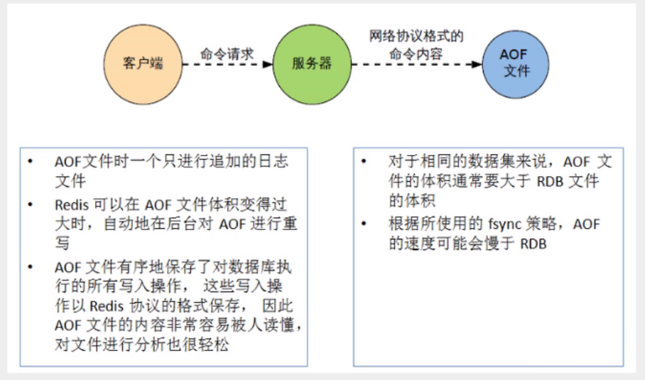


- zjz说:
  - 他们主要是要做持久化操作的....
  - rdb:因为是根据修改次数进行统计的,所以最后的操作有可能保存不了,适用于大规模的恢复
  - AOF:是每次修改,每秒同步,所以性能,效率低.
  


## Redis发布订阅
- Redis 发布订阅(pub/sub)是一种**消息通信模式**：发送者(pub)发送消息，订阅者(sub)接收消息。
- Redis 客户端可以订阅任意数量的频道
- 第一个:消息发送者 第二个:频道 第三个:消息订阅者!
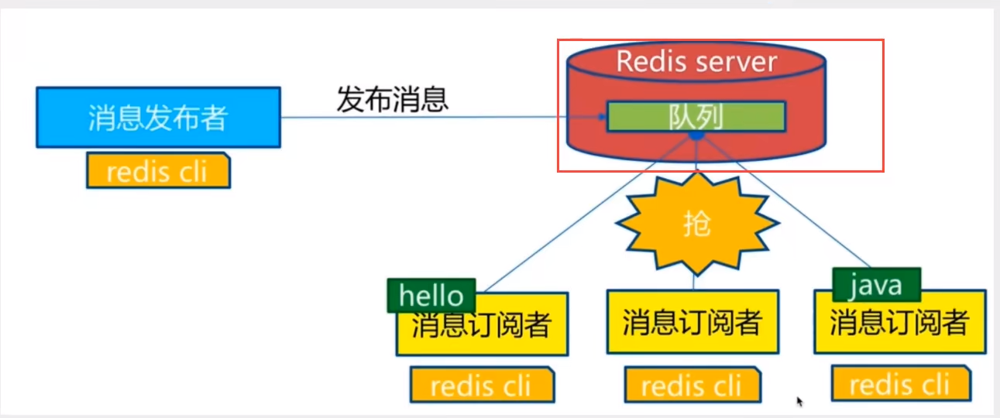
  

- 订阅端:::SUBSCRIBE 端
- 发送端:::PUBLISH 端 消息


> 原理
- 1.Redis是使用C实现的，通过分析 Redis 源码里的 pubsub.c 文件，了解发布和订阅机制的底层实现，籍此加深对 Redis 的理解。
- 2.Redis 通过 PUBLISH 、SUBSCRIBE 和 PSUBSCRIBE 等命令实现发布和订阅功能。
- 3.通过 SUBSCRIBE 命令订阅某频道后，redis-server 里维护了一个字典，字典的键就是一个个 channel
  ，而字典的值则是一个链表，链表中保存了所有订阅这个 channel 的客户端。SUBSCRIBE 命令的关
  键，就是将客户端添加到给定 channel 的订阅链表中。
- 4.通过 PUBLISH 命令向订阅者发送消息，redis-server 会使用给定的频道作为键，在它所维护的 channel
 字典中查找记录了订阅这个频道的所有客户端的链表，遍历这个链表，将消息发布给所有订阅者。
- 5.Pub/Sub 从字面上理解就是发布（Publish）与订阅（Subscribe），在Redis中，你可以设定对某一个
  key值进行消息发布及消息订阅，当一个key值上进行了消息发布后，所有订阅它的客户端都会收到相应
  的消息。这一功能最明显的用法就是用作实时消息系统，比如普通的即时聊天，群聊等功能。
- 使用场景
  - Pub/Sub构建实时消息系统
  - Redis的Pub/Sub系统可以构建实时的消息系统
  - 比如很多用Pub/Sub构建的实时聊天系统的例子。
  
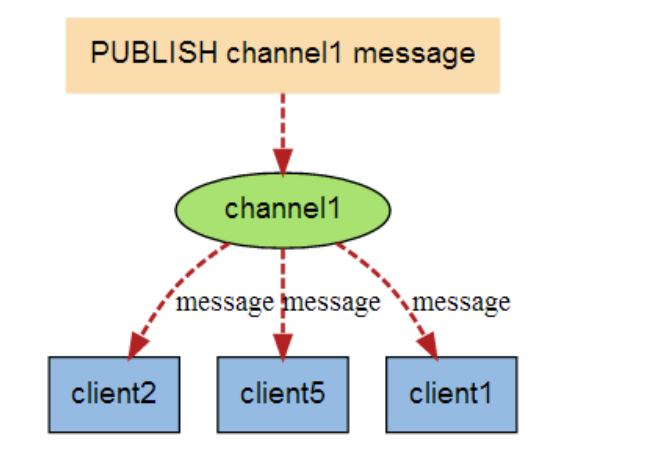
  
- 使用场景
  - 1.实时消息系统.
  - 2.实时聊天,(频道当作聊天室,将信息回显给所有人即可!)
  - 3.订阅,关注系统都是可以的
  - 稍微复杂的场景,我们使用消息中间件MQ,,rabbitMQ,卡夫卡
  


## 主从复制
- 主人--仆从  --- 低配:一主二从
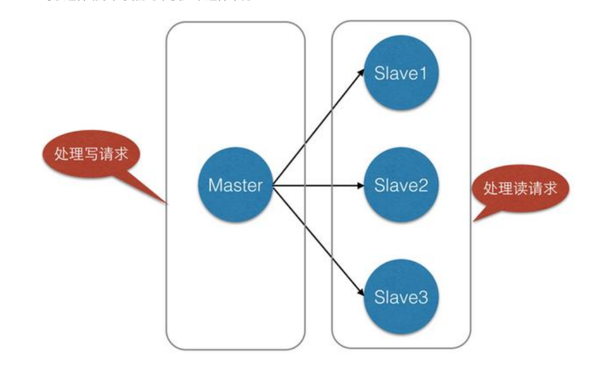
  
## 介绍
- 主从复制，是指将一台Redis服务器的数据，复制到其他的Redis服务器。前者称为主节点
  (master/leader)，后者称为从节点(slave/follower)；数据的复制是单向的，只能由主节点到从节点。
  Master以写为主，Slave 以读为主。
  
- 默认情况下，每台Redis服务器都是主节点；且一个主节点可以有多个从节点(或没有从节点)，但一个从节点只能有一个主节点
  
> 主从复制的作用主要包括：
  - 1、**数据冗余**：主从复制实现了数据的热备份，是持久化之外的一种数据冗余方式。
  - 2、**故障恢复**：当主节点出现问题时，可以由从节点提供服务，实现快速的故障恢复；实际上是一种服务的冗余。
  - 3、**负载均衡**：在主从复制的基础上，配合读写分离，可以由主节点提供写服务，由从节点提供读服务
    （即写Redis数据时应用连接主节点，读Redis数据时应用连接从节点），分担服务器负载；尤其是在写
      少读多的场景下，通过多个从节点分担读负载，可以大大提高Redis服务器的并发量。
  - 4、**高可用基石**：除了上述作用以外，主从复制还是哨兵和集群能够实施的基础，因此说主从复制是Redis高可用的基础。
> 一般来说，要将Redis运用于工程项目中，只使用一台Redis是万万不能的，原因如下：
  - 1、从结构上，单个Redis服务器会发生单点故障，并且一台服务器需要处理所有的请求负载，压力较大；
  - 2、从容量上，单个Redis服务器内存容量有限，就算一台Redis服务器内存容量为256G，也不能将所有内存用作Redis存储内存，
    一般来说，`单台Redis最大使用内存不应该超过20G`。
    
> 环境配置
- 只配置从库,不用配置主库!
- 查看主从复制的信息:info replication  # 当前库的信息
- 复制三个配置文件,然后修改对应的信息
  - 1.端口 2.Pid名字 3.log文件名字 4.dump.rdb名字 5.主机密码
  
> 模式1:一主二从
- 默认情况下,**每台redis服务器都是主节点**,我们只要配置从机就好了
- 认老大.!  --- 一住二从,79为主,80,81为从,,我们只要配置80,81就行
- 命令:::: SLAVEOF 主机 端口(老大的)-------
  - 如果主节点有密码，从节点配置要配置masterauth密码 
- 32主从复制使用docker进行的，host是master的ip(bind那里的地址)不是本机地址

- 主机死了,从机还是只能读,,主机恢复后,从机还可以继续读

> 从机死了
- 如果是命令行配置的主从,从机重启了就会变成主机---重启的定义是关掉服务server了,
- 死机再变回从机,主机的数据立马同步过来


> 复制原理
- Slave启动成功后连接到master后会发送一个sync的同步命令
- Master接到命令,启动后台的存储过程,同时收集所有接收到用于修改数据集的命令,
  在后台进程执行完毕后,master将传输整个数据文件到slave,并完成一次同步.
- `全量复制`:slave 服务在接收到数据库文件数据后,将**其存盘并加载**到内存中
- `增量复制`:Master 继续将新的所有收集到的修改命令依次传给slave,**完成同步**
- zjz说:全量也就是将所有的内容进行重刷   ---增量也就是继续同步数据
- 主从复制的策略就是,只要重新连接,一次重刷(全量复制)将被自动执行


> 模式2:套娃模式
- 如果使用套娃(链表模式)  -- A -- B --C   
  - A是B的主节点,b是C的主节点,,,PS:此时B仍然是从节点
  - C依旧可以拿到A的数据

> 如果没老大了,能不能选举出一个(zookeeper)  
- 谋朝篡位----手动挡----老大回来了,小弟依旧老大..
- 一主二从的情况下，如果主机断了，从机可以使用命令 `SLAVEOF NO ONE` 将自己改为主机！这个时
  候其余的从机链接到这个节点。对一个从属服务器执行命令 SLAVEOF NO ONE 将使得这个从属服务器
  关闭复制功能，并从从属服务器转变回主服务器，原来同步所得的数据集不会被丢弃。


## 哨兵模式(必会)
> 自动选举老大的模式
- 主从切换技术的方法是：当主服务器宕机后，需要手动把一台从服务器切换为主服务器，这就需要人工
  干预，费事费力，还会**造成一段时间内服务不可用**。这不是一种推荐的方式，更多时候，我们优先考虑
  哨兵模式。redis2.8提供的

> 功能:监控后台主机是否有故障,如果故障了根据投票数,`自动将从库转为主库`
- 哨兵模式是一种`特殊的模式`，首先Redis提供了哨兵的命令，哨兵是一个独立的进程，`作为进程，它会独立运行`。
  - 其原理是哨兵通过发送命令，等待Redis服务器响应，从而监控运行的多个Redis实例。

> 单哨兵模式...哨兵死了怎么办  
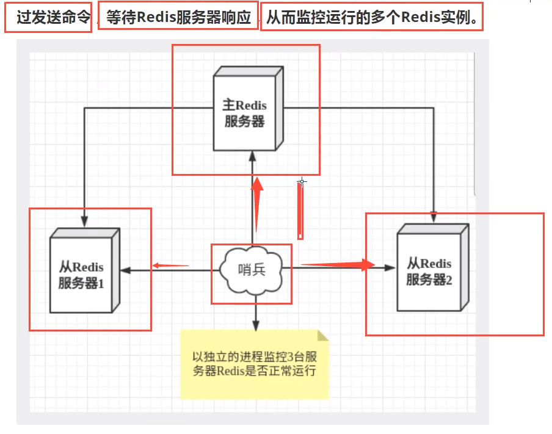
  
- 这里的哨兵有两个作用
  - 1.通过发送命令，让Redis服务器返回监控其运行状态，包括主服务器和从服务器。
  - 2.当哨兵监测到master宕机，会自动将slave切换成master，然后通过发布`订阅模式`通知其他的从服
  务器，修改配置文件，让它们切换主机。

> 多哨兵模式---哨兵集群.
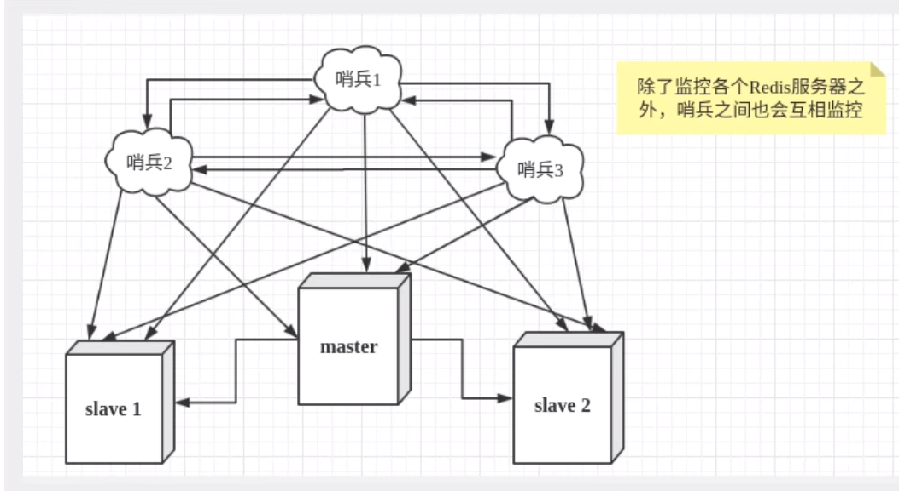
- 假设主服务器宕机，哨兵1先检测到这个结果，系统并不会马上进行failover过程，仅仅是哨兵1主观的认
  为主服务器不可用，这个现象成为**主观下线**。
- 当后面的哨兵也检测到主服务器不可用，并且数量达到一 定值时，那么哨兵之间就会进行一次投票，
  投票的结果由一个哨兵发起，进行failover[故障转移]操作。
  切换成功后，就会通过发布`订阅模式`，让各个哨兵把自己监控的从服务器实现切换主机，这个过程称为
  **客观下线**
  

> 测试
- 1、自定义的 /zjzconfig 目录下新建 `sentinel.conf` 文件，名字千万不要错
  2、配置哨兵，填写内容
  sentinel monitor 被监控主机名字(随便取) `bind的ip` port 1
  ，代表只有1个及1个以上的哨兵认为主机不可用时，才会进行failover操作
  3、启动哨兵
  Redis-sentinel /zjzconfig/sentinel.conf
  上述目录依照各自的实际情况配置，可能目录不同
  4、正常主从演示
  
> 最后原老大回来了,只能当新老大的小弟..


> 哨兵模式的优缺点
- 优点
  - 1. 哨兵集群模式是基于主从模式的，所有主从的优点，哨兵模式同样具有。
  - 2. 主从可以切换，故障可以转移，系统可用性更好。
  - 3. 哨兵模式是主从模式的升级，系统更健壮，可用性更高。
- 缺点
  - 1. Redis较难支持在线扩容，在集群容量达到上限时在线扩容会变得很复杂。
  - 2. 实现哨兵模式的配置也不简单，甚至可以说有些繁琐


## 缓存穿透和雪崩(面试高频,工作常用)
### 缓存穿透(查不到)
- 缓存穿透的概念很简单，用户想要查询一个数据，发现redis内存数据库没有，也就是缓存没有命中，于
  是向持久层数据库查询。发现也没有，于是本次查询失败。当用户很多的时候，缓存都没有命中，于是
  都去请求了持久层数据库。这会给持久层数据库造成很大的压力，这时候就相当于出现了缓存穿透。
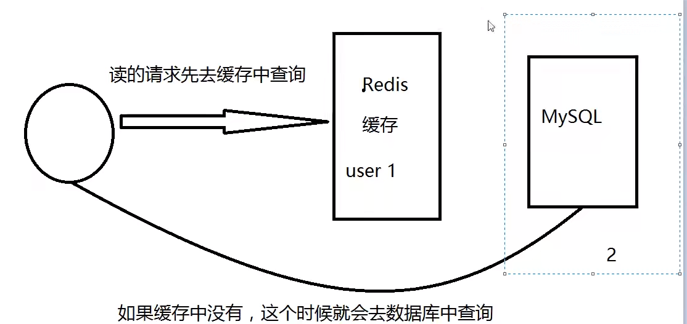
  
> 布隆过滤器
- 布隆过滤器是一种数据结构，对所有可能查询的参数以hash形式存储，在控制层先进行校验，不符合则
    丢弃，从而避免了对底层存储系统的查询压力；
  
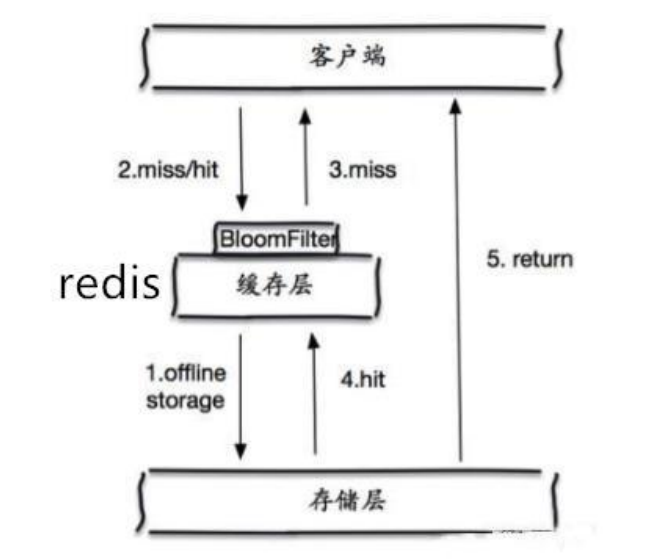

> 缓存空对象
- 1、如果空值能够被缓存起来，这就意味着缓存需要更多的空间存储更多的键，因为这当中可能会有很多
  的空值的键；
- 2、即使对空值设置了过期时间，还是会存在缓存层和存储层的数据会有一段时间窗口的不一致，这对于
  需要保持一致性的业务会有影响。

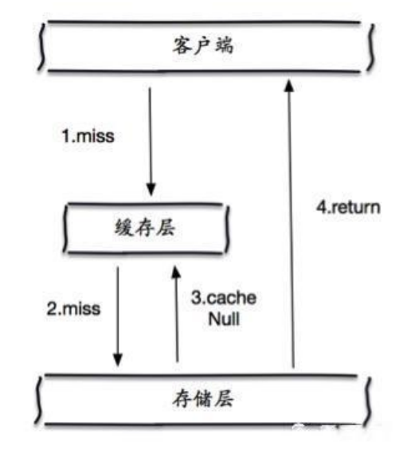


### 缓存击穿(针对性太强)---不是穿透
- 这里需要注意和缓存击穿的区别，缓存击穿，是指一个**key非常热点**，在不停的扛着大并发，大并发集中
  对这一个点进行访问，当这个key在失效的瞬间，**持续的大并发就穿破缓存**，直接请求数据库，就像在一
  个屏障上凿开了一个洞。
- 当某个key在过期的瞬间，有大量的请求并发访问，这类数据一般是热点数据，由于缓存过期，会同时访
  问数据库来查询最新数据，并且回写缓存，会导使数据库瞬间压力过大。

> 解决方案
- 设置热点数据永不过期
  - 从缓存层面来看，没有设置过期时间，所以不会出现热点 key 过期后产生的问题。加互斥锁
- 分布式锁：使用分布式锁，保证对于每个key同时只有一个线程去查询后端服务，其他线程没有获得分布
  式锁的权限，因此只需要等待即可。这种方式将高并发的压力转移到了分布式锁，因此对分布式锁的考
  验很大。
- 分布式锁
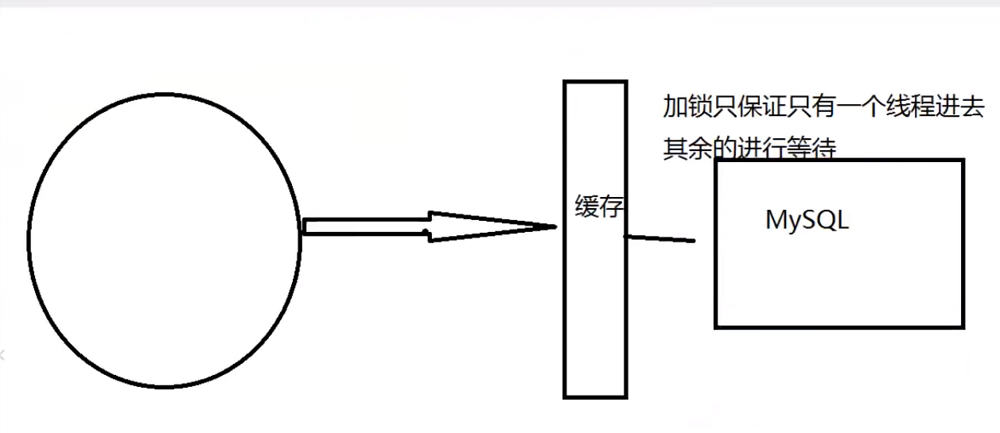


### 缓存雪崩(过期,失效)
> 缓存雪崩，是指在某一个时间段，缓存集中过期失效。
- 产生雪崩的原因之一，比如在写本文的时候，马上就要到双十二零点，很快就会迎来一波抢购，这波商
  品时间比较集中的放入了缓存，假设缓存一个小时。那么到了凌晨一点钟的时候，这批商品的缓存就都
  过期了。而对这批商品的访问查询，都落到了数据库上，对于数据库而言，就会产生周期性的压力波
  峰。于是所有的请求都会达到存储层，存储层的调用量会暴增，造成存储层也会挂掉的情况
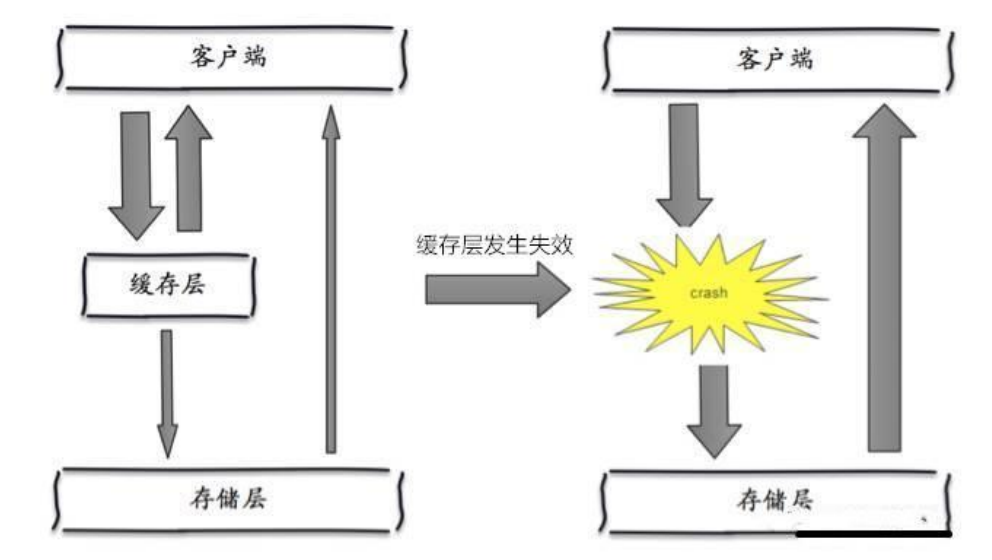
  
- 其实集中过期，倒不是非常致命，比较致命的缓存雪崩，是**缓存服务器某个节点宕机或断网**。因为自然
  形成的缓存雪崩，一定是在某个时间段集中创建缓存，这个时候，数据库也是可以顶住压力的。无非就
  是对数据库产生周期性的压力而已。而缓存服务节点的宕机，对数据库服务器造成的压力是不可预知
  的，很有可能瞬间就把数据库压垮。

- 在双11的时候,停掉一些服务(保证主要服务可用!!)


> 解决方案
- `redis高可用`(异地多活!)
  - 这个思想的含义是，既然redis有可能挂掉，那我多增设几台redis，这样一台挂掉之后其他的还可以继续工作，其实就是搭建的集群。
- `限流降级`
  - 这个解决方案的思想是，在缓存失效后，通过加锁或者队列来控制读数据库写缓存的线程数量。比如对
  某个key只允许一个线程查询数据和写缓存，其他线程等待。
- `数据预热`
- 数据加热的含义就是在正式部署之前，我先把可能的数据先预先访问一遍，这样部分可能大量访问的数
  据就会加载到缓存中。在即将发生大并发访问前手动触发加载缓存不同的key，设置不同的过期时间，让
  **缓存失效的时间点尽量均匀**。


