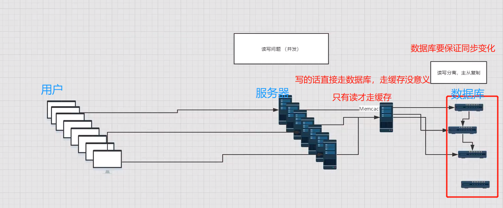

# CACHE


## Cache介绍
> 简介：
  
- 1.由来？想要解决什么问题？
    - 1.查询：连接数据库是十分耗资源的
    - 2.想要将一次的查询结果，给他**暂存**一个可以直接取到的地方！---》内存 ： 缓存
    - 3.我们再次查询相同数据的时候，直接走缓存，就不用走数据库了
    
- 2.什么是缓存（Cache）？
    - 存在内存中的临时数据
    - 将用户查询到的数据放在缓存(内存)中，用户去查询数据就不用从磁盘上（关系型数据库数据文件）查询，
      从缓存中直接去查，从而**提高查询效率**，**解决高并发系统**的性能问题。
      

      
- 3. 为什么使用缓存？
  - 减少和数据库的交互次数，减少系统开销，提高系统效率。
    
- 4. 什么样的数据能使用缓存？
 - 经常查询并且不经常改变的数据。

# Mybatis缓存
- MyBatis包含一个非常强大的查询缓存特性，它可以非常方便地定制和配置缓存。缓存可以极大的提升查询效率。
- MyBatis系统中默认定义了两级缓存：一级缓存和二级缓存
    - 默认情况下，只有一级缓存开启。（SqlSession级别的缓存，也称为本地缓存）
    - 二级缓存需要手动开启和配置，他是基于namespace级别的缓存。（一个mapper对应一个namespace）
    - 为了提高扩展性，MyBatis定义了缓存接口Cache。我们可以通过实现Cache接口来自定义二级缓存
      
- 缓存策略
    - MyBatis 内置了一个强大的**事务性查询缓存机制**，它可以非常方便地配置和定制。 
    - 可用的清除策略有：
       -  `LRU ` – 最近最少使用：移除最长时间不被使用的对象。
       -  `FIFO` – 先进先出：按对象进入缓存的顺序来移除它们。(队列)
       -  `SOFT` – 软引用：基于垃圾回收器状态和软引用规则移除对象。
       -  `WEAK` – 弱引用：更积极地基于垃圾收集器状态和弱引用规则移除对象。
    - 默认LRU
    
## 原理：
- 先二级缓存--》一级缓存--》数据库


## 一级缓存
- 1.一级缓存也叫本地缓存：
  - 与数据库同一次会话期间查询到的数据会放在本地缓存中。
  - 以后如果需要获取相同的数据，直接从缓存中拿，没必须再去查询数据库；
    - 自测： 
        - 1.开启日志
        - 2.测试在一个Session中查询两次相同的记录
        - 3.查看日志输出

    ```
       @Test
        public void quertUserByIdTest(){
        SqlSession sqlSession = MybatisUtils.getSqlSession();
        UserMapper mapper = sqlSession.getMapper(UserMapper.class);
        User user1 = mapper.quertUserById(1);
        // 测试从哪里取值
        User user2 = mapper.quertUserById(1);
    
            if(user1 != null && user2 != null){
                System.out.println(user1.toString());       // User(id=1, name=zjz1, password=123456)
                System.out.println(user2.toString());       // User(id=1, name=zjz1, password=123456)
                System.out.println(user1==user2);       // true
            }else {
                System.out.println("用户不存在！");
            }
            sqlSession.close();
        } 
    ```
    
- 2.一级缓存失效的四种情况
    - 一级缓存是SqlSession级别的缓存，是一直开启的，我们关闭不了它；
    - 一级缓存失效情况：没有使用到当前的一级缓存，效果就是，还需要再向数据库中发起一次查询请求！
        - 1.查询不同的东西
        - 2.增删改操作，可能会改变原来的数据，所以必定会刷新缓存
        - 3.查询不同的Mapper.xml
        - 4.手动清理缓存
            ` /* 清理缓存 clearCache*/   sqlSession.clearCache();`
          
    - 总：一级缓存默认开启的，只在一次sqlSession中有效，也就是拿到连接到关闭这个区间
        - 用处不大，底层是一个Map，利用Map存下数据，取值，，，


## 二级缓存
### 介绍
- 1.由来：：二级缓存也叫全局缓存，一级缓存作用域太低了，所以诞生了二级缓存
- 2.作用域：基于namespace级别的缓存，一个名称空间，对应一个二级缓存；
    - 关键点：一级缓存的数据被保存到二级缓存中 ---- 会话关闭才会存！ 
- 3工作机制
  - 一个会话查询一条数据，这个数据就会被放在当前会话的一级缓存中；
  - 如果当前会话关闭了，这个会话对应的一级缓存就没了；但是我们想要的是，会话关闭了，**一级缓存中的数据被保存到二级缓存中**；
  - 新的会话查询信息，就可以从二级缓存中获取内容；
  - 不同的mapper查出的数据会放在自己对应的缓存（map）中；
- 4.直接使用cache时，我们需要将javaBean序列化
    - 报错`Error serializing object.  Cause: java.io.NotSerializableException: com.zjz.pojo.User`
### 操作
- Mybatis中的操作：
    - 1.开启缓存
    
    ```
        <!--显示的开启全局缓存-->
          <setting name="cacheEnabled" value="true"/>      <!--开关映射器配置文件中已配置的任何缓存-->
  
    ```
    - 2.Mapper.xml中配置
    
    ```
        官方示例=====>查看官方文档 
     <cache eviction="FIFO"
             flushInterval="60000" 
             size="512" 
            readOnly="true"/> 
        这个更高级的配置创建了一个 FIFO 缓存，每隔 60 秒刷新，最多可以存储结果对象或列表的 512 个引用，
        而且返回的对象被认为是只读的，因此对它们进行修改可能会在不同线程中的调用者产生冲突。
    ```
  
    ```
           <!--在当前Mapper.xml中使用二级缓存-->
             <cache/>
  
            <!--在开启的基础，也可以在CRUD标签中配置（useCache）是否使用-->
  
  
            <select id="quertUserById" parameterType="_int" resultType="user" useCache="true">
            <!-- true是使用-->
            
        
    ```


## Ehcache(自定义缓存)
> Ehcache是一种广泛使用的java分布式缓存，用于通用缓存；

- 1.要在应用程序中使用Ehcache，需要引入依赖的jar包
```

<!-- https://mvnrepository.com/artifact/org.mybatis.caches/mybatis-ehcache -->
<dependency>
    <groupId>org.mybatis.caches</groupId>
    <artifactId>mybatis-ehcache</artifactId>
    <version>1.2.1</version>
</dependency>


```

- 2.在mapper.xml中使用对应的缓存即可
    ```
    
        <mapper namespace = “org.acme.FooMapper” > 
            <cache type = “org.mybatis.caches.ehcache.EhcacheCache” /> 
        </mapper> 
    ```
  
- 3.编写ehcache.xml文件，如果在 加载时 未找到 /ehcache.xml 资源或出现问题，则将使用默认配置。

```
    <?xml version="1.0" encoding="UTF-8"?> 
    <ehcache xmlns:xsi="http://www.w3.org/2001/XMLSchema-instance" 
        xsi:noNamespaceSchemaLocation="http://ehcache.org/ehcache.xsd" 
        updateCheck="false"> 
    <!--diskStore：为缓存路径，
    ehcache分为内存和磁盘两级，此属性定义磁盘的缓存位置。
    参数解释如下： 
        user.home – 用户主目录 
        user.dir – 用户当前工作目录 
        java.io.tmpdir – 默认临时文件路径 --> 
        <diskStore path="./tmpdir/Tmp_EhCache"/> 
    <defaultCache 
    eternal="false" maxElementsInMemory="10000" 
    overflowToDisk="false" 
    diskPersistent="false" 
    timeToIdleSeconds="1800" 
    timeToLiveSeconds="259200" 
    memoryStoreEvictionPolicy="LRU"/>
     <cache 
     name="cloud_user" 
     eternal="false" 
     maxElementsInMemory="5000" 
     overflowToDisk="false" 
     diskPersistent="false" 
     timeToIdleSeconds="1800" 
     timeToLiveSeconds="1800" 
     memoryStoreEvictionPolicy="LRU"/> 
     <!--defaultCache：默认缓存策略，当ehcache找不到定义的缓存时，则使用这个缓存策 略。只能定义一个。 --> 
     <!--
     1.name:缓存名称。 
     2.maxElementsInMemory:缓存最大数目 
     3.maxElementsOnDisk：硬盘最大缓存个数。 
     4.eternal:对象是否永久有效，一但设置了，timeout将不起作用。 
     5.overflowToDisk:是否保存到磁盘，当系统当机时 timeToIdleSeconds:设置对象在失效前的允许闲置时间（单位：秒）。
         仅当 eternal=false对象不是永久有效时使用，可选属性，默认值是0，也就是可闲置时间无穷大。
     6.timeToLiveSeconds:设置对象在失效前允许存活时间（单位：秒）。最大时间介于创建 时间和失效时间之间。
         仅当eternal=false对象不是永久有效时使用，默认是0.，也就是对象存 活时间无穷大。 
      7.diskPersistent：是否缓存虚拟机重启期数据 
      Whether the disk store persists between restarts of the Virtual Machine. The default value is false.
      8.diskSpoolBufferSizeMB：这个参数设置DiskStore（磁盘缓存）的缓存区大小。默认是30MB。每个Cache都应该有自己的一个缓冲区。 
      9.diskExpiryThreadIntervalSeconds：磁盘失效线程运行时间间隔，默认是120秒。 
      10.memoryStoreEvictionPolicy：当达到maxElementsInMemory限制时，Ehcache将会根据指定的策略去清理内存。
      默认策略是LRU（最近最少使用）。你可以设置为FIFO（先进先出）或是LFU（较少使用）。
       
      11.clearOnFlush：内存数量最大时是否清除。 
      12.memoryStoreEvictionPolicy:可选策略有：LRU（最近最少使用，默认策略）、 FIFO（先进先出）、LFU（最少访问次数）。 
      13.FIFO，first in first out，这个是大家最熟的，先进先出。 
      14.LFU， Less Frequently Used，就是上面例子中使用的策略，直白一点就是讲一直以来最少被使用的。
        如上面所讲，缓存的元素有一个hit属性，hit值最小的将会被清出缓存。 
      15.LRU，Least Recently Used，最近最少使用的，缓存的元素有一个时间戳，当缓存容量满了，而又需要腾出地方来缓存新的元素的时候，
        那么现有缓存元素中时间戳离当前时间最远的 元素将被清出缓存。 -->
       
       </ehcache>
```


