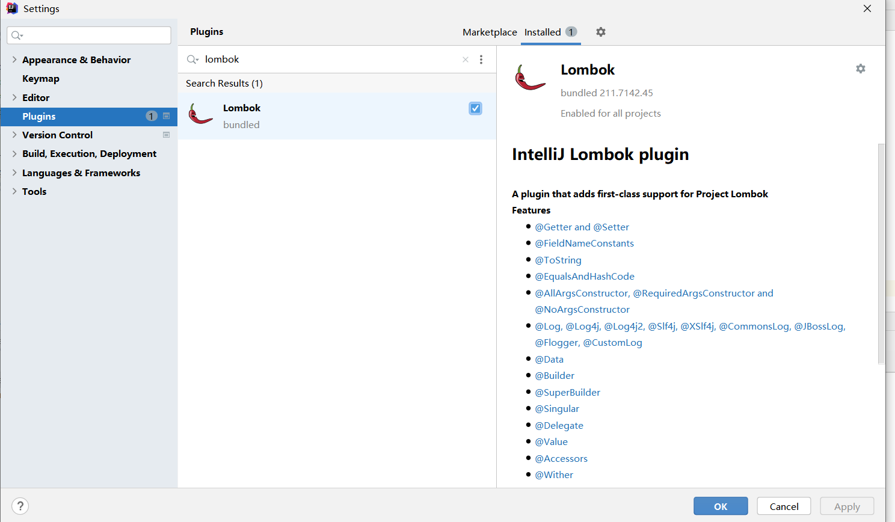
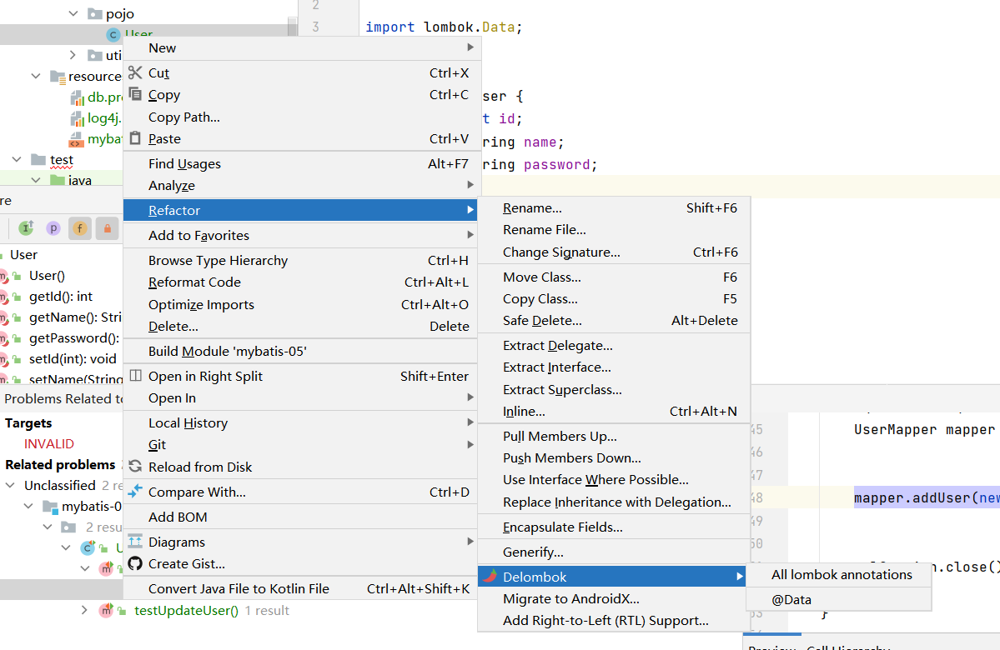

# LOMBOK
> 目的，不用写get set
> 

## 配置
- 1.安装Lombok插件



- 2.导入jar包
    ```
        <!-- https://mvnrepository.com/artifact/org.projectlombok/lombok -->
        <dependency>
            <groupId>org.projectlombok</groupId>
            <artifactId>lombok</artifactId>
            <version>1.18.20</version>
        </dependency>
    
    
    ```
  

- 如果没导包，还是可以通过插件生成




## 注解
- 常用的
- `@Data`
  - 无参构造，get，set，toString，hashCode，equals
  
- `@AllArgsConstructor` // 有参构造器
- `@NoArgsConstructor` // 无参构造器

- ---一般这三个结合使用
- 可手动添加构造器，以及get set

```
      import lombok.AllArgsConstructor;
      import lombok.Data;
      import lombok.NoArgsConstructor;
      
      @Data
      @AllArgsConstructor
      @NoArgsConstructor
      
      public class User {
          private int id;
          private String name;
          private String password;
      
      }
  
```


