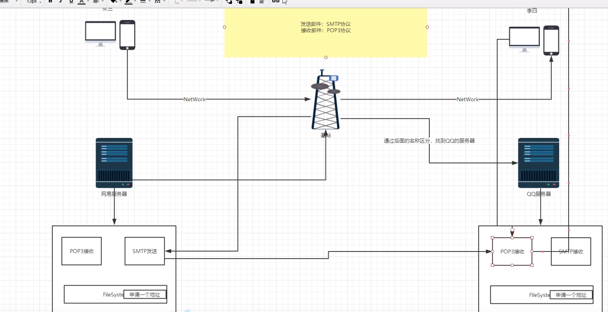

# Email
## 邮件





- 两个包
    - mail.jar
    - activation.jar
  

- 简单邮件
  - 没有附件和图片，纯文本邮件
- 复杂邮件
  - 有附件和图片
  

## 简单邮件
- JavaMail 是sun公司（现以被甲骨文收购）为方便Java开发人员在应用程序中实现邮件发送和接收功能而提供的一套标准开发包，它支持一些常用的邮件协议，如前面所讲的SMTP，POP3，IMAP,还有MIME等。
  - 我们在使用JavaMail API 编写邮件时，无须考虑邮件的底层实现细节，只要调用JavaMail 开发包中相应的API类就可以了。
  - 我们可以先尝试发送一封简单的邮件，确保电脑可以连接网络。
  - 步骤：
    - 1创建包含邮件服务器的网络连接信息的Session对象；
    - 2创建代表邮件内容的Message对象；
    - 3创建Transport对象，连接服务器，发送Message；
    - 4关闭连接。
- 去进行邮箱设置的 POP3/SMTP服务器开启：
  ```
  import 是mail的
  public class EmailDemo {
  
      //简单邮件 没有附件和图片，纯文本邮件
      //复杂邮件 有附件和图片
  
      // 要发送邮件需要获得协议和支持！开启服务POP3/SMTP服务
      // 授权码：wyxpmsvpwdwveaab
  
      public static void main(String[] args) throws GeneralSecurityException, MessagingException {
  
          Properties properties = new Properties();
          properties.setProperty("mail.host","smtp.qq.com");  // 设置QQ邮箱服务器
          properties.setProperty("mail.transport.protocol","smtp"); // 邮件发送协议
          properties.setProperty("mail.smtp.auth","true"); // 需要验证用户名和密码
  
  
          // 关于QQ邮箱，还需要设置SSL加密，
          MailSSLSocketFactory sf = new MailSSLSocketFactory();
          sf.setTrustAllHosts(true);
          properties.put("mail.smtp.ssl.enable","true");
          properties.put("mail.smtp.ssl.socketFactory",sf);
  
  
          // 使用JavaMail发送邮件的5个步骤
          //1、创建定义整个应用程序所需要的环境信息的 Session对象
  
          // QQ才有的授权码，其它邮箱不用】
          Session session = Session.getDefaultInstance(properties, new Authenticator() {
              public PasswordAuthentication getPasswordAuthentication() {
                  //发件人邮件用户名，授权码
                  return new PasswordAuthentication("1637883325@qq.com", "wyxpmsvpwdwveaab");
              }
          });
          //2、通过session 去得到 transport对象
          Transport ts = session.getTransport();
  
          //可以开启Session的Debug模式，这样就能看到程序发送邮件的运行状态
          session.setDebug(true);
  
          //3、使用邮件的用户名和授权码 连接邮件服务器
          ts.connect("smtp.qq.com","1637883325@qq.com","wyxpmsvpwdwveaab");
         // ts.connect("smtp.163.com","zjz@163.com","ALDEGHIPYNNRZTJL");
  
          //4、创建邮件，一个Message对象
          // 写邮件。 注意需要传递Session
          MimeMessage message = new MimeMessage(session);
  
          //指定邮件的发件人
          message.setFrom(new InternetAddress("1637883325@qq.com"));
          // 邮件的收件人。 此时发件人和收件人一样，即自己给自己发
  
  
          message.setRecipient(Message.RecipientType.TO, new InternetAddress("1637883325@qq.com"));
  
          //邮件的标题
          message.setSubject("欢迎来到德莱联盟---");
          //邮件的文本内容
          message.setContent("<h1 style='color: blue'> 你好啊，小伙子!---<h1>", "text/html; charset=UTF-8");
  
          //5、发送邮件
          ts.sendMessage(message, message.getAllRecipients());
  
          //6。关闭连接
          ts.close();
  
  
  
      }
      
  }
  
  ```
  

## 发送带图片和附件的邮件
- 在这种带有附件类型， 邮件扩展类型的时候，需要使用 MIME 协议。

- MIME(Multipurpose Internet Mail Extensions)多用途互联网邮件扩展类型。是设定某种扩展名的

- 文件用一种应用程序来打开的方式类型，当该扩展名文件被访问的时候，浏览器会自动使用指定应用程序来打开。多用于指定一些客户端自定义的文件名，以及一些媒体文件打开方式。

- MimeBodyPart类：
  - javax.mail.internet.MimeBodyPart类 表示的是一个MIME消息，它和MimeMessage类一样都是从Part接口继承过来。

- MimeMultipart类：
  - javax.mail.internet.MimeMultipart是抽象类 Multipart的实现子类,它用来组合多个MIME消息。一个MimeMultipart对象可以包含多个代表MIME消息的MimeBodyPart对象。
  


- 比普通发送多的内容

```

   // #################### 带有图片的邮件修改，其实就是改变了邮件的内容，使用 MimeBodyPart类
          /** //邮件的文本内容
           * message.setContent("<h1 style='color: blue'> 文本内容!<h1>", "text/html; charset=UTF-8");
           */
          //准备图片数据
          MimeBodyPart image = new MimeBodyPart();
          // 图片需要经过数据处理： DataHandler:数据处理
          DataHandler dh = new DataHandler(new FileDataSource("src/main/resources/Servlet思维导图.jpg"));
          image.setDataHandler(dh);  //在我们的Body中放入这个处理的图片数据
          image.setContentID("Servlet思维导图.jpg"); //给图片设置一个 ID，后面传送的时候使用
  
          //准备正文数据
          MimeBodyPart text = new MimeBodyPart();
          text.setContent("这是一封邮件正文带图片的邮件", "text/html;charset=UTF-8");
  
          //描述数据关系
          MimeMultipart mm = new MimeMultipart();
          mm.addBodyPart(text);
          mm.addBodyPart(image);
          mm.setSubType("related");
  
          //设置到消息中，保存修改
          message.setContent(mm);  //把编辑好的邮件内容去放到 message对象中
          message.saveChanges();
  
          //5、发送邮件
          ts.sendMessage(message, message.getAllRecipients());

```


 

