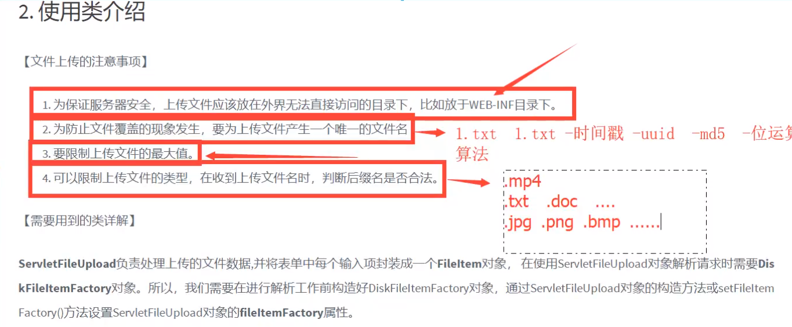
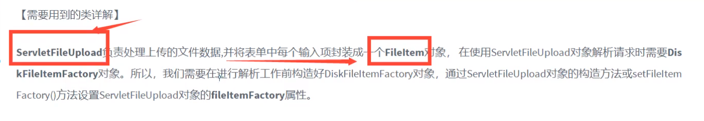

# 文件上传
## 文件传输
- 


## 文件上传
- 需要导包
  
    ```
        
        <!-- https://mvnrepository.com/artifact/commons-io/commons-io -->
        <dependency>
            <groupId>commons-io</groupId>
            <artifactId>commons-io</artifactId>
            <version>2.6</version>
        </dependency>
    
  
        <!-- https://mvnrepository.com/artifact/commons-fileupload/commons-fileupload -->
        <dependency>
            <groupId>commons-fileupload</groupId>
            <artifactId>commons-fileupload</artifactId>
            <version>1.4</version>
        </dependency>

    ```
  

- 文件调优，限制，类





- go
 - 1.在html 页面中input中必须有 name`<input type ="file" name = "filename"`;
 - 2.表单中如果包含一个文件上传输入项的话，这个表单的enctype属性就必须设置为multipart/form-dat
  - `enctype="multipart/form-data"`
 - 3.编写Servlet
   
  ```
            public class FileServlet extends HttpServlet {
            @Override
            protected void doGet(HttpServletRequest request, HttpServletResponse response) throws ServletException, IOException {
        
            }
        
            @Override
            protected void doPost(HttpServletRequest request, HttpServletResponse response) throws ServletException, IOException {
                // 判断上传的文件是普通表单还是带文件的表单
                if (!ServletFileUpload.isMultipartContent(request)) {
                    return; // 终止方法运行，说明是一个普通的表单，直接返回
                }
        
                // 创建上传文件的保存路径，建议在WEN-INF路径下，安全，用户无法访问上面的文件
                String uploadPath = this.getServletContext().getRealPath("/WEB-INF/upload");
                File uploadFile = new File(uploadPath);
                if (!uploadFile.exists()) {
                    uploadFile.mkdir(); // 创建这个目录
                }
                System.out.println("路径：" + uploadPath);
        /*
        
                // 缓存，临时文件
                // 临时文件，假如文件超过了预期的大小，我们就把他放在一个临时文件中，过几天自动删除，或者提醒用户转存为永久
                String tmpPath = this.getServletContext().getRealPath("/WEB-INF/tmp");
                File tmpFile = new File(tmpPath);
                if (!tmpFile.exists()) {
                    tmpFile.mkdir(); // 创建这个目录
                }
        
        */
        
                // 处理上传的文件，一般都需要通过流来获取，我们可以使用request.getInputStream(),原生态的文件上传流获取，十分麻烦
                // 但是我们建议使用Apache的文件上传组件来实现，common-fileuplaoad，他需要依赖于commons-io 组件
        
                //1、创建DiskFileItemFactory对象，处理文件上传路径或限制文件大小
                try {
                DiskFileItemFactory factory = gteDiskFileItemFactory(uploadFile);
        
                //2、获取ServletFileUpload
        
                ServletFileUpload upload = getServletFileUpload(factory);
        
                //3、处理上传文件
        
                    String msg = uploadParseRequest(upload,request,uploadPath);
                    request.setAttribute("msg",msg);
                    request.getRequestDispatcher("info.jsp").forward(request,response);
                } catch (FileUploadException e) {
                    e.printStackTrace();
                }
        
        
        
        
            }
        
        
            public static DiskFileItemFactory gteDiskFileItemFactory(File file){
        //1、创建DiskFileItemFactory对象，处理文件上传路径或限制文件大小
        
                DiskFileItemFactory factory = new DiskFileItemFactory();
        
                //通过这个工厂设置一个缓冲区，当上传的文件大小大于缓冲区的时候，将它放到临时文件中；
        
                factory.setSizeThreshold(1024 * 1024);//缓冲区大小为1M
        
                factory.setRepository(file);
        
                return factory;
        
            }
        
        
        
        
        
        
            public static ServletFileUpload getServletFileUpload(DiskFileItemFactory factory){
        //2、获取ServletFileUpload
        
                ServletFileUpload upload = new ServletFileUpload(factory);
        
                //监听文件上传进度
        
                upload.setProgressListener(new ProgressListener() {
                @Override
        
                public void update(long pBytesRead, long lpContentLenght, int i) {
                //pBytesRead:已读取到的文件大小
        
                //pContentLenght：文件大小
        
                System.out.println("总大小："+lpContentLenght+"已上传："+pBytesRead);
        
                }
        
                });
        
                //处理乱码问题
        
                upload.setHeaderEncoding("UTF-8");
        
                //设置单个文件的最大值
        
                upload.setFileSizeMax(1024 * 1024 * 10);
        
                //设置总共能够上传文件的大小
        
                //1024 = 1kb * 1024 = 1M * 10 = 10M
        
                upload.setSizeMax(1024 * 1024 * 10);
        
                return upload;
        
        }
        
        
        
        
            public static String uploadParseRequest(ServletFileUpload upload, HttpServletRequest request, String uploadpath) throws
                    IOException, FileUploadException {
                    String msg = "";
        
        //3、处理上传文件
        
                //把前端的请求解析，封装成一个FileItem对象
                List<FileItem> fileItems = upload.parseRequest(request);
        
                for (FileItem fileItem : fileItems) {
                    if (fileItem.isFormField()) { //判断是普通表单还是带文件的表单
        
                    //getFieldName指的是前端表单控件的name
        
                        String name = fileItem.getFieldName();
        
                        String value = fileItem.getString("UTF-8");//处理乱码
        
                        System.out.println(name + ":" + value);
        
                    } else {//判断它是带文件的表单
        
             //======================处理文件=======================//
        
             //拿到文件的名字
        
                        String uploadFileName = fileItem.getName();
        
                        System.out.println("上传的文件名：" + uploadFileName);
        
                        if (uploadFileName.trim().equals("") || uploadFileName == null) {
                            continue;
        
                        }
        
                //获得上传的文件名，例如/img/girl/XXX.jpg,只需要XXX，其前面的后面的都不需要
        
                        String fileName = uploadFileName.substring(uploadFileName.lastIndexOf("/") + 1);
        
                //获得文件的后缀名
        
                        String fileExtName = uploadFileName.substring(uploadFileName.lastIndexOf(".") + 1);
        
                        /*
        
                         * 如果后缀名 fileExtName 不是我们需要的
        
                         *就直接return，不处理，告诉用户类型不对
        
                         * */
        
                        System.out.println("文件信息【文件名：" + fileName + "文件类型：" + fileExtName + "】");
        
                //可以使用UUID(唯一通用识别码)来保证文件名的统一
                          // 网络传输中的东西都需要序列化
                        String uuidFileName = UUID.randomUUID().toString();
        
                //=======================传输文件=========================//
        
                //获得文件上传的流
        
                        InputStream inputStream = fileItem.getInputStream();
        
                //创建一个文件输出流
        
                        FileOutputStream fos = new FileOutputStream(uploadpath + "/" + uuidFileName + "." + fileExtName);
        
                //创建一个缓冲区
        
                        byte[] buffer = new byte[1024 * 1024];
        
                //判断是否读取完毕
        
                        int len = 0;
        
                //如果大于0，说明还存在数据
        
                        while ((len = inputStream.read(buffer)) > 0) {
                            fos.write(buffer, 0, len);
        
                        }
        
                //关闭流
        
                        fos.close();
        
                        inputStream.close();
        
                        msg = "文件上传成功！";
        
                        fileItem.delete();//上传成功，清除临时文件
        
                    }
        
                }
        
                return msg;
        
            }
        
        }


  ```
  
- 4.jsp编写
```
    。jsp---
    <%--通过表单上传文件--%>
    <form action="${pageContext.request.contextPath}/upload.do" method="post" enctype="multipart/form-data">
    
        上传用户：<input type="text" name="username"><br>
     <p><input type="file" name="file1" ></p>
      <p><input type="file" name="file2"></p>
    
       <p> <input type="submit">|<input type="reset"></p>   
    </form>
    
    。jsp
    ${msg}


```

- 5.记得配web.xml


