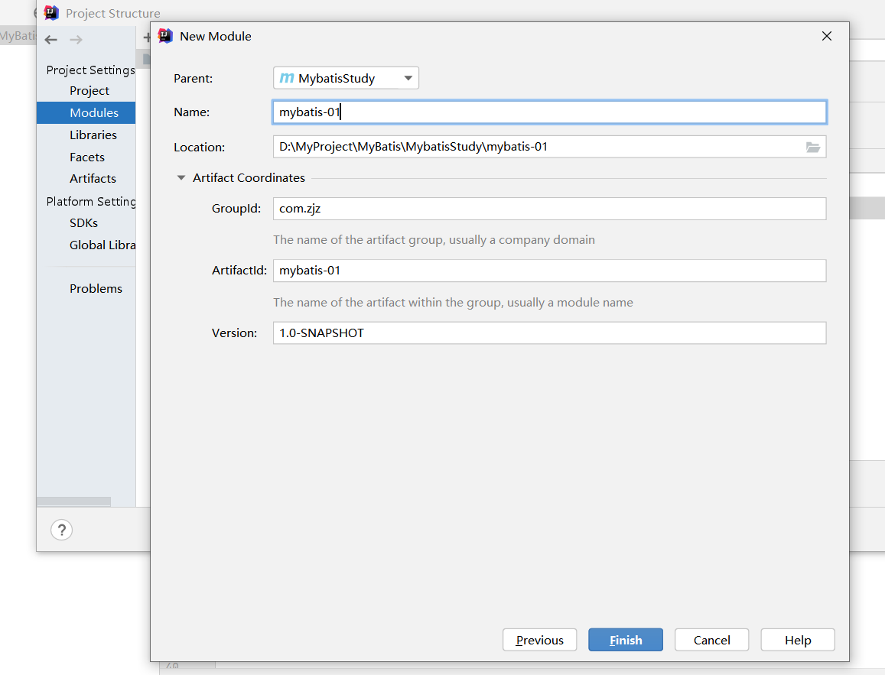
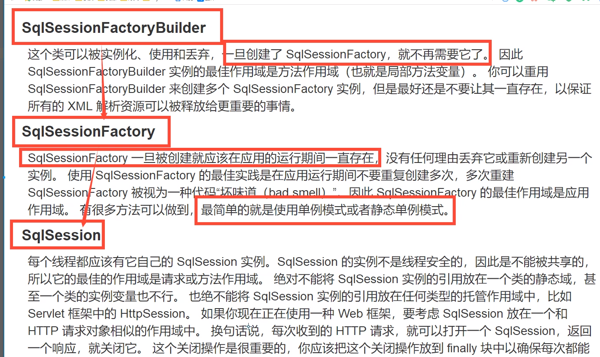
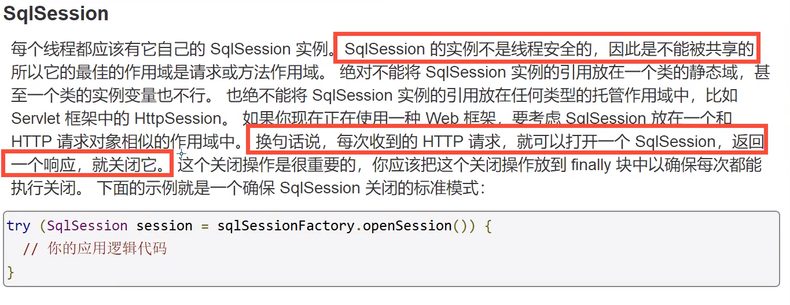
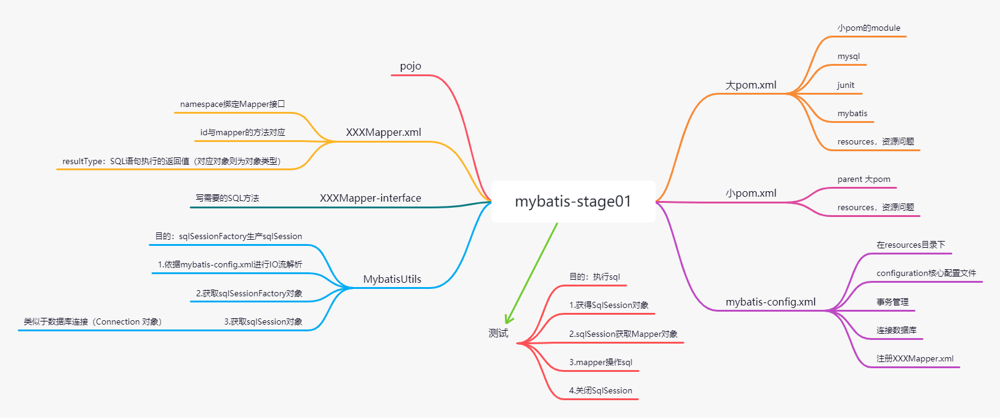
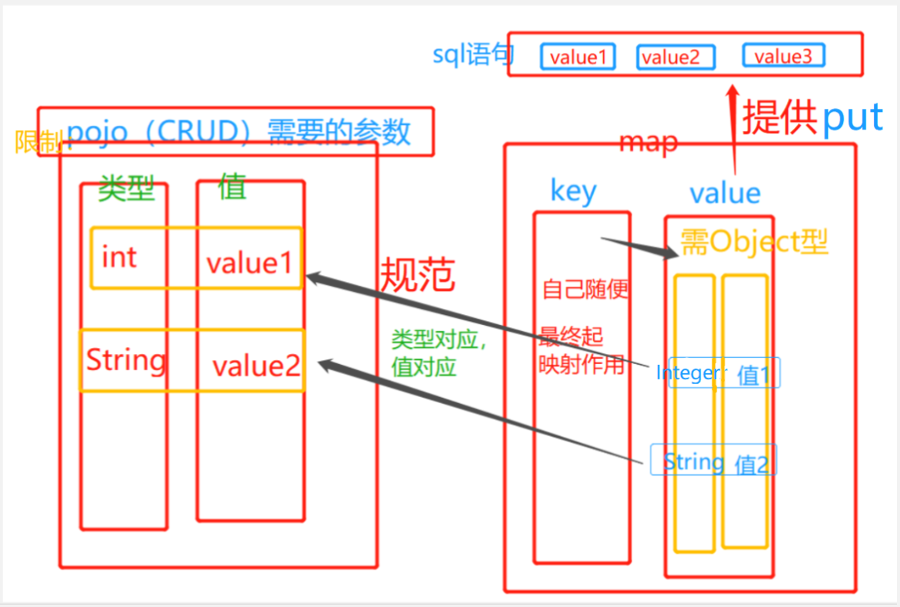
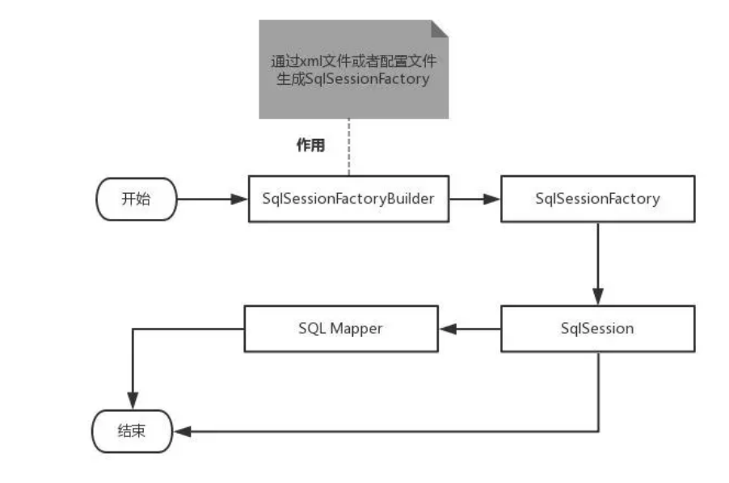
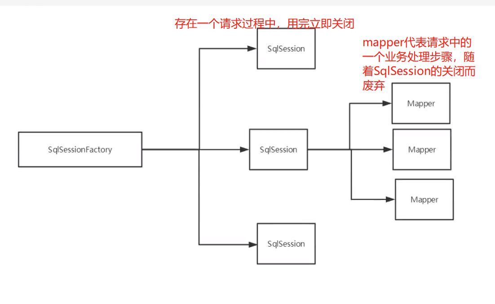
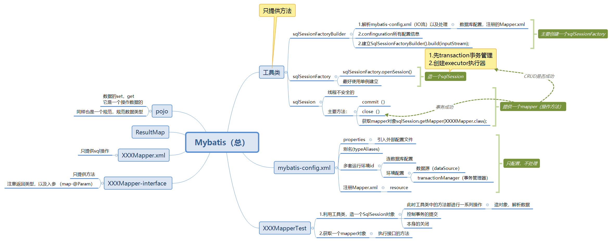

[TOC]

# Mybatis
- Thinking is more important than learning
  
- 代码位置-https://gitee.com/zhangjzm/my-batis.git

> 定义：持久层？
>
> 干啥的？作用于哪一方面？
> 主要是java代码操作数据库,实际是java代码作为调用者,在xml配置sql进行操作
> 关键的是ORM的映射,不同类之间的注入,以及怎么拿到钥匙sqlSession,怎么使用遥控板mapper上的按钮,还有服务员的操作
> 
> 基本配置，基本操作？

- 重点，难点---结果集映射
- 分页，
- 注解开发（**重点**）
- 一对多，多对多的处理（难点）
  - 我们依据有几个sql语句区分嵌套和子查询
  - 我们依据是否有集合区分多对一,一对多 
- 动态SQL（**重点**）
- 缓存（**十分重要**，极其重要）

# mybatis开始

## -----环境准备

- JDK 1.8
- mysql 8.0.21
- maven 3.6.1
- mybatis 3.5.3
- IDEA
- 回顾 - JDBC - Mysql - java - Maven - Junit
- 框架，都有配置文件。最好的方式---看官网
- 官网  https://mybatis.org/mybatis-3/zh/index.html
- 下载：GitHub : https://github.com/mybatis/mybatis-3/releases
- maven下载  mybatis 3.5.3

  ```
      <!-- https://mvnrepository.com/artifact/org.mybatis/mybatis -->
      <dependency>
          <groupId>org.mybatis</groupId>
          <artifactId>mybatis</artifactId>
          <version>3.5.3</version>
      </dependency>

  ```

# 一.简介

## 1.什么是MyBatis

- MyBatis 是一款优秀的持久层框架
- MyBatis 避免了几乎所有的 **JDBC 代码**和**手动设置参数**以及**获取结果集**的过程
- MyBatis 可以使用简单的 XML 或注解来配置和映射原生信息，
  将接口和 Java 的 实体类 【Plain Old Java Objects,普通的 Java对象】映射成数据库中的记录。
- MyBatis 本是apache的一个开源项目ibatis, 2010年这个项目由apache 迁移到了google code，并且改名为MyBatis 。
- 2013年11月迁移到Github .

## 2.持久化

- 1.持久化是将程序数据在持久状态和瞬时状态间转换的机制。

  - 1）.即把数据（如内存中的对象）**保存到可永久保存的存储设备**中（如磁盘）。持久化的主要应用
    是**将内存中的对象存储在数据库中**，或者存储在磁盘文件中、XML数据文件中等等。
  - 2）.JDBC就是一种持久化机制。文件IO也是一种持久化机制。
  - 3）.在生活中 : 将鲜肉冷藏，吃的时候再解冻的方法也是。将水果做成罐头的方法也是。
- 2.为什么需要持久化服务呢？那是由于内存本身的缺陷引起的（**内存断电即失**）

  - 1）.内存断电后数据会丢失，但有一些对象是无论如何都不能丢失的，比如银行账号等，遗憾的
    是，人们还无法保证内存永不掉电。
  - 2）.内存过于昂贵，与硬盘、光盘等外存相比，内存的价格要高2~3个数量级，而且维持成本也
    高，至少需要一直供电吧。所以即使对象不需要永久保存，也会因为内存的容量限制不能一直
    呆在内存中，**需要持久化来缓存到外存**。

## 3.持久层

- 什么是持久层？
  - 1.完成持久化工作的代码块 . ----> dao层 【DAO (Data Access Object) 数据访问对象】
  - 2.大多数情况下特别是企业级应用，数据持久化往往也就意味着将内存中的数据保存到磁盘上加
    以固化，而持久化的实现过程则大多通过各种关系数据库来完成。
  - 3.不过这里有一个字需要特别强调，也就是所谓的“层”。对于应用系统而言，数据持久功能大多
    是必不可少的组成部分。也就是说，我们的系统中，已经天然的具备了“持久层”概念？也许
    是，但也许实际情况并非如此。之所以要独立出一个“持久层”的概念,而不是“持久模块”，“持久
    单元”，也就意味着，我们的系统架构中，应该有一个相对独立的逻辑层面，专著于数据持久
    化逻辑的实现.
  - 4.与系统其他部分相对而言，这个层面应该具有一个较为清晰和严格的逻辑边界。 【说白了就
    是用来操作数据库存在的！】

## 4.为什么需要Mybatis？

- 帮助程序员将数据存到数据库中
- 方便
- 传统JDBC代码台复杂。简化。框架。自动化
- 不用Mybatis也可以，更容易上手。技术没有高低之分
- 优点-------主要就是用的人多

# 二.第一个Mybatis程序

> 思路：搭建环境-->导入mybatis-->编写代码-->测试

## 1.搭建环境

- 1）.数据库的

```sql
        mysql> create database `mybatis`;
        Query OK, 1 row affected (0.00 sec)
  
        mysql> use `mybatis`;
        Database changed
        mysql> create table `user`(
            -> `id` int not null,
            -> `name` varchar(20) DEFAULT null,
            -> `password` varchar(20) DEFAULT null,
            -> primary key(`id`)
            -> )engine = INNODB DEFAULT charset=utf8;
        Query OK, 0 rows affected (0.02 sec)
        mysql> insert into `user`(`id`,`name`,`password`) values(0,'zjz0','123456'),(1,'zjz1','123456'),(2,'zjz2','123456');
        Query OK, 3 rows affected (0.00 sec)

```

## 2）.maven项目

- 普通maven项目
- 删除src
- 导入mysql mybatis junit 包

```xml
        <dependencies>
            <!-- mysql-->
            <dependency>
                <groupId>mysql</groupId>
                <artifactId>mysql-connector-java</artifactId>
                <version>8.0.21</version>
            </dependency>
            <!--  单元测试-->
            <dependency>
                <groupId>junit</groupId>
                <artifactId>junit</artifactId>
                <version>4.11</version>
            </dependency>
            <!--mybatis-->
            <!-- https://mvnrepository.com/artifact/org.mybatis/mybatis -->
            <dependency>
                <groupId>org.mybatis</groupId>
                <artifactId>mybatis</artifactId>
                <version>3.5.3</version>
            </dependency>
  
        </dependencies>
        <!-- ex:此处增加的build详细在maven====太长不加了-->
   
```

## 3）.创建一个modules



## 4）.编写mybatis的核心配置文件

- 配置 mybatis-config.xml

  ```xml
       <?xml version="1.0" encoding="UTF-8" ?> <!DOCTYPE configuration PUBLIC "-//mybatis.org//DTD Config 3.0//EN"
                  "http://mybatis.org/dtd/mybatis-3-config.dtd">

          <!--configuration核心配置文件-->

          <configuration>
              <environments default="development">
                  <environment id="development">
                      <!-- 事务管理-->
                      <transactionManager type="JDBC"/>
                      <dataSource type="POOLED">
                          <property name="driver" value="com.mysql.jdbc.Driver"/>
                          <property name="url"
                                    value="jdbc:mysql://localhost:3306/mybatis? useSSL=true&useUnicode=true&characterEncoding=utf8"/>
                          <property name="username" value="root"/>
                          <property name="password" value="123456"/>
                      </dataSource>
                  </environment>
              </environments>
            <!--每一个mapper.xml都需要在mybatis核心配置文件中注册-->
              <mappers>
                  <mapper resource="com/zjz/dao/UserMapper.xml"/>
              </mappers>
          </configuration>

  ```
  - 编写mybatis工具类
    - sqlSessionFactory -- 构建sqlSession

  ```
       // sqlSessionFactory -产生-> sqlSession
        public class MybatisUtils {
        private static SqlSessionFactory sqlSessionFactory;

            static {
                try {
                    // 第一步--获取sqlSessionFactory对象

                    String resource = "mybatis-config.xml";
                    InputStream inputStream = Resources.getResourceAsStream(resource);
                    sqlSessionFactory = new SqlSessionFactoryBuilder().build(inputStream);
                } catch (IOException e) {
                    e.printStackTrace();
                }
            }//获取SqlSession连接
  ```
        public static SqlSession getSqlSession() {
            SqlSession sqlSession = sqlSessionFactory.openSession();  // sqlSession 不是线程安全的
                return sqlSession;

        }
    }
  ```

  ```
## 5）.编写代码- UserMapper接口

  ```
      public interface UserMapper {
          // 查询全部用户
          List<Object> getUserList(); // list中泛型<>可以指定POJO，也可以指定Object（多表）
      }

  ```
- UserMapper.xml


```xml
<?xml version="1.0" encoding="UTF-8" ?> <!DOCTYPE mapper PUBLIC "-//mybatis.org//DTD Mapper 3.0//EN"
"http://mybatis.org/dtd/mybatis-3-mapper.dtd">
<!--namespace,绑定一个Dao/Mapper接口-->
<mapper namespace="com.zjz.dao.UserMapper">
<!--id要与mapper的方法对应-->
<!--resultType返回类型-->
<!--resultType返回类型
select中，如果指定，那么返回指定对象，不指定报错   多表应该怎么写
-->

<select id="getUserList" resultType="com.zjz.pojo.User" >
    select * from user
</select>
```

## 6）.测试

- Junit测试

```java
     public class UserMapperTest {
        @Test
        public void test(){

            // 第一步，获得SqlSession对象
            SqlSession sqlSession = MybatisUtils.getSqlSession();
            // 执行sql
            // 第一种方式：getMapper 推荐---
            UserMapper mapper = sqlSession.getMapper(UserMapper.class);
            List<User> userList = mapper.getUserList();

            // 第二种方式;;; 通过sqlSession的方法对绝对位置的mapper方法封装---不推荐，快淘汰了
            List<User> list = sqlSession.selectList("com.zjz.dao.UserMapper.getUserList"); // 好像在哪里见了？

            System.out.println(userList.toString());
            System.out.println(list.toString());

            // 关闭SqlSession
            sqlSession.close();

        }
     }

```
## 三个核心接口




## 注意

- MapperRegistry 注册问题   Executor was closed SqlSession开关问题
- 问题
  - 1.配置文件没有注册（mybatis-config没配置）
  - UserMapper.xml--2.绑定接口错误 3.方法名不对 4.返回类型不对
  - pom.xml 5.Maven导出资源错误  MapperRegistry

### 总：



# 三，基本CRUD

> 操作DML一定要提交事务 sqlSession.commit();
>

## 1.namespace

- namespace中的包名要和Mapper接口的包名一致（映射上，有了连接，才能使用）

## 2.Mapper.xml

- 语句
  - 1.id：对应的namesapce中的方法名
  - 2.**resultType**：
    - Sql语句执行的返回值（对应对象则为对象类型）-单表返回对应的对象，多表返回
    - --如果select，必须有，其它可以没有
    - 在resultType中：参数一个是com.zjz.pojo.bean 一个是设置别名，要不就报错
  - 3.parameterType  参数类型  
    - 如果是基本数据类型_int _char  如果写int那么就是Integer类型的
  - 4.**语句中传参使用`#{XXX}`  XXX 要对应  parameterType里面的东西**

> 问题 sqlSession 是如何控制全局的，中途关闭它，有什么影响？（或者只让它有初始值）
>

- 查询时，可以依据参数查找对象---入参parameterType  出参 resultType
- 插入时，入参parameterType--一般就是对象了 ，出参不写

## 代码

- 1.接口Mapper

  ```
      public interface UserMapper {
           // 查询全部用户
          List<Object> getUserList(); // list中可以指定POJO，也可以指定Object（多表）
  ```
      // 根据id查询
      User getUserById(int id);

      // 插入insert
      int addUser(User user);

      // 修改用户
      int updateUser(User user);

      // 删除用户
      int deleteUser(int id);
  }
  ```

  ```

  - 2.Mapper.xml

    ```
        <!--namespace,绑定一个Dao/Mapper接口-->
        <mapper namespace="com.zjz.dao.UserMapper">
            <!--id要与mapper的方法对应-->
        <!--resultType返回类型-->
        <!--resultType返回类型
            select中，如果指定，那么返回指定对象，不指定报错   多表应该怎么写？？
        -->

            <select id="getUserList" resultType="com.zjz.pojo.User" >
                select * from user
            </select>


            <select id="getUserById" parameterType="_int" resultType="com.zjz.pojo.User">
                select * from mybatis.user where id = #{id}
            </select>

            <insert id="addUser" parameterType="com.zjz.pojo.User">
                insert into  mybatis.user(id,name,password) values (#{id},#{name},#{password});
            </insert>

            <update id="updateUser" parameterType="com.zjz.pojo.User">
                update mybatis.user
                set name = #{name},password = #{password}
                where id = #{id};
            </update>

            <delete id="deleteUser" parameterType="_int">
                delete from mybatis.user where id = #{id};
            </delete>
        </mapper>

    ```
  - 3.Test

    ```
            @Test
            public void TestGetUserById(){
                SqlSession sqlSession = MybatisUtils.getSqlSession();

                UserMapper mapper = sqlSession.getMapper(UserMapper.class);
                User userById = mapper.getUserById(1);
                System.out.println(userById);

                sqlSession.close();
            }


            @Test
            public void TestAddUser(){
                SqlSession sqlSession = MybatisUtils.getSqlSession();
                UserMapper mapper = sqlSession.getMapper(UserMapper.class);

                 mapper.addUser(new User(5, "zjz05", "123456"));

                // 提交事务
                sqlSession.commit();

                sqlSession.close();

            }

            @Test
            public void TestUpdateUser(){
                SqlSession sqlSession = MybatisUtils.getSqlSession();
                UserMapper mapper = sqlSession.getMapper(UserMapper.class);

                mapper.updateUser(new User(4,"zjz04","123456"));

                sqlSession.commit();
                sqlSession.close();

            }
    ```
### 模糊查询  **切记防止sql注入**

- 方式一：安全的

  - XXXMappper.xml

  ```
        <!--like '%zjz%'-->
      <select id="getUserLike" resultType="com.zjz.pojo.User" >
          select * from user where name like #{value}
      </select>
  ```
  - test语句
  - `List<User> list = mapper.getUserLike("%zjz%");`
- 方式二：可sql注入

  - XXXMappper.xml

  ```
        <!--like '%zjz%'-->
      <select id="getUserLike" resultType="com.zjz.pojo.User" >
          select * from user where name like "%"#{value}"%"
      </select>
  ```
  - test语句
  - `List<User> list = mapper.getUserLike("zjz");`

### 一些错误

- 1.标签。。各对各的 select……
- 2.resource绑定mapper，需要使用路径
- 3.程序配置文件符合规范
- 4.NullPointException 没找到资源
- 5.输出的xml文件有乱码。。。
- 6.maven资源导出问题

# 四，MAP的使用--**超常用**

> 思考：多表连接查询怎么做？---MAP的好处！---返回List<Object>
>
> 使用场景:比如我们后期动态SQL，必须要用到的，有时候用户不传数据就可以用它不送数据，然后SQL返回默认值
> 类似加了一层封装
>

- 实体类,或者数据库中的表,字段或者参数过多,就考虑使用Map
- 非常灵活，不用死死的在方法中定一个值，然后最后处理一个值的锁定。。。它可以随意定义几个值的锁定（前提是sql语句有对应）
>
> HashMap<> 因为要调用hashcode()方法和equals()方法，进行比较，，，所以不能为基本类型
> 
> 规范? -满足pojo的类型，SQL值的需求- Map需要<XX,Object>，因为Object通配所有，毕竟有Integer Double String……
> 使用时要---parameterType="map"
>
> 使用的依据：
>

- 本质上parameterType就是一个送参数的，不管你送啥，你要将下面的值和**sql**以后要使用的参数对应就好
- 最后送参时还是要对应原本的类型的，只是使用容器作为一个中介

> `考虑，能否使用ArrayList---答：能 比较麻烦，没有map直接`--未考虑好


### 注意：因为map只是送值的，所以**只有put操作**。。
- value分不分类型？ 插入时不分，锁定值时区分 ---（最好对应-）map.put("id",8);

> 操作

- 接口中

  ```
    // map的使用---万能的Map
    int addUser1(Map<String,Object> map);

    User  getUserById1(Map<String,Object> map);  // map 用法

  ```


- Mapper.xml中

  ```
    <!--map的使用-->
    <insert id="addUser1" parameterType="map">
        insert into  mybatis.user(id,name,password) values (#{userId},#{userName},#{userPassword});
    </insert>
      
        <select id="getUserById1" parameterType="map" resultType="com.zjz.pojo.User">
        select * from mybatis.user where id = ${id}
    </select>
  ```

- Test

    ```
          @Test
          public void TestAddUser1(){
              SqlSession sqlSession = MybatisUtils.getSqlSession();
              UserMapper mapper = sqlSession.getMapper(UserMapper.class);
          
               Map<String, Object> map = new HashMap<>();
              map.put("userId",5);       // 对应#{userId}--类型限制POJO
              map.put("userName","zjz5");   // 对应#{userName}--类型限制POJO
              map.put("userPassword","321616");  // 对应#{UserPassword}--类型限制POJO
              mapper.addUser1(map);
          
              // 提交事务
              sqlSession.commit();
          
              sqlSession.close();
          
          }
          
          
          
              @Test
          public void TestGetUserById1(){
              SqlSession sqlSession = MybatisUtils.getSqlSession();
              UserMapper mapper = sqlSession.getMapper(UserMapper.class);
          
              Map<String, Object> map = new HashMap<>();
              map.put("id","8");
              User userById1 = mapper.getUserById1(map);
              System.out.println(userById1);
          
              sqlSession.close();
          
          }
    ```

### 使用详情及规范

- 类型限制（POJO），值对应（SQL）
- 方法只使用 put 送值-，
- value类型没对应好，。value分不分类型？ 插入时不分，锁定值时区分 ---（最好对应-）map.put("id",8);
- key没对应好，如果送的值多了，报错---少了，送null --（主键不送---肯定报错啊！）
  - 注：查询时必须都得对应上key

> 不懂的---两个例子，你自己做一个，三列即可确定一件事了



- 备注：HashMap<> 因为要调用hashcode()方法和equals()方法，进行比较，，，所以不能为基本类型

## 问题以及双锁定条件

> 根据 密码 和 名字 查询用户
- 思路一：直接在方法中传递参数
  - 1. 在接口方法的参数前加 @Param属性
    - 为啥需要@Param,不加时，直接报错,因为类型影响后面
    - 加上之后，取值直接取@Param中的值 
  - 2. Sql语句编写的时候，直接取@Param中设置的值即可，不需要单独设置参数类型(parameterType)
  ```
      //通过密码和名字查询用户 
      User selectUserByNP(@Param("username") String username,@Param("pwd") String pwd);
      
      
       /* <select id="selectUserByNP" resultType="com.kuang.pojo.User"> 
       select * from user where name = #{username} and pwd = #{pwd} 
       </select> */
  
  ```
- 思路二：使用万能的Map
  - 1. 在接口方法中，参数直接传递Map；
  - 2. 编写sql语句的时候，需要传递参数类型，参数类型为map
  - 3. 在使用方法的时候，Map的 key 为 sql中取的值即可，没有顺序要求！

  ```
      User selectUserByNP2(Map<String,Object> map);
      
      
      <select id="selectUserByNP2" parameterType="map" resultType="com.kuang.pojo.User"> 
      select * from user where name = #{username} and pwd = #{pwd} 
      </select>
      
      Map<String, Object> map = new HashMap<String, Object>(); 
        map.put("username","小明"); 
        map.put("pwd","123456"); 
      User user = mapper.selectUserByNP2(map);
  ```
- 总结：
  - 如果参数过多，我们可以考虑直接使用Map实现，如果参数比较少，直接传递参数即可


## `@Param注解`
### 1.使用@Param
> `#{} 或 ${}`   直接使用#{}就好。。
- 前者对应prepareStatement,防止SQL注入，后者对应Statement--

- 实例一 @Param注解单一属性
  ```
    // 依据id，name查询
    User getUserByIdName(@Param("id") int id,@Param("name") String name);
  -------------------------------------
   <select id="getUserByIdName" resultType="com.zjz.pojo.User">
        select * from mybatis.user where id = #{id} AND name = #{name}
    </select>
  ```

- 1.当你使用了使用@Param注解来声明参数时，如果使用 #{} 或 ${} 的方式都可以。
```
  // 根据id查询
  User getUserById(@Param("id")int id);
  
  <select id="getUserById" parameterType="int" resultType="com.zjz.pojo.User">
        select * from mybatis.user where id = ${id}
    </select>
```

- 2.当你不使用@Param注解来声明参数时，必须使用 #{}方式且**只有一个参数**。在我的版本（M361，S802） ${} 的方式，不会报错。（可能其它版本报错）
- 所以目前还是单个参数可以不用，多个参数要用

```
  // 根据id查询
  User getUserById(int id);
  
  <select id="getUserById" parameterType="int" resultType="com.zjz.pojo.User">
        select * from mybatis.user where id = ${id}
    </select>
```

### 2，不使用@Param注解
- 不使用@Param注解时，**参数只能有一个**，可以是属性，也可以是对象
  - 目前似乎不支持@param("User")
    - 目前也没有此限制--`并且是Javabean。在SQL语句里可以引用JavaBean的属性，而且只能引用JavaBean的属性。`
  ```
  
    // 插入insert
    int addUser(User user);
    
      <insert id="addUser" parameterType="com.zjz.pojo.User">
        insert into  mybatis.user(id,name,password) values (#{id},#{name},#{password});
    </insert>
  
   @Test
    public void TestAddUser(){
        SqlSession sqlSession = MybatisUtils.getSqlSession();
        UserMapper mapper = sqlSession.getMapper(UserMapper.class);
         mapper.addUser(new User(4, "zjz4", "123456"));
        // 提交事务
        sqlSession.commit();
        sqlSession.close();

    }
  
  ```


### 小结：
- 所有的增删改操作都需要提交事务！
- 接口所有的普通参数，尽量都写上@Param参数，尤其是多个参数时，必须写上！（否则报错）
- 有时候根据业务的需求，可以考虑使用map传递参数！
- 为了规范操作，在SQL的配置文件中，我们尽量将Parameter参数和resultType都写上！


# 五.配置解析
## 1.核心配置文件
- mybatis-config.xml
```
configuration（配置）
  properties（属性）
  settings（设置）
  typeAliases（类型别名）
  typeHandlers（类型处理器）
  objectFactory（对象工厂）
  plugins（插件）
  environments（环境配置）
    environment（环境变量）
      transactionManager（事务管理器）
      dataSource（数据源）
  databaseIdProvider（数据库厂商标识）
  mappers（映射器）
  <!-- 注意元素节点的顺序！顺序不对会报错 -->
```

## 2.environments元素

> 配置MyBatis的多套运行环境，将SQL映射到多个不同的数据库上，必须指定其中一个为默认运行环境（通过default指定）
>
> 默认 事务JDBC  数据源 POOLED

- 1.子元素节点：environment

  - 具体的一套环境，通过设置id进行区别，id保证唯一！
  - 子元素节点：transactionManager - [ 事务管理器 ]
  - <!-- 语法 --> `<transactionManager type="[ JDBC | MANAGED ]"/> ` 有**两个事务管理器**，不是一个！！
- 2.子元素节点：数据源（dataSource）

  - dataSource 元素使用标准的 JDBC 数据源接口来配置 JDBC 连接对象的资源。
  - 数据源是必须配置的。
  - 有三种内建的数据源类型
  - `type="[UNPOOLED|POOLED|JNDI]"）` ---JNDI 正常连接
  - （池：用完可以回收，不关，等下一个来连）
- 3.属性（properties）

  - 使用它实现引用配置文件
  - 优先走外部的，再走里面的property

    ```
         <!--引入外部配置文件-->
        <properties resource="db.properties">
            <property name="username" value="root"/>
            <property name="password" value="123456"/>
        </properties>

    ```
- 4.别名(typeAliases)
- 1.起别名typeAlias

  ```
    <!--起别名-->
      <typeAliases>
          <typeAlias type="com.zjz.pojo.User" alias="User"/>
      </typeAliases>


    // 这样在XXXMapper.xml中的resultType就可以直接使用User，不用com.zjz.pojo.User

    <select id="getUserList" resultType="User" >
          select * from user
      </select>


  ```
- 2.package(**重要**)
- 扫描包下的实体类，将**类名首字母小写**作为别名-----
- 可以自定义DIY --- 注解`@Alias`

```
    <!--起别名-->
    <typeAliases>
        <package name="com.zjz.pojo"/>
    </typeAliases>
  
  
    非必须：javabean 注解 
    @Alias("xiaoming")
  
```  

- 两个之间的区别
  - Aliases 可以之间手动DIY一个别名
  - package 需要找到对应的javaBean，注解 ，然后就DIY的，否则都是类名首字母小写

## 设置

- setting
- 一个配置完整的 settings 元素的示例如下：

  ```
      <settings>
          <setting name="cacheEnabled" value="true"/>      <!--开关映射器配置文件中已配置的任何缓存-->
          <setting name="lazyLoadingEnabled" value="true"/>  <!--延迟加载的全局开关。-->
          <setting name="multipleResultSetsEnabled" value="true"/> <!--是否允许单个语句返回多结果集（需要数据库驱动支持）-->
          <setting name="useColumnLabel" value="true"/>              <!--使用列标签代替列名-->
          <setting name="useGeneratedKeys" value="false"/>          <!--允许 JDBC 支持自动生成主键，需要数据库驱动支持-->
          <setting name="autoMappingBehavior" value="PARTIAL"/>       <!--允许 JDBC 支持自动生成主键，需要数据库驱动支持-->
            <!--NONE 表示关闭自动映射；PARTIAL 只会自动映射没有定义嵌套结果映射的字段。 FULL 会自动映射任何复杂的结果集（无论是否嵌套）-->
          <setting name="autoMappingUnknownColumnBehavior" value="WARNING"/> <!--指定发现自动映射目标未知列（或未知属性类型）的行为。-->
            <!-- NONE: 不做任何反应
              WARNING:  WARNING 输出警告日志（'org.apache.ibatis.session.AutoMappingUnknownColumnBehavior' 的日志等级必须设置为 WARN）
             FAILING:  FAILING 映射失败 (抛出 SqlSessionException) -->
          <setting name="defaultExecutorType" value="SIMPLE"/>          <!--配置默认的执行器。SIMPLE 就是普通的执行器；-->
          <setting name="defaultStatementTimeout" value="25"/>         <!--设置超时时间-->
          <setting name="defaultFetchSize" value="100"/>           <!--为驱动的结果集获取数量（fetchSize）设置一个建议值。此参数只可以在查询设置中被覆盖。-->
          <setting name="safeRowBoundsEnabled" value="false"/>      <!--禁止在嵌套语句中使用结果处理器（ResultHandler） true开启禁止-->
          <setting name="mapUnderscoreToCamelCase" value="false"/>   <!--是否开启驼峰命名自动映射，
               即从经典数据库列名 A_COLUMN 映射到经典 Java 属性名 aColumn。注：ORACLE数据库常见-->
          <setting name="localCacheScope" value="SESSION"/>      <!--MyBatis 利用本地缓存机制（Local Cache）防止循环引用和加速重复的嵌套查询。-->
          <setting name="jdbcTypeForNull" value="OTHER"/>          <!--当没有为参数指定特定的 JDBC 类型时，空值的默认 JDBC 类型-->
          <setting name="lazyLoadTriggerMethods" value="equals,clone,hashCode,toString"/> <!--指定对象的哪些方法触发一次延迟加载-->
          </settings>

  ```

- 其它配置
- 类型处理器 typeHandlers
- 对象工厂  objectFactory
- plugins 插件

  - mybatis-generator-core
  - mybatis-plus-----以后学
  - 通用mapper

## 映射（mapper）---特别重要，不要忘记了
> 最好的办法-<mapper resource="com/zjz/dao/*Mapper.xml"/>
> 通配所有的Mapper.xml文件


- MapperRegistry：注册绑定我们的配置文件
- 方式一  resource（推荐使用）

  ```
    <!--每一个mapper.xml都需要在mybatis核心配置文件中注册-->
  
    <mappers>
        <mapper resource="com/zjz/dao/UserMapper.xml"/>
    </mappers>
  ```

- 方式二 使用class文件绑定注册

  ```
    <!--每一个mapper.xml都需要在mybatis核心配置文件中注册-->
    <mappers>
        <mapper class="com.zjz.dao.UserMapper"/>
    </mappers>
  ```

- 不绑定报错`Type interface com.zjz.dao.UserMapper is not known to the MapperRegistry`

- class使用注意:
  - 接口必须和他的Mapper配置文件**必须同名**
  - 接口和他的配置文件必须在**同一个包下**

  ```
      <?xml version="1.0" encoding="UTF8" ?> <!DOCTYPE configuration PUBLIC "-//mybatis.org//DTD Config 3.0//EN"
              "http://mybatis.org/dtd/mybatis-3-config.dtd">
      
      <!--configuration核心配置文件-->      
      <configuration>

          <!--引入外部配置文件-->
          <properties resource="db.properties">
              <property name="username" value="root"/>
              <property name="password" value="123456"/>
          </properties>
      
      
          <environments default="test">
      
              <environment id="development">
                  <!-- 事务管理-->
                  <transactionManager type="JDBC"/>
                  <dataSource type="POOLED">
                      <property name="driver" value="com.mysql.cj.jdbc.Driver"/>
                      <property name="url"
                                value="jdbc:mysql://localhost:3306/mybatis? useSSL=true&amp;useUnicode=true&amp;characterEncoding=utf8"/>
                      <property name="username" value="root"/>
                      <property name="password" value="123456"/>
                  </dataSource>
              </environment>
      
      
              <environment id="test">
                  <!-- 事务管理-->
                  <transactionManager type="JDBC"/>
                  <dataSource type="POOLED">
                      <property name="driver" value="${driver}"/>
                      <property name="url"
                                value="${url}"/>
                      <property name="username" value="${username}"/>
                      <property name="password" value="${password}"/>
                  </dataSource>
              </environment>
      
          </environments>
      
          <!--绑定接口-->
          <mappers>
              <mapper class="com.zjz.dao.UserMapper"></mapper>
          </mappers>
      
  <!--每一个mapper.xml都需要在mybatis核心配置文件中注册，通配包下所有mapper
    <mappers>
        <mapper resource="com/zjz/dao/*Mapper.xml"/>
    </mappers>
  -->
      </configuration>
  ```

## 生命周期和作用域

> 作用域（Scope）和生命周期
>
> 理解我们目前已经讨论过的不同作用域和生命周期类是至关重要的，因为错误的使用会导致非常严重的并发问题。
>



- SqlSessionFactoryBuilder:

  - 一旦创建了SqlSessionFactor，就不再需要了
  - 局部变量
- SqlSessionFactory：

  - 生命周期就同于 MyBatis 的应用周期。
  - 可以想象为：数据库连接池
  - 一旦创建了 SqlSessionFactory，就要长期保存它，直至不再使用MyBatis 应用
  - 往往希望 SqlSessionFactory 作为一个**单例**，让它在应用中被共享。所以说 SqlSessionFactory 的最佳作用域是应用作用域。
  
- SqlSession
  - 连接到连接池的请求
  - SqlSession 就相当于一个数据库连接（Connection 对象），你可以在一个事务里面执行多条 SQL，
    然后通过它的 commit、rollback等方法，提交或者回滚事务。
  - 所以它应该存活在一个业务请求中，处理完整个请求后，应该关闭这条连接，让它归还给 SqlSessionFactory，
    否则数据库资源就很快被耗费精光，系统就会瘫痪，所以用 try...catch...finally... 语句来**保证其正确关闭**。



## ResultMap

> 属性名，字段名不一致
>

- 如果POJO同数据库的字段不一致
- 正常运行会显示不一致的字段为null
  `User{id=0, name='zjz0', pwd='null'}`
- 1.解决方法--别名

  ```
    <select id="selectUserById" resultType="User">
        select id , name , password as pwd  from user where id = #{id}
    </select>
  ```
- 2.方案二：使用结果集映射->ResultMap 【推荐】

  - 注意：`<resultMap id="UserMap" type="User"> 的id`
    对应 `<select id="selectUserById" resultMap="UserMap">的resultMap`
    - ----------

      ```
        <resultMap id="UserMap" type="User">
           <!-- id为主键 --> 
              <id column="id" property="id"/> 
          <!-- column是数据库表的列名 , property是对应实体类的属性名 -->
            <result column="name" property="name"/> 
             <result column="pwd" property="password"/>
        </resultMap> 
    
    
        <select id="selectUserById" resultMap="UserMap"> 
          select id , name , pwd from user where id = #{id}
        </select>
    
      ```
  
- 数据库中，存在一对多，多对一的情况，我们之后会
  使用到一些高级的结果集映射，association，collection这些


## 总




