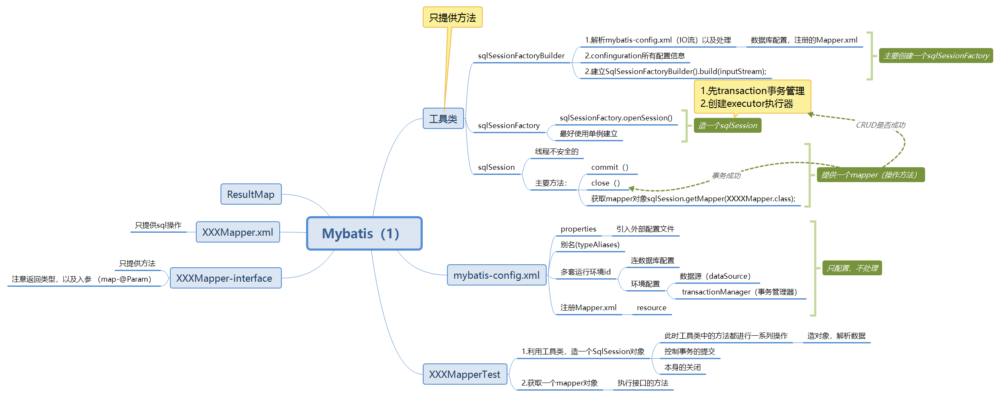
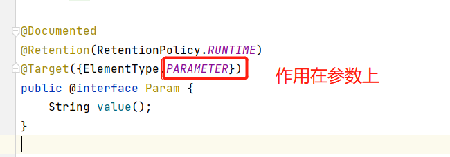
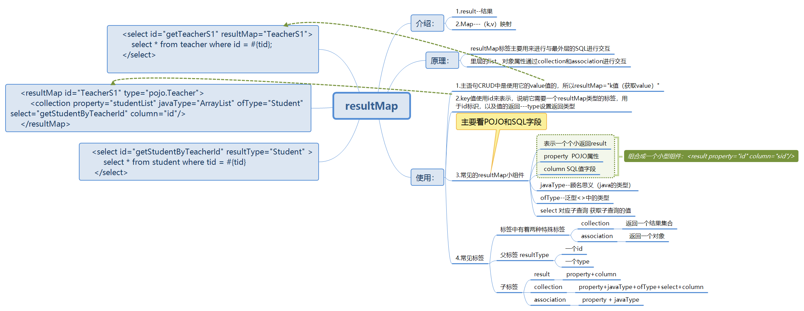
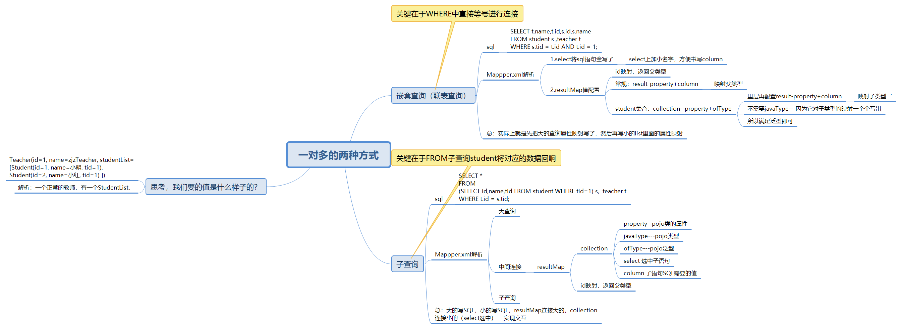
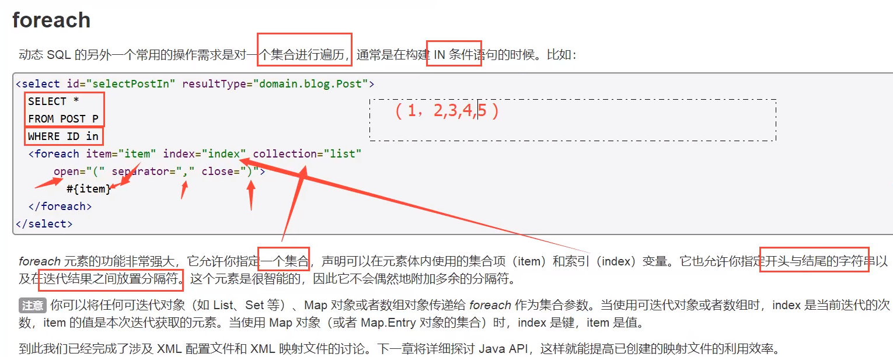
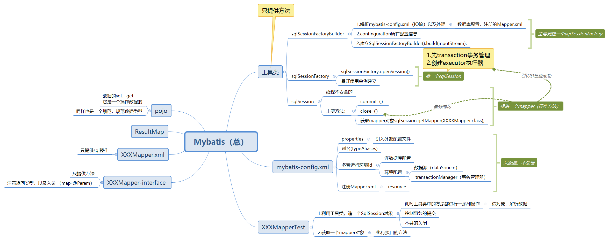

# Mybatis核心
## 前言
- Thinking is more important than learning
> 本文重点：注解开发，mybatis多表操作，动态SQL（WHERE，SET，IF，SQL—ID减少复用）Mybatis的交互！（重点）
> 代码地址--https://gitee.com/zhangjzm/my-batis.git1

- 我们依据是否有集合来区分一对多,多对一,注意是集合,不是对象
- 我们依据有几个sql语句区分嵌套和子查询
## 面向接口编程
- 真正的开发中，很多时候我们会选择面向接口编程
- 根本原因 : **解耦**,可拓展,提高复用,分层开发中,上层不用管具体的实现,大家都遵守共同的标准,使得开发变得容易,规范性更好


> 关于接口的理解
- 接口从更深层次的理解，应是定义（规范，约束）与实现（名实分离的原则）的分离。
- 接口的本身反映了系统设计人员对系统的抽象理解。
- 接口应有两类：
  - 第一类是对一个个体的抽象，它可对应为一个抽象体(abstract class)； 
  - 第二类是对一个个体某一方面的抽象，即形成一个抽象面（interface）；
  - 一个体有可能有多个抽象面。抽象体与抽象面是有区别的
    

> 三个面向区别
- 面向对象是指，我们考虑问题时，以对象为单位，考虑它的属性及方法 .
- 面向过程是指，我们考虑问题时，以一个具体的流程（事务过程）为单位，考虑它的实现 .
- 接口设计与非接口设计是针对复用技术而言的，与面向对象（过程）不是一个问题.更多的体现就是对系统整体的架构


## Mybatis详细执行流程




- 设置事务自动提交
- 虽说可以自动提交，但是有些时候出错了，他也会提交了。。。
  - 工具类中
  
```
   public static SqlSession getSqlSession() {
        
       return sqlSessionFactory.openSession(true);  // true 意味着开始事务自动提交，不写的话需手动提交
    }

```


## 注解开发
- 所有注解底层都是通过反射机制来运行的


- mybatis最初配置信息是基于 XML ,映射语句(SQL)也是定义在 XML 中的。而到MyBatis 3提供了
  新的基于注解的配置。不幸的是，Java 注解的的表达力和灵活性十分有限。最强大的 MyBatis 映
  射并不能用注解来构建。多表的时候。。。
- sql 类型主要分成 :
  - @select ()
  - @update ()
  - @Insert ()
  - @delete ()
- 【注意】利用注解开发就不需要resource mapper.xml映射文件了.但是需要配置class。。


## 注解CRUD
- 地址 Mybatis-05
- 1.使用注解开发需要改mybatis-config.xml
  ```
    <!--绑定接口-->
      <mappers>
          <mapper class="com.zjz.dao.UserMapper"/>
      </mappers>
  ```


- 2.Mapper代码

- 入参为User时，测试时直接方法（new User（XX，XX，XX））;


  ```
      
      @Select("select * from user")
      List<User> GetUsers();
  
      // 方法存在多个参数，所有参数前面必须加@Param("X")注解
      @Select("select * from user where id =#{id} AND name = #{name}")
      List<User> getUserByIdName(@Param("id")int id,@Param("name")String name);
  
    
  
      @Insert("insert into user(id,name,password) values(#{id},#{name},#{password})")
      int addUser(User user);
      // 测试时的送参：mapper.updateUser(new User(4,"zjz4","123456"));
  
  
      @Update("update user set name=#{name},password=#{password} where id=#{id}")
      int updateUser(User user);
    
      // 测试时的送参： mapper.updateUser(new User(4,"zjz4","123456"));
      
      @Delete("delete from user where id=#{id}")
      int deleteUser(@Param("id")int id);
      
  
  ```

- 查看`@param`源码




## 映射（mapper）---特别重要，不要忘记了
> resource class 两种映射方式
> 
> 普通方法--一个个xml绑定。`<mapper resource="com/zjz/dao/UserMapper.xml"/>`
> 
> 使用注解开发就需要专门绑定接口了
> ` <mapper class="com.zjz.dao.UserMapper"/>`
> 


- 遇到的问题，resultType的pojo没解析出来

```
  Cause: org.apache.ibatis.builder.BuilderException: Error resolving class. 
  Cause: org.apache.ibatis.type.TypeException: Could not resolve type alias 'Student'.  
  Cause: java.lang.ClassNotFoundException: Cannot find class: Student

    <!--起别名-->
      <typeAliases>
          <typeAlias type="com.zjz.pojo.BEAN" alias="BEAN"/>
      </typeAliases>
      
      或者Mapper.xml中resultType直接com.zjz.pojo.BEAN
      
      
        <!--起别名  package 直接给包里所有起别名-->
    <typeAliases>
       <package name="com.zjz.pojo"/>
    </typeAliases>

```

# 多表连接查询
- 地址 Mybatis-06,7
> 
> 多对一，一对多--怎么区分：
> 
> 一种是看结果要什么？（设计思想）---要一个老师手下有多个学生？ 还是要多个学生，后面有个备注（教师：---）
> 
> 关键：编码的主体（因为一对多反过来就是多对一，所以主体要分清） --外键（联系）
> 

- 核心涉及：
 - 复杂的属性，我们需要单独处理  对象：association  集合：collection
 - 对象用来多对一（每个人都对应这个师傅（对象））    集合用来一对多 （一个人有多个徒弟（集合））
 - 类型获取：
   - 对象中 javaType="" 指定的属性类型---对象
   - 集合中的泛型信息。使用ofType获取--对象


## resultMap（重中之重，。）

- 主要作用：实现多表查询

- 体系图





## 多表连接查询——多对一
> 重点  **association**  resultMap   property column  javaType
>

- association 对象
- javaType="" 指定的属性！！类型（对象）


> 多个学生对应一个老师  主要是看主体，外键 使用学生时多个学生的外键相同，映射一个老师
> 
> 思想：子查询，联表查询
> 
> 引入Teacher对象查询--毕竟每个学生后面都映射着老师
> 
- 区别： 
` <association property="teacher" javaType="Teacher">
    <result property="name" column="tname"/>
  </association>`

` <association property="teacher" column="tid" javaType="com.pojo.Teacher" select="getTeacher"/>`

> --类似子查询
> 
- pojo（此时便区分出，多个学生属于一个老师）
```
    @Data
    @AllArgsConstructor
    @NoArgsConstructor
    public class Student {
        private int id;
        private String name;
        private Teacher teacher; // 引入老师对象（每个学生都有老师的id）
    }
    
    
    public class Teacher {
        private int id;
        private String name;
    }


```

- mybatis-config
  ```
      <mappers>
        <mapper class="com.dao.TeacherMapper"/>
        <mapper class="com.dao.StudentMapper"/>
    </mappers>
  
  ```
- StudentMapper （查每个学生）
```
  // 查询所有的学生信息，以及对应的老师的信息
    public List<Student> getStudentList();

```


- StudentMapper.xml
```
   <!--子查询 -->
    <select id="getStudentList" resultMap="StudentTeacher">
        select * from student
    </select>
    <resultMap id="StudentTeacher" type="com.pojo.Student">
        <result property="id" column="id"/>
        <result property="name" column="name"/>
    <!--
        复杂的属性，我们需要单独处理  对象：association  集合：collection
        javaType="" 指定的属性！！类型（对象）
    -->
    <association property="teacher" column="tid" javaType="com.pojo.Teacher" select="getTeacher"/>

    </resultMap>

    <select id="getTeacher" resultType="com.pojo.Teacher">
         select * from teacher where id = #{id}
    </select>


```


> 类似嵌套查询 推荐使用：：
> 

- mapper.xml
``` 
    <!--按照结果嵌套查询-->

    <select id="getStudentList2" resultMap="StudentTeacher2">
        select s.id sid,s.name sname,t.name tname
        from student s ,teacher t
        where s.tid = t.id;
    </select>
    
    <!--resultType Aliases 已经配置Student Teacher -->
    <resultMap id="StudentTeacher2" type="Student">
        <result property="id" column="sid"/>
        <result property="name" column="sname"/>
        <association property="teacher" javaType="Teacher">
            <result property="name" column="tname"/>
        </association>
    </resultMap>


```


> 结果：**多对一**
- 发现每个学生后面写的个老师，说明**学生为主体**。每个后面有一个老师
- `[Student(id=1, name=小明, teacher=Teacher(id=0, name=zjzTeacher)), 
  Student(id=2, name=小红, teacher=Teacher(id=0, name=zjzTeacher)), 
  Student(id=3, name=小黄, teacher=Teacher(id=0, name=zjzTeacher)), 
  Student(id=4, name=小蓝, teacher=Teacher(id=0, name=zjzTeacher)), 
  Student(id=5, name=小白, teacher=Teacher(id=0, name=zjzTeacher))]`

- 总：


## 多表连接查询——多对一的查询方式

> 嵌套查询（链表查询）
- pojo
  ```
     // student的属性
    public class Student {
        private int id;
        private String name;
        private int tid;
    }
    
    
      public class Teacher {
        private int id;
        private String name;
    
        // 一个老师对应多个学生
        public List<Student> studentList;
    }
  ```
  
- dao
- `Teacher getTeacherS(@Param("tid")int id);`


- TeacherMapper.xml
```
      <!--按结果嵌套查询-->
      <select id="getTeacherS" resultMap="TeacherS">
          select t.name tname,t.id tid,s.id sid,s.name sname
          from student s ,teacher t
          where s.tid = t.id and t.id = #{tid}
      </select>
       <!--typeAliases 已经配置好 Teacher Student-->
       
      <resultMap id="TeacherS" type="Teacher">
          <result property="id" column="tid"/>
          <result property="name" column="tname"/>
          <!--
         复杂的属性，我们需要单独处理  对象：association  集合：collection
         javaType="" 指定的属性！！类型
         集合中的泛型信息。使用ofType获取
          -->
          <collection property="studentList" ofType="Student">
              <result property="id" column="sid"/>
              <result property="name" column="sname"/>
              <result property="tid" column="tid"/>
          </collection>
  
      </resultMap>


```


> 子查询
> 

- TeacherMapper
```
 Teacher getTeacherS1(@Param("id")int id);
```

- TeacherMapper.xml
```
    <!-- 子查询-->
  
      <select id="getTeacherS1" resultMap="TeacherS1">
          select * from teacher where id = #{id};
      </select>
  
      <resultMap id="TeacherS1" type="Teacher">
          <!--Teacher底下的属性，此时加id，普通查询不出来了-->
          <result property="id" column="id"/>
          <collection property="studentList" javaType="ArrayList" ofType="Student" select="getStudentByTeacherId" column="id"/>
      </resultMap>
  
      <select id="getStudentByTeacherId" resultType="Student" >
          select * from student where tid = #{id}
      </select>

```


- 结果：一个老师的集合下有5个学生
```
  Teacher(id=1, name=zjzTeacher, studentList=[
  Student(id=1, name=小明, tid=1), 
  Student(id=2, name=小红, tid=1), 
  Student(id=3, name=小黄, tid=1), 
  Student(id=4, name=小蓝, tid=1), 
  Student(id=5, name=小白, tid=1)])

```

- 核心体系图




### 关于多表总结
- 1.三个图   resultMap   多对一   一对多 
- 2.保证sql的可读性
- 3.属性名（property），字段（column）
- 4.日志要用好，好找问题
- 5.复杂的多表要注意速率---慢SQL 1000s，快 1s SQL优化，引擎，InnoDB底层原理，索引，索引优化


# 动态SQL
> 定义:所谓动态SQL，本质还是SQL语句，只是我们可以在SQL层面，去**执行一个逻辑代码**
> 
> 作用：非常方便的进行SQL语句拼接
> 
> 关键：逻辑代码怎么操作
> 
- 动态SQL，根据不同的条件生成不同的SQL（以前JDBC时的SQL拼接）


## 介绍
- 动态 SQL 元素和 JSTL 或基于类似 XML 的文本处理器相似。
  在 MyBatis 之前的版本中，有很多元素需要花时间了解。
  MyBatis 3 大大精简了元素种类，现在只需学习原来一半的元素便可。 
  MyBatis 采用功能强大的基于 OGNL 的表达式来淘汰其它大部分元素。
- -------------------------------
- if 
- choose (when, otherwise) 
- trim (where, set) 
- foreach
- -------------------------------

##  where标签
- 在SQL语句之下编写
- `<where>中间写IF啥的</where>`
  

- 作用：如果**没有前置**元素，它会**自动**去掉语句中的and或or，然后作为前置元素，如果什么属性都不传，自动清除where
 
  ```
    如果不加的话会是这样的运行，肯定报错，所以它的作用就是去掉and
    select * from blog where and author = #{author}
  ```


### if操作（常用）
- 代码在：mybatis-08
> 操作  
- XXXMapper中

  ```
   // 查询博客IF
      List<Blog> QueryBlogIF(Map map);
  
  ```

- XXXMapper.xml
  ```
          <select id="QueryBlogIF" parameterType="map" resultType="Blog">
        select * from blog
        <where>
            <if test="title != null">
                and title = #{title}
            </if>

            <if test="author != null">
                and author = #{author}
            </if>
        </where>
    </select>
  
  ```

- Test中
  
    ```
    
         @Test
            public void Test3(){
                SqlSession sqlSession = MybatisUtils.getSqlSession();
        
                BlogMapper mapper = sqlSession.getMapper(BlogMapper.class);
                logger.info("QueryBlogIF开始");
        
                HashMap map = new HashMap();
        
                
        
                map.put("title","MYTitle1");
        
                List<Blog> blogs = mapper.QueryBlogIF(map);
        
        
                for (Blog blog : blogs) {
                    System.out.print(blog);
        
                }
                System.out.println();
        
                logger.info("QueryBlogIF结束");
                sqlSession.close();
            }
    
    
    ```


## choose
> choose 类似于switch 比起if   它是从上到下进行的，**执行一个后**停止后面的
> 
> 适用于优先级查询，比如VIP来了，优先买了，后来再看有没有
> 
> when---otherwise 两个小标签
> 
> 当然少不了where标签
> 


- Mapper接口
  
  ```
  
      // 查询博客Choose
      List<Blog> QueryBlogChoose(Map map);
  
  ```

- Mapper.xml
  
  ```
      <select id="QueryBlogChoose" parameterType="map" resultType="Blog">
          select * from blog
          <where>
              <choose>
                  <when test="title != null">
                      title = #{title}
                  </when>
                  <when test="author != null">
                      and author = #{author}
                  </when>
                  <otherwise>
                      and views > #{views}
                  </otherwise>
              </choose>
          </where>
      </select>
  
  ```


## SET
> 目的：update中用啊
> 
> 作用：**前置SET**关键字 同时**删掉**无关的逗号
> 
>

- 注：SET中如果没,逗号是会报错的

### 使用
- Mapper接口
  
  ```
    // 更新博客
      int updateBlog(Map map);
  
  ```
  
- Mapper.xml

```
    <update id="updateBlog" parameterType="map">
        update blog
        <set>
            <if test="title != null">
                title = #{title},
            </if>
            <if test="author != null">
                author = #{author},
            </if>
        </set>
        where id = #{id}
    </update>
```


## trim
> prefixOverrides 属性会忽略通过管道符分隔的文本序列（注意此例中的空格是必要的）。
> 会移除所有 prefixOverrides 属性中指定的内容，并且插入 prefix 属性中指定的内容。
> 
> prefixOverrides 除去前面的    suffixOverrides 除去后面的
> 
> 
> 
- trim 元素来定制 where 元素的功能。比如，和 where 元素等价的自定义 trim 元素为
  
  ```
    <trim prefix="WHERE" prefixOverrides="AND |OR ">
      ...
    </trim>
    
  ```
  
  
  ```
    <trim prefix="SET" suffixOverrides=",">
      ...
    </trim>
  ```


# SQL片段
- 目的：实现代码的复用，减少重复性操作
- 存值的地方----  `<sql id="ID">代码</sql>`
- 怎么使用？ ----  `<include refid="ID"></include>`


- 使用SQL标签抽取公共部分，
- 在需要使用的地方使用include标签引用即可


- 注意事项，最好基于单表来定义SQL片段
- SQL-ID不要有WEHER标签
- 最好就if test-----

- 代码

```
  <sql id="if-title-author">
        <if test="title != null">
            and title = #{title}
        </if>

        <if test="author != null">
            and author = #{author}
        </if>
    </sql>


  <select id="QueryBlogIF" parameterType="map" resultType="Blog">
        select * from blog
        <where>
            <include refid="if-title-author"></include>
        </where>
    </select>
    
```


# foreach
> 目的：遍历一些操作，如(id=1 or id=2 or id=3)
> 
> 使用：
> 
> 关键字：collection item open close separator
>
- collection 集合名字
- item 集合中的子元素的名字
- open 以什么东西开始
- close 以什么东西结束
- separate 每执行一个item中间加什么操作--




- Mapper.xml

  ```
      <!--
          SQL语句：select * from blog where 1=1 and (id=1 or id=2 or id=3)
      
          我们现在传递一个万能的map，这个map中可以传递=一个集合=
          
          open close 中要注意空格的使用，如果连起来，会被视为一个整体
      -->
      
          <select id="QueryBlogForeach" parameterType="map" resultType="Blog">
             select * from blog
              <where>
                  <foreach collection="ids" item="id" open="and ("  close=")" separator="or">
                      id = #{id}
                  </foreach>
      
              </where>
      
          </select>
  
  
  ```
  

- 测试：
  
  ```
      @Test
      public void TestQueryBlogForeach(){
          SqlSession sqlSession = MybatisUtils.getSqlSession();
  
          BlogMapper mapper = sqlSession.getMapper(BlogMapper.class);
          logger.info("QueryBlogForeach开始");
  
          HashMap map = new HashMap();
  
          List<Integer> ids = new ArrayList<>();
  
          ids.add(1);
          ids.add(2);
          map.put("ids",ids);
  
          List<Blog> blogs = mapper.QueryBlogForeach(map);
  
          System.out.println(blogs.toString());
  
          logger.info("QueryBlogForeach结束");
          sqlSession.close();
      }
  ```


- 总：


## 学了这么多，交互是怎么交互的？？？
- 1.mybatis-config.xml 作用就是：全局服务--可以认为是管家
  - 1.外部沟通 获取properties文件
  - 2.提供生产钥匙功能所需的模板，（钥匙得匹配了吧！） 不同钥匙对应不同的数据库，对应不同的遥控板，
  - 3.你的一举一动，我这都可以提供监控服务（Log，事务）
  - 4.那些setting中就不说了哈。。。
- 2.开始学的工具类，作用是依据管家，调用一系列方法--提供一把钥匙--这个钥匙可以打开保险柜，拿到遥控板--所以呢（开！！关！！保险柜） 事务呢？你开了门看看还好，动了？？就得记录了！！（主动记在小本本上）
- 3.遥控器怎么用了？？？
  - 功能提供者：，pojo提供基本功能。
  - pojo：1.提供一种规范resultType 2.本质上SQL返回的值给pojo了。因为它有对象，能存东西！3.如果SQL要改也是依赖于它的set 4.查就get了
  - 而它返回一堆数据啥的，也只不过是用容器装起来了。
- 4.效果的展示：Mapper的方法功能
  - 交互时使用的，值的来源于Mapper.xml依据pojo规范，返回到Mapper手中--当然Mapper的方法是不会使用数据的，只是一个展示！！！类似于按钮
- 所以按下按钮（入参）的时候，我们的xml开始整数据库，pojo的方法开始操作值---最后Mapper的方法拿到值。  

- 总：




