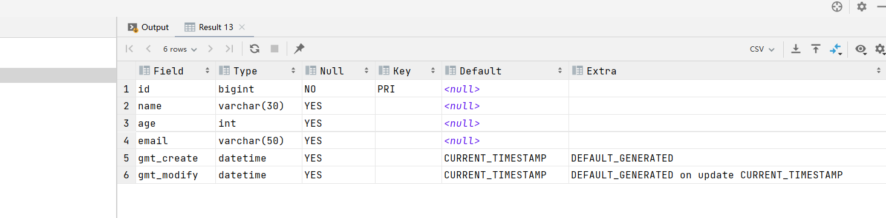
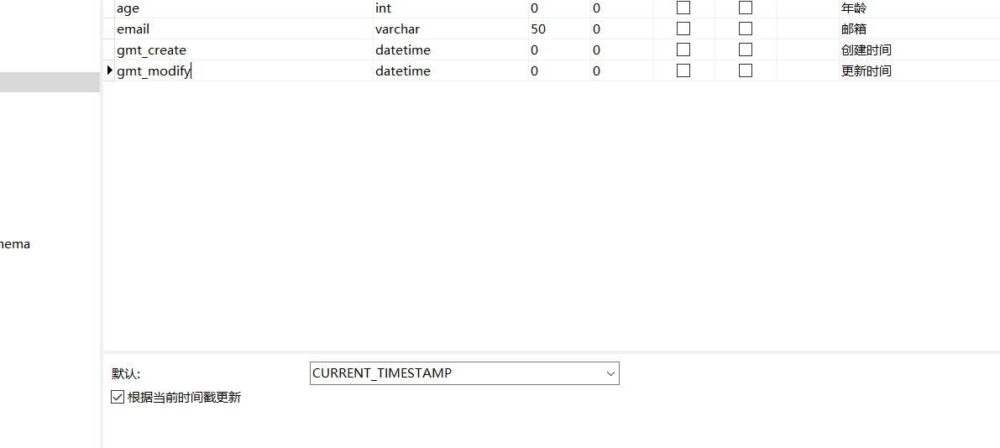
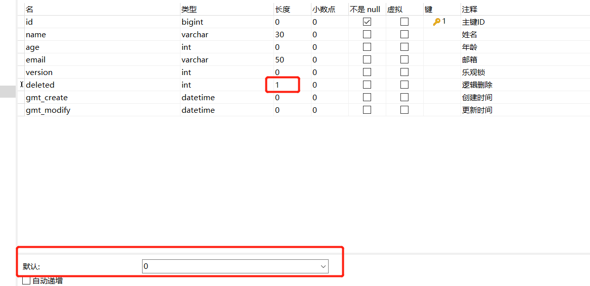

# Mybatis-Plus
> 定义：
>
> 干啥的？作用于哪一方面？
>
> 基本配置，基本操作？
>

- 需要的基础:Spring,Mybatis,SpringMVC

> 以后配置直接看这整就行
> https://mp.baomidou.com/guide/quick-start.html#初始化工程

## 简介
- Mybatis本来就是简化JDBC操作的!
- Mybatis简化Mybatis
- 特性
  - **无侵入**：只做增强不做改变，引入它不会对现有工程产生影响，如丝般顺滑
  - **损耗小**：启动即会自动注入基本 CURD，性能基本无损耗，直接面向对象操作
  - **强大的 CRUD 操作**：内置通用 Mapper、通用 Service，仅仅通过少量配置即可实现单表大部分 CRUD 操作，更有强大的条件构造器，满足各类使用需求
  - **支持 Lambda 形式调用**：通过 Lambda 表达式，方便的编写各类查询条件，无需再担心字段写错
  - **支持主键自动生成**：支持多达 4 种主键策略（内含分布式唯一 ID 生成器 - Sequence），可自由配置，完美解决主键问题
  - **支持 ActiveRecord 模式**：支持 ActiveRecord 形式调用，实体类只需继承 Model 类即可进行强大的 CRUD 操作
  - **支持自定义全局通用操作**：支持全局通用方法注入（ Write once, use anywhere ）
  - **内置代码生成器**：采用代码或者 Maven 插件可快速生成 Mapper 、 Model 、 Service 、 Controller 层代码，支持模板引擎，更有超多自定义配置等您来使用
  - **内置分页插件**：基于 MyBatis 物理分页，开发者无需关心具体操作，配置好插件之后，写分页等同于普通 List 查询
  - **分页插件支持多种数据库**：支持 MySQL、MariaDB、Oracle、DB2、H2、HSQL、SQLite、Postgre、SQLServer 等多种数据库
  - **内置性能分析插件**：可输出 SQL 语句以及其执行时间，建议开发测试时启用该功能，能快速揪出慢查询
  - **内置全局拦截插件**：提供全表 delete,update 操作智能分析阻断，也可自定义拦截规则，预防误操作

- 总的来说:只做增强,简化CRUD,内置代码生成器,查出慢查询,

## 快速入门:
- 使用第三方组件
    - 1.导入对应的依赖
    - 2.研究依赖如何配置
    - 3.代码如何编写?
    - 4.提高扩展技术能力.
    
> 步骤:
- 1.创建数据库mybatis_plus
- 2.创建user表,数据插入
    - 真实开发中,version(乐观锁),deleted(逻辑删除),gmt_create,gmt_modified
- 3.新建项目
    - springboot项目初始化.
    
- 4.依赖--注:只导入mybatis-plus就行了
  ```
          <dependency>
              <groupId>mysql</groupId>
              <artifactId>mysql-connector-java</artifactId>
          </dependency>
          <dependency>
              <groupId>org.projectlombok</groupId>
              <artifactId>lombok</artifactId>
          </dependency>
          <!--mybatis-plus是自己开发的,并非官方的!-->
          <dependency>
              <groupId>com.baomidou</groupId>
              <artifactId>mybatis-plus-boot-starter</artifactId>
              <version>3.0.5</version>
  ```
  
- 5.连接数据库,和mybatis连接方法相同
  - 6.传统方式:pojo-dao(连接mybatis,配置mapper.xml文件)---service-controller
- 7.现在使用了mybatis-plus之后,
  - pojo
  - mapper接口
  - 使用

- 注意:我们需要在主启动类上去扫描我们mapper包下的所有接口
  - @MapperScan("com.zjz.mapper")  // 扫描mapper文件夹
  
## 思考问题?
- 1.SQL谁帮我们写的? Mybatis-Plus
- 2.方法哪里来的? Mybatis-Plus都写好了


## 配置日志
- mybatis-plus.configuration.log-impl=org.apache.ibatis.logging.stdout.StdOutImpl
- 配置完日志后,后面的学习就可以查看注意这个自动生成的SQL,就会喜欢使用Mybatis-plus开发


# CRUD扩展
- 发现不输入id,会生成一个默认ID,---数据库插入ID的默认值为:全局的唯一id
### 强大之处,
- 自动拼接动态SQL

## 主键生成策略
- 分布式系统唯一id生成汇总方案:
- 1. 数据库自增长序列或字段  2. UUID  3. UUID的变种 4. Redis生成ID 5. Twitter的snowflake算法 6. 利用zookeeper生成唯一ID 7. MongoDB的ObjectId
  
- 主要使用:Mybatis-plus中默认:::雪花算法:::Twitter的snowflake算法
- snowflake是Twitter开源的分布式ID生成算法，结果是一个long型的ID。
  - 1446000475332702209
  - 其核心思想是：
    - 使用41bit(位)作为毫秒数，10bit作为机器的ID（5个bit是数据中心，5个bit的机器ID），
    - 12bit作为毫秒内的流水号（意味着每个节点在每毫秒可以产生 4096 个 ID），最后还有一个符号位，永远是0。
      - 一字节是8比特,- 1Byte=8bit(位)  --- 1KB=1024Byte(字节)=8*1024bit
- 具体实现的代码可以参看https://github.com/twitter/snowflake。雪花算法支持的TPS可以达到419万左右（2^22*1000）。

- 雪花算法在工程实现上有单机版本和分布式版本。单机版本如下，分布式版本可以参看美团leaf算法：https://github.com/Meituan-Dianping/Leaf


### 一些自增方法的使用
- 1.数据库自增长序列或字段:
  - 实体类字段上`@TableId(type=IdType.AUTO)`
  - 数据库结构自增字段弄上自增

###  


## 自动填充
- 创建时间,修改时间都是自动化完成的,我们不希望手动更新
- 阿里巴巴开发手册:所有的数据库表:gmt_create,gmt_modify....几乎所有的表都要配置--自动化


> 方式一:数据库级别的(工作中不允许修改数据库)
- 1.在表中新增字段gmt_create,gmt_modify--
- 2.设置创建时间默认为当前时间默认CURRENT_TIMESTAMP,更新时间默认CURRENT_TIMESTAMP,更新依据时间戳更新
  



- 再次测试,先把实体类同步
- private Date gmtCreate;
- private Date gmtModify;
- test ok!

> 方式二:代码级别

- 1.删除之前的写的默认值,更新操作
- 2.加注解

  ``` 
     // 字段添加填充内容
      @TableField(fill = FieldFill.INSERT)
      private Date gmtCreate;
      @TableField(fill = FieldFill.INSERT_UPDATE)
      private Date gmtModify;
  ```
  
- 3.编写处理器,处理注解
  
  ```
    @Slf4j
    @Component  // 一定不要忘记把处理器加到IOC容器中
    public class MyMateObjectHandler implements MetaObjectHandler {
    
    
        // 插入时的填充策略
        @Override
        public void insertFill(MetaObject metaObject) {
            log.info("start insertFill ----------");
            //  setFieldValByName(String fieldName, Object fieldVal, MetaObject metaObject)
            this.setFieldValByName("gmtCreate",new Date(),metaObject);
            this.setFieldValByName("gmtModify",new Date(),metaObject);
        }
    
        // 更新时的填充策略
        @Override
        public void updateFill(MetaObject metaObject) {
            log.info("start updateFill----------");
            this.setFieldValByName("gmtModify",new Date(),metaObject);
        }
    }
    
  
  
  ```


### 乐观锁&悲观锁
- 在面试过程中经常被问到乐观锁/悲观锁，这个其实很简单
> 乐观锁：顾名思义十分乐观,他总是认为不会出现问题,无论干什么都不上锁!如果出现了问题,再次更新值测试 version-new version
> 
> 悲观锁：顾名思义十分悲观,他总是认为出现问题,无论干什么都会上锁!再去操作!
- 乐观锁机制!
- 乐观锁实现方式:
  - 取出记录时,获取当前version
  - 更新时,带上这个version
  - 执行更新时,set version = newVersion where version = oldVersion
  - 如果version不对,就更新失败
  
- 例如:

  ``` 
     乐观锁：先查询，获得版本号
      -- A
      update user set name = "wsk",version = version+1
      where id = 1 and version = 1
      -- B  （B线程抢先完成，此时version=2，会导致A线程修改失败！）
      update user set name = "wsk",version = version+1
      where id = 1 and version = 1
  ```
  

### 测试MP(Mybatis-plus)的乐观锁插件
- 1.给数据库中增加version字段 
- 2.实体类加对应的字段
  ```
      @Version // 乐观锁Version注解
      private Integer version;
  ```
  
- 3.注册组件
- config配置类

- 测试--发现一旦一个运行了,version改变了,第二个where中有version=oldVersion操作,所以无法覆盖

### 测试查询
- selectBatchIds 批量查询  
- userList.forEach(System.out::println); list的遍历

### 分页
- 1.原始的limit分页
- 2.pageHelper第三方插件
- 3.MP其实也内置了分页插件!
> 如何使用:
- 1.配置分页插件拦截器config的一个Bean
- 2.测试分页查询

  ```
      // 测试分页查询
      @Test
      public void testPage(){
          // 一页5个  参数1:当前页  参数2:页面大小
          // 最后要是使用,前端传一个当前页就可以了
          Page<User> page = new Page<>(1,5);
          userMapper.selectPage(page,null);
  
          page.getRecords().forEach(System.out::println);
          System.out.println(page.getTotal()); // 总条数
      }
  
  ```
  
### 删除:
- id删除:deleteById
- 批量删除:deleteBatchIds


### 逻辑删除
> 本质时更新操作
- 物理删除:从数据库中直接删除
- 逻辑删除:在数据库中没有被移除,而是通过一个变量让它失效! 就是加字段...where时也加
  - 管理员可以查看被删除的记录!!!防止数据的丢失,类似回收站!
  
- 测试:
  - 数据库加一个deleted字段:



- pojo增加实体类属性
  ```
     @TableLogic //逻辑删除注解
      private Integer deleted;
  
  ```
  
- 配置
  - LogicSqlInjector
  
  


### 批量操作
- 本质是 WHERE 字段名 IN()操作.. 


# 重点:
## 执行 SQL 分析打印
> 现在好像不需要了,还是使用druid把
- 我们在平时的开发中，会遇到一些满Sql。测试、druid···
- MybatisPlus也提供了性能分析插件，如果超过这个时间就停止运行！
- 导入插件
- 测试使用


## 条件构造器 Wrapper
- 十分重要:Wrapper
- 写一些复杂的SQL就可以使用它来替代
-   QueryWrapper<User> wrapper = new QueryWrapper<>();
- 和Map有点像
- 是使用方法来操作的
- 想操作直接找把:::::https://mp.baomidou.com/guide/wrapper.html#having


## 代码生成器;
- AutoGenerator 是 MyBatis-Plus 的代码生成器，通过 AutoGenerator 
  可以快速生成 Entity、Mapper、Mapper XML、Service、Controller 等各个模块的代码，极大的提升了开发效率。
  
- dao,pojo,service,controller都自己编写完成
- 地址::::https://mp.baomidou.com/guide/generator.html


