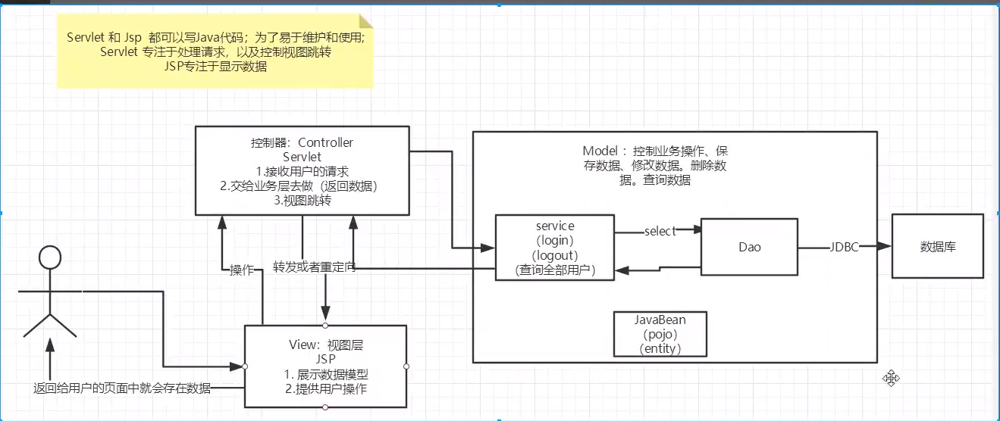
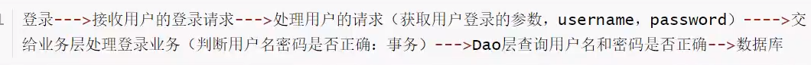
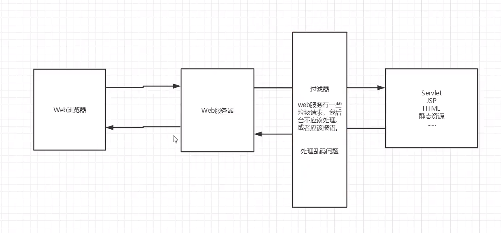
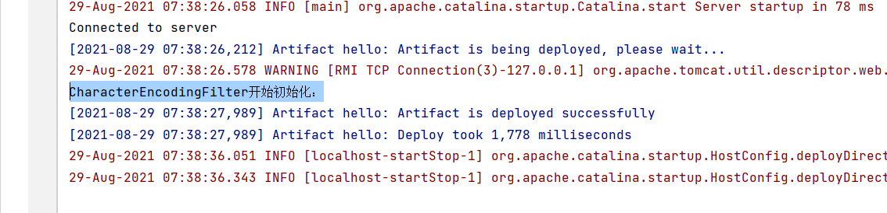
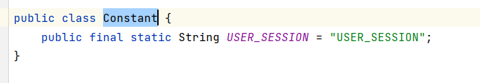

# MVC
- Model 模型， View 视图， Controller 控制器
### 重点：三层架构，Filter
## 1.三层架构


- Model
    - 业务处理：业务逻辑（Service）
    - 数据持久层 CRUD（Dao）
- View 
    - 展示数据
    - 提供链接发起servlet请求（a，form，img……）
- Controller
    - 接收用户的请求（req，请求参数，Session信息……）
    - 交给业务层处理代码
    - 控制视图的跳转
    


## **2.Filter**
### 2.1概念以及编写
- Filter：过滤器，用来过滤网址的数据
    - 处理中文乱码
    - 登录验证……
    


- Filter开发步骤
    - 1.导包 --导的是**servlet的包**
    - 2.编写过滤器
    - 3.先编写FilterChain，让路通了。。。
        -  `filterChain.doFilter(request,response);`
        - 它的ServletRequest与HttpServletRequest（正常servlet）的关系是父子关系
    - 4.它里面没Session，需要强转HttpServletRequest
        - 
    - tomcat启动时初始化   关闭时销毁
    - 4.配置web.xml 使用Filter标签

      
  ```
      //1.编写过滤器
       public class CharacterEncodingFilter implements Filter {
          //Chain: 链
          /*
              1.过滤器中所有代码，在过滤特定请求的时候都会被执行
              2.必须要让过滤器继续通行  filterChain.doFilter(request,response);
           */
          @Override
          public void doFilter(ServletRequest request, ServletResponse response, FilterChain filterChain) throws IOException, ServletException {
              request.setCharacterEncoding("utf-8");
              response.setCharacterEncoding("utf-8");
              response.setContentType("text/html;charset=UTF-8");
      
              System.out.println("CharacterEncodingFilter执行前：");
             //让我们的代码继续走，如果不写，程序到这就会被拦截,写的是参数里的
              filterChain.doFilter(request,response);
              System.out.println("CharacterEncodingFilter执行后：");
      
          }
      
          //初始化    ，web服务器启动时就初始化，因为它要随时监听，随时等待过滤对象出现
          @Override
          public void init(FilterConfig filterConfig) throws ServletException {
              System.out.println("CharacterEncodingFilter开始初始化：");
          }
      
          //销毁 web服务器关闭销毁
            @Override
            public void destroy() {
                System.out.println("CharacterEncodingFilter销毁：");
            }
        }
  

         //2.Web.xml中配置过滤器
        <!--  过滤器-->
        <filter>
          <filter-name>CharacterEncodingFilter</filter-name>
          <filter-class>com.zjz.filter.CharacterEncodingFilter</filter-class>
        </filter>
        <filter-mapping>
          <filter-name>CharacterEncodingFilter</filter-name>
        <!--  只要是/servlet的任何请求，都会经过这个过滤器  -->
          <url-pattern>/servlet/*</url-pattern>
         <!--    <url-pattern>/*</url-pattern>      尽量写多个，而不选择全过滤-->
        </filter-mapping>
  
  ```


## 2.2Filter应用
>  用户登录后就能进入主页，用户注销后就不能进入主页了
- 依据是Session
  - 登录时要获取session
- 最好在一个类中配置，以后方便修改

  
- `req.getSession().setAttribute(Constant.USER_SESSION,req.getSession().getId());`
  
- 退出时，注销session
  
  ```
    req.getSession().removeAttribute(Constant.USER_SESSION);
  ```
  
  - 所以过滤器就是判别有没有session值

- 编写Filter
  
  ```
    public class SysFilter implements Filter {
        @Override
        public void doFilter(ServletRequest servletRequest, ServletResponse servletResponse, FilterChain filterChain) throws IOException, ServletException {
            HttpServletRequest request = (HttpServletRequest)servletRequest;
            HttpServletResponse response = (HttpServletResponse)servletResponse;
            Object user_session = request.getSession().getAttribute(Constant.USER_SESSION);
            //不成功，打回去
            if(user_session == null){
                response.sendRedirect("/hello/error.jsp");
            }
            filterChain.doFilter(servletRequest,servletResponse);
        }
        @Override
        public void init(FilterConfig filterConfig) throws ServletException {}
        @Override
        public void destroy() {}
    }
  
  ```
  
- 配置web
  
  ```
     <filter>
        <filter-name>SysFilter</filter-name>
        <filter-class>com.zjz.filter.SysFilter</filter-class>
      </filter>
      <filter-mapping>
        <filter-name>SysFilter</filter-name>
        <url-pattern>/sys/*</url-pattern>
      </filter-mapping>
  
  ```
  

### filter也可以进行判别会员等级，来达到分别跳转
    

## 3.监听器
- 3.1）编写一个监听器
  - a1.实现监听器的接口
  - a2.编写servlet，实现一个页面跳转
  - a3.编写监听的显示页面
  - a4.配置web.xml
  ```
      //统计网站在线人数：统计session
      public class OnlineCountListener implements HttpSessionListener {
    
      
        //创建session的监听：看你的一举一动
        //一旦你创建一个session就会触发一次这个事件！
        @Override
        public void sessionCreated(HttpSessionEvent se) {
            ServletContext ctx = se.getSession().getServletContext();
    
            System.out.println(se.getSession().getId());
            Integer onlineCount = (Integer) ctx.getAttribute("OnlineCount");
            if(onlineCount == null){
                onlineCount = new Integer(1);
            }else {
                int count = onlineCount.intValue();
                onlineCount = new Integer(count+1);
            }
    
            ctx.setAttribute("OnlineCount",onlineCount);
    
        }
    
    
        //销毁session的监听，看你的一举一动
        //一旦session销毁就会触发一次这个事件！
        @Override
        public void sessionDestroyed(HttpSessionEvent se) {
    
            ServletContext ctx = se.getSession().getServletContext();
            Integer onlineCount = (Integer) ctx.getAttribute("OnlineCount");
            if(onlineCount == null){
                onlineCount = new Integer(0);
            }else {
                int count = onlineCount.intValue();
                onlineCount = new Integer(count-1);
            }
    
            ctx.setAttribute("OnlineCount",onlineCount);
    
        }
    
    
      }

  ```
  
  ```
      // resp.sendRedirect("/hello/OnlineCountJSP.jsp");
      req.getRequestDispatcher("OnlineCountJSP.jsp").forward(req,resp);
  ```


  ```
      <%@ page contentType="text/html;charset=UTF-8" language="java" %>
      <html>
      <head>
          <title>Title</title>
      </head>
      <body>
        <h1>当前有<span style="color: aqua"> <%= this.getServletConfig().getServletContext().getAttribute("OnlineCount")%></span> 人</h1>
      </body>
      </html>

  ```

  ```
        <!--监听器  -->
        <listener>
          <listener-class>com.zjz.listener.OnlineCountListener</listener-class>
        </listener>
        <servlet>
          <servlet-name>OnlineCountServlet</servlet-name>
          <servlet-class>com.zjz.servlet.OnlineCountServlet</servlet-class>
        </servlet>
        <servlet-mapping>
          <servlet-name>OnlineCountServlet</servlet-name>
          <url-pattern>/OnlineCountServlet</url-pattern>
        </servlet-mapping>
  ```

- 3.2 应用场景
  - 监听器：GUI编程中经常使用


