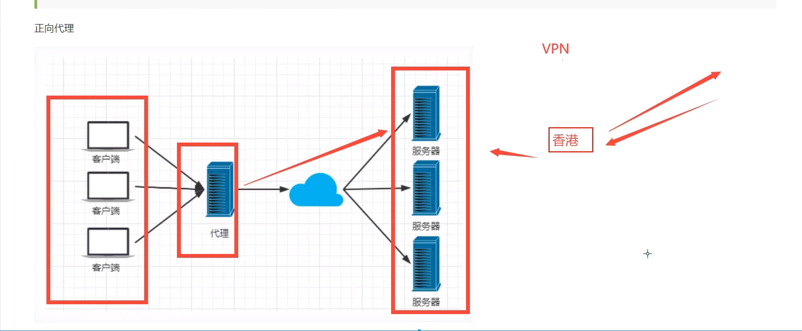
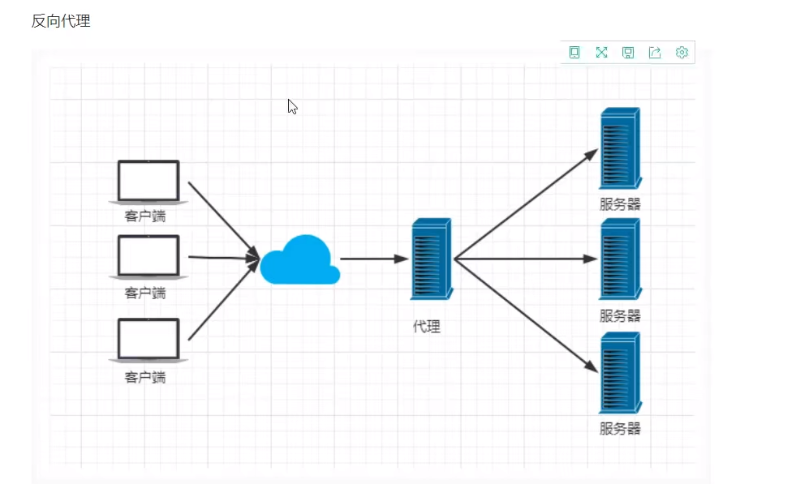
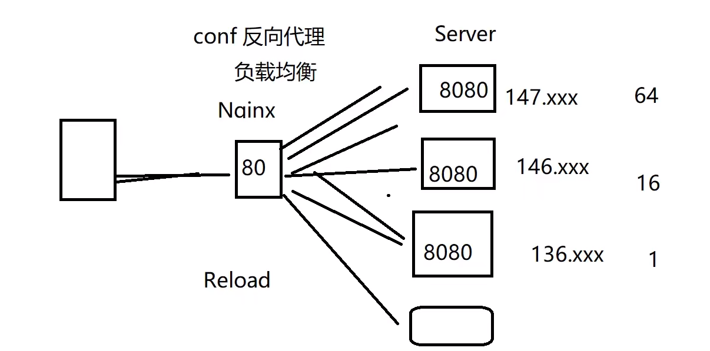

# Nginx
- 一台服务器满足不了需求
- 加了几个Tomcat之后,形成了多个服务器
- 需要一个代理服务器,维持三套服务器之间的关联
- 反向代理
- 负载均衡


## Nginx
- Nginx一个`高性能`的HTTP和`反向Web代理服务器`,同时也提供IMAP/POP3/SMTP服务.
- 特点:占有内存小,并发能力强.Nginx的并发能力在同类型的网页服务器中表现较好.能支持5w个并发请求响应
- 7*24不间断运行..
> Nginx作用:
- 反向代理:代理服务器端的
- 负载均衡:两种策略:内置和扩展策略.
  - 内置策略:轮询,加权轮询,Ip hash
    - 加权轮询---加权重,,保证性能最大化
    - Ip hash --- Session ---固定的Ip打到固定的服务器上--redis做session共享  
  - 扩展策略:  

- 动静分离:有些请求是需要后台处理的,有些不需要.如:css,html,jpg,js等文件,这些不需要经过后台处理的文件叫做静态文件.


- 正向代理:代理客户端的
    - VPN,
    






## Nginx安装
- http://nginx.org/en/download.html 直接下载一个
- nginx.conf文件
- 访问---->http://localhost/  发现welcome nginx就对了


## 命令
    ```
        # 启动
        [root@localhost nginx]# sbin/nginx
        # -s quit是正常停止。
        [root@localhost nginx]# sbin/nginx -s quit
        # -s stop是强制停止
        [root@localhost nginx]# sbin/nginx -s stop
        # 启动状态下重新加载配置文件
        [root@localhost nginx]# sbin/nginx -s reload
        # 查看nginx进程
        [root@localhost nginx]# ps aux|grep nginx

    ```



